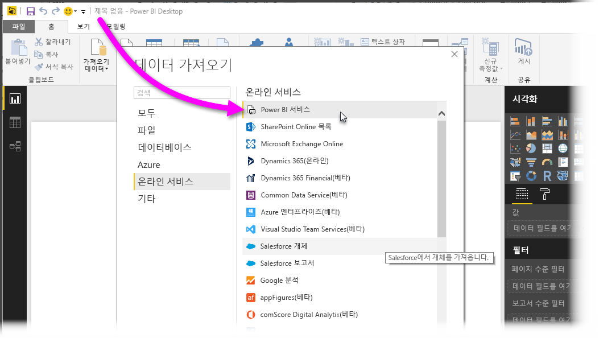
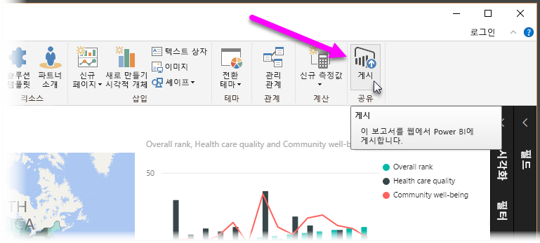
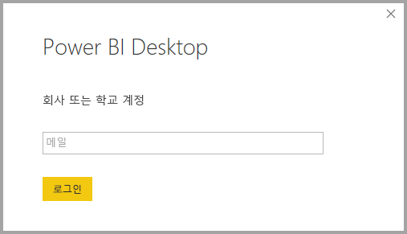
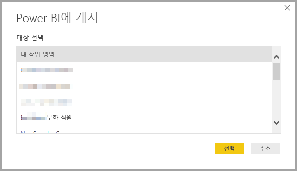
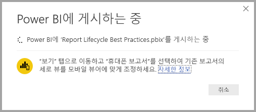
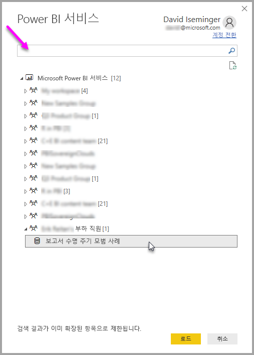
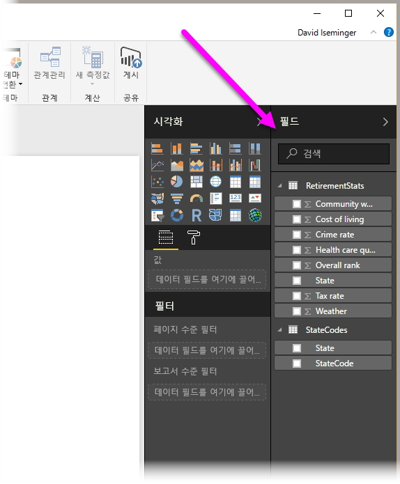

# Power BI Desktop에서 Power BI 서비스의 데이터 집합에 연결
Power BI 서비스에서 공유 데이터 집합에 대한 라이브 연결을 설정하고 동일한 데이터 집합에서 다양한 보고서를 만들 수 있습니다. 즉, Power BI Desktop에서 완벽한 데이터 모델을 만들고 이를 Power BI 서비스에 게시하면 사용자가 동일한 공통 데이터 모델에서 여러 개의 다른 보고서(별도의 .pbix 파일)를 작성할 수 있습니다. 이 기능을 **Power BI 서비스 라이브 연결**이라고 합니다.

이 문서에서 다루는 모범 사례를 비롯하여 이 기능으로 얻을 수 있는 모든 이점이 있습니다. 또한 몇 가지 고려 사항과 제한 사항이 있으므로 이 문서의 끝 부분에 있는 내용을 읽어야 합니다.

## 보고서 수명 주기 관리에 Power BI 서비스 라이브 연결 사용
Power BI가 각광 받는 한 가지 비결은 보고서, 대시보드 및 기본 데이터 모델의 확산에 있습니다. 이유는 간편하게 **Power BI Desktop**에서 강력한 보고서를 작성한 다음 **Power BI 서비스**에서 해당 보고서를 공유([게시](desktop-upload-desktop-files.md))하고 해당 데이터 집합에서 멋진 대시 보드를 만들 수 있기 때문입니다. 많은 사람들이 동일한(또는 거의 동일한) 데이터 집합을 사용하여 이 작업을 수행하므로 어느 데이터 집합을 기반으로 한 어떤 보고서인지, 그리고 각 데이터 집합이 얼마나 최신 상태인지 아는 것이 중요합니다. **Power BI 서비스 라이브 연결**은 이러한 문제를 해결하고 공통 데이터 집합 보고서 및 대시보드를 보다 쉽고 일관되게 만들고 공유하며 확장합니다.

### 모든 사람이 사용할 수 있는 데이터 집합을 만든 후 공유
Anna(비즈니스 분석가)는 여러분의 팀원이며 좋은 데이터 모델(보통 데이터 집합이라고 함)을 만드는 데 크게 기여한다고 가정해 보겠습니다. Anna는 자신의 전문 기술을 통해 데이터 집합 및 보고서를 만든 후 해당 보고서를 **Power BI 서비스**에서 공유할 수 있습니다.

그녀의 보고서와 데이터 집합은 모든 사람에게 호응도가 좋으며 여기서 문제가 시작됩니다. 모든 팀원은 자신의 고유한 데이터 집합 버전을 만든 후 자신의 보고서를 팀과 공유하려고 합니다. 갑자기 **Power BI 서비스**에서 팀의 작업 공간에 다양한 데이터 세트의 수많은 보고서가 생깁니다. 어떤 보고서가 최신인가요? 데이터 집합은 동일한가요? 다른가요? 차이점은 무엇인가요? **Power BI 서비스 라이브 연결** 기능으로 보다 향상되도록 변경할 수 있습니다. 다음 섹션에서는 다른 사용자가 자신의 고유한 보고서에 Anna가 게시한 데이터 집합을 어떻게 사용하며, 모든 사람이 동일하게 일치하고 심사 및 게시된 데이터 집합을 사용하여 자신의 고유한 보고서를 어떻게 작성하는지 알아봅니다.

### 라이브 연결을 사용하여 Power BI 서비스 데이터 집합에 연결
Anna가 자신의 보고서를 만들면(그리고 이를 기반으로 데이터 집합을 만들면) 보고서를 **Power BI 서비스**에 게시하며 이 내용이 Power BI 서비스의 작업 영역에 표시됩니다. 이제 모든 사람이 Anna의 작업 영역을 보고 사용할 수 있습니다.

작업 영역에 대해 자세히 알아보려면 [앱 작업 영역](service-create-workspaces.md)을 참조하세요.

작업 영역의 다른 멤버는 이제 **Power BI 서비스 라이브 연결** 기능을 사용하여 Anna의 공유 데이터 모델에 라이브 연결을 설정하고 그녀의 원본 데이터 집합에서 자신의 고유한 보고서를 만들 수 있습니다.

다음 이미지는 Anna가 **Power BI Desktop** 보고서를 1개 만들고 **Power BI 서비스**에 게시(해당 데이터 모델 포함)하는 방법을 보여 줍니다. 그러면 Anna의 작업 영역에 있는 다른 사용자는 **Power BI 서비스 라이브 연결**을 사용하여 Anna의 데이터 모델에 연결하고 그녀의 데이터 집합을 기반으로 고유한 보고서를 만들 수 있습니다.

> [!NOTE]
> 데이터 집합은 하나의 작업 영역에서만 공유됩니다. Power BI 서비스 라이브 연결을 설정하려면 연결할 데이터 집합은 멤버로 속한 공유 작업 영역에 있어야 합니다.
> 
> 

## Power BI 서비스 라이브 연결 사용에 대한 단계별 지침
**Power BI 서비스 라이브 연결**이 얼마나 유용한지, 보고서 수명 주기 관리를 위한 모범 사례로 활용하는 방법을 알았으므로, 이제 Anna의 훌륭한 보고서(및 데이터 집합)부터 Power BI 작업 영역에서 팀 구성원이 사용할 수 있는 공유 데이터 집합까지 과정을 살펴보겠습니다.

### Power BI 보고서 및 데이터 집합 게시
**Power BI 서비스 라이브 연결**을 사용하여 보고서 수명 주기를 관리하는 첫 번째 단계는 팀 구성원이 사용하려는 보고서(및 데이터 집합)을 보유하는 것입니다. 따라서 Anna는 먼저 **Power BI Destkop**에서 자신의 보고서를 **게시**해야 합니다. Power BI Desktop의 **홈** 리본에서 **게시**를 선택하여 이 작업을 수행합니다.

그녀가 자신의 Power BI 서비스 계정에 로그인하지 않으면 로그인하라는 메시지가 표시됩니다.

여기에서 보고서 및 데이터 집합을 게시할 작업 영역 대상을 선택할 수 있습니다. 보고서가 게시된 작업 영역에 대한 액세스 권한이 있는 멤버만 **Power BI 서비스 라이브 연결**을 사용하여 데이터 집합에 액세스할 수 있습니다.

게시 프로세스가 시작되고 **Power BI Desktop**에 진행 상태가 표시됩니다.

완료되면 **Power BI Desktop**에 성공이 표시되고 **Power BI 서비스**에서 보고서 자체로 이동할 수 있는 링크와 보고서에 대한 **신속한 정보 활용**으로 이동할 수 있는 링크가 몇 개 표시됩니다.

다음으로, 보고서(및 데이터 집합)가 게시된 작업 영역에 대한 액세스 권한이 있는 다른 팀 구성원이 데이터 집합에 연결하여 자신의 고유한 보고서를 작성하는 방법을 알아보겠습니다.

### 게시된 데이터 집합에 Power BI 서비스 라이브 연결 설정
게시된 보고서에 연결을 설정하고 게시된 데이터 집합을 토대로 사용자 고유의 보고서를 만들려면 **Power BI Desktop**의 **홈** 리본에서 **데이터 가져오기**를 선택하고 **Power BI 서비스**를 선택합니다. **데이터 가져오기 > 온라인 서비스 > Power BI 서비스**에서도 선택할 수 있습니다.

Power BI에 로그인하지 않은 경우 로그인하라는 메시지가 표시됩니다. 로그인하면 사용자가 속한 작업 영역과 **Power BI 서비스 라이브 연결**을 설정하려는 데이터 집합이 포함된 작업 영역을 선택할 수 있는 창이 표시됩니다.

작업 공간 옆 대괄호 안의 숫자는 해당 작업 그룹에서 사용할 수 있는 공유 데이터 집합 수를 나타내고 왼쪽의 삼각형을 선택하면 작업 영역이 확장되어 공유 데이터 집합을 선택할 수 있습니다.

이전 **Power BI 서비스** 라이브 연결 창에서 메모할 항목이 몇 가지 있습니다.

* 공유 데이터 집합을 검색할 수는 있지만 검색 결과가 확장된 항목으로 제한되며 확장되지 않은 작업 영역은 포함하지 않습니다.
* 검색을 확장하기 위해 두 개 이상의 작업 영역을 확장할 수 있습니다.

창에서 **로드**를 선택하면 선택한 데이터 집합으로 라이브 연결이 설정되므로 표시되는 데이터(필드 및 해당 값)가 **Power BI Desktop**에 실시간으로 로드됩니다.

이제 모든 사용자는 동일한 데이터 집합에서 모든 사용자 지정 보고서를 만들고 공유할 수 있습니다. 지식이 풍부한 한 명(Anna처럼)이 올바른 형식의 데이터 집합을 만들고, 많은 팀 구성원은 해당 공유 데이터 집합을 사용하여 각자 고유한 보고서를 만들 수 있게 하는 훌륭한 방법입니다.

> [!NOTE]
> **Power BI 서비스**에 대한 라이브 연결을 사용하여 데이터 집합을 기반으로 보고서를 만들 때는 사용 중인 데이터 집합이 포함된 동일한 Power BI 서비스 작업 영역에만 해당 보고서를 게시할 수 있습니다.
> 
> 

## 제한 사항 및 고려 사항
**Power BI 서비스 라이브 연결**을 사용하는 경우 몇 가지 제한 사항 및 고려 사항을 기억해야 합니다.

* 작업 영역의 읽기 전용 구성원은 **Power BI Desktop**의 데이터 집합에 연결할 수 없습니다.
* 동일한 **Power BI 서비스** 작업 영역에 속한 사용자만 **Power BI 서비스 라이브 연결**을 사용하여 게시된 데이터 집합에 연결할 수 있습니다. 사용자는 보통 두 개 이상의 작업 영역에 속할 수 있습니다.
* 라이브 연결이므로 왼쪽 탐색 및 모델링은 사용할 수 없으며 이는 **SQL Server Analysis Services**에 연결할 때의 동작과 유사합니다.
* 라이브 연결이므로 **SQL Server Analysis Services**에 연결될 때처럼 RLS(행 및 역할 수준 보안), OneDrive for Business 및 기타 이러한 연결 동작이 적용됩니다.
* **Power BI 서비스**에서 연결할 데이터 집합을 선택하면 검색 상자는 확장된 작업 영역에만 적용됩니다.
* 소유자가 원래 공유된 .pbix 파일을 수정하는 경우 **Power BI 서비스**에서 공유된 데이터 집합 및 보고서를 덮어씁니다.
* 작업 영역의 구성원은 원래 공유된 보고서를 바꿀 수 없습니다. 그렇게 하려고 하면 파일의 이름을 바꾸고 게시할지 묻는 경고 메시지가 표시됩니다.
* **Power BI 서비스**에서 공유 데이터 집합을 삭제하면 다른 **Power BI Desktop**(.pbix 파일)은 더 이상 제대로 작동하지 않거나 시각적 요소를 표시하지 않습니다.
* 콘텐츠 팩의 경우 **Power BI 서비스**에 대해 .pbix 보고서 및 데이터 집합을 공유하기 위해 팩을 사용하기 전에 먼저 복사본을 만들어야 합니다.
* 내 조직에서 복사된 콘텐츠 팩의 경우 서비스에서 생성된 보고서 및/또는 라이브 연결을 사용하여 콘텐츠 팩을 복사하는 과정에서 생성된 보고서를 바꿀 수 없습니다. 그렇게 하려고 하면 파일의 이름을 바꾸고 게시할지 묻는 경고 메시지가 표시됩니다. 이 경우에 게시된 활성 연결 보고서만 바꿀 수 있습니다.
* **Power BI 서비스**에 대한 라이브 연결을 사용하여 데이터 집합을 기반으로 보고서를 만들 때는 사용 중인 데이터 집합이 포함된 동일한 Power BI 서비스 작업 영역에만 해당 보고서를 게시할 수 있습니다.
* **Power BI 서비스**에서 공유 데이터 집합을 삭제하면 **Power BI Desktop**에서 해당 데이터 집합에 더 이상 액세스할 수 없습니다.

