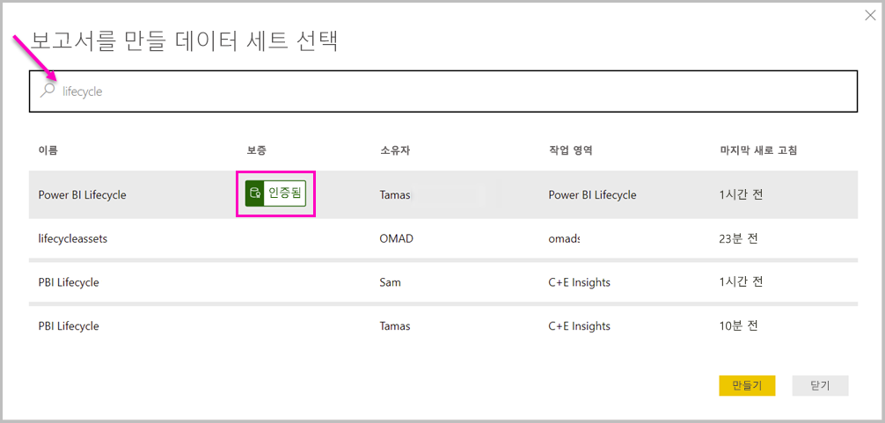

# Power BI Desktop에서 Power BI 서비스의 데이터 세트에 연결

*Power BI 서비스*에서 공유 데이터 세트에 대한 라이브 연결을 설정하고 동일한 데이터 세트에서 다양한 보고서를 만들 수 있습니다. Power BI Desktop에서 완벽한 데이터 모델을 만들어 Power BI 서비스에 게시할 수 있습니다. 그런 다음, 해당 공통 데이터 모델에서 다양한 보고서를 별도의 *.pbix* 파일로 만들어 다른 작업 영역에 저장할 수 있습니다. 이 기능을 *Power BI 서비스 라이브 연결*이라고 합니다.

이 문서에서 다루는 모범 사례를 비롯하여 이 기능으로 다양한 이점을 얻을 수 있습니다. 이 기능의 [고려 사항 및 제한 사항](#limitations-and-considerations)을 검토하는 것이 좋습니다.

## 보고서 수명 주기 관리에 Power BI 서비스 라이브 연결 사용

Power BI가 각광 받는 한 가지 비결은 보고서, 대시보드 및 기본 데이터 모델의 확산에 있습니다. 간편하게 Power BI Desktop에서 설득력 있는 보고서를 작성한 다음 Power BI 서비스에서 해당 보고서를 [게시](desktop-upload-desktop-files.md)하고 해당 데이터 세트에서 멋진 대시보드를 만들 수 있습니다. 많은 사람들이 사용하는 데이터 세트가 동일하거나 거의 동일하기 때문에 어느 보고서가 어느 데이터 세트를 기반으로 하며 각 데이터 세트가 얼마나 최신 상태인지 알기가 어려울 수 있습니다. Power BI 서비스 라이브 연결은 이러한 문제를 해결하며, 보다 쉽고 일관되게 공통 데이터 세트 보고서 및 대시보드를 만들고 공유하며 확장합니다.

### 모든 사람이 사용할 수 있는 데이터 세트를 만든 다음, 공유

비즈니스 분석가 Anna가 팀에 있다고 가정해 보겠습니다. Anna는 데이터 세트라고 하는 데이터 모델을 만드는 데 능숙합니다. Anna는 데이터 세트 및 보고서를 만든 다음 해당 보고서를 Power BI 서비스에서 공유할 수 있습니다.

모두가 Anna의 보고서와 데이터 세트를 좋아합니다. 여기서 문제가 시작됩니다. Anna의 모든 팀원이 해당 데이터 세트의 *자체 버전*을 만들고 자체 보고서를 팀과 공유하려고 합니다. 갑자기 Power BI 서비스의 팀 작업 영역에 데이터 세트가 서로 다른 수많은 보고서가 만들어집니다. 어떤 보고서가 최신인가요? 데이터 세트는 동일한가요? 다른가요? 차이점은 무엇인가요? Power BI 서비스 라이브 연결 기능을 사용하면 이 모든 문제를 개선할 수 있습니다. 다음 섹션에서는 다른 사용자가 자신의 고유한 작업 영역에서 자신의 고유한 보고서에 Anna가 게시한 데이터 세트를 어떻게 사용하며, 모든 사람이 동일하게 일치하고 심사 및 게시된 데이터 세트를 사용하여 자신의 고유한 보고서를 어떻게 작성하는지 알아봅니다.

### 라이브 연결을 사용하여 Power BI 서비스 데이터 세트에 연결

Anna는 보고서와 보고서의 기반이 되는 데이터 세트를 만듭니다. 그런 다음 Power BI 서비스에 게시합니다. 보고서는 Power BI 서비스의 팀 작업 영역에 나타납니다. *새 환경 작업 영역*에 저장하는 경우, Anna는 작업 영역 내부 및 외부의 모든 사용자가 살펴보고 사용할 수 있도록 *빌드 사용 권한*을 설정할 수 있습니다.

새 환경 작업 영역에 대한 자세한 내용은 [작업 영역](service-new-workspaces.md)을 참조하세요.

작업 영역 내부와 외부의 다른 멤버는 이제 Power BI 서비스 라이브 연결 기능을 사용하여 Anna의 공유 데이터 모델에 라이브 연결을 설정할 수 있습니다. 또한 *자신만의 새 환경 작업 영역*에서 *자신의 원래 데이터 세트*로 자신만의 고유한 보고서를 만들 수 있습니다.

다음 그림은 Anna가 Power BI Desktop 보고서 하나를 만들고 해당 데이터 모델을 포함하여 Power BI 서비스에 게시하는 방법을 보여 줍니다. 그러면 다른 사용자가 Power BI 서비스 라이브 연결을 사용하여 Anna의 데이터 모델에 연결한 다음, 자체 작업 영역에서 Anna의 데이터 세트를 기반으로 자체 보고서를 만들 수 있습니다.

> [!NOTE]
> 데이터 세트를 [클래식 공유 작업 영역](service-create-workspaces.md)에 저장하는 경우 해당 작업 영역의 멤버만 데이터 세트에 보고서를 빌드합니다. Power BI 서비스 라이브 연결을 설정하려면 연결할 데이터 세트는 멤버로 속한 공유 작업 영역에 있어야 합니다.
> 
> 

## Power BI 서비스 라이브 연결을 사용하기 위한 단계별 지침

Power BI 서비스 라이브 연결이 얼마나 유용하고, 보고서 수명 주기 관리를 위한 모범 사례로 어떻게 활용하는지 알았으므로, 이제 Anna의 훌륭한 보고서와 데이터 세트에서 출발해 Power BI 팀 동료가 사용할 수 있는 공유 데이터 세트까지 이르는 과정을 살펴보겠습니다.

### Power BI 보고서 및 데이터 세트 게시

Power BI 서비스 라이브 연결을 사용하여 보고서 수명 주기를 관리하는 첫 번째 단계는 팀 동료가 사용하려는 보고서와 데이터 세트를 보유하는 것입니다. 따라서 Anna는 먼저 Power BI Desktop에서 보고서를 *게시*해야 합니다. Power BI Desktop의 **홈** 리본에서 **게시**를 선택합니다.

Anna가 Power BI 서비스 계정에 로그인하지 않았다면 로그인하라는 메시지가 Anna에게 표시됩니다.

여기에서 Anna는 보고서 및 데이터 세트를 게시할 작업 영역 대상을 선택할 수 있습니다. Anna가 새 환경 작업 영역에 저장하면, 빌드 권한이 있는 모든 사용자가 해당 데이터 세트에 액세스할 수 있습니다. 빌드 사용 권한은 게시 후 Power BI 서비스에서 설정됩니다. 클래식 작업 영역에 작업을 저장하면, 보고서가 게시된 작업 영역에 대한 액세스 권한이 있는 멤버만 Power BI 서비스 라이브 연결을 사용하여 데이터 세트에 액세스할 수 있습니다.

게시 프로세스가 시작되고 Power BI Desktop에 진행 상태가 표시됩니다.

완료되면 Power BI Desktop에 성공이 표시되고, Power BI 서비스에서 보고서 자체로 이동할 수 있는 몇몇 링크와 보고서에 대한 빠른 인사이트를 얻을 수 있는 링크가 표시됩니다.

이제 데이터 세트가 포함된 보고서가 Power BI 서비스에 있으므로 보고서를 *승격*할 수도 있습니다. 승격이란 품질과 안정성을 증명하는 것을 뜻합니다. Power BI 테넌트의 중앙 인증 기관에서 *인증*하도록 요청할 수도 있습니다. 이러한 보증을 사용하면 사용자가 데이터 세트를 찾을 때 데이터 세트가 항상 목록의 상단에 표시됩니다. 자세한 내용은 [데이터 세트 승격](service-datasets-promote.md)을 참조하세요.

마지막 단계는 보고서가 기반으로 하는 데이터 세트에 대한 빌드 사용 권한을 설정하는 것입니다. 빌드 사용 권한은 데이터 세트를 보고 사용할 수 있는 사용자를 결정합니다. 작업 영역 자체에서 또는 작업 영역에서 앱을 공유할 때 설정할 수 있습니다. 자세한 내용은 [공유 데이터 세트의 빌드 사용 권한](service-datasets-build-permissions.md)을 참조하세요.

다음으로 보고서와 데이터 세트가 게시된 작업 영역에 대한 액세스 권한이 있는 다른 팀 동료가 데이터 세트에 연결하여 자체 보고서를 작성하는 방법을 알아보겠습니다.

### 게시된 데이터 세트에 Power BI 서비스 라이브 연결 설정

게시된 보고서에 대한 연결을 설정하고 게시된 데이터 세트를 기반으로 보고서를 만들려면 Power BI Desktop의 **홈** 리본에서 **데이터 가져오기**를 선택하고 왼쪽 창에서 **Power Platform**을 선택한 다음 **Power BI 데이터 세트**를 선택합니다.

Power BI에 로그인하지 않은 경우 로그인하라는 메시지가 표시됩니다. 로그인하면 사용자가 속한 작업 영역이 Power BI에 표시됩니다. Power BI 서비스 라이브 연결을 설정하려는 데이터 세트가 포함될 작업 영역을 선택할 수 있습니다.

목록의 데이터 세트는 모든 작업 영역에서 빌드 사용 권한이 있는 모든 공유 데이터 세트입니다. 특정 데이터 세트를 검색하고 해당 이름, 소유자, 해당 데이터 세트가 있는 작업 영역 및 마지막으로 새로 고쳐진 시기를 볼 수 있습니다. 목록의 맨 위에 데이터 세트에 대한 **보증**(인증 또는 승격)도 표시됩니다.

**만들기**를 선택하면 선택한 데이터 세트에 대한 라이브 연결이 설정됩니다. Power BI Desktop이 로드하는 필드와 값은 실시간으로 Power BI Desktop에서 볼 수 있습니다.

이제 모든 사용자는 동일한 데이터 세트에 기반한 사용자 지정 보고서를 만들고 공유할 수 있습니다. 이 방법은 Anna의 경우처럼 데이터 세트를 잘 아는 한 명에게 잘 구성된 데이터 세트 만들기를 맡기는 좋은 방법입니다. 많은 팀 동료는 해당 공유 데이터 세트를 사용하여 자체 보고서를 만들 수 있습니다.

## 제한 사항 및 고려 사항

Power BI 서비스 라이브 연결을 사용할 때는 몇 가지 제한 사항 및 고려 사항을 염두에 두어야 합니다.

* 데이터 세트에 대한 빌드 사용 권한이 있는 사용자만 Power BI 서비스 라이브 연결을 사용하여 게시된 데이터 세트에 연결할 수 있습니다.
* 무료 사용자는 **내 작업 영역** 및 Premium 기반 작업 영역의 데이터 세트만 볼 수 있습니다.
* 이 연결은 라이브 연결이므로 왼쪽 탐색 및 모델링을 사용할 수 없습니다. 각 보고서에서 하나의 데이터 세트에만 연결할 수 있습니다. 이 동작은 *SQL Server Analysis Services*에 연결될 때의 동작과 비슷합니다.
* 이 연결은 라이브 연결이므로 RLS(행 수준 보안) 및 이러한 그 밖의 연결 동작이 적용됩니다. 이는 SQL Server Analysis Services에 연결된 경우와 동일합니다.
* 소유자가 원래의 공유 *.pbix* 파일을 수정하는 경우, Power BI 서비스에서 공유된 데이터 세트 및 보고서를 덮어씁니다. 해당 데이터 세트를 기반으로 하는 보고서는 덮어쓰지 않지만 데이터 세트에 대한 변경 내용은 보고서에서 반영됩니다.
* 작업 영역의 멤버는 원래 공유된 보고서를 바꿀 수 없습니다. 그렇게 하려고 하면 파일의 이름을 바꾸고 게시할지 묻는 경고 메시지가 표시됩니다.
* Power BI 서비스에서 공유 데이터 세트를 삭제하면 해당 데이터 세트를 기반으로 하는 다른 보고서는 더 이상 제대로 작동하지 않거나 시각적 개체를 표시하지 않습니다.
* 콘텐츠 팩의 경우 Power BI 서비스에 대해 *.pbix* 보고서 및 데이터 세트를 공유하기 위한 기초로 사용하기 전에 먼저 복사본을 만들어야 합니다.
* *내 조직*에서 복사된 콘텐츠 팩의 경우 서비스에서 생성된 보고서 또는 라이브 연결을 사용하여 콘텐츠 팩을 복사하는 과정에서 생성된 보고서를 바꿀 수 없습니다. 그렇게 하려고 하면 파일의 이름을 바꾸고 게시할지 묻는 경고 메시지가 표시됩니다. 이 경우에 게시된 활성 연결 보고서만 바꿀 수 있습니다.
* Power BI 서비스에서 공유 데이터 세트를 삭제하면 Power BI Desktop에서 해당 데이터 세트에 더 이상 액세스할 수 없습니다.
* Power BI 서비스의 데이터 세트를 공유하는 보고서는 Power BI REST API를 사용하여 자동화된 배포를 지원하지 않습니다.
