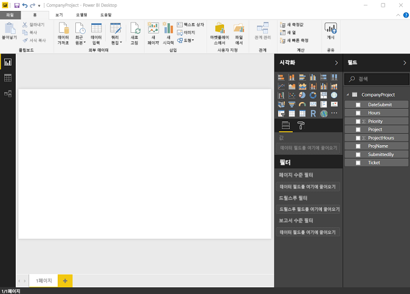
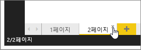

# Power BI Desktop의 보고서 뷰
Power BI로 작업한 적이 있다면 데이터에 동적 관점과 통찰력을 제공하는 보고서를 얼마나 쉽게 만들 수 있는지 알고 있을 것입니다. Power BI Desktop에는 Power BI의 고급 기능도 있습니다. Power BI Desktop을 사용하여 고급 쿼리를 만들고, 여러 소스의 데이터를 매시업하고, 테이블 간에 관계를 만드는 등 많은 작업을 할 수 있습니다.

Power BI Desktop에는 시각화가 포함된 보고서 페이지를 원하는 개수만큼 만들 수 있는 **보고서 뷰**가 포함되어 있습니다. Power BI Desktop의 보고서 뷰는 Power BI 서비스의 보고서 편집용 보기와 거의 동일한 디자인 환경을 제공합니다. 시각화를 이동하고, 복사 및 붙여넣고, 병합할 수 있습니다.

이들 간 차이점은 Power BI Desktop을 사용하는 경우 데이터가 보고서에서 최상의 통찰력을 지원하도록 쿼리와 데이터 모델링 작업을 수행할 수 있다는 것입니다. 로컬 드라이브든, 클라우드든 관계없이 어디든지 Power BI Desktop 파일을 저장할 수 있습니다.

## 직접 살펴보겠습니다.
Power BI Desktop에서 처음 데이터를 로드하면 빈 캔버스가 있는 **보고서 보기**가 표시됩니다.

왼쪽 탐색 모음의 아이콘을 선택하여 **보고서 보기**, **데이터 보기**와 **관계 보기**를 전환할 수 있습니다.

일부 데이터를 추가한 후 캔버스의 새 시각화에 필드를 추가할 수 있습니다.

시각화 형식을 변경하려면 리본 메뉴의 **시각화** 그룹에서 선택하거나, 마우스 오른쪽 단추를 클릭하고 **시각화 형식 변경** 아이콘에서 다른 형식을 선택할 수 있습니다.

> [!TIP]
> 다양한 시각화 형식으로 실험해 보세요. 시각화가 데이터의 정보를 명확하게 전달하는 것이 중요합니다.
> 
> 

보고서에 시작할 빈 페이지가 하나 이상 있습니다. 페이지는 탐색기 창에서 캔버스 바로 왼쪽에 나타납니다. 한 페이지에 모든 종류의 시각화를 추가할 수 있지만 지나치게 많이 사용하지 않는 것이 중요합니다. 한 페이지에 시각화가 너무 많으면 복잡해 보이며 적절한 정보를 찾기 어렵습니다. 리본 메뉴에서 **새 페이지** 를 클릭하면 보고서에 새 페이지를 추가할 수 있습니다.

페이지를 삭제하려면 보고서 보기의 아래쪽에 있는 페이지의 탭에서 **X**를 클릭합니다.

> [!NOTE]
> Power BI Desktop에서 보고서 및 시각화를 대시보드에 고정할 수 없습니다. 이렇게 하려면 Power BI 사이트에 [Power BI Desktop에서 게시](desktop-upload-desktop-files.md)해야 합니다.
> 
> 

