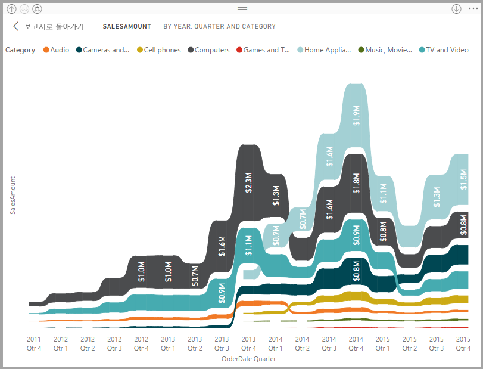
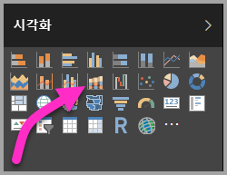
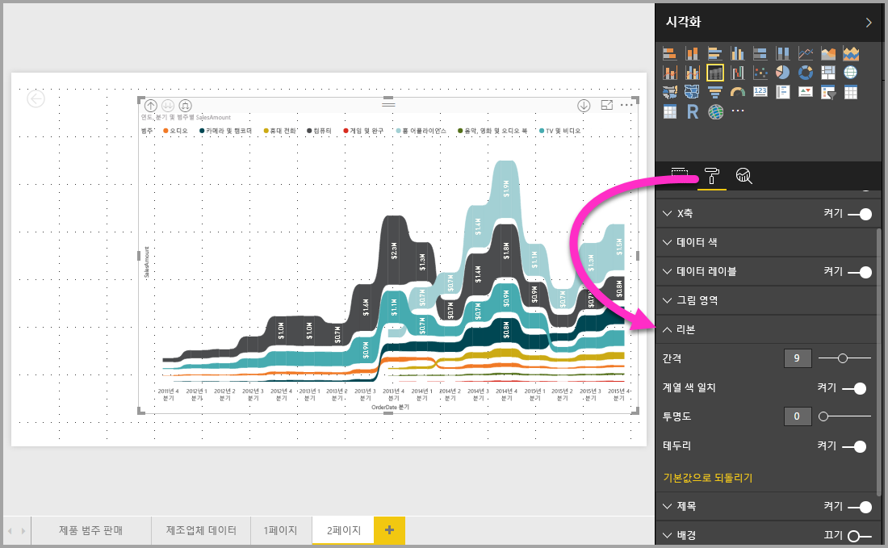

# Power BI에서 리본 차트 사용
**Power BI**에서 리본 차트를 사용하여 데이터를 시각화하고, 가장 높은 순위(가장 큰 값)를 가진 데이터의 범주를 신속하게 결정할 수 있습니다. 리본 차트는 각 기간에 가장 높은 범위(값)가 항상 위쪽에 표시되어 순위 변경 내용을 효과적으로 표시합니다. 2017년 9월 릴리스 및 **Power BI 서비스**에 대한 후속 업데이트부터 리본 차트는 **Power BI Desktop**에서 사용할 수 있습니다.

## 리본 차트 만들기
리본 차트를 만들려면 **시각화** 패널에서 **리본 차트**를 선택합니다.

리본 차트는 리본을 사용하여 시각화된 시간 연속체에 데이터의 범주를 연결하므로 차트의 x-축(일반적으로 타임라인)의 범위에서 지정된 범주 순위가 지정되는 방법을 표시할 수 있습니다.

## 리본 차트 서식 지정
리본 차트를 만들 경우 **시각화** 창의 **서식** 섹션에서 사용할 수 있는 서식 지정 옵션이 있습니다. 리본 차트에 대한 서식 지정 옵션은 리본에 지정된 추가 서식 지정 옵션을 포함하는 누적 세로 막대형 차트의 해당 옵션과 유사합니다.

리본 차트의 이러한 서식 옵션을 통해 다음 항목을 조정할 수 있습니다.

* **간격**을 통해 리본 간에 표시되는 공간을 조정할 수 있습니다. 번호는 열 최대 높이의 백분율입니다.
* **계열 색 일치**를 사용하면 계열 색과 리본 메뉴의 색을 일치시킬 수 있습니다. 해당 옵션을 끄면 리본은 회색으로 표시됩니다.
* **투명도**는 기본값이 30으로 설정된 투명도 리본을 지정합니다.
* **테두리**를 통해 리본의 위쪽 및 아래쪽에 어두운 테두리를 배치할 수 있습니다. 테두리는 기본적으로 꺼져 있습니다.

## 다음 단계
**Power BI Desktop**에 대한 자세한 내용 및 시작하는 방법은 다음 문서를 확인하세요.

* [Power BI Desktop 시작](desktop-getting-started.md)
* [Power BI Desktop을 사용한 쿼리 개요](desktop-query-overview.md)
* [Power BI Desktop의 데이터 원본](desktop-data-sources.md)
* [Power BI Desktop에서 데이터에 연결](desktop-connect-to-data.md)
* [Power BI Desktop에서 데이터 셰이핑 및 결합](desktop-shape-and-combine-data.md)
* [Power BI Desktop의 일반적인 쿼리 작업](desktop-common-query-tasks.md)   

