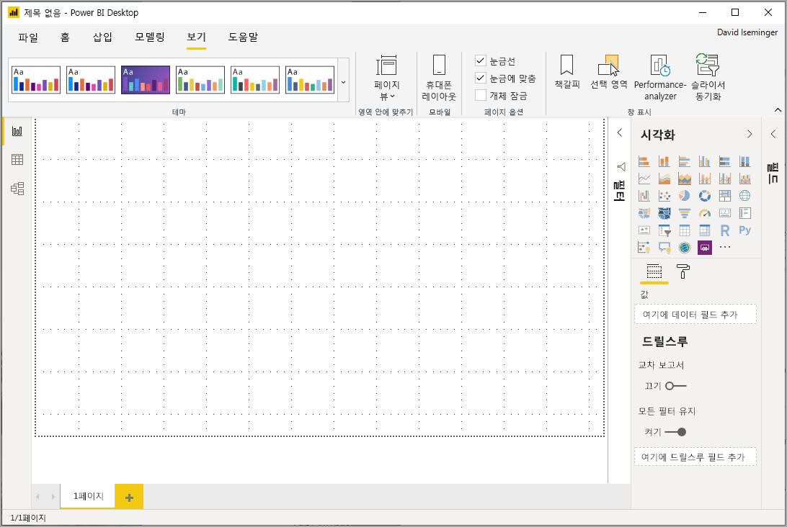
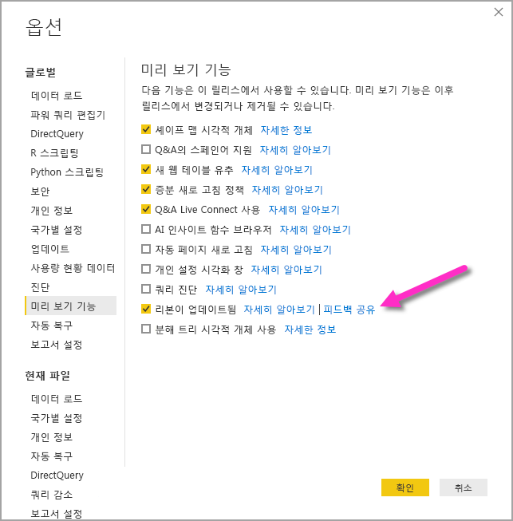
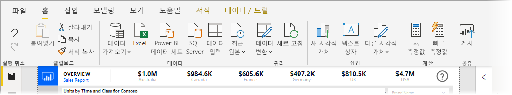
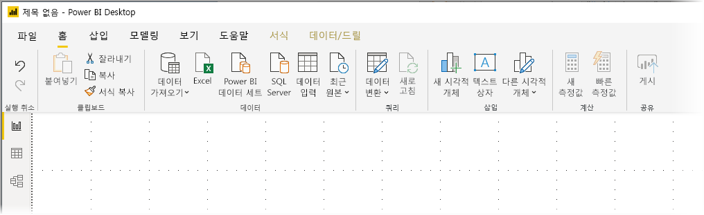
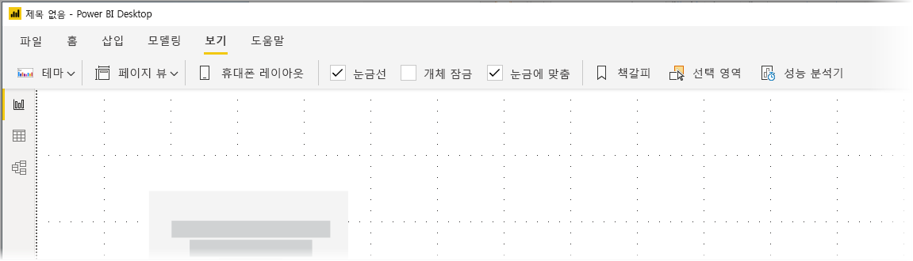

# Power BI Desktop에서 업데이트된 리본 사용(미리 보기)

2019년 11월 업데이트부터 Power BI Desktop은 Microsoft Office와 같은 다른 Microsoft 제품의 모양 및 환경과 보다 잘 어울리도록 리본을 수정하고 있습니다.

업데이트된 리본은 미리 보기 상태이므로 사용자 및 고객으로부터 피드백을 수집하여 환경이 확실한지 확인할 수 있습니다. 업데이트된 Power BI Desktop 리본이 일반 공급으로 출시하기 전에 몇 개월간 미리 보기, 피드백 수집 및 개선 작업을 진행할 예정입니다. 

## 업데이트된 리본을 사용하도록 설정하는 방법

Power BI의 업데이트된 리본은 미리 보기 기능이며 사용하도록 설정해야 합니다. 사용하도록 설정하려면 **파일 > 옵션 및 설정> 옵션**을 차례로 선택한 다음, 왼쪽 열에서 **미리 보기 기능**을 선택합니다. 오른쪽 창에는 **업데이트된 리본** 선택 항목이 있습니다. **업데이트된 리본** 옆의 확인란을 선택하여 미리 보기 기능을 사용하도록 설정합니다. 미리 보기 기능 변경 내용을 적용하려면 Power BI Desktop을 다시 시작해야 합니다.

## 새 리본의 기능

리본을 업데이트하여 얻으려는 이점은 Power BI Desktop과 다른 Microsoft 제품 사이에 환경을 쉽고 친숙하게 만드는 것입니다. 

이러한 이점은 다음과 같은 범주로 그룹화할 수 있습니다.

* **향상된 모양, 느낌 및 구성** - 업데이트된 Power BI Desktop 리본의 아이콘은 Office 애플리케이션에 있는 리본 항목의 모양, 느낌 및 구성과 어울리도록 조정되었습니다.

    

* **직관적인 테마 갤러리** - **보기** 리본에 있는 테마 갤러리에는 PowerPoint 테마 갤러리의 친숙한 모양과 느낌이 있습니다. 따라서 리본의 이미지는 색 조합 및 글꼴과 같은 테마 변경 내용이 보고서에 적용될 경우 표시될 모양을 보여줍니다. 

    

* **보기를 기반으로 하는 동적 리본 콘텐츠** - Power BI Desktop의 기존 리본 메뉴에서는 사용할 수 없는 아이콘 또는 명령은 단순히 회색으로 표시되어 최적의 환경을 만들 수 없었습니다. 업데이트된 리본을 사용하면 아이콘이 동적으로 표시되고 정렬되므로 컨텍스트에서 사용할 수 있는 옵션을 항상 알 수 있습니다.

* **한 줄로 축소하여 공간을 절약할 수 있는 리본 메뉴** - 업데이트된 리본의 또 다른 이점은 리본 메뉴 자체를 한 줄로 축소하여 컨텍스트에 따라 리본 항목을 동적으로 표시하는 기능입니다. 

    

이러한 가시적인 변경 사항 외에도 업데이트된 리본에서는 향후 다음과 같은 Power BI Desktop 및 리본 업데이트가 가능합니다.

* 리본 메뉴에서 시각적 개체 갤러리와 같은 보다 유연하고 직관적인 컨트롤 만들기
* Power BI Desktop에 *검정* 및 *진한 회색* Office 테마를 추가
* 접근성 향상

## 다음 단계
Power BI Desktop을 사용하여 연결할 수 있는 모든 종류의 데이터가 있습니다. 데이터 원본에 대한 자세한 내용은 다음 리소스를 확인하세요.

* [Power BI Desktop이란?](desktop-what-is-desktop.md)
* [Power BI Desktop의 데이터 원본](desktop-data-sources.md)
* [Power BI Desktop에서 데이터 셰이핑 및 결합](desktop-shape-and-combine-data.md)
* [Power BI Desktop에서 Excel 통합 문서에 연결](desktop-connect-excel.md)   
* [Power BI Desktop에 데이터 직접 연결](desktop-enter-data-directly-into-desktop.md)   

