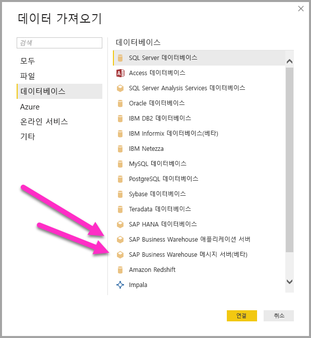
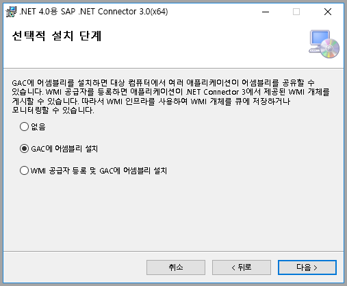
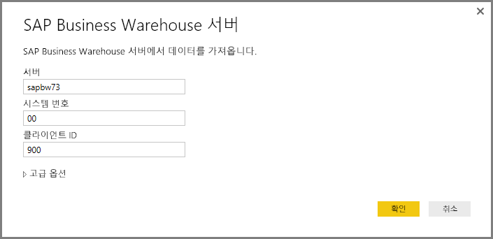
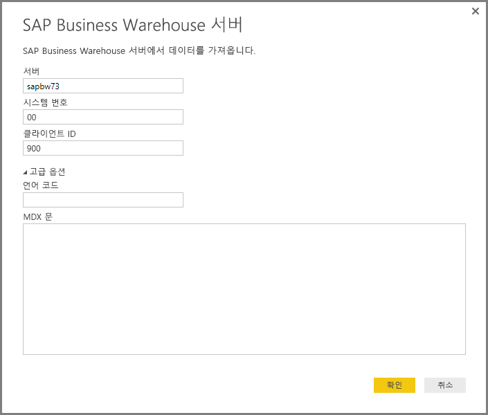
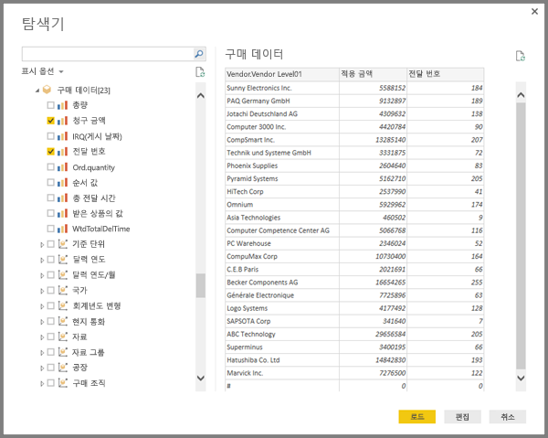
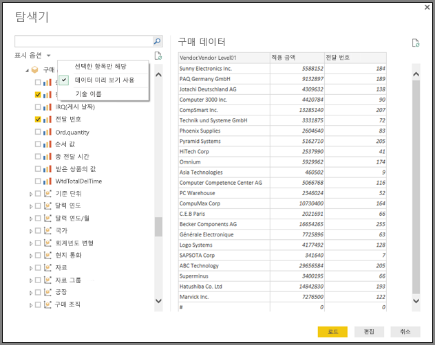
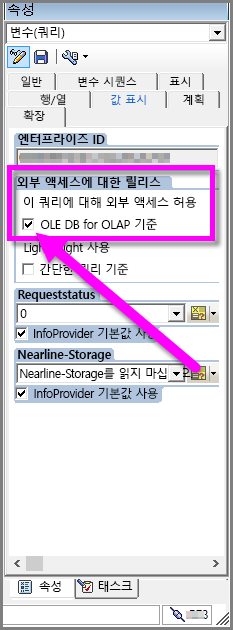

# <a name="use-the-sap-business-warehouse-connector-in-power-bi-desktop"></a>Power BI Desktop에서 SAP Business Warehouse 커넥터 사용

Power BI Desktop을 통해 *SAP BW(Business Warehouse)* 데이터에 액세스할 수 있습니다.

SAP 고객이 Power BI를 기존 SAP BW 시스템에 연결하여 활용하는 방법에 대한 자세한 내용은 [Power BI 및 SAP BW 백서](https://aka.ms/powerbiandsapbw)를 참조하세요. DirectQuery 및 SAP BW 사용에 대한 자세한 내용은 [DirectQuery 및 SAP BW(Business Warehouse)](desktop-directquery-sap-bw.md)를 참조하세요.

Power BI Desktop의 2018년 6월 릴리스 및 2018년 10월 일반 공급부터 성능 및 기능이 크게 향상된 구현이 포함된 *SAP BW 커넥터*를 사용할 수 있습니다. Microsoft는 SAP BW 커넥터 *구현 2.0*을 개발했습니다. SAP BW 커넥터의 버전 1 또는 구현 2.0 SAP 커넥터 중 하나를 선택하세요. 다음 섹션에서는 각 버전의 설치를 차례로 설명합니다. Power BI Desktop에서 SAP BW에 연결할 때 하나 또는 다른 연결을 선택할 수 있습니다.

가능하면 항상 구현 2.0 SAP 커넥터를 사용하는 것이 좋습니다.

## <a name="installation-of-version-1-of-the-sap-bw-connector"></a>버전 1의 SAP BW 커넥터 설치

가능하면 항상 구현 2.0 SAP 커넥터를 사용하는 것이 좋습니다. 이 섹션에서는 SAP BW 커넥터 버전 1 설치를 설명합니다.

1. 로컬 컴퓨터에 *SAP NetWeaver* 라이브러리를 설치합니다. SAP NetWeaver 라이브러리는 SAP 관리자를 통하거나 [SAP 소프트웨어 다운로드 센터](https://support.sap.com/swdc)에서 바로 구할 수 있습니다. SAP 소프트웨어 다운로드 센터는 구조가 자주 변경되기 때문에 더 구체적인 사이트 탐색 지침은 제공할 수 없습니다. SAP NetWeaver 라이브러리는 일반적으로 SAP 클라이언트 도구 설치에 포함됩니다.

   *SAP Note #1025361*을 검색하여 가장 최신 버전에 대한 다운로드 위치를 가져올 수 있습니다. SAP NetWeaver 라이브러리(32비트 또는 64비트)의 아키텍처가 Power BI Desktop 설치와 일치해야 합니다. SAP Note에 따라 *SAP NetWeaver RFC SDK*에 포함된 모든 파일을 설치합니다.
2. Power BI Desktop에서 **데이터 가져오기**를 선택합니다. **데이터베이스** 옵션에는 *SAP Business Warehouse 애플리케이션 서버*와 *SAP Business Warehouse 메시지 서버*가 포함됩니다.

   

## <a name="installation-of-implementation-20-sap-connector"></a>구현 2.0 SAP 커넥터 설치

SAP 커넥터 구현 2.0에는 SAP .NET Connector 3.0이 필요합니다. 다운로드에 액세스하려면 유효한 S 사용자가 필요합니다. SAP .NET Connector 3.0을 구하려면 SAP Basis 팀에 문의하세요.

SAP에서 [SAP .NET Connector 3.0](https://support.sap.com/en/product/connectors/msnet.html)을 다운로드할 수 있습니다.

커넥터는 32비트 버전과 64비트 버전으로 제공됩니다. Power BI Desktop 설치와 일치하는 버전을 선택하세요. 현재 웹사이트에는 다음 두 가지 버전의 .NET 4.0 프레임워크가 나열되어 있습니다.

* zip 파일(6,896KB) 형식의 Windows 32비트(x86) Microsoft .NET 3.0.22.0용 SAP 커넥터, 2019년 6월 1일
* zip 파일(7,180KB) 형식의 Windows 64비트(x64) Microsoft .NET 3.0.22.0용 SAP 커넥터, 2019년 6월 1일

설치 시 **선택적 설정 단계**에서 *GAC에 어셈블리 설치*를 선택해야 합니다.



> [!NOTE]
> SAP BW 구현의 첫 번째 버전에는 NetWeaver DLL이 필요 했습니다. SAP 커넥터 구현 2.0을 사용하고 첫 번째 버전을 사용하지 않는다면 Netweaver DLL이 필요하지 않습니다.

## <a name="version-1-sap-bw-connector-features"></a>버전 1 SAP BW 커넥터 기능

Power BI Desktop의 버전 1 SAP BW 커넥터를 사용하면 *SAP Business Warehouse 서버* 큐브에서 데이터를 가져오거나 DirectQuery를 사용할 수 있습니다.

SAP BW 커넥터 및 DirectQuery를 함께 사용하는 방법에 대해 자세히 알아보려면 [DirectQuery 및 SAP BW(Business Warehouse)](desktop-directquery-sap-bw.md)를 참조하세요.

연결할 때 **서버**, **시스템 번호**, **클라이언트 ID**를 지정하여 연결을 설정합니다.



또한 두 가지 추가 **고급 옵션**인 **언어 코드** 및 지정된 서버에 대해 실행할 사용자 지정 **MDX 문**을 지정할 수 있습니다.



MDX 문을 지정하지 않으면 서버에서 사용할 수 있는 큐브 목록이 연결 설정에 표시됩니다. 사용 가능한 큐브에서 차원 및 측정값을 포함하여 항목을 드릴다운하고 선택할 수 있습니다. Power BI는 [Open Analysis Interface](https://help.sap.com/saphelp_nw70/helpdata/en/d9/ed8c3c59021315e10000000a114084/content.htm)에 의해 노출되는 쿼리와 큐브를 노출합니다.

서버에서 하나 이상의 항목을 선택하면 탐색기 대화 상자가 출력 테이블의 미리 보기를 만듭니다.



**탐색기** 대화 상자는 표시 옵션도 제공합니다.

* **선택한 항목만 표시**. 기본적으로 **탐색기**는 모든 항목을 표시합니다.  이 옵션은 선택한 항목의 최종 세트를 확인하는 데 유용합니다. 선택한 항목을 보는 다른 방법은 미리 보기 영역에서 열 이름을 선택하는 것입니다.
* **데이터 미리 보기 사용**. 이 값이 기본값입니다. 데이터 미리 보기를 표시합니다. 데이터 미리 보기를 사용하지 않도록 설정하면 미리 보기를 위한 데이터를 더 이상 요청하지 않으므로 서버 호출 수가 줄어듭니다.
* **기술 이름**. SAP BW는 큐브 내의 개체에 대한 *기술 이름*의 개념을 지원합니다. 기술 이름을 사용하면 큐브 소유자가 큐브에 있는 해당 개체의 *물리적 이름*만 노출하는 것과 달리 큐브 개체의 *식별 이름*을 노출할 수 있습니다.



필요한 모든 개체를 선택한 후 다음 옵션 중 하나를 선택하여 다음에 수행할 작업을 결정할 수 있습니다.

* **로드**를 선택하여 출력 테이블의 전체 행 집합을 Power BI Desktop 데이터 모델에 로드합니다. **보고서** 뷰가 열립니다. **데이터** 또는 **관계** 뷰를 사용하여 데이터 시각화 또는 추가 수정을 시작할 수 있습니다.
* **편집**을 선택하여 **쿼리 편집기**를 엽니다. 전체 행 집합을 Power BI Desktop 데이터 모델로 가져오기 전에 추가 데이터 변환 및 필터링 단계를 지정합니다.

SAP BW 큐브에서 데이터를 가져오는 것 외에 Power BI Desktop의 다른 다양한 데이터 원본에서 데이터를 가져온 다음 단일 보고서로 결합할 수도 있습니다. 이 기능은 SAP BW 데이터를 기반으로 하는 다양한 종류의 흥미로운 보고 및 분석 시나리오를 제공합니다.

## <a name="using-implementation-20-sap-bw-connector"></a>구현 2.0 SAP BW 커넥터 사용

SAP BW 커넥터의 구현 2.0을 사용하려면 새 연결을 만드세요. 새 연결을 만들려면 다음 단계를 수행하세요.

1. **데이터 가져오기**를 선택합니다. **SAP Business Warehouse 애플리케이션 서버** 또는 **SAP Business Warehouse 메시지 서버**를 선택한 다음 연결합니다.

2. 새 연결 대화 상자에서 구현을 선택합니다. 다음 그림에 나온 것처럼 **구현**에서 **2.0**을 선택하면 **실행 모드**, **일괄 처리 크기**, **특성 구조 사용**을 사용할 수 있습니다.

    

3. **확인**을 선택합니다. 이 시점 이후의 환경은 버전 1 SAP BW 커넥터의 [버전 1 SAP BW 커넥터 기능](#version-1-sap-bw-connector-features)에 설명된 것과 동일합니다.

### <a name="new-options-for-implementation-20"></a>구현 2.0의 새 옵션

구현 2.0은 다음 옵션을 지원합니다.

* *ExecutionMode*는 서버에서 쿼리를 실행하는 데 사용되는 MDX 인터페이스를 지정합니다. 유효한 옵션은 다음과 같습니다.

  * `SapBusinessWarehouseExecutionMode.BasXml`
  * `SapBusinessWarehouseExecutionMode.BasXmlGzip`
  * `SapBusinessWarehouseExecutionMode.DataStream`

    기본값은 `SapBusinessWarehouseExecutionMode.BasXmlGzip`입니다.

    대규모 데이터 세트에서 대기 시간이 긴 경우 `SapBusinessWarehouseExecutionMode.BasXmlGzip`을 사용하면 성능이 향상될 수 있습니다.

* *BatchSize*는 MDX 문을 실행할 때 한 번에 검색되는 최대 행 수를 지정합니다. 행 수가 적으면 대규모 데이터 세트를 검색할 때 서버에 대한 호출이 많아집니다. 행 수가 많으면 성능이 향상될 수 있지만 SAP BW 서버의 메모리 문제가 발생할 수 있습니다. 기본값은 50000행입니다.

* *EnableStructures*는 특성 구조가 인식되는지 여부를 나타냅니다. 이 옵션의 기본값은 false입니다. 선택할 수 있는 개체 목록에 영향을 줍니다. 기본 쿼리 모드에서는 지원되지 않습니다.

이 구현에서는 *ScaleMeasures* 옵션이 사용되지 않습니다. 이제 동작은 *ScaleMeasures*를 false로 설정하는 것과 동일하며, 항상 실제 크기 값이 표시됩니다.

### <a name="additional-improvements-for-implementation-20"></a>구현 2.0에 대한 추가 개선 사항

다음 목록은 새 구현과 함께 제공되는 몇 가지 추가 개선 사항을 설명합니다.

* 성능 향상.
* 수백만 행의 데이터를 검색할 수 있고 일괄 처리 크기 매개 변수를 통해 미세 조정할 수 있습니다.
* 실행 모드로 전환할 수 있습니다.
* 압축 모드를 지원합니다. 긴 대기 시간 연결 또는 대규모 데이터 세트에 특히 유용합니다.
* `Date` 변수의 검색이 향상되었습니다.
* [실험적] `Date`(ABAP 유형 DATS) 및 `Time`(ABAP 유형 TIMS) 차원을 텍스트 값 대신 날짜 및 시간으로 각각 표시합니다.
* 예외 처리가 향상됩니다. BAPI 호출에서 발생하는 오류가 이제 표시됩니다.
* BasXml 및 BasXmlGzip 모드의 열 접기입니다. 예를 들어 생성된 MDX 쿼리가 40개의 열을 검색하지만 현재 선택 항목에는 10개만 필요한 경우, 이 요청은 서버로 전달되어 더 작은 데이터 세트를 검색합니다.

### <a name="changing-existing-reports-to-use-implementation-20"></a>2\.0 구현을 사용하기 위해 기존 보고서 변경

구현 2.0을 사용하기 위한 기존 보고서 변경은 가져오기 모드에서만 가능합니다. 다음 단계를 수행하세요.

1. 기존 보고서를 열고 리본에서 **쿼리 편집**을 선택한 다음 업데이트할 SAP Business Warehouse 쿼리를 선택합니다.

1. 조회를 마우스 오른쪽 단추로 클릭하고 **고급 편집기**를 선택합니다.

1. **고급 편집기**에서 `SapBusinessWarehouse.Cubes` 호출을 다음과 같이 변경합니다.

    다음 예와 같이 쿼리에 옵션 레코드가 이미 포함되어 있는지 확인합니다.

    

    이미 포함되어 있다면 `Implementation` 2.0 옵션을 추가하고 다음과 같이 `ScaleMeasures` 옵션(있는 경우)을 제거합니다.

    

    쿼리에 옵션 레코드가 이미 포함되어 있지 않으면 추가합니다. 다음 옵션의 경우:

    

    이를 다음으로 변경합니다.

    

SAP BW 커넥터의 구현 2.0이 버전 1과 호환되도록 모든 노력을 기울였습니다. 하지만 사용되는 다른 SAP BW MDX 실행 모드 때문에 약간의 차이가 있을 수 있습니다. 불일치를 해결하려면 실행 모드 간 전환을 시도하세요.

## <a name="troubleshooting"></a>문제 해결

이 섹션에서는 SAP BW 커넥터 작업 시 문제 해결 상황과 솔루션을 제공합니다.

1. SAP BW의 숫자 데이터는 쉼표 대신 소수점을 반환합니다. 예를 들어 1,000,000은 1.000.000으로 반환됩니다.

   SAP BW는 `,`(쉼표) 또는 `.`(점)을 소수 구분 기호로 사용하여 소수 데이터를 반환합니다. Power BI Desktop에서 사용하는 드라이버는 SAP BW에서 사용할 소수 구분 기호를 지정하기 위해 `BAPI_USER_GET_DETAIL`을 호출합니다. 이 호출은 *소수 형식 표기법*을 저장하는 `DCPFM`이라는 필드가 있는 `DEFAULTS`라는 구조를 반환합니다. 이 필드는 다음 값 중 하나를 사용합니다.

   * ' '(스페이스) = 소수점은 쉼표입니다. N.NNN,NN
   * 'X' = 소수점은 마침표입니다. N,NNN.NN
   * 'Y' = 소수점은 N NNN NNN,NN입니다.

   이 문제를 보고한 고객이 특정 사용자(잘못된 데이터를 보여주는 사용자)의 `BAPI_USER_GET_DETAIL` 호출이 다음과 유사한 오류 메시지와 함께 실패하는 것을 발견했습니다.

   ```xml
    You are not authorized to display users in group TI:
        <item>
            <TYPE>E</TYPE>
            <ID>01</ID>
            <NUMBER>512</NUMBER>
            <MESSAGE>You are not authorized to display users in group TI</MESSAGE>
            <LOG_NO/>
            <LOG_MSG_NO>000000</LOG_MSG_NO>
            <MESSAGE_V1>TI</MESSAGE_V1>
            <MESSAGE_V2/>
            <MESSAGE_V3/>
            <MESSAGE_V4/>
            <PARAMETER/>
            <ROW>0</ROW>
            <FIELD>BNAME</FIELD>
            <SYSTEM>CLNTPW1400</SYSTEM>
        </item>
   ```

   이 오류를 해결하려면 사용자가 SAP 관리자에게 `BAPI_USER_GET_DETAIL`을 실행할 권한을 Power BI의 SAPBW 사용자에게 부여해 달라고 요청해야 합니다. 또한 이 문제 해결 솔루션의 앞 부분에서 설명한 것처럼 사용자에게 필요한 `DCPFM` 값이 있는지 확인하는 것도 중요합니다.

2. SAP BEx 쿼리에 대한 연결
   
   다음 그림에 나와 있는 것처럼 특정 속성을 사용하도록 설정하여 Power BI Desktop에서 BEx 쿼리를 수행할 수 있습니다.
   
   
   
3. **탐색기** 창은 데이터 미리 보기를 표시하지 않고 대신 *개체 참조가 개체의 인스턴스로 설정되지 않음* 오류 메시지를 제공합니다.
   
   SAP 사용자는 SAP BW의 InfoProviders에서 메타데이터를 가져오고 데이터를 검색하기 위해 특정 BAPI 함수 모듈에 대한 액세스 권한이 필요합니다. 이러한 모듈에는 다음이 포함됩니다.

   * BAPI_MDPROVIDER_GET_CATALOGS
   * BAPI_MDPROVIDER_GET_CUBES
   * BAPI_MDPROVIDER_GET_DIMENSIONS
   * BAPI_MDPROVIDER_GET_HIERARCHYS
   * BAPI_MDPROVIDER_GET_LEVELS
   * BAPI_MDPROVIDER_GET_MEASURES
   * BAPI_MDPROVIDER_GET_MEMBERS
   * BAPI_MDPROVIDER_GET_VARIABLES
   * BAPI_IOBJ_GETDETAIL

   이 문제를 해결하려면 사용자에게 다양한 MDPROVIDER 모듈 및 `BAPI_IOBJ_GETDETAIL`에 대한 액세스 권한이 있는지 확인하세요. 이 문제 또는 비슷한 문제를 해결하기 위해 추적을 사용할 수 있습니다. **파일** > **옵션 및 설정** > **옵션**을 선택합니다. **옵션**에서 **진단**을 선택한 다음 **추적 사용**을 선택합니다. 추적이 활성화되어 있는 동안 SAP BW에서 데이터를 검색하고 추적 파일에서 자세한 정보를 확인합니다.

## <a name="sap-bw-connection-support"></a>SAP BW 연결 지원

다음 표에서는 SAP BW에 대한 현재 지원을 자세히 설명합니다.

|Product  |Mode  |인증  |커넥터  |SNC 라이브러리  |지원됨  |
|---------|---------|---------|---------|---------|---------|
|Power BI Desktop     |모두         | 사용자 / 암호  | 애플리케이션 서버 | 해당 없음  | yes  |
|Power BI Desktop     |모두         | Windows          | 애플리케이션 서버 | sapcrypto + gsskrb5/gx64krb5  | yes  |
|Power BI Desktop     |모두         | 가장을 통한 Windows | 애플리케이션 서버 | sapcrypto + gsskrb5/gx64krb5  | yes  |
|Power BI Desktop     |모두         | 사용자 / 암호        | 메시지 서버 | 해당 없음  | yes  |
|Power BI Desktop     |모두         | Windows        | 메시지 서버 | sapcrypto + gsskrb5/gx64krb5  | yes  |
|Power BI Desktop     |모두         | 가장을 통한 Windows | 메시지 서버 | sapcrypto + gsskrb5/gx64krb5  | yes  |
|Power BI 게이트웨이     |가져오기      | Power BI Desktop과 동일 |         |   |   |
|Power BI 게이트웨이     |DirectQuery | 사용자 / 암호        | 애플리케이션 서버 | 해당 없음  | yes  |
|Power BI 게이트웨이     |DirectQuery | 가장을 통한 Windows(고정 사용자, SSO 없음) | 애플리케이션 서버 | sapcrypto + gsskrb5/gx64krb5  | yes  |
|Power BI 게이트웨이     |DirectQuery | DirectQuery 쿼리에 대해 Kerberos를 통해 SSO 옵션 사용 | 애플리케이션 서버 | sapcrypto + gsskrb5/gx64krb5   | yes  |
|Power BI 게이트웨이     |DirectQuery | 사용자 / 암호        | 메시지 서버 | 해당 없음  | yes  |
|Power BI 게이트웨이     |DirectQuery | 가장을 통한 Windows(고정 사용자, SSO 없음) | 메시지 서버 | sapcrypto + gsskrb5/gx64krb5  | yes  |
|Power BI 게이트웨이     |DirectQuery | DirectQuery 쿼리에 대해 Kerberos를 통해 SSO 옵션 사용 | 메시지 서버 | gsskrb5/gx64krb5  | 예  |
|Power BI 게이트웨이     |DirectQuery | DirectQuery 쿼리에 대해 Kerberos를 통해 SSO 옵션 사용 | 메시지 서버 | sapcrypto  | yes  |

## <a name="next-steps"></a>다음 단계

SAP 및 DirectQuery에 대한 자세한 내용은 다음 리소스를 참조하세요.

* [DirectQuery 및 SAP HANA](desktop-directquery-sap-hana.md)
* [DirectQuery 및 SAP BW(Business Warehouse)](desktop-directquery-sap-bw.md)
* [Power BI의 DirectQuery 사용](desktop-directquery-about.md)
* [Power BI 데이터 원본](desktop-directquery-data-sources.md)
* [Power BI 및 SAP BW 백서](https://aka.ms/powerbiandsapbw)
