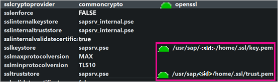
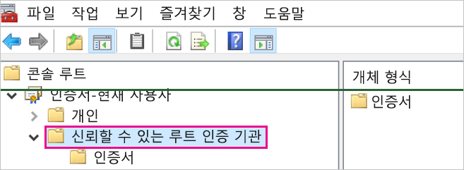
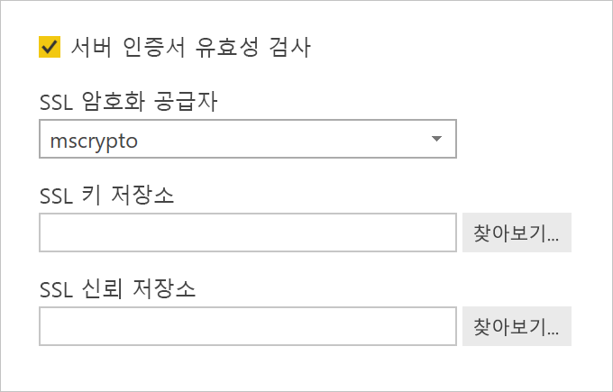
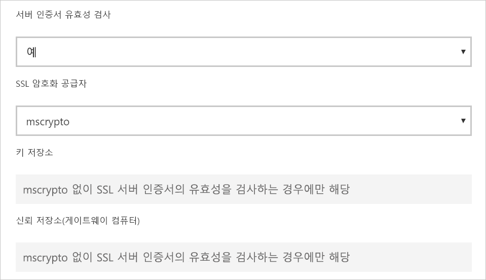

# <a name="enable-encryption-for-sap-hana"></a>SAP HANA에 대한 암호화 사용

Power BI Desktop 및 Power BI 서비스에서 SAP HANA 서버로의 연결을 암호화하는 것이 좋습니다. OpenSSL 및 SAP 소유 CommonCryptoLib(이전의 sapcrypto) 라이브러리를 사용하여 HANA 암호화를 설정할 수 있습니다. SAP는 CommonCryptoLib 사용을 권장하지만, 두 라이브러리에서 모두 기본 암호화 기능을 사용할 수 있습니다.

이 문서에서는 OpenSSL을 사용하여 암호화를 설정하는 방법을 간략하게 설명하고 SAP 설명서의 일부 특정 영역을 참조합니다. 콘텐츠와 링크를 주기적으로 업데이트하지만, 종합적인 지침 및 지원은 항상 공식 SAP 설명서를 참조하세요. OpenSSL 대신 CommonCryptoLib를 사용하여 암호화를 설정하려는 경우 [SAP HANA 2.0에서 TLS/SSL을 구성하는 방법](https://blogs.sap.com/2018/11/13/how-to-configure-tlsssl-in-sap-hana-2.0/)을 참조하세요. OpenSSL에서 CommonCryptoLib로 마이그레이션하는 단계는 [SAP Note 2093286](https://launchpad.support.sap.com/#/notes/2093286)(s-user가 필요함)을 참조하세요.

> [!NOTE]
> 이 문서에서 자세히 설명하는 암호화 설정 단계는 SAML SSO의 설정 및 구성 단계와 겹칩니다. HANA 서버의 암호화 공급자로 OpenSSL을 선택하든, CommonCryptoLib를 선택하든 간에 SAML 및 암호화 구성에서 동일하게 선택해야 합니다.

OpenSSL을 사용하여 SAP HANA의 암호화를 설정하는 4단계가 있습니다. 이 단계에 대해서는 다음에 설명하겠습니다.  자세한 내용은 [SSL을 통해 SAP HANA Studio와 SAP HANA 서버 간의 통신 보안 설정](https://blogs.sap.com/2015/09/28/securing-the-communication-between-sap-hana-studio-and-sap-hana-server-through-ssl/)을 참조하세요.

## <a name="use-openssl"></a>OpenSSL 사용

HANA 서버가 OpenSSL을 암호화 공급자로 사용하도록 구성되었는지 확인합니다. 아래의 누락된 경로 정보를 HANA 서버의 서버 ID(sid)로 바꿉니다.



## <a name="create-a-certificate-signing-request"></a>인증서 서명 요청 만들기

HANA 서버에 대한 X509 인증서 서명 요청을 만듭니다.

1. SSH를 사용하여 HANA 서버가 실행되는 Linux 머신에 \<sid\>adm으로 연결합니다.

1. 홈 디렉터리 _/__usr/sap/\<sid\>/home_으로 이동합니다.

1. 아직 없는 경우 이름이 _.__ssl_인 숨겨진 디렉터리를 만듭니다.

1. 다음 명령을 실행합니다.

    ```
    openssl req -newkey rsa:2048 -days 365 -sha256 -keyout Server\_Key.pem -out Server\_Req.pem -nodes
    ```

이 명령은 인증서 서명 요청과 프라이빗 키를 만듭니다. 서명된 인증서는 1년간 유효합니다(-days 매개 변수 참조). CN(일반 이름)을 입력하라는 메시지가 표시되면 HANA 서버가 설치된 컴퓨터의 FQDN(정규화된 도메인 이름)을 입력합니다.

## <a name="get-the-certificate-signed"></a>서명된 인증서 가져오기

HANA 서버에 연결하는 데 사용할 클라이언트가 신뢰하는 CA(인증 기관)에서 서명한 인증서를 가져옵니다.

1. 신뢰할 수 있는 회사 CA(다음 예제에서 CA\_Cert.pem 및 CA\_Key.pem으로 표시됨)가 이미 있는 경우 다음 명령을 실행하여 인증서 요청에 서명합니다.

    ```
    openssl x509 -req -days 365 -in Server\_Req.pem -sha256 -extfile /etc/ssl/openssl.cnf -extensions usr\_cert -CA CA\_Cert.pem -CAkey CA\_Key.pem -CAcreateserial -out Server\_Cert.pem
    ```

    사용할 수 있는 CA가 아직 없는 경우 [SSL을 통해 SAP HANA Studio와 SAP HANA 서버 간의 통신 보안 설정](https://blogs.sap.com/2015/09/28/securing-the-communication-between-sap-hana-studio-and-sap-hana-server-through-ssl/)에 간략하게 설명된 단계에 따라 루트 CA를 직접 만들 수 있습니다.

1. 서버 인증서, 키, CA의 인증서를 결합하여 HANA 서버 인증서 체인을 만듭니다(key.pem 이름은 SAP HANA 규칙임).

    ```
    cat Server\_Cert.pem Server\_Key.pem CA\_Cert.pem \> key.pem
    ```

1. trust.pem이라는 CA\_Cert.pem의 복사본을 만듭니다(trust.pem 이름은 SAP HANA 규칙임).

    ```
    cp CA\_Cert.pem trust.pem
    ```

1. HANA 서버를 다시 시작합니다.

1. SAP HANA 서버의 인증서 서명에 사용한 CA와 클라이언트 간의 트러스트 관계를 확인합니다.

    클라이언트 머신에서 HANA 서버로 암호화된 연결을 설정하려면 클라이언트에서 HANA 서버의 X509 인증서 서명에 사용된 CA를 신뢰해야 합니다.

    MMC(Microsoft 관리 콘솔) 또는 명령줄을 사용하여 이 트러스트 관계가 있는지 확인하는 여러 가지 방법이 있습니다. 연결을 설정하는 사용자의 **신뢰할 수 있는 루트 인증 기관** 폴더 또는 원하는 경우 클라이언트 머신 자체의 동일한 폴더로 CA의 X509 인증서(trust.pem)를 가져올 수 있습니다.

    

    신뢰할 수 있는 루트 인증 기관 폴더로 인증서를 가져오려면 먼저 trust.pem을 .crt 파일로 변환해야 합니다. 예를 들어 다음 OpenSSL 명령을 실행합니다.

    ```
    openssl x509 -outform der -in your-cert.pem -out your-cert.crt
    ```
    
    OpenSSL을 변환에 사용하는 방법에 대한 자세한 내용은 [OpenSSL 설명서](https://www.openssl.org/docs/manmaster/man1/x509.html)를 참조하세요.

## <a name="test-the-connection"></a>연결 테스트

Power BI Desktop 또는 Power BI 서비스에서 연결을 테스트합니다.

1. SAP HANA 서버에 연결하기 전에 Power BI Desktop 또는 Power BI 서비스의 **게이트웨이 관리** 페이지에서 **서버 인증서 유효성 검사**가 사용하도록 설정되었는지 확인합니다. **SSL 암호화 공급자**에서 OpenSSL 설정 단계를 따른 경우 mscrypto를 선택하고, commoncrypto 라이브러리를 암호화 공급자로 구성한 경우 commoncrypto를 선택합니다. SSL 키 저장소 및 SSL 신뢰 저장소 필드는 비워 둡니다.

    - Power BI Desktop

        

    - Power BI 서비스

        

1. Power BI Desktop에서 데이터를 로드하거나 Power BI 서비스에서 게시된 보고서를 새로 고쳐, **서버 인증서 유효성 검사** 옵션이 사용하도록 설정된 서버에 대해 암호화된 연결을 설정할 수 있는지 확인합니다.
