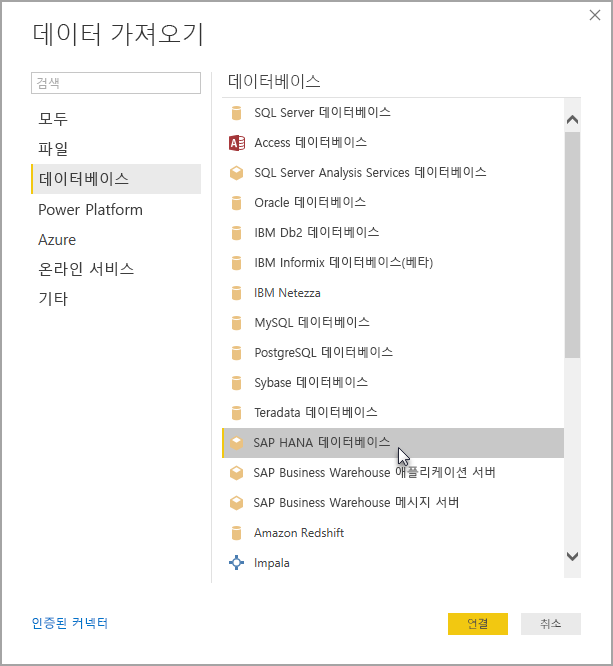

# Power BI Desktop에서 SAP HANA 사용
Power BI Desktop을 통해 이제 **SAP HANA** 데이터베이스에 액세스할 수 있습니다. **SAP HANA**를 사용하려면 Power BI Desktop **SAP HANA** 데이터 연결이 제대로 작동하기 위해 로컬 클라이언트 컴퓨터에 SAP HANA ODBC 드라이버를 설치해야 합니다. [SAP 소프트웨어 다운로드 센터](https://support.sap.com/swdc)에서 SAP HANA ODBC 드라이버를 다운로드할 수 있습니다. 여기서 Windows용 SAP HANA CLIENT를 검색해 보세요. **SAP 소프트웨어 다운로드 센터**에서 구조를 자주 변경했기 때문에 해당 사이트를 탐색하기 위한 보다 구체적인 지침을 사용할 수 없습니다.

**SAP HANA** 데이터베이스에 연결하려면 다음 이미지처럼 **데이터 가져오기 > 데이터베이스 > SAP HANA 데이터베이스**를 선택합니다.

SAP HANA 데이터베이스에 연결할 때 *서버: 포트* 형식으로 서버 이름 및 포트를 지정합니다. - 다음 이미지는 *ServerXYZ* 및 포트 30015 라는 서버를 사용한 예를 보여 줍니다.

이 릴리스에서는 [DirectQuery](desktop-directquery-sap-hana.md) 모드의 **SAP HANA**가 Power BI Desktop과 Power BI 서비스에서 지원되므로 DirectQuery 모드에서 **SAP HANA**를 사용하는 보고서를 Power BI 서비스에 게시하고 업로드할 수 있습니다. DirectQuery 모드에서 **SAP HANA** 를 사용하지 않는 경우에도 Power BI 서비스에 보고서를 게시하고 업로드할 수 있습니다.

## SAP HANA에 대해 지원되는 기능
이 릴리스에는 다음 목록에 표시된 것처럼 여러 가지 **SAP HANA**용 기능이 있습니다.

* **SAP HANA** 용 Power BI 커넥터에서는 SAP ODBC 드라이버를 사용하여 가장 적합한 사용자 환경을 제공합니다.
* **SAP HANA** 는 DirectQuery 및 가져오기 옵션을 모두 지원합니다.
* Power BI는 HANA 정보 모델(예: 분석 및 계산 뷰)을 지원하고 탐색이 최적화되어 있습니다.
* **SAP HANA**를 사용하면 직접 SQL 기능을 사용하여 행 및 열 테이블을 연결할 수도 있습니다.
* HANA 모델에 대해 최적화된 탐색 포함
* Power BI는 **SAP HANA** 변수 및 입력 매개 변수를 지원합니다.

## SAP HANA의 제한 사항
**SAP HANA**를 사용하는 데는 다음과 같이 몇 가지 제한이 있습니다.

* NVARCHAR 문자열은 최대 4000 유니코드 문자 길이로 잘립니다.
* SMALLDECIMAL은 지원되지 않습니다.
* VARBINARY는 지원되지 않습니다.
* 유효한 날짜는 1899/12/30부터 9999/12/31 사이입니다.

## 다음 단계
DirectQuery에 대한 자세한 내용은 다음 리소스를 참조하세요.

* [DirectQuery 및 SAP HANA](desktop-directquery-sap-hana.md)
* [Power BI의 DirectQuery](desktop-directquery-about.md)
* [DirectQuery에서 지원하는 데이터 원본](desktop-directquery-data-sources.md)

