# 자습서: Power BI Desktop에서 데이터 셰이핑 및 결합

**Power BI Desktop**을 사용하면 다양한 형식의 데이터 원본에 연결한 다음, 요구 사항에 맞게 데이터를 셰이핑하여 다른 사용자와 공유할 수 있는 시각적 보고서를 만들 수 있습니다. 데이터 셰이핑은 열 또는 테이블 이름 바꾸기, 텍스트를 숫자로 변경, 행 제거, 첫 행을 머리글로 설정 등의 데이터 변환을 의미합니다. 데이터 *결합* 은 둘 이상의 데이터 원본에 연결하고, 필요에 따라 셰이핑한 다음 하나의 유용한 쿼리로 통합하는 것을 의미합니다.

이 자습서에서는 다음 작업을 수행하는 방법을 알아봅니다.

* **쿼리 편집기**를 사용하여 데이터 셰이핑
* 데이터 원본에 연결
* 다른 데이터 원본에 연결
* 해당 데이터 원본을 결합하고 보고서에서 사용할 데이터 모델 만들기

이 자습서에서는 Power BI Desktop을 사용하여 쿼리를 셰이핑하는 방법을 설명하며 가장 일반적인 몇 가지 작업을 강조해서 설명합니다. 처음부터 직접 쿼리를 만드는 방법을 포함하여 여기에 사용된 쿼리는 [Power BI Desktop 시작](desktop-getting-started.md)에서 자세히 설명합니다.

Power BI Desktop의 **쿼리 편집기** 에서는 오른쪽 클릭 메뉴와 리본을 많이 사용합니다. 리본 메뉴의 **변환** 탭에서 선택할 수 있는 옵션은 대부분 항목(예: 열)을 마우스 오른쪽 단추로 클릭하고 나타나는 메뉴에서 선택하여 사용할 수도 있습니다.

## 데이터 모양 지정
쿼리 편집기에서 데이터를 셰이핑하는 경우 쿼리 편집기가 데이터를 로드 및 표시할 때 데이터를 조정하는 단계별 지침(쿼리 편집기가 자동으로 수행)을 제공합니다. 원래 데이터 원본은 영향을 받지 않습니다. 이 특정 데이터 보기가 조정되거나 셰이핑됩니다.

지정하는 단계(예: 테이블 이름 바꾸기, 데이터 형식 변환 또는 열 삭제)는 쿼리 편집기에 의해 기록되고, 이 쿼리가 데이터 소스에 연결할 때마다 데이터가 항상 지정한 방식으로 셰이핑되도록 이러한 단계가 수행됩니다. Power BI Desktop에서 쿼리 편집기 기능을 사용할 때마다 또는 **Power BI** 서비스 등에서 공유 쿼리를 사용하는 사용자에 대해 이 프로세스가 발생합니다. 이러한 단계는 **쿼리 설정** 창의 **적용된 단계** 아래에 순차적으로 캡처됩니다.

다음 이미지는 셰이핑된 쿼리에 대한 **쿼리 설정** 창을 보여 줍니다. 다음 몇 단락에서 이러한 단계를 각각 수행합니다.

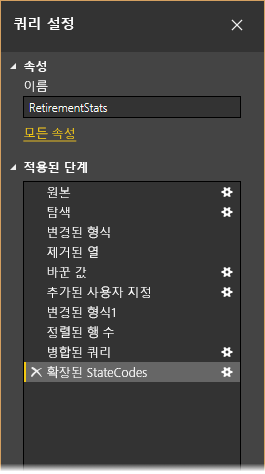

웹 데이터 원본에 연결하여 찾은 [Power BI Desktop 시작](desktop-getting-started.md)의 은퇴 데이터를 사용하여 요구 사항에 맞게 데이터를 셰이핑하겠습니다.

먼저 사용자 지정 열을 추가하여 같은 요소인 모든 데이터를 기반으로 순위를 계산하고 이 순위를 기존 열 ‘순위’와 비교해 보겠습니다.  **열 추가** 리본에서 **사용자 지정 열** 단추를 가리키는 화살표를 사용하여 사용자 지정 열을 추가할 수 있습니다.

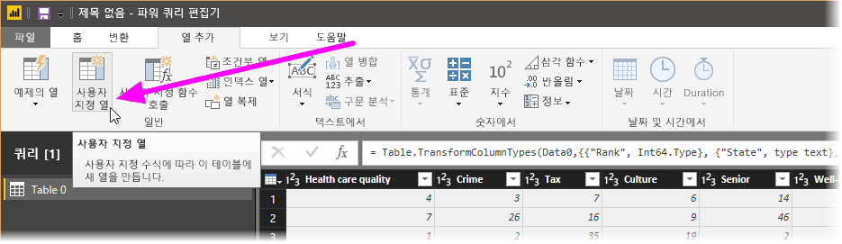

**사용자 지정 열** 대화 상자의 **새 열 이름**에 _New Rank_ 를 입력하고 **사용자 지정 열 수식**에 다음을 입력합니다.

    ([Cost of living] + [Weather] + [Health care quality] + [Crime] + [Tax] + [Culture] + [Senior] + [#"Well-being"]) / 8

상태 메시지 ‘구문 오류가 검색되지 않았습니다.’가 표시되는지 확인하고 **확인**을 클릭합니다.

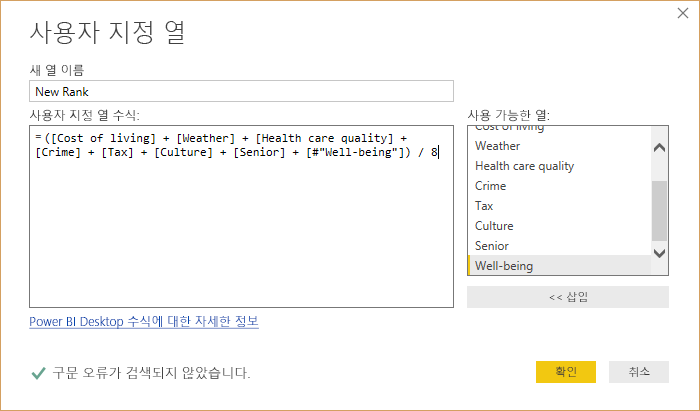

열 데이터를 일관성 있게 유지하기 위해 새 열 값을 정수로 변환해 보겠습니다. 열 머리글을 마우스 오른쪽 단추로 클릭하고 **형식 변경 \> 정수**를 선택하여 변경하면 됩니다. 

둘 이상의 열을 선택해야 할 경우 먼저 열을 하나 선택하고 **Shift** 키를 누른 채 인접한 열을 추가로 선택한 다음, 열 머리글을 마우스 오른쪽 단추로 클릭하여 선택한 모든 열을 변경합니다. **Ctrl** 키를 사용하여 인접하지 않은 열을 선택할 수도 있습니다.

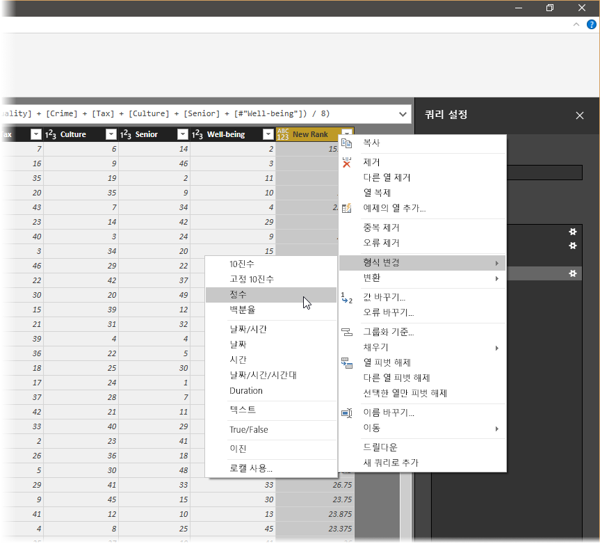

**변환** 리본에서 열 데이터 형식을 ‘변환’할 수도 있습니다. 다음은 **변환** 리본이며, 화살표가 현재 데이터 형식을 다른 데이터 형식으로 변환할 수 있는 **데이터 형식** 단추를 가리키고 있습니다.

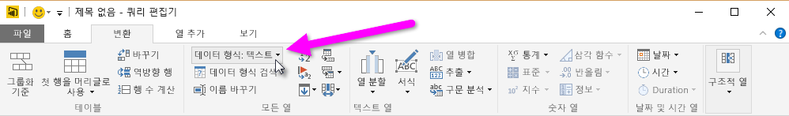

**쿼리 설정**의 **적용된 단계**는 데이터에 적용된 셰이핑 단계를 반영합니다. 셰이핑 프로세스에서 단계를 제거하려는 경우 단계 왼쪽에 있는 **X**를 선택하면 됩니다. 다음 이미지의 **적용된 단계**는 지금까지의 단계를 반영합니다. 웹 사이트(**원본**)에 연결하고, 테이블을 선택하고(**탐색**), 테이블을 로드하는 동안 쿼리 편집기가 텍스트 기반 숫자 열을 텍스트에서 정수로 자동으로 변경했습니다(**변경된 형식**). 마지막 두 단계는 **추가된 사용자 지정 항목** 및 **변경된 유형1**이 포함된 이전 작업을 보여줍니다. 

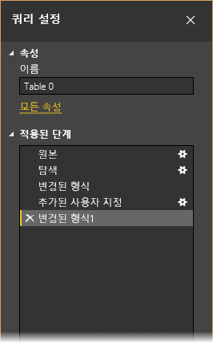

이 쿼리로 작업하려면 먼저 해당 데이터를 원하는 위치로 가져오기 위해 몇 가지 변경을 수행해야 합니다.

* ‘열을 제거하여 순위 조정’ - **Cost of living**은 결과의 요소가 아닙니다. 이 열을 제거한 후 데이터가 변경되지 않는 문제가 발생하지만, Power BI Desktop을 사용하여 쉽게 수정할 수 있으며, 이 과정에서 쿼리의 **적용된 단계** 기능이 얼마나 유용한지 확인할 수 있습니다.
* ‘몇 가지 오류 수정’ - 열을 제거했으므로 **New Rank** 열에서 계산을 다시 조정해야 합니다. 이 작업에는 수식 변경이 포함됩니다.
* ‘데이터 정렬’ - **New Rank** 및 **Rank** 열을 기준으로 합니다. 
* ‘데이터 바꾸기’ - 특정 값을 바꾸는 방법 및 **적용된 단계**를 삽입할 필요성을 강조 표시합니다.
* ‘테이블 이름 변경’ – **Table 0**은 유용한 설명자가 아니지만 간단하게 변경할 수 있습니다.

**Cost of living** 열을 제거하려면 다음 그림과 같이 해당 열을 선택하고 리본에서 **홈** 탭을 선택한 다음, **열 제거** 를 선택하면 됩니다.

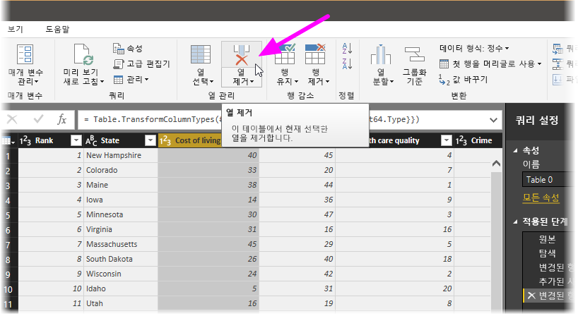

_New Rank_ 값은 변경되지 않았습니다. 이는 단계의 순서 때문입니다. 쿼리 편집기가 단계를 순차적으로 기록하면서도 서로 독립적이므로 각 **적용된 단계**를 시퀀스에서 위나 아래로 이동할 수 있습니다. 단계를 마우스 오른쪽 단추로 클릭하면 쿼리 편집기가 **이름 바꾸기**, **삭제**, **끝까지** **삭제**(현재 단계 및 모든 후속 단계 제거), **위로 이동** 또는 **아래로 이동**을 수행할 수 있는 메뉴를 제공합니다. 계속해서 마지막 단계 ‘제거된 열 수’를 ‘추가된 사용자 지정 항목’ 단계 바로 위로 이동합니다.

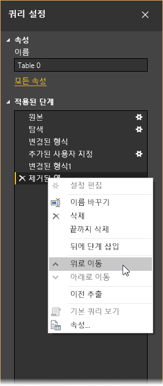

다음으로 ‘추가된 사용자 지정 항목’ 단계를 선택합니다. 이제 데이터에 ‘Error’가 표시되고 이 오류를 해결해야 합니다. 

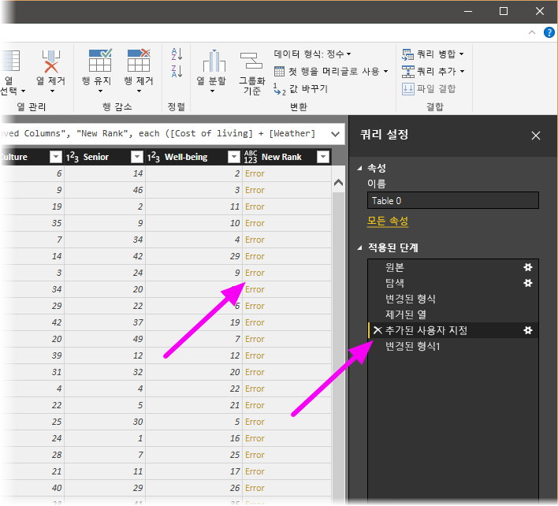

각 오류에 대한 자세한 내용을 확인할 수 있는 몇 가지 방법이 있습니다. **Error** 단어를 클릭하지 않고 셀을 선택하거나 **Error** 단어를 직접 클릭할 수 있습니다. *Error* 단어를 직접 클릭하지 **않고** 셀을 선택하는 경우 쿼리 편집기의 창 아래쪽에 오류 정보가 표시됩니다.

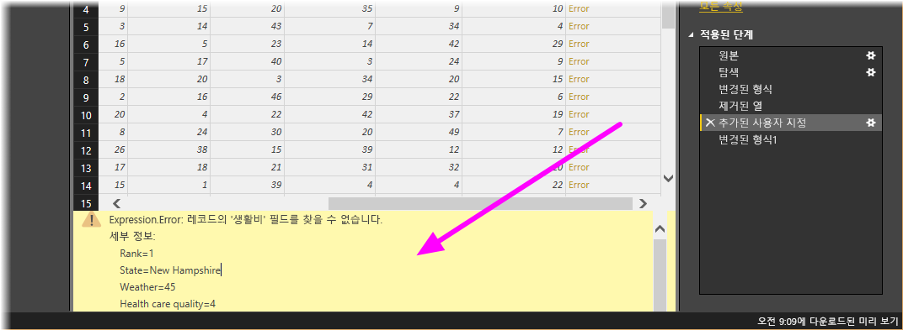

*Error* 단어를 직접 클릭하면 쿼리가 **쿼리 설정** 창에 **적용된 단계**를 만들고 오류에 대한 정보를 표시합니다. 여기서는 이 경로를 따르지 않을 것이므로 **취소**를 선택합니다.

오류를 수정하려면 _New Rank_ 열을 선택한 다음, **보기** 리본을 열고 **수식 입력줄** 확인란을 선택하여 열의 데이터 수식을 표시합니다. 

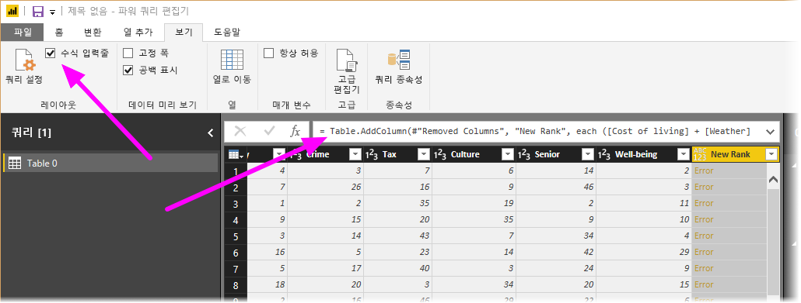

이제 ‘Cost of living’ 매개 변수를 제거하고 수식을 다음으로 변경하여 제수를 줄일 수 있습니다. 

    Table.AddColumn(#"Removed Columns", "New Rank", each ([Weather] + [Health care quality] + [Crime] + [Tax] + [Culture] + [Senior] + [#"Well-being"]) / 7)

수식 상자 왼쪽에서 녹색 확인 표시를 선택하거나 **Enter** 키를 누르면 데이터가 수정된 값으로 바뀌고 **추가된 사용자 지정 항목** 단계가 이제 ‘오류 없이’ 완료됩니다.

> [!NOTE]
> 오류가 있는 행을 모두 제거하는 **오류 제거**를 수행할 수도 있습니다(리본 또는 오른쪽 클릭 메뉴 사용). 이 경우 데이터에서 모든 행이 제거되었으며, 이 작업을 원했던 것이 아닙니다. 모든 데이터를 좋아하고 테이블에 유지하려고 합니다.

이제 **New Rank** 열을 기준으로 데이터를 정렬해야 합니다. 먼저 마지막 적용된 단계 **변경된 유형1**을 선택하여 가장 최근 데이터에 액세스합니다. 그런 다음, **New Rank** 열 머리글 옆에 있는 드롭다운을 선택하고 **오름차순 정렬**을 선택합니다.

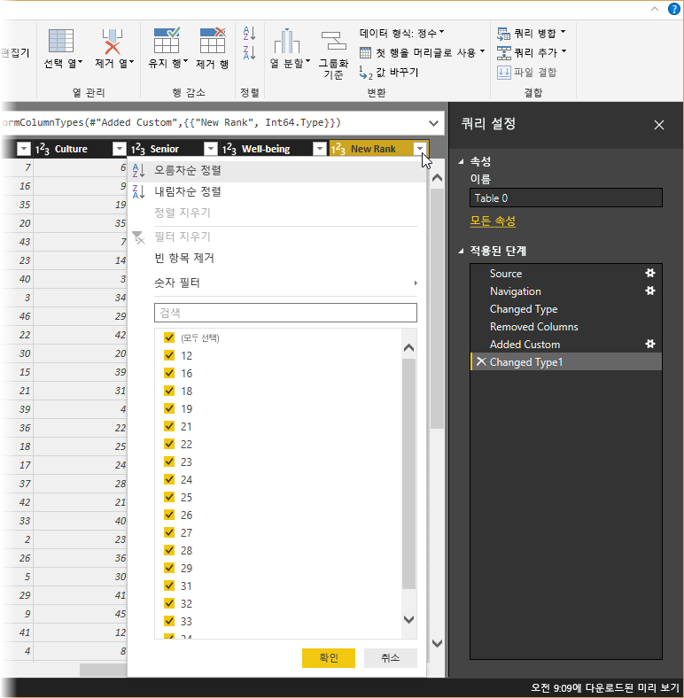

이제 데이터가 **New Rank**에 따라 정렬됩니다.  그러나 **Rank** 열을 확인하면 **New Rank** 값이 동률인 경우 데이터가 제대로 정렬되지 않음을 알 수 있습니다. 이를 수정하려면 **New Rank** 열을 선택하고 **수식 입력줄**에서 수식을 다음으로 변경합니다.

    = Table.Sort(#"Changed Type1",{{"New Rank", Order.Ascending},{"Rank", Order.Ascending}})

수식 상자 왼쪽에서 녹색 확인 표시를 선택하거나 **Enter** 키를 누르면 행이 이제 _New Rank_ 및 _Rank_ 의 두 가지 기준에 따라 정렬됩니다.

또한 목록에서 **적용된 단계**를 선택하고 시퀀스의 해당 지점에서 데이터 셰이핑을 계속할 수 있습니다. 쿼리 편집기가 현재 선택한 **적용된 단계** 바로 뒤에 새 단계를 자동으로 삽입합니다. 직접 시도해 보겠습니다.

먼저 사용자 지정 열을 추가하기 전에 **적용된 단계**에서 ‘제거된 열 수’ 단계를 선택합니다. 여기서는 Arizona에서 _Weather_ 순위의 값을 바꿉니다. Arizona의 _Weather_ 순위를 포함하는 해당 셀을 마우스 오른쪽 단추로 클릭하고 나타나는 메뉴에서 ‘값 바꾸기...’를 선택합니다. 현재 선택한 **적용된 단계**(‘추가된 사용자 지정 항목’ 단계 전의 단계)를 확인합니다.

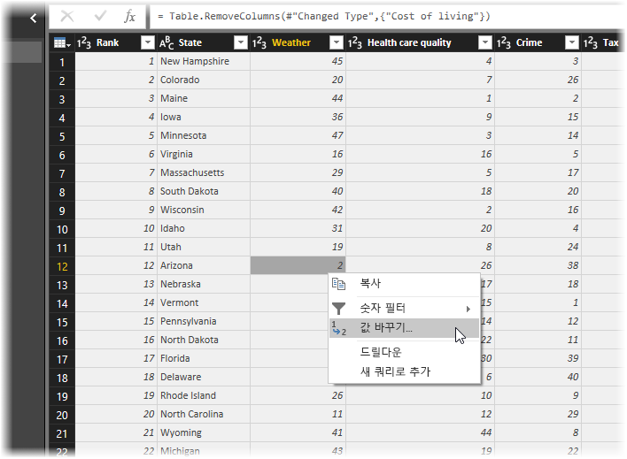

단계를 삽입하기 때문에 쿼리 편집기가 계속할 경우 후속 단계로 인해 쿼리가 중단될 수 있다고 경고합니다. 신중하게 작업해야 합니다. 이것은 자습서이고 쿼리 편집기의 유용한 기능을 강조해서 단계를 만들고 삭제 및 삽입하고, 단계를 다시 정렬하는 방법을 보여 주려고 하기 때문에 계속해서 **삽입**을 선택합니다.

값을 _51_ 로 변경하면 Arizona에 대한 데이터가 바뀝니다. 새 적용된 단계를 만들 때 쿼리 편집기는 작업, 이 경우 **Replaced Value**를 기반으로 하여 이름을 지정합니다. 쿼리에 동일한 이름을 가진 단계가 둘 이상 있을 경우 쿼리 편집기가 각 후속 **적용된 단계**에 번호를 순서대로 추가하여 구분합니다.

이제 마지막 **적용된 단계**, ‘정렬된 행 수’를 선택하고 Arizona의 새 순위에 관한 데이터가 변경되었는지 확인합니다.  이는 오른쪽의 ‘추가된 사용자 지정 항목’ 단계 앞에 ‘바꾼 값’ 단계를 삽입했기 때문입니다.

약간 복잡하긴 하지만 쿼리 편집기가 얼마나 강력하고 유연할 수 있는지를 보여 주는 좋은 예입니다.

마지막으로, 해당 테이블의 이름을 설명이 포함된 다른 이름으로 변경하려고 합니다. 보고서를 만드는 경우 특히 여러 데이터 소스에 연결할 때 설명이 포함된 테이블 이름을 사용하면 유용하며, 모두 **보고서** 보기의 **필드** 창에 나열됩니다.

테이블 이름은 쉽게 변경할 수 있습니다. **쿼리 설정** 창의 **속성** 아래에 다음 이미지와 같이 테이블의 새 이름을 입력한 다음 **Enter** 키를 누릅니다. 이 테이블을 RetirementStats라고 부르겠습니다.

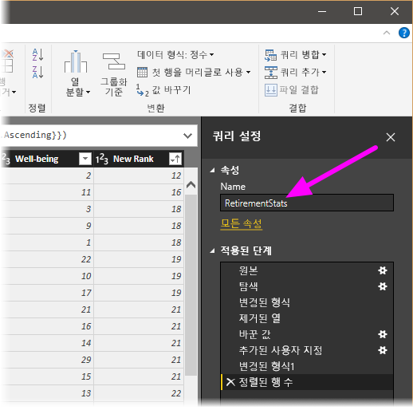

이제 필요한 범위까지 데이터를 셰이핑했습니다. 이제 다른 데이터 소스에 연결하고 데이터를 결합하겠습니다.

## 데이터 결합
다양한 주와 관련된 데이터는 흥미로우며 추가 분석 노력 및 쿼리를 작성하는 데 유용합니다. 그러나 한 가지 문제가 있습니다. 대부분의 데이터는 주의 전체 이름이 아니라 주 코드를 나타내는 2자로 된 약어를 사용합니다. 주 이름을 해당 약어와 연결하는 방법이 필요합니다.

다행히 이 작업을 수행하는 다른 공용 데이터 소스가 있지만 은퇴 테이블에 연결하려면 먼저 상당한 모양 지정이 필요합니다. 다음은 주 약어에 대한 웹 리소스입니다.

<http://en.wikipedia.org/wiki/List_of_U.S._state_abbreviations>

쿼리 편집기의 **홈** 리본에서 **새 원본\> 웹**을 선택하고 주소를 입력한 다음, **연결**을 선택하면 탐색기에 해당 웹 페이지에서 발견된 사항이 표시됩니다.

 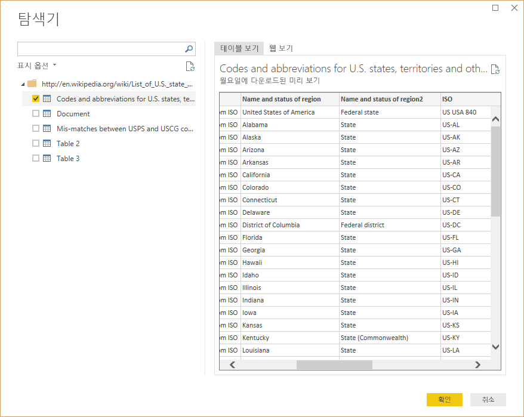

원하는 데이터를 포함하지만 해당 테이블의 데이터를 원하는 데이터까지 줄이려면 상당한 모양 지정이 필요하므로 **Codes and abbreviations...** 를 선택합니다.

> [!TIP]
> 아래 단계를 수행하는 더 빠르거나 쉬운 방법이 있나요? 예, 두 테이블 간의 관계를 만들고 해당 관계를 기반으로 데이터의 모양을 지정할 수 있습니다. 다음 단계에 따라 테이블이 작동하는 방식을 이해하고 관계가 여러 테이블의 데이터를 빠르게 사용하는 데 어떻게 도움이 되는지 파악할 수 있습니다.
> 
> 

이 데이터를 모양으로 가져오려면 다음 단계를 수행합니다.

* 상위 행 제거 – 웹 페이지의 테이블이 생성된 방식의 결과이며 필요하지 않습니다. **홈** 리본에서 **행 줄이기 \>행 제거 \>상위 행 제거**를 선택합니다.

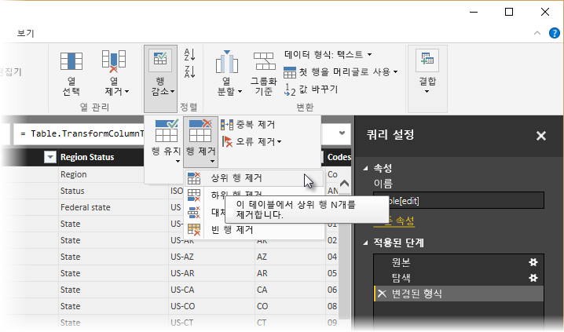

제거할 행 수를 지정할 수 있는 **상위 행 제거** 창이 나타납니다.

>[!NOTE]
>실수로 Power BI에서 테이블 머리글을 데이터 테이블의 행으로 가져오는 경우 리본의 **홈** 탭이나 **변환** 탭에서 **첫 행을 머리글로 사용**을 선택할 수 있습니다.

* 하위 26개 행 제거 – 모두 지역이므로 포함할 필요가 없습니다. **홈** 리본에서 **행 감소 \> 행 제거 \>하위 행 제거** 를 선택합니다.

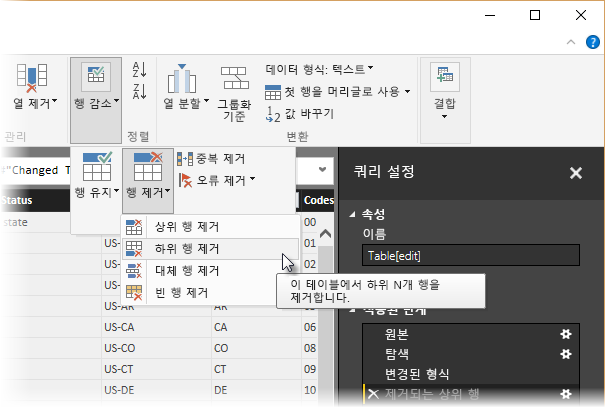

* RetirementStats 테이블에 워싱턴 DC에 대한 정보가 없으므로 목록에서 필터링해야 합니다. 영역 상태 열 옆에 있는 드롭다운 화살표를 선택한 다음 **Federal district** 옆에 있는 확인란의 선택을 취소합니다.

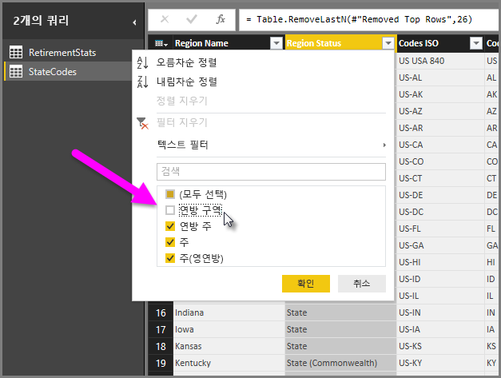

* 몇 개의 불필요한 열 제거 – 주와 2자로 된 공식 약어 간의 매핑만 필요하므로 다음 열을 제거할 수 있습니다. 차례로 **Column1**, **Column3**, **Column4** 및 **Column6**~**Column11**. 먼저 **Column1**을 선택하고 **Ctrl** 키를 누른 채 제거할 다른 열을 선택합니다. 이렇게 하면 연속하지 않는 여러 열을 선택할 수 있습니다. 리본의 홈 탭에서 **열 제거 > 열 제거\>를 선택합니다**.

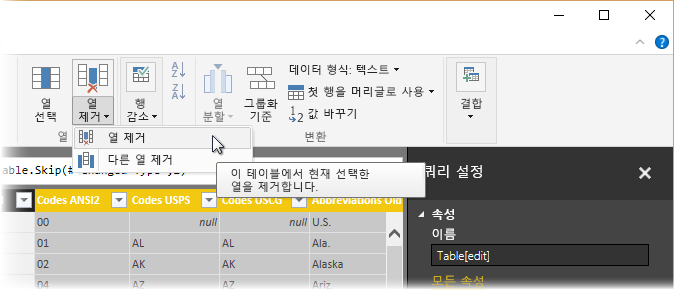

>[!NOTE]
>이 시점에서 쿼리 편집기에서 적용된 단계의 *시퀀스*가 중요하며 데이터의 셰이핑 방식에 영향을 줄 수 있음에 주목하는 것이 좋습니다. 또한 한 단계가 다른 후속 단계에 미칠 수 있는 영향을 고려하는 것이 중요합니다. 적용된 단계에서 한 단계를 제거하면 쿼리의 단계 시퀀스 영향 때문에 후속 단계가 의도한 대로 동작하지 않을 수 있습니다.

>[!NOTE]
>너비를 줄이기 위해 쿼리 편집기 창의 크기를 조정할 때 보이는 공간을 최대한 활용하기 위해 일부 리본 항목이 압축됩니다. 쿼리 편집기 창의 너비를 늘리면 늘어난 리본 영역을 최대한 활용하기 위해 리본 항목이 확장됩니다.

* 열과 테이블 자체의 이름 바꾸기 – 일반적으로 열의 이름을 바꾸는 몇 가지 방법이 있습니다. 먼저 열을 선택한 다음 리본의 **변환** 탭에서 **이름 바꾸기**를 선택하거나 마우스 오른쪽 단추를 클릭하고 나타나는 메뉴에서 **이름 바꾸기...** 를 선택합니다. 다음 그림에는 두 옵션을 가리키는 화살표가 있습니다. 하나만 선택해야 합니다.

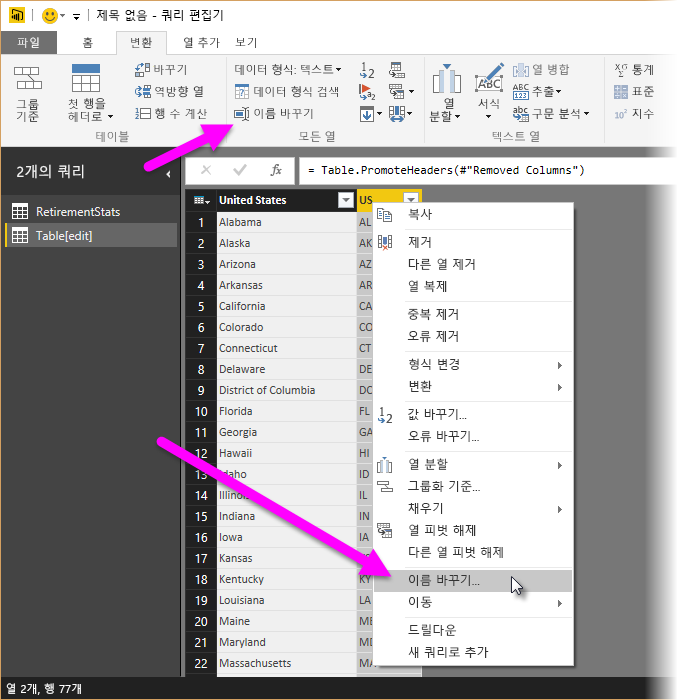

이름을 *State Name* 및 State Code로 바꾸겠습니다. 테이블의 이름을 바꾸려면 **쿼리 설정** 창의 **이름** 상자에 이름을 입력하면 됩니다. 이 테이블을 StateCodes라고 부르겠습니다.

이제 StateCodes 테이블을 원하는 방식으로 셰이핑했으므로 이러한 두 테이블 또는 쿼리를 하나로 결합하겠습니다. 이제 테이블이 데이터에 적용한 쿼리의 결과이므로 쿼리라고도 합니다.

쿼리를 결합하는 기본 방법에는 *병합* 및 추가의 두 가지가 있습니다.

다른 쿼리에 추가하려는 열이 하나 이상 있는 경우 쿼리를 **병합** 합니다. 기존 쿼리에 추가하려는 데이터 행이 더 있는 경우 쿼리를 **추가** 합니다.

이 경우 쿼리를 병합하려고 합니다. 시작하려면 쿼리 편집기의 왼쪽 창에서 다른 쿼리를 병합하려는 경우 *넣을* 쿼리를 선택하며 이 경우에는 RetirementStats입니다. 그런 다음 리본 메뉴의 홈 탭에서 **결합\>** **쿼리 병합**을 선택합니다.

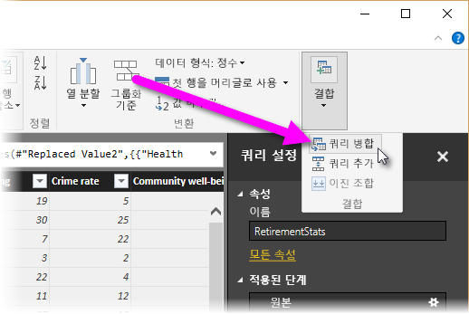

전송하지 않으려는 데이터를 포함하거나 전송하지 않는 상태로 데이터가 결합되도록 개인 정보 수준을 설정하라는 메시지가 표시될 수 있습니다.

그런 다음 **병합** 창이 나타나고, 선택한 테이블에 병합하려는 테이블 및 병합에 사용할 일치하는 열을 선택하라는 메시지가 표시됩니다. RetirementStats 테이블(쿼리)에서 State를 선택한 다음 StateCodes 쿼리를 선택합니다. 이 경우에는 다른 쿼리가 하나뿐이므로 쉽지만 여러 데이터 원본에 연결하는 경우 많은 쿼리 중에서 선택해야 합니다. 일치하는 열(RetirementStats의 **State** 및 StateCodes의 **State Name**)을 올바르게 선택하면 **병합** 창이 다음과 같이 나타나고 **확인** 단추를 사용할 수 있습니다.

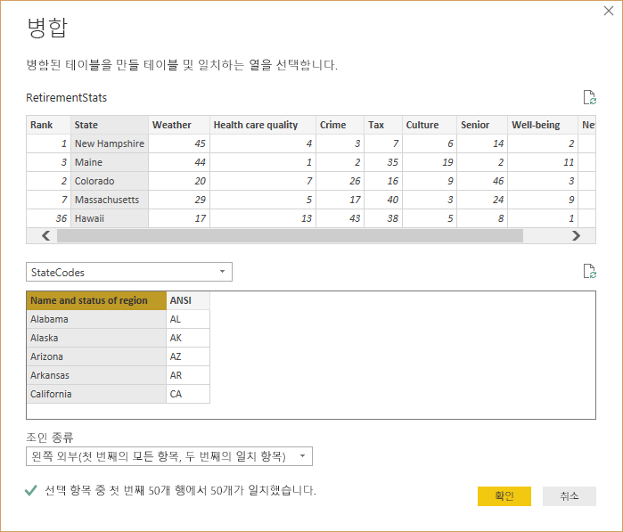

기존 쿼리와 병합된 테이블(쿼리)의 내용인 **NewColumn** 이 쿼리의 끝 부분에 만들어집니다. 병합된 쿼리의 모든 열이 **NewColumn**에 압축되지만 테이블을 **확장** 하도록 선택하고 원하는 모든 열을 포함할 수 있습니다.

병합된 테이블을 확장하고 포함할 열을 선택하려면 확장 아이콘()을 선택합니다. **확장** 창이 나타납니다.

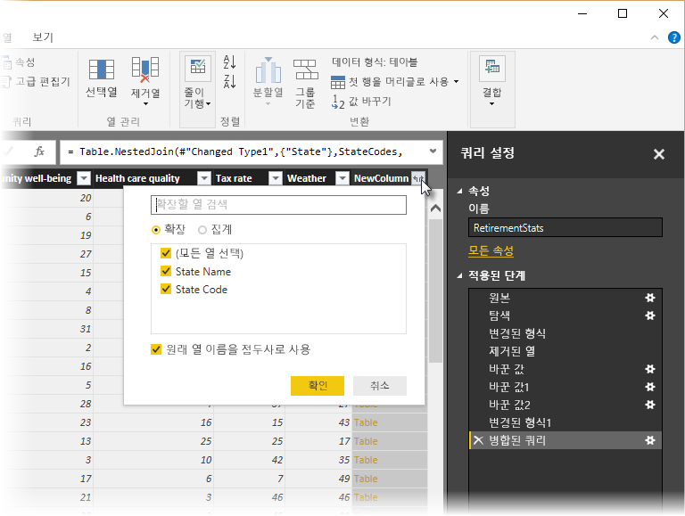

이 경우 **State Code** 열만 포함하려고 하므로 해당 열만 선택하고 **확인**을 선택합니다. 필요하지 않거나 원하지 않으므로 Use original column name as prefix(원래 열 이름을 접두사로 사용) 확인란을 선택 취소합니다. 선택된 상태로 두면 병합된 열의 이름이 **NewColumn.State Code**(원래 열 이름 또는 **NewColumn**, 점, 쿼리로 가져오는 열 이름)로 지정됩니다.

>[!NOTE]
>**NewColumn** 테이블에 가져오는 방법을 알아보고 싶으세요? 몇 가지를 실험한 후 결과가 만족스럽지 않으면 **쿼리 설정** 창의 **적용된 단계** 목록에서 해당 단계를 삭제합니다. 쿼리가 해당 **확장** 단계를 적용하기 전의 상태로 돌아갑니다. 확장 프로세스가 원하는 방식으로 표시될 때까지 원하는 횟수만큼 수행할 수 있는 무료 반복 서비스와 같습니다.

이제 각각 요구 사항에 맞게 모양이 지정된 두 데이터 소스를 결합하는 단일 쿼리(테이블)가 있습니다. 이 쿼리는 임의 주의 주택 비용 통계, 인구 통계 또는 구직 기회와 같은 흥미로운 많은 추가 데이터 연결의 기초로 사용될 수 있습니다.

변경 내용을 적용하고 쿼리 편집기를 닫으려면 **홈** 리본 메뉴에서 **닫기 및 적용**을 선택합니다. 변환된 데이터 세트는 Power BI Desktop에 표시되고 보고서를 만드는 데 사용할 준비가 되었습니다.

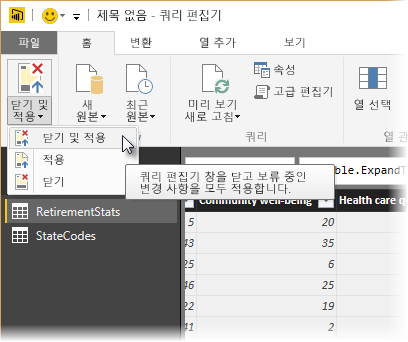

## 다음 단계
Power BI Desktop에서 모든 종류의 작업을 수행할 수 있습니다. 해당 기능에 대한 자세한 내용은 다음 리소스를 확인하세요.

* [Power BI Desktop이란?](desktop-what-is-desktop.md)
* [Power BI Desktop을 사용한 쿼리 개요](desktop-query-overview.md)
* [Power BI Desktop의 데이터 원본](desktop-data-sources.md)
* [Power BI Desktop에서 데이터에 연결](desktop-connect-to-data.md)
* [Power BI Desktop의 일반적인 쿼리 작업](desktop-common-query-tasks.md)   

