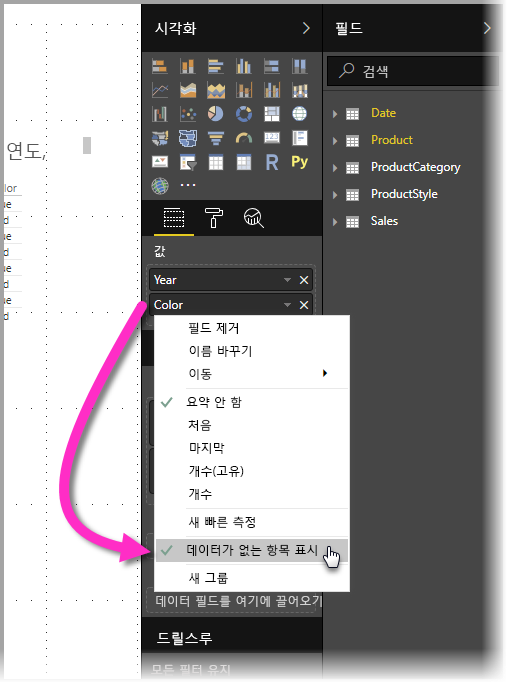
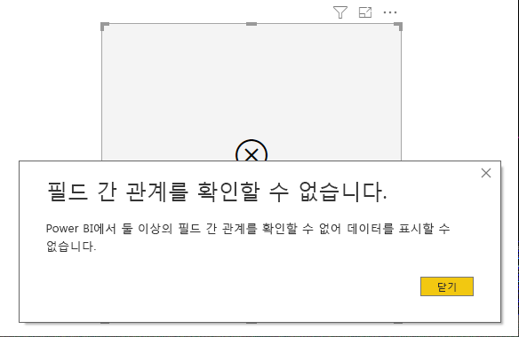
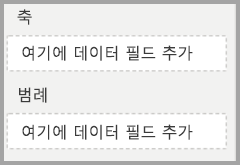
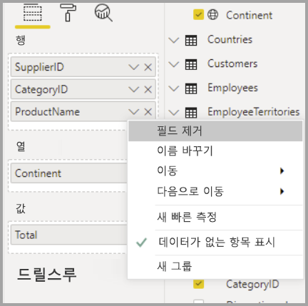

# Power BI에서 데이터가 없는 항목 표시

Power BI를 사용하면 다양한 소스에서 가져온 다양한 유형의 데이터를 시각화할 수 있습니다. 시각적 개체를 만들 때는 데이터가 표현되고 표시되는 방식을 올바르게 관리할 수 있도록 Power BI에 관련 데이터만 표시됩니다. Power BI는 시각적 개체의 구성 및 기반 데이터 모델을 바탕으로 관련 데이터가 무엇인지 판단합니다. 이 문서에서는 Power BI에서 판단이 이루어지는 과정을 보여주는 예를 통해 Power BI가 관련 데이터를 판단하는 방식을 설명합니다.

## 관련 데이터 판단

Powe BI가 표시와 관련 있는 데이터를 판단하는 방식을 알아보기 위해 먼저 간단한 테이블의 예를 살펴보겠습니다. 이 문서의 끝부분에 있는 [예제 데이터 모델](#example-data-model) 섹션에서 설명하는 모델을 사용하여 다음과 같은 설정으로 테이블을 빌드합니다.

**1. 동일한 테이블에서 온 그룹:** *제품[색] - 제품[크기]*

|*제품[색]*  |*제품[크기]*  |
|---------|---------|
|파랑     |대형         |
|파랑     |중형         |
|파랑     |소형         |
|빨강     |대형         |

이 예제에서 Power BI는 테이블 *[제품]* 에 존재하는 *[색-크기]* 조합을 표시합니다. 

이번에는 다른 조합을 살펴보겠습니다.

**2. 직접적인 관계가 있는 서로 다른 테이블에서 온 그룹과 수치:** *제품스타일[마감] - 제품[색] - 합계(판매[수량])*

|*제품스타일[마감]*  |*제품[색]*  |*[수량합계]*  |
|---------|---------|---------|
|유광     |파랑         |10         |
|무광     |파랑         |15         |

이 예제에서 Power BI는 존재하는 조합만 표시합니다. 예를 들어, ("없음" + "파랑")이나 ("무광" + "빨강")과 같은 조합은 이 모델에 존재하지 않으므로 표시하지 않습니다. 조합의 존재 여부를 결정하는 조건은 *합계(판매[수량])* 의 값이 비어 있지 않은 것입니다.

다른 경우를 살펴보겠습니다. 

**3. 관계가 있는 서로 다른 테이블에서 온 그룹, 수치 없음:** *제품스타일[마감] - 제품[색]*

|*제품스타일[마감]*  |*제품[색]*  |
|---------|---------|
|유광     |파랑         |
|유광     |빨강         |
|무광     |파랑         |

명시적인 수치가 없고 두 테이블이 직접적인 관계가 있으므로 Power BI는 결과로 나오는 조합을 제한하기 위해 수치를 삽입하려고 시도합니다. 이 예제에서는 Power BI가 *CALCULATE(COUNTROWS('제품'))* 이라는 수치를 삽입하려고 시도합니다. *제품*은 두 테이블의 공통 테이블이므로 이 수치는 비어 있지 않아야 합니다.

따라서 Power BI는 제품 테이블에 항목이 있는 조합을 표시하고, 그에 따라 *("없음" + "파랑")* 및 *("무광" + "빨강")* 조합은 제외됩니다.

**4. 관계가 없는 서로 다른 테이블에서 온 그룹**

이 문서에서 다루는 샘플 모델에는 이 조합이 없지만, 관계가 없는 서로 다른 테이블에서 온 그룹이 있다면 Power BI는 두 열의 관계를 파악할 수 없습니다. 따라서 각 열의 모든 값이 크로스 조인됩니다. 데이터베이스에서 이러한 크로스 조인 연산을 수행하려면 비용이 많이 들고 사용자에게 그다지 유용한 정보를 제공하지도 않기 때문에 이 경우 Power BI는 *제약 없는 조인*이라는 유형의 오류를 발생시킵니다. 

## 데이터가 없는 항목 표시

앞 섹션에서는 Power BI가 표시와 관련 있는 데이터를 판단하는 방식을 설명했습니다. 그러나 데이터가 없는 항목을 *표시하고 싶을 때*도 있습니다. 

**데이터가 없는 항목 표시** 기능을 사용하면 수치 데이터가 없는(수치 값이 비어 있는) 행과 열을 포함할 수 있습니다.

**데이터가 없는 항목 표시** 기능을 사용하도록 설정하려면 시각적 개체를 하나 선택하고 **필드** 영역에서 해당 필드를 마우스 오른쪽 단추로 클릭한 후 아래 그림과 같이 표시되는 메뉴에서 **데이터가 없는 항목 표시**를 선택합니다.

**데이터가 없는 항목 표시** 기능은 다음과 같은 경우에는 적용되지 *않습니다*.

* 시각적 개체에 추가된 수치가 없고, 그룹화 열이 동일한 테이블에서 온 경우.
* 그룹 사이에 관계가 없는 경우. Power BI는 관계가 없는 그룹을 갖는 시각적 개체에 대한 쿼리를 실행하지 않습니다.
* 수치가 어느 그룹과도 관계가 없는 경우. 이런 경우에는 일부 그룹 조합에서만 수치가 비어 있지 않을 것이기 때문입니다.
* 빈 수치를 제외하는 사용자 정의 수치 필터가 있는 경우. 예: *판매금액 > 0*

### 데이터가 없는 항목 표시가 작동하는 방식

수치가 있는 경우에 **데이터가 없는 항목 표시**를 사용하면 재미있는 결과를 볼 수 있습니다. 그룹이 모두 동일한 테이블에서 온 경우 또는 이 모델의 경로를 통해 관계를 맺을 수 있는 경우를 살펴보겠습니다. 예를 들어, *제품스타일*은 *제품*과 직접적인 관계가 있고, *판매*와 간접적인 관계가 있습니다. *제품스타일*과 *제품범주*는 *제품* 테이블을 통해 관계를 갖습니다.

몇 가지 재미있는 사례에서 **데이터가 없는 항목 표시**를 껐을 때와 켰을 때를 비교해 보겠습니다. 

**1. 동일한 테이블에서 온 그룹화 열:** *제품[색] - 제품[크기] - 합계(판매[수량])*

**데이터가 없는 항목 표시** 기능을 끈 경우:

|*제품[색]*  |*제품[크기]*  |*[수량합계]*  |
|---------|---------|---------|
|파랑     |중형         |15         |
|파랑     |소형         |10         |

**데이터가 없는 항목 표시** 기능을 켠 경우:

|*제품[색]*  |*제품[크기]*  |*[수량합계]*  |
|---------|---------|---------|
|파랑     |대형         |         |
|파랑     |중형         |15         |
|파랑     |소형         |10         |
|빨강     |대형         |         |

이 기능을 켰을 때 두 개의 새로운 조합, 즉 *파랑 - 대형*과 *빨강 - 대형*이 나타났습니다. 두 항목 모두 *판매* 테이블에 대응되는 *수량*이 없지만 *제품* 테이블에 나타났습니다.

**2. 관계있는 테이블에서 온 그룹화 열:** *제품스타일[마감] - 제품[색] - 합계(판매[수량])*

**데이터가 없는 항목 표시** 기능을 끈 경우:

|*제품스타일[마감]*  |*제품[색]*  |*[수량합계]*  |
|---------|---------|---------|
|유광     |파랑         |10         |
|무광     |파랑         |15         |

**데이터가 없는 항목 표시** 기능을 켠 경우:

|*제품스타일[마감]*  |*제품[색]*  |*[수량합계]*  |
|---------|---------|---------|
|유광     |파랑         |10         |
|유광     |빨강         |         |
|무광     |파랑         |15         |
|없음     |         |         |

*(유광-빨강)* 과 *(없음, 공란)* 이라는 조합이 나타난 것을 볼 수 있습니다. 그 이유는 다음과 같습니다.
* Power BI는 먼저 제품스타일[마감]을 살펴보고 표시할 값을 선택합니다. 여기서 유광, 무광, 없음이 선택되었습니다.
* 각각의 값을 사용하여 대응되는 모든 *제품[색]* 항목을 선택합니다. 
* *없음*은 어떤 *제품[색]* 에도 대응되지 않으므로 이 값에는 공란이 표시됩니다.

열의 값을 선택하는 메커니즘은 순서에 따라 진행된다는 사실에 유의해야 합니다. 테이블 사이의 *왼쪽 우선 외부 조인* 연산이라고 생각하면 됩니다. 열의 순서가 변경되면 결과도 변경됩니다.

이번에는 순서를 변경해 보고 그 결과를 살펴보겠습니다. 이 섹션의 **2**번에서 사용한 항목을 순서만 변경한 것입니다.

**제품[색] - 제품스타일[마감] - 합계(판매[수량])**

**데이터가 없는 항목 표시** 기능을 켠 경우:

|*제품[색]* |*제품스타일[마감]*  |*[수량합계]*  |
|---------|---------|---------|
|파랑     |유광         |10         |
|파랑     |무광         |15         |
|빨강     |유광         |         |

테이블에 *제품스타일[마감]=없음*이 나타나지 않는 것을 볼 수 있습니다. Power BI가 먼저 *제품* 테이블에 있는 모든 *색* 값을 선택한 다음 각 색에 대해 데이터를 포함하는 대응되는 *마감* 값을 선택했기 때문입니다. *없음*은 어떠한 *색* 조합에도 나타나지 않으므로 선택되지 않았습니다.

## Power BI 시각적 개체 동작

시각적 개체의 한 필드에서 **데이터가 없는 항목 표시**를 사용하도록 설정하면, 동일한 ‘시각적 개체 버킷’이나 계층 구조에 있는 다른 모든 필드에 대해서도 해당 기능이 자동으로 사용됩니다.  시각적 개체 버킷 또는 계층 구조는 해당 **축**, **범례**, **범주**, **행** 또는 **열**일 수 있습니다.

예를 들어 **행** 버킷에 4개의 필드가 있는 행렬 시각적 개체의 한 필드에서 **데이터가 없는 항목 표시**를 사용하도록 설정하면 행렬의 모든 항목에서 사용하도록 설정됩니다. 다음 그림에서는 **행** 버킷의 첫 번째 필드인 *SupplierID* 필드에서 **데이터가 없는 항목 표시**를 사용하도록 설정했습니다. **행** 버킷의 다른 필드도 자동으로 사용하도록 설정됩니다.

반면, **열** 버킷에 표시된 *Continent* 필드에는 **데이터가 없는 항목 표시**가 자동으로 사용하도록 설정되지 ‘않습니다’.  

이 시각적 개체 동작은 시각적 개체를 다른 형식으로 변환하는 경우(예: 행렬 시각적 개체를 테이블 시각적 개체로 변환하는 경우)에 주로 나타납니다. 이러한 변환에서는 **데이터가 없는 항목 표시**가 해당 버킷의 필드에서 사용하도록 설정된 버킷으로 이동하는 모든 필드에 대해 자동으로 사용하도록 설정됩니다. 앞의 예제에서 *SupplierID*에 **데이터가 없는 항목 표시** 기능이 사용하도록 설정되어 있고 시각적 개체를 테이블로 변환하면, **열** 버킷의 *Continent* 필드가 **행** 버킷의 필드와 함께 테이블 시각적 개체에서 사용되는 유일한 버킷인 **값** 버킷으로 이동됩니다. 따라서 **값** 버킷의 모든 필드에서 **데이터가 없는 항목 표시**가 사용하도록 설정됩니다.

### 데이터 내보내기

**요약된 데이터 내보내기** 기능을 사용하는 경우 **데이터가 없는 항목 표시** 기능의 동작은 내보내기가 테이블 시각적 개체로 변환된 것과 동일합니다. 따라서 차트 행렬 시각적 개체와 같은 시각적 개체를 내보내는 경우, 내보낸 데이터가 표시된 시각적 개체와 다르게 나타날 수 있습니다. 내보내기 프로세스의 일부로 테이블 시각적 개체로 변환되면서 내보내는 모든 필드에 대해 **데이터가 없는 항목 표시**가 사용하도록 설정되기 때문입니다. 

## 예제 데이터 모델

이 섹션에서는 본 문서의 예제에서 사용된 샘플 데이터 모델을 보여줍니다.

**모델**: 

**데이터**:

|제품[제품Id]|    제품[제품이름]|   제품[색]| 제품[크기]|  제품[범주Id]|    제품[스타일Id]|
|---------|---------|---------|---------|---------|---------|
|1  |제품1  |파랑   |소형  |1  |1 |
|2  |제품2  |파랑   |중형 |2  |2 |
|3  |제품3  |빨강    |대형  |1  |1 |
|4  |제품4  |파랑   |대형  |2  |2 |

|제품범주[범주Id]|   제품범주[범주이름]|
|---------|---------|
|1  |휴대 전화   |
|2  |카메라 |
|3  |TV |

|제품스타일[스타일Id]| 제품스타일[마감]|   제품스타일[광택]|
|---------|---------|---------|
|1  |유광  |예 |
|2  |무광  |아니요 |
|3  |없음   |아니요 |

|판매[판매Id]| 판매[제품Id]|   판매[날짜]|    판매[수량]|
|---------|---------|---------|---------|
|1  |1  |2012/1/1 0:00| 10 |
|2  |2  |2013/1/1 0:00| 15 |

## 다음 단계

이 문서에서는 Power BI에서 **데이터가 없는 항목 표시** 기능을 활성화하는 방법을 설명했습니다. 다음 문서에도 관심이 있을 수 있습니다. 

* [Power BI의 다차원 모델의 기본 멤버](desktop-default-member-multidimensional-models.md)
