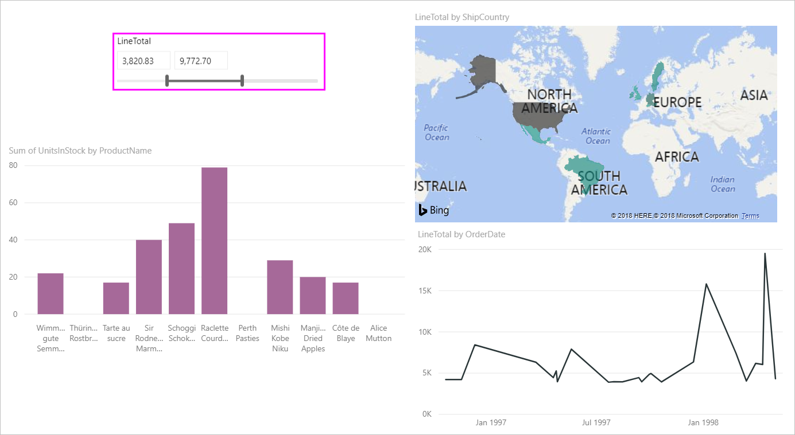
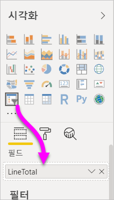
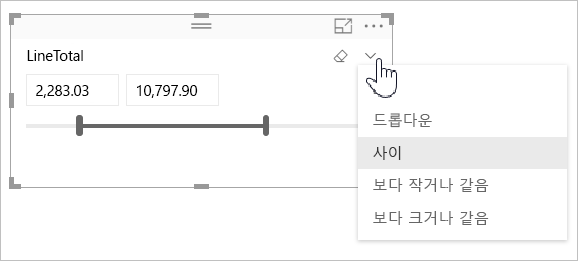
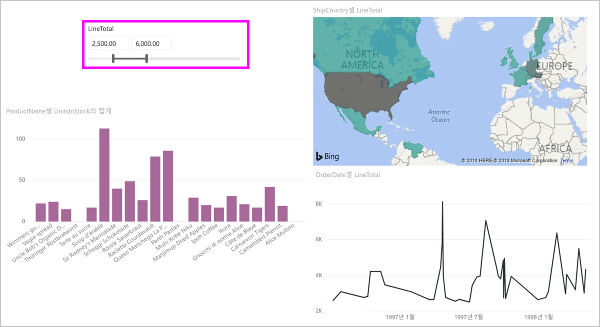
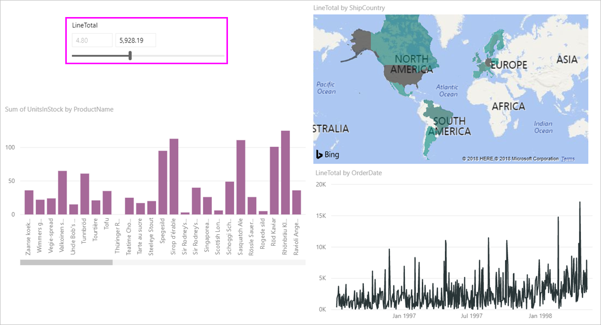
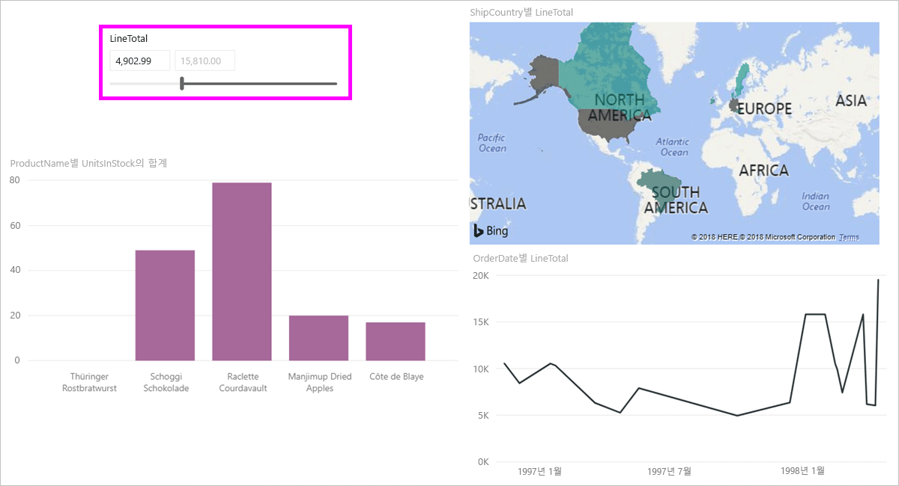

# Power BI Desktop에서 숫자 범위 슬라이서 사용
숫자 범위 슬라이서를 사용하여 데이터 모델의 모든 숫자 열에 모든 종류의 필터를 적용할 수 있습니다. 숫자 데이터를 필터링하는 세 가지 옵션은 숫자 사이, 숫자보다 작거나 같음 또는 숫자보다 크거나 같음입니다. 이는 간단하게 들릴 수도 있지만 데이터를 필터링하는 강력한 방법입니다.

## 숫자 범위 슬라이서 사용
다른 슬라이서를 사용하는 것처럼 숫자 범위 슬라이서를 사용할 수 있습니다. 보고서에 **슬라이서** 시각적 개체를 만든 후 **필드** 값으로 숫자 값을 선택하기만 하면 됩니다. 다음 이미지에서는 **LineTotal** 필드를 선택했습니다.

**숫자 범위 슬라이서**의 오른쪽 위 모서리에서 아래쪽 화살표 링크를 선택하면 메뉴가 나타납니다.

숫자 범위에 대해 다음 세 가지 옵션 중에서 선택할 수 있습니다.

* **사이**
* **작거나 같음**
* **크거나 같음**

메뉴에서 **사이**를 선택하면 슬라이더가 나타납니다. 슬라이더를 사용하여 숫자 사이에 있는 숫자 값을 선택할 수 있습니다. 경우에 따라 슬라이서 막대를 이동하는 세분성으로 인해 해당 숫자에 정확하게 맞추기가 어렵습니다. 슬라이더를 사용하고 상자 중 하나를 선택하여 원하는 값을 입력할 수도 있습니다. 이 옵션은 특정 숫자를 조각화하려는 경우에 편리합니다. 

다음 이미지에서 보고서 페이지는 2500.00과 6000.00 사이 범위로 지정된 **LineTotal** 값으로 필터링됩니다.

**작거나 같음**을 선택하면 슬라이더 막대의 왼쪽(낮은 값) 핸들이 사라지고 슬라이더 막대의 상한만을 조정할 수 있습니다. 다음 이미지에서는 슬라이더 막대를 최대 5928.19로 설정합니다.

마지막으로 **크거나 같음**을 선택한 경우 오른쪽(높은 값) 슬라이더 막대 핸들이 사라집니다. 다음 이미지에 표시된 대로 낮은 값을 조정할 수 있습니다. 이제 4902.99보다 크거나 같은 **LineTotal** 값이 있는 항목만이 보고서 페이지의 시각적 개체에 표시됩니다.

## 숫자 범위 슬라이서를 사용하여 정수로 맞춤

숫자 범위 슬라이서는 기본 필드의 데이터 형식이 **정수**인 경우 정수로 맞춰집니다. 이 기능을 통해 슬라이서를 깔끔하게 정수로 맞출 수 있습니다. **10진수** 필드에서는 숫자의 분수를 입력하거나 선택할 수 있습니다. 텍스트 상자에 설정된 서식은 더 정밀한 숫자를 입력하거나 선택할 수 있더라도 필드에 설정된 서식과 일치합니다.

## 날짜 범위 슬라이서로 서식 지정 표시

슬라이서를 사용하여 날짜 범위를 표시하거나 설정하는 경우 날짜는 **간단한 날짜** 형식으로 표시됩니다. 사용자의 브라우저 또는 운영 체제 로캘에 따라 날짜 형식이 결정됩니다. 이 형식은 기본 데이터 또는 모델의 데이터 형식 설정과 관계없이 표시 형식으로 사용됩니다. 

예를 들어 기본 데이터 형식으로 자세한 날짜 형식을 사용할 수 있습니다. 이 경우 *dddd, MMMM d, yyyy*와 같은 날짜 형식이 다른 시각적 개체 또는 상황에서 날짜를 *Wednesday, March 14, 2001*로 지정합니다. 그러나 날짜 범위 슬라이서에서 해당 날짜는 슬라이서에서 *03/14/2001*로 표시됩니다.

슬라이서에 **짧은 날짜** 형식을 표시하면 슬라이서 내에서 문자열의 길이가 일관되고 간단하게 유지됩니다. 

## 제한 사항 및 고려 사항
다음과 같은 제한 사항 및 고려 사항이 **숫자 범위 슬라이서**에 적용됩니다.

* **숫자 범위 슬라이서**는 집계된 값이 아닌 데이터에 있는 모든 기본 행을 필터링합니다. 예를 들어 *판매액* 필드를 사용하는 경우를 가정해 보겠습니다. 슬라이서는 시각적 개체의 각 데이터 요소에 대한 판매액 합계가 아니라 판매액을 기준으로 각 트랜잭션을 필터링합니다.
* 현재는 측정값을 사용하지 않습니다.
* 기본 열에 있는 값의 범위를 벗어난 경우에도 숫자 슬라이서의 텍스트 상자에 원하는 수를 입력할 수 있습니다. 이 옵션을 통해 데이터가 앞으로 변경될 수 있다는 것을 아는 경우 필터를 설정할 수 있습니다.
