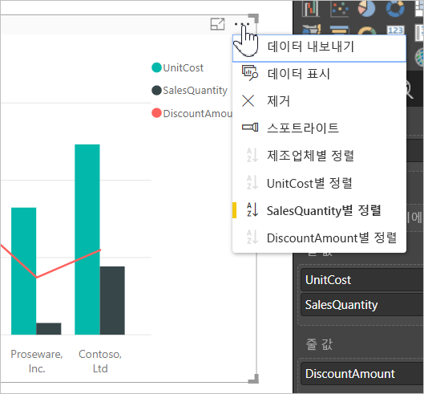
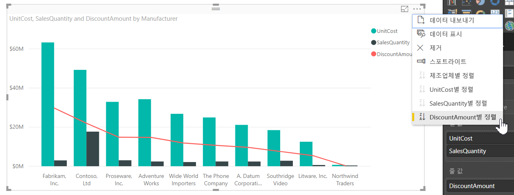
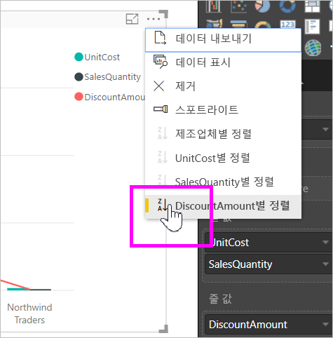
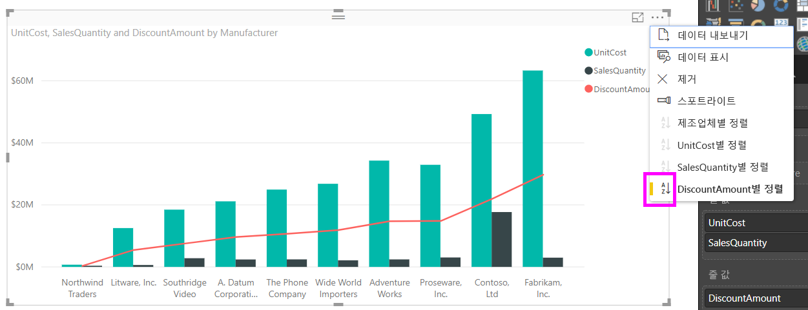
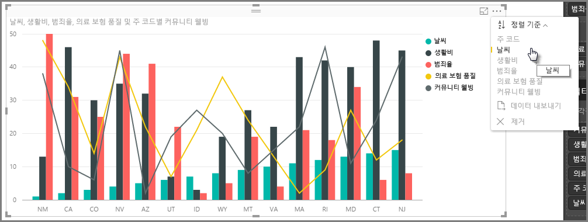
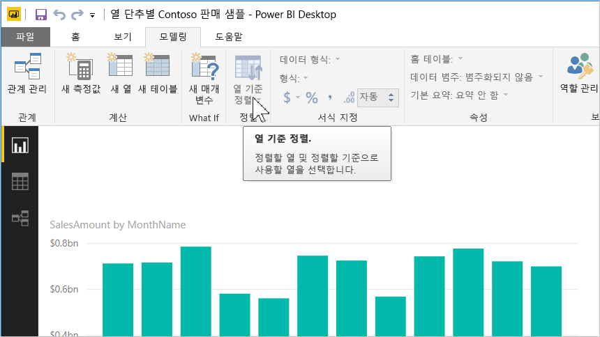
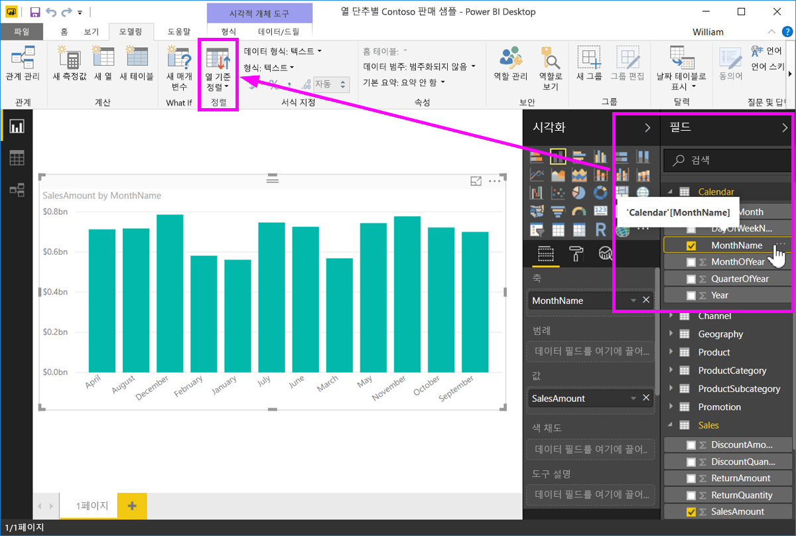
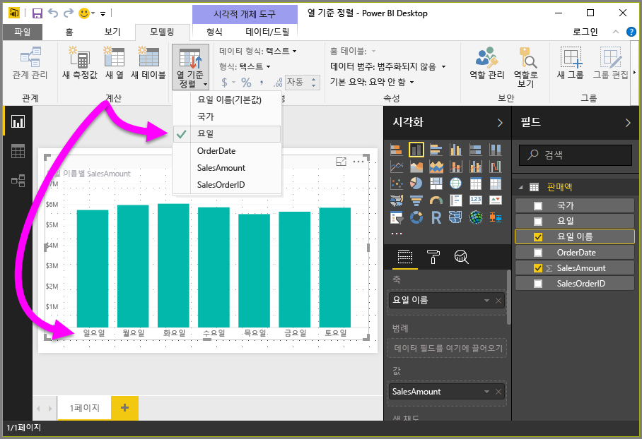

# Power BI Desktop의 열 기준 정렬
**Power BI Desktop**과 **Power BI 서비스**에서는 다양한 데이터 필드로 정렬하여 시각적 개체의 모양을 변경할 수 있습니다. 시각적 개체의 정렬 방법을 변경하면 다루려는 정보를 강조 표시하고 다루려는 추세(또는 강조점)에 시각적 효과를 줄 수 있습니다.

숫자 데이터(예: 판매 수치) 또는 텍스트 데이터(예: 주 이름) 중 어떤 데이터를 사용하든지 시각화를 원하는 모양으로 정렬할 수 있습니다.  **Power BI**는 여러 다양한 정렬 방법과 사용 가능한 간편한 메뉴를 제공합니다. 다음 그림에서처럼 아무 시각적 개체에서나 줄임표(...)를 선택한 다음 **정렬 기준**을 선택하고 정렬하려는 기준 필드를 선택합니다.

## 더 구체적인 예제
더 구체적인 예제와, **Power BI Desktop**에서 어떻게 작동하는지 살펴보겠습니다.

다음 시각화에서는 날씨와 관련하여 상위 15주 상태를 나열합니다(가장 화창한 날 1순위부터 50순위까지, 1순위가 가장 화창한 날). 정렬을 수행하기 전 시각화 모양은 다음과 같습니다.

이 시각적 개체는 현재 **주거 비용**을 기준으로 정렬되어 있습니다. 해당 범례에 대해 내림차순으로 표시된 막대의 색을 찾아 알 수 있지만 현재 정렬 열을 확인하는 더 나은 방법으로 **정렬 기준** 대화 상자가 있습니다. 이 대화 상자는 시각적 개체의 오른쪽 위에 있는 줄임표 메뉴(...)에서 사용할 수 있습니다. 줄임표를 선택하면 다음이 표시됩니다.

줄임표를 선택할 때 나타나는 메뉴에는 눈에 띄는 몇 가지 항목이 있습니다.

* **주거 비용** 옆에 노란색 막대가 있고 **주거 비용**이 굵게 표시됩니다.
* **정렬 기준** 옆에 있는 작은 아이콘은 **Z/A**(A 위에 Z)와 아래쪽 화살표를 표시합니다.

다음 두 섹션에서는 이러한 각 부분을 독립적으로 살펴보겠습니다.

## 정렬에 사용할 열 선택
**정렬 기준** 메뉴에서 **주거 비용** 옆의 노란색 막대는 시각적 개체의 정렬에 **주거 비용**을 사용 중임을 나타냅니다. 다른 열을 기준으로 정렬하는 방법도 간단합니다. 줄임표를 선택하면 **정렬 기준** 메뉴가 표시되며 여기에서 다른 열을 선택하면 됩니다. 너무나 쉽습니다.

다음 이미지에서는 정렬 기준 열로 **지역 사회 복지**를 선택했습니다. 이 열은 시각적 개체에서 막대가 아닌 한 개의 줄로 나타납니다. 다음은 **지역 사회 복지**를 선택한 후의 모양입니다.

시각적 개체가 어떻게 변경되었는지 확인합니다. 이제 값이 시각적 개체에 포함된 해당 주에 대해 가장 높은 "지역 사회 복지" 값(이 경우 로드 아일랜드에 해당하는 RI)에서 가장 낮은 값을 포함하는 AZ(아리조나)로 내림차순 정렬됩니다. 전체 차트는 가장 화창한 날에 대한 15주 상태를 계속 포함한다는 것에 유의하세요. 시각적 개체에 포함된 다른 열을 기준으로 정렬되는 것 뿐입니다.

그러나 내림차순 대신 오름차순으로 정렬하려고 한다면 어떨까요? 다음 섹션에서는 이 작업이 얼마나 쉬운지 보여 줍니다.

## 정렬 순서(작은 값-큰 값, 큰 값-작은 값)를 선택합니다.
이전 이미지의 **정렬 기준** 메뉴를 자세히 살펴보면 **정렬 기준** 옆 아이콘에 **Z/A**(A 위에 Z)가 표시된 것을 알 수 있습니다. 직접 살펴보겠습니다.

**Z/A**가 표시되면 시각적 개체가 선택한 열을 기준으로 가장 큰 값에서 가장 작은 값으로 정렬되는 것을 의미합니다. 이러한 동작을 변경하려는 경우 문제가 되지 않습니다. **Z/A** 아이콘을 탭하거나 클릭하면 정렬 순서가 **A/Z**로 변경되고 시각적 개체가 선택한 열을 기준으로 작은 값에서 큰 값으로 정렬됩니다.

다음은 동일한 시각적 개체로 순서를 변경하기 위해 **정렬 기준** 메뉴에서 **Z/A** 아이콘을 탭한 후의 모양입니다. 이제 이전 모양과 반대로 AZ(아리조나)가 첫 번째 주로 나열되며 RI(로드 아일랜드)가 마지막에 옵니다.

정렬 기준으로 시각적 개체에 포함된 어떤 열이든 사용할 수 있습니다. 정렬할 기준 열로 날씨(Weather)를 간편하게 선택할 수 있으며 **정렬 기준** 메뉴에서 **Z/A**를 선택하여 가장 화창한 날의 주가 먼저 표시(가장 높은 값 - 이 데이터 모델에서 날씨는 화창한 날에 해당)되도록 선택할 수도 있습니다. 하지만 해당 주에 이러한 정렬 기준을 적용해도 시각적 개체에 있는 다른 열은 그대로 유지됩니다. 이러한 설정을 통해 시각적 개체를 살펴보겠습니다.

## 열 기준 정렬 단추를 사용하여 정렬
데이터를 정렬하는 다른 방법이 있습니다. 바로 **모델링** 리본에 있는 **열 기준 정렬** 단추를 사용하는 것입니다.

이 정렬 방식은 **필드** 창에서 열을 선택한 다음, **열 기준 정렬** 단추를 선택하여 시각적 개체를 정렬할 방식(기준으로 사용할 열)을 선택합니다. **열 기준 정렬** 단추를 활성화하려면 **필드** 창에서 정렬하려는 열(필드)을 선택해야 합니다. 그렇지 않으면 단추는 비활성화 상태입니다.

일반적인 예를 살펴보겠습니다. 일주일의 각 요일에 데이터가 있고 시간 순서대로 정렬하고자 합니다. 다음 단계는 방법을 알아봅니다.

1. 먼저 시각적 개체는 선택되어 있으나 **필드** 창에서 선택된 열이 없습니다. **열 기준 정렬** 단추가 비활성화(회색으로 표시)되어 있습니다.
   
   
2. **필드** 창에서 정렬하려는 열을 선택하면 **열 기준 정렬** 단추가 활성화됩니다.
   
   
3. 이제 선택한 시각적 개체로 기본 값( *요일 이름* ) 대신 요일 을 선택할 수 있습니다. 이제 시각적 개체가 원하는 순서인 요일 이름을 기준으로 정렬됩니다.
   
   

이것으로 끝입니다! **필드** 창에서 열을 선택하여 **열 기준 정렬** 단추를 활성화해야 하는 것을 기억하세요.

## 기본 열 정렬로 되돌리기
원하는 열을 기준으로 정렬할 수 있지만 시각적 개체를 기본 정렬 열로 되돌리고 싶을 때도 있습니다. 그러나 문제가 되지 않습니다. 정렬 열을 선택한 시각적 개체에 대해(이전에 배운 것처럼 선택한 정렬 열에는 **정렬 기준** 메뉴 옆에 노란색 막대가 표시됨) **정렬 기준** 메뉴를 열고 해당 열을 다시 선택하면 시각화가 기본 정렬 열로 되돌려집니다.

예를 들어 다음은 이전 차트입니다.

해당 메뉴로 돌아가 **날씨**를 다시 선택하면 다음 이미지처럼 시각적 개체가 **주 코드**를 기준으로 사전순으로 정렬되는 기본 상태가 됩니다.

시각적 개체를 정렬하는 다양한 옵션을 통해 손쉽게 차트 또는 이미지를 만들 수 있습니다.

