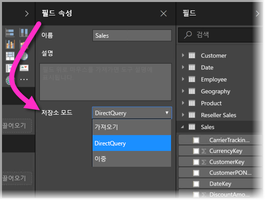
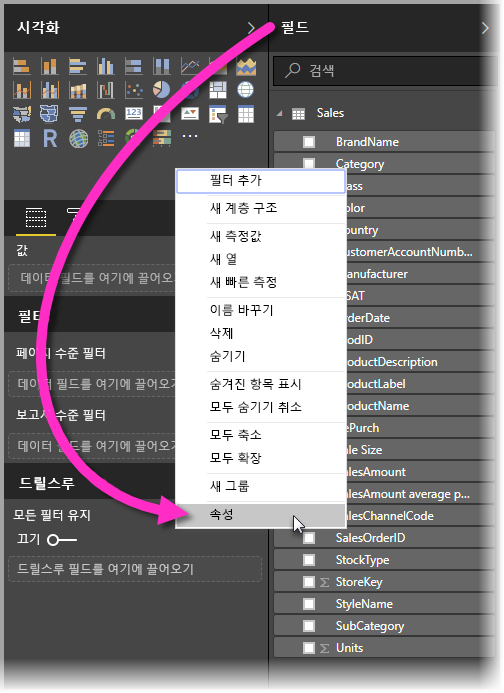
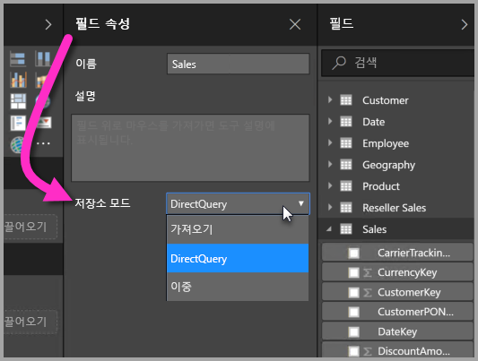
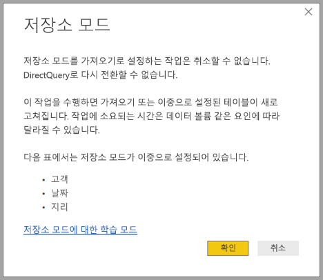

# Power BI Desktop의 저장소 모드(미리 보기)

**Power BI Desktop**에서는 테이블의 **저장소 모드**를 지정하여 테이블 데이터가 보고서용으로 메모리 내에 캐시되는지 여부를 제어할 수 있습니다. 

**저장소 모드**를 설정하면 많은 이점이 제공됩니다. 모델에서 개별적으로 각 테이블에 대한 **저장소 모드**를 설정하면 단일 데이터 집합에서 다음 이점 중 하나 이상을 활용할 수 있습니다.

* **쿼리 성능** - 사용자가 Power BI 보고서에서 시각적 개체를 조작할 때 DAX 쿼리가 데이터 집합에 제출됩니다. **저장소 모드**를 제대로 설정하여 데이터를 메모리에 캐시하면 보고서의 쿼리 성능과 상호 작용이 향상될 수 있습니다.
* **큰 데이터 집합** - 캐시되지 않은 테이블이 캐싱을 위해 메모리를 사용하지 않습니다. 너무 크거나 비용이 많이 드는 큰 데이터 집합에 대한 대화형 분석을 메모리에 완전히 캐시할 수 있습니다. 캐시할 테이블과 캐시하지 않을 테이블을 선택할 수 있습니다.
* **데이터 새로 고침 최적화** - 캐시되지 않은 테이블을 새로 고칠 필요가 없습니다. 서비스 수준 계약 및 비즈니스 요구 사항을 충족하는 데 필요한 데이터만 캐시하여 새로 고침 시간을 줄일 수 있습니다.
* **거의 실시간 요구 사항** - 거의 실시간 요구 사항이 있는 테이블이 캐시되지 않아 데이터 대기 시간을 줄이는 이점이 있습니다.
* **쓰기 저장** - 쓰기 저장을 사용하면 비즈니스 사용자가 셀 값을 변경하여 what-if 시나리오를 살펴볼 수 있습니다. 사용자 지정 응용 프로그램이 변경 내용을 데이터 원본에 적용할 수 있습니다. 캐시되지 않은 테이블이 즉시 변경 내용을 반영하므로 효과를 즉시 분석할 수 있습니다.

**Power BI Desktop**의 **저장소 모드** 설정은 다음 세 가지 관련 기능 중 하나입니다.

* **복합 모델** - 보고서에 DirectQuery 연결 또는 가져오기를 비롯한 여러 데이터 연결을 다양한 조합으로 포함할 수 있습니다.
* **다 대 다 관계** - **복합 모델**을 사용하면 테이블 간에 **다 대 다 관계**를 설정할 수 있어 테이블의 고유한 값에 대한 요구 사항이 제거되고 관계 설정만을 위한 새 테이블 도입과 같은 이전 해결 방법을 사용할 필요가 없습니다. 
* **저장소 모드** - 이제 백 엔드 데이터 원본에 대한 쿼리가 필요한 시각적 개체를 지정할 수 있고, 쿼리가 필요하지 않은 시각적 개체는 DirectQuery를 기반으로 하는 경우에도 가져오게 되어 성능을 향상하고 백 엔드 로그를 줄일 수 있습니다. 이전에는 슬라이서와 같은 간단한 시각적 개체도 백 엔드 원본으로 전송되는 쿼리를 시작했습니다. 

**복합 모델**에 대한 세 가지 관련 기능 모음은 다음 별도의 문서에서 설명합니다.

* **복합 모델**은 관련 문서 [Power BI Desktop의 복합 모델(미리 보기)](desktop-composite-models.md)에서 자세히 설명합니다.
* **다 대 다 관계**는 관련 문서 [Power BI Desktop의 다 대 다 관계(미리 보기)](desktop-many-to-many-relationships.md)에서 설명합니다.
* **저장소 모드**는 이 문서에서 자세히 설명합니다.

## 저장소 모드 미리 보기 기능 사용

**저장소 모드** 기능은 미리 보기 상태이며 **Power BI Desktop**에서 사용하도록 설정해야 합니다. **저장소 모델**을 사용하려면 **파일 > 옵션 및 설정 > 옵션 > 미리 보기 기능**을 선택한 후 **복합 모델** 확인란을 선택합니다. 

기능을 사용하려면 **Power BI Desktop**을 다시 시작해야 합니다.

## 저장소 모드 속성 사용

**저장소 모드**는 모델의 각 테이블에서 설정할 수 있는 속성입니다. **저장소 모드**를 설정하려면 **필드** 창에서 테이블을 선택한 후 마우스 오른쪽 단추를 클릭하여 상황에 맞는 메뉴를 표시합니다. 상황에 맞는 메뉴에서 **속성**을 선택합니다.

**저장소 모드** 선택 항목이 테이블의 **필드 속성** 창에 표시됩니다. 여기서 현재 **저장소 모드**를 보거나 수정할 수 있습니다.

**저장소 모드**에는 다음 세 가지 값이 있습니다.

* **가져오기** -**가져오기**로 설정하면 가져온 테이블이 캐시됩니다. 가져오기 테이블의 데이터를 반환하는 Power BI 데이터 집합에 제출된 쿼리는 캐시된 데이터에서만 수행할 수 있습니다.
* **DirectQuery** - 이 설정을 사용하면 DirectQuery 테이블이 캐시되지 않습니다. DirectQuery 테이블에서 데이터를 반환하는 Power BI 데이터 집합(예: DAX 쿼리)에 제출된 쿼리를 수행하려면 데이터 원본에 대한 주문형 쿼리를 실행해야 합니다. 데이터 원본에 제출된 쿼리는 해당 데이터 원본(예: SQL)의 쿼리 언어를 사용합니다.
* **이중** - 이중 테이블은 Power BI 데이터 집합에 제출된 쿼리의 컨텍스트에 따라 캐시되거나 캐시되지 않은 상태로 작동할 수 있습니다. 경우에 따라 캐시된 데이터에서 쿼리가 수행되거나 데이터 원본에서 주문형 쿼리를 실행하여 쿼리가 수행됩니다.

가져올 테이블을 변경하면 작업을 ‘취소할 수 없습니다’. 다시 DirectQuery 또는 이중으로 변경할 수 없습니다.

## DirectQuery 및 이중 테이블에 대한 제약 조건

이중 테이블에는 DirectQuery 테이블과 동일한 제약 조건이 적용됩니다. 제약 조건에는 제한된 M 변환 및 계산 열의 제한된 DAX 함수가 포함됩니다. 자세한 내용은 [DirectQuery 사용의 의미](desktop-directquery-about.md#implications-of-using-directquery)를 참조하세요.

## 다양한 저장소 모드가 포함된 테이블에 대한 관계 규칙

관계는 관련 테이블의 **저장소 모드**에 따라 규칙을 준수해야 합니다. 이 섹션서는 유효한 조합의 예제를 제공합니다. 자세한 내용은 [Power BI Desktop의 다 대 다 관계(미리 보기)](desktop-many-to-many-relationships.md)를 참조하세요.

단일 데이터 원본이 있는 데이터 집합의 경우 다음 **일 대 다** 관계 조합이 유효합니다.

| **다** 쪽의 테이블 | **일** 쪽의 테이블 |
| ------------- |----------------------| 
| 이중          | 이중                 | 
| 가져오기        | 가져오기 또는 이중       | 
| DirectQuery   | DirectQuery 또는 이중  | 

## 이중 전파
예를 살펴보겠습니다. 가져오기 및 DirectQuery를 지원하는 단일 원본에서 모든 테이블을 가져오는 경우 다음 간단한 모델을 사용하는 것이 좋습니다.

처음에 이 모델의 모든 테이블이 DirectQuery라고 가정해 봅니다. *SurveyResponse* 테이블의 **저장소 모드**를 가져오기로 변경하면 다음 프롬프트가 표시됩니다.

이전에 설명한 관계 규칙을 준수하려면 차원 테이블(*Customer*, *Date* 및 *Geography*)을 **이중**으로 설정해야 합니다. 사전에 이러한 테이블을 **이중**으로 설정하도록 하는 대신 단일 작업으로 설정할 수 있습니다.

전파 논리는 많은 테이블을 포함하는 모델에 도움이 되도록 디자인되었습니다. 50개 테이블이 포함된 모델이 있고 특정 팩트(트랜잭션) 테이블만 캐시해야 한다고 가정합니다. **Power BI Desktop**의 논리에서는 **이중**으로 설정해야 하는 최소 차원 테이블 집합을 파악하므로 설정할 필요가 없습니다.

전파 논리는 **일 대 다** 관계의 한쪽으로만 이동합니다.

* *Customer* 테이블은 DirectQuery 테이블 *Sales* 및 *SurveyResponse*에 대한 관계 때문에 *SurveyResponse* 대신 **가져오기**로 변경할 수 없습니다.
* *Customer* 테이블을 *SurveyResponse* 대신 **이중**으로 변경할 수는 있습니다. 전파 논리는 *Geography* 테이블을 **이중**으로도 설정합니다.

## 저장소 모드 사용 예제
이전 섹션의 예제를 계속 진행하고 다음 **저장소 모드** 속성 설정을 적용한다고 가정해 보겠습니다.

| 테이블                   | 저장소 모드         |
| ----------------------- |----------------------| 
| *Sales*                 | DirectQuery          | 
| *SurveyResponse*        | 가져오기               | 
| *Date*                  | 이중                 | 
| *Customer*              | 이중                 | 
| *Geography*             | 이중                 | 

이러한 저장소 모드 속성 설정을 적용하면 *Sales* 테이블에 중요한 데이터 볼륨이 있다고 가정하여 다음 동작이 발생합니다.
* 차원 테이블(*Date*, *Customer* 및 *Geography*)이 캐시되므로 표시할 슬라이서 값을 검색할 때 초기 보고서 로드 시간이 빠릅니다.
* *Sales* 테이블을 캐시하지 않으면 다음 결과가 발생합니다.
    * 데이터 새로 고침 시간이 개선되고 메모리 소비가 감소함
    * 보고서 쿼리가 DirectQuery 모드에서 실행되는 *Sales* 테이블을 기반으로 하므로 시간이 더 오래 걸리지만 캐싱 대기 시간이 도입되지 않으므로 실시간에 더 가까움

* *SurveyResponse* 테이블을 기반으로 하는 보고서 쿼리는 메모리 내 캐시에서 반환되므로 비교적 빠릅니다.

## 캐시를 적중 또는 무시하는 쿼리

**Power BI Desktop**의 진단 포트에 **SQL 프로파일러**를 연결하면 다음 이벤트에 따라 추적을 수행하여 메모리 내 캐시를 적중 또는 무시하는 쿼리를 확인할 수 있습니다.

* Queries Events\Query Begin
* Query Processing\Vertipaq SE Query Begin
* Query Processing\DirectQuery Begin

각 *Query Begin* 이벤트의 경우 동일한 *ActivityID*를 가진 다른 이벤트를 확인합니다. 예를 들어 *DirectQuery Begin* 이벤트가 없지만 *Vertipaq SE Query Begin* 이벤트가 있는 경우에는 쿼리가 캐시에서 응답된 것입니다.

**이중** 모드 테이블을 참조하는 쿼리는 가능한 경우 캐시에서 데이터를 반환하고, 가능하지 않으면 DirectQuery로 되돌립니다.

이전 예제를 계속하여, 다음 쿼리는 **이중** 모드인 *Date* 테이블의 열만 참조합니다. 따라서 캐시를 적중해야 합니다.

다음 쿼리는 **DirectQuery** 모드인 *Sales* 테이블의 열만 참조합니다. 따라서 캐시를 적중하지 ‘않아야’ 합니다.

다음 쿼리는 두 열을 결합하므로 흥미롭습니다. 이 쿼리는 캐시를 적중하지 않습니다. 초기에는 캐시에서 *CalendarYear* 값을 검색하고 원본에서 *SalesAmount* 값을 검색한 후 결과를 결합할 것으로 기대할 수 있지만, 이 방법은 SUM/GROUP BY 작업을 원본 시스템에 제출하는 것보다 덜 효율적입니다. 작업이 원본으로 푸시다운된 경우 반환되는 행 수가 훨씬 더 적을 수 있습니다. 

> [!NOTE]
> 이 동작은 캐시된 테이블과 캐시되지 않은 테이블을 결합할 때 [Power BI Desktop의 다 대 다 관계(미리 보기)](desktop-many-to-many-relationships.md)와 다릅니다.

## 캐시는 동기화되어야 합니다.

이전 섹션에 표시된 쿼리는 **이중** 테이블이 때때로 캐시를 적중하고 때때로 캐시를 적중하지 않음을 보여줍니다. 이로 인해 캐시가 오래된 경우 다른 값이 반환될 수 있습니다. 예를 들어 쿼리 실행은 캐시된 값과 일치하도록 DirectQuery 결과를 필터링하여 데이터 문제를 마스크하려고 시도하지 않습니다. 데이터 흐름을 알고 있어야 하며 이에 따라 디자인해야 합니다. 필요한 경우 원본에서 이러한 경우를 처리하도록 설정된 방법이 있습니다.

**이중** 저장소 모드는 성능 최적화입니다. 이 모드는 비즈니스 요구 사항을 충족하는 기능을 손상하지 않는 방식으로만 사용해야 합니다. 대체 동작의 경우 [Power BI Desktop의 다 대 다 관계(미리 보기)](desktop-many-to-many-relationships.md) 문서에 설명된 방법을 사용하는 것이 좋습니다.

## 데이터 보기
데이터 집합에 있는 하나 이상 테이블의 **저장소 모드**가 가져오기 또는 이중으로 설정된 경우 **데이터 보기** 탭이 표시됩니다.

*데이터 보기**에서 선택한 경우 **이중** 및 **가져오기** 테이블에 캐시된 데이터가 표시됩니다. DirectQuery 테이블에 데이터가 표시되지 않고 DirectQuery 테이블의 상태를 표시할 수 없다는 메시지가 표시됩니다.

## 제한 사항 및 고려 사항

**저장소 모드**의 이 릴리스 및 **복합 모델**과 상관 관계에 대한 몇 가지 제한 사항이 있습니다.

다음 다차원 원본은 **복합 모델**과 함께 사용할 수 없습니다.

* SAP HANA
* SAP Business Warehouse
* SQL Server Analysis Services
* Power BI 데이터 집합

DirectQuery를 사용하여 이러한 다차원 원본에 연결할 경우 다른 DirectQuery 원본에 연결할 수 없고 가져온 데이터와 결합할 수도 없습니다.

DirectQuery 사용에 대한 기존 제한 사항은 **복합 모델**을 사용할 경우에도 적용됩니다. 이러한 제한 사항 중 대부분은 테이블의 **저장소 모드**에 따라 테이블별로 적용됩니다. 예를 들어 가져온 테이블의 계산 열은 다른 테이블을 참조할 수 있지만, DirectQuery 테이블에서 계산 열은 동일한 테이블의 열만 참조하도록 제한됩니다. 다른 제한 사항은 모델 내의 테이블이 DirectQuery인 경우 모델에 전체적으로 적용됩니다. 예를 들어 **QuickInsights** 및 **Q&A** 기능은 모델 내의 테이블에 DirectQuery의 **저장소 모드**가 있는 경우 해당 모델에서 사용할 수 없습니다. 

## 다음 단계

다음 문서에서는 복합 모델을 자세히 설명하고 DirectQuery도 자세히 설명합니다.

* [Power BI Desktop의 복합 모델(미리 보기)](desktop-composite-models.md)
* [Power BI Desktop의 다 대 다 관계(미리 보기)](desktop-many-to-many-relationships.md)

DirectQuery 문서:

* [Power BI의 DirectQuery 사용](desktop-directquery-about.md)
* [Power BI의 DirectQuery에서 지원하는 데이터 원본](desktop-directquery-data-sources.md)

