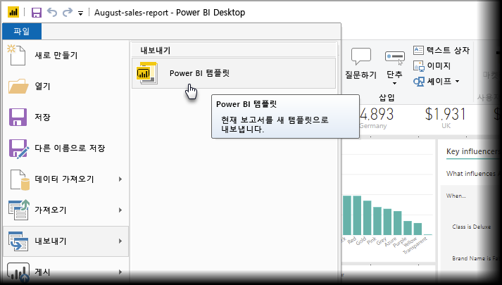
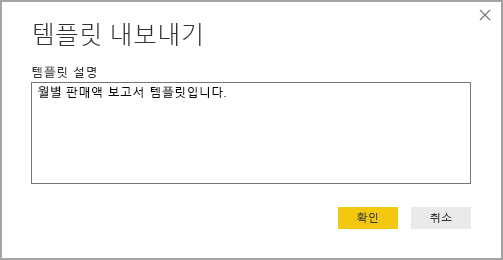
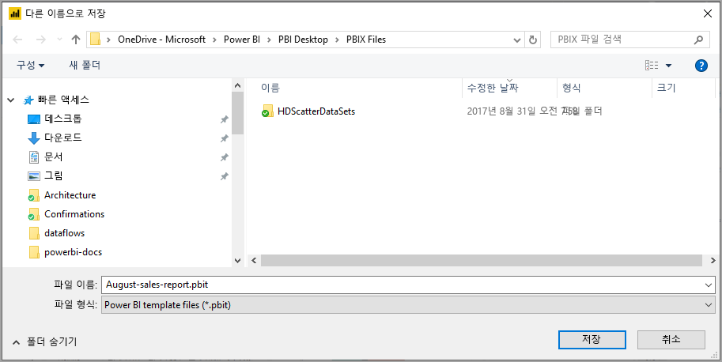
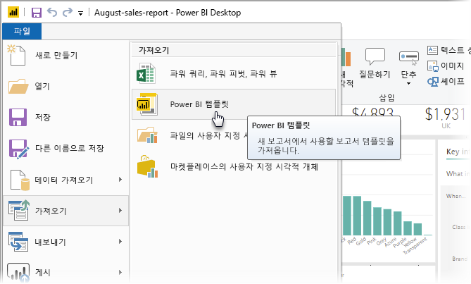
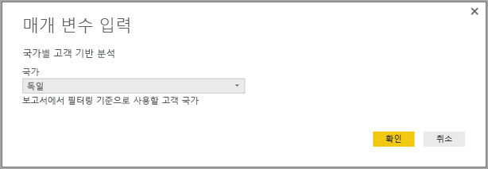
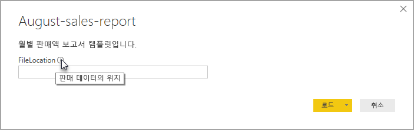

# Power BI Desktop의 보고서 템플릿 만들기

**Power BI Desktop**을 사용하여 전체 조직에서 인사이트를 공유하는 매력적인 보고서를 만들 수 있습니다. Power BI Desktop **템플릿**을 사용하면 기존 템플릿을 기반으로 하고, 사용자 또는 조직의 다른 사용자가 새 보고서의 레이아웃, 데이터 모델 및 쿼리의 시작점으로 사용할 수 있는 보고서 템플릿을 만들어 작업을 간소화할 수 있습니다. **Power BI Desktop**의 템플릿을 통해 보고서 생성을 바로 시작하고 표준화할 수 있습니다.

## 템플릿 만들기

Power BI 보고서 템플릿에는 템플릿 생성에 사용된 보고서의 다음 정보가 포함됩니다.

* 보고서 **페이지**, 시각적 개체 및 기타 시각적 요소
* 스키마, 관계, 측정값 및 기타 모델 정의 아티팩트를 포함하는 **데이터 모델 정의**
* 쿼리, 쿼리 매개 변수 및 기타 쿼리 요소와 같은 모든 **쿼리 정의**

보고서의 데이터는 템플릿에 포함되지 ‘않습니다’.  

보고서 템플릿은 파일 확장명 .PBIT를 사용합니다. Power BI Desktop 보고서의 경우 .PBIX 확장명을 사용합니다. 

보고서 템플릿을 만들려면 메뉴에서 **파일 > 내보내기 > Power BI 템플릿**을 선택합니다. 템플릿에 대한 설명을 입력하라는 다음 창이 표시됩니다. 이 예제에서 템플릿에 대한 설명은 ‘월별 판매 보고서 템플릿’입니다. 

**확인**을 선택하면 .PBIT 템플릿 파일을 저장할 파일 위치를 묻는 메시지가 표시됩니다.

이렇게만 하면 지정한 파일 위치에 Power BI 보고서 템플릿이 .PBIT 확장명으로 생성됩니다.

> [!NOTE]
> 템플릿은 데이터를 포함하지 않고 보고서 정의 자체이기 때문에 일반적으로 Power BI 보고서 템플릿 파일은 Power BI Desktop 보고서보다 훨씬 작습니다. 

## 템플릿 사용

Power BI 보고서 템플릿을 사용하려면 Power BI Desktop에서 템플릿을 열고 사용하기 시작하면 됩니다. 다음 두 가지 방법으로 Power BI 보고서 템플릿을 열 수 있습니다.

* 아무 .PBIT 파일이나 두 번 클릭하여 Power BI Desktop을 자동으로 시작하고 템플릿 로드
* Power BI Desktop 내에서 **파일 > 가져오기 > Power BI 템플릿** 선택

보고서 템플릿을 열면, 템플릿의 기반이 되는 보고서에서 정의된 모든 매개 변수의 값이 대화 상자에 나타납니다. 예를 들어 보고서에서 국가 또는 지역을 기준으로 고객을 분석하고 *Country* 매개 변수를 사용하여 고객 기반을 지정하는 경우, 매개 변수를 정의할 때 지정된 값 목록에서 *Country* 값을 선택하라는 메시지가 표시됩니다. 

필수 매개 변수를 제공하면 보고서와 연결된 기본 데이터의 위치를 묻는 메시지가 표시됩니다. 그런 다음, 현재 보고서 작성자는 해당 자격 증명을 기준으로 데이터에 연결할 수 있습니다.

매개 변수와 데이터를 지정하고 나면, 템플릿의 기반이 되었던 보고서의 모든 페이지, 시각적 개체, 데이터 모델 아티팩트 및 쿼리를 포함하는 보고서가 생성됩니다. 

이제 끝났습니다! Power BI Desktop에서 간편하게 보고서 템플릿을 만들고 사용함으로써, 매력적인 레이아웃 및 기타 보고서 측면을 쉽게 재현하고 다른 사용자와 공유할 수 있습니다.

## 다음 단계
**쿼리 매개 변수**:
* [Power BI Desktop에서 쿼리 매개 변수를 사용하는 방법](https://docs.microsoft.com/power-query/power-query-query-parameters)에 관해 자세히 알아보고 싶을 수 있습니다.

또한, Power BI Desktop에서 모든 종류의 작업을 수행할 수 있습니다. 해당 기능에 대한 자세한 내용은 다음 리소스를 확인하세요.

* [Power BI Desktop이란?](desktop-what-is-desktop.md)
* [Power BI Desktop을 사용한 쿼리 개요](desktop-query-overview.md)
* [Power BI Desktop의 데이터 형식](desktop-data-types.md)
* [Power BI Desktop에서 데이터 셰이핑 및 결합](desktop-shape-and-combine-data.md)
* [Power BI Desktop의 일반적인 쿼리 작업](desktop-common-query-tasks.md)    
