# Power BI Desktop(미리 보기)의 보고서 페이지에 기반을 둔 도구 설명 만들기
**Power BI Desktop**에서 만든 보고서 페이지에 기반을 둔 시각적 개체를 가리키면 나타나는 **보고서 도구 설명**을 시각적으로 풍부하게 만들 수 있습니다. 도구 설명으로 사용되는 보고서 페이지를 만들면 사용자 지정 도구 설명에 시각적 개체, 이미지 및 기타 보고서 페이지에서 만든 항목 컬렉션을 포함할 수 있습니다. 

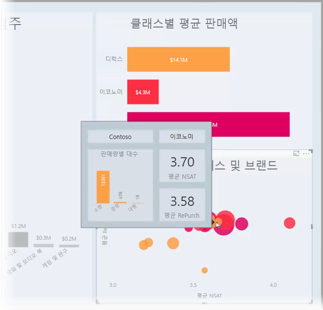

원하는 만큼 많은 도구 설명 페이지를 만들 수 있습니다. 각 도구 설명 페이지는 하나 이상의 보고서 필드와 연결할 수 있으므로, 선택된 필드가 포함된 시각적 개체를 가리키면 도구 설명 페이지에서 만든 도구 설명이 나타나고, 마우스가 가리키는 데이터 요소에 따라 필터링됩니다. 

보고서 도구 설명을 사용하여 모든 종류의 흥미로운 작업을 수행할 수 있습니다. 도구 설명을 만드는 방법과 이를 구성하기 위해 해야 할 일을 살펴보겠습니다.

### 도구 설명 미리 보기 활성화 
보고서 도구 설명 기능은 현재 미리 보기 상태이므로, 활성화해야 보고서 도구 설명을 만들 수 있습니다. 보고서 도구 설명 미리 보기 기능을 활성화하려면 Power BI Desktop에서 **파일 > 옵션 및 설정 > 옵션 > 미리 보기 기능**을 선택한 다음, **책갈피** 옆에 있는 확인란을 선택합니다. 

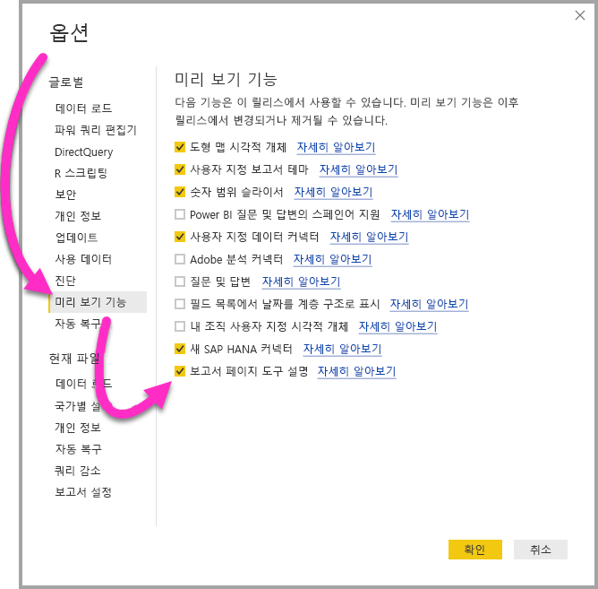

보고서 도구 설명의 미리 보기 버전을 활성화하도록 선택한 후에는 **Power BI Desktop**을 다시 시작해야 합니다.

## 보고서 도구 설명 페이지 만들기
시작하려면 페이지 탭 영역에서 **Power BI Desktop** 캔버스 아래쪽에 있는 **+** 단추를 클릭하여 새 보고서 페이지를 만듭니다. 단추는 보고서의 마지막 페이지 옆에 있습니다. 

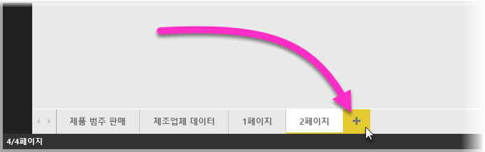

도구 설명의 크기는 제한되지 않지만 도구 설명은 보고서 캔버스 위에 표시되므로 적당히 작게 유지하는 것이 좋습니다. **페이지 크기** 카드의 **서식** 창에서 *도구 설명*이라는 새로운 페이지 크기 템플릿을 볼 수 있습니다. 여기에는 도구 설명을 위해 준비된 보고서 페이지 캔버스 크기가 제공됩니다.

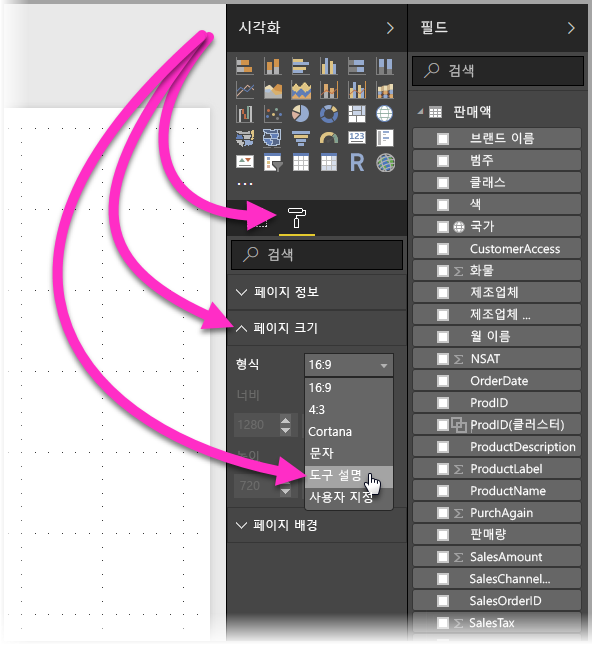

기본적으로 **Power BI Desktop**은 보고서 캔버스를 페이지의 사용 가능한 공간에 맞춥니다. 이는 유용한 경우가 많지만 도구 설명의 경우에는 그렇지 않은 경우도 있습니다. 작업이 완료되면 도구 설명의 모양을 보다 잘 볼 수 있도록 **페이지 보기**를 실제 크기로 변경할 수 있습니다. 

그렇게 하려면 리본에서 **보기** 탭을 선택합니다. 여기에서 다음 이미지에 표시된 것처럼 **페이지 보기 > 실제 크기**를 선택합니다.

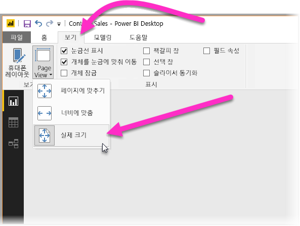

용도를 분명히 알 수 있도록 보고서 페이지의 이름을 지정할 수도 있습니다. **서식** 창에서 **페이지 정보** 카드를 선택한 다음, 여기에 표시되는 **이름** 필드에 이름만 입력하면 됩니다. 다음 이미지에서 도구 설명 보고서 이름은 *Tooltip 1*이지만, 더 영감을 얻을 수 있는 이름으로 자유롭게 지정할 수 있습니다.

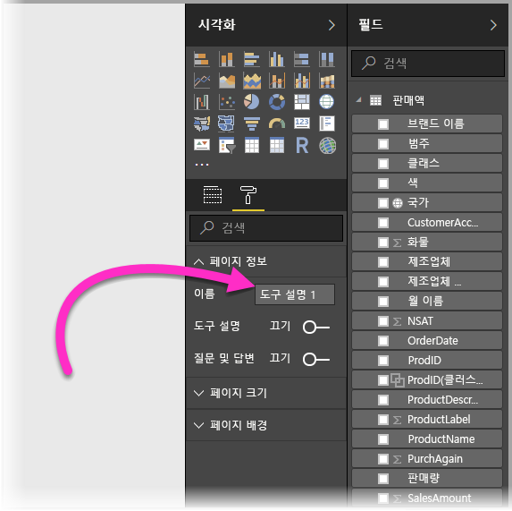

여기에서 도구 설명에 표시할 시각적 개체를 만들 수 있습니다. 다음 이미지에는 도구 설명 페이지에 두 개의 카드와 하나의 클러스터된 막대형 차트가 있고 페이지 자체의 배경색, 각 시각적 개체의 배경색으로 원하는 모양을 지정했습니다.

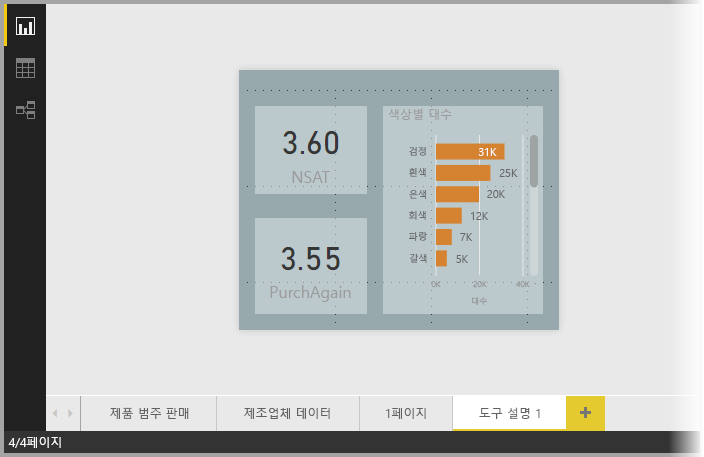

도구 설명 보고서 페이지가 도구 설명으로 작동하려면 더 많은 단계를 완료해야 합니다. 다음 섹션에 설명된 대로 몇 가지 방법으로 도구 설명 페이지를 구성해야 합니다. 

## 도구 설명 보고서 페이지 구성 

도구 설명 보고서 페이지를 만들었으면, **Power BI Desktop**이 도구 설명으로 등록하고, 올바른 시각적 개체 위에 표시하도록 페이지를 구성해야 합니다.

시작하려면 **페이지 정보** 카드에서 **도구 설명** 슬라이더를 **켜기**로 전환하여 페이지를 도구 설명으로 만들어야 합니다.  

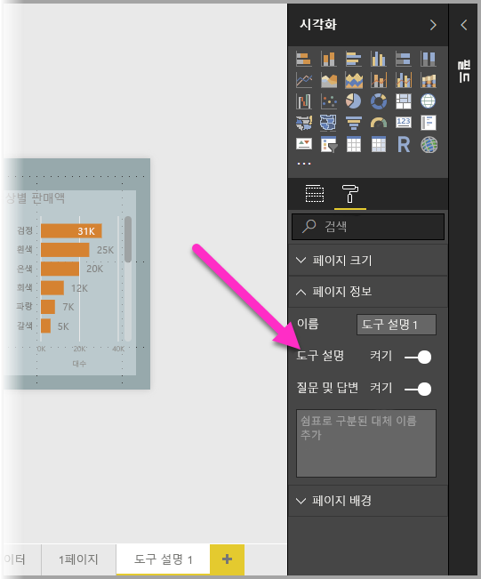

해당 슬라이더가 켜져 있으면 보고서 도구 설명을 표시할 필드를 지정합니다. 지정한 필드를 포함하는 보고서의 시각적 개체에 도구 설명이 나타납니다. **시각화** 창의 **필드** 섹션에 있는 **도구 설명 필드** 버킷으로 끌어서 적용할 하나 이상의 필드를 지정합니다. 다음 이미지에서 *SalesAmount* 필드는 **도구 설명 필드** 버킷으로 끌어온 것입니다.

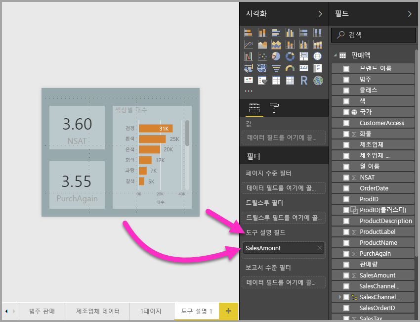
 
**도구 설명 필드** 버킷에는 측정값을 포함한 범주 및 숫자 필드를 모두 포함할 수 있습니다.

완료되면 생성된 도구 설명 보고서 페이지가 **도구 설명 필드** 버킷에 배치된 필드를 사용하는 보고서의 시각적 개체에서 도구 설명으로 사용되며, 기본 Power BI 도구 설명을 대체합니다.

## 수동으로 보고서 도구 설명 설정

지정된 필드를 포함하는 시각적 개체를 가리키면 자동으로 나타나는 도구 설명을 만드는 것 외에도, 수동으로 도구 설명을 설정할 수 있습니다. 

이제 보고서 도구 설명을 지원하는 모든 시각적 개체에는 해당 **서식 지정** 창에 **도구 설명** 카드가 있습니다. 

도구 설명을 수동으로 설정하려면 수동 도구 설명을 지정할 시각적 개체를 선택한 다음, **시각화** 창에서 **서식** 섹션을 선택하고 **도구 설명** 카드를 확장하세요.

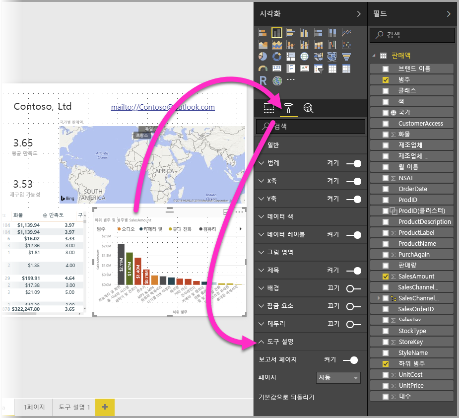

그런 다음, **페이지** 드롭다운에서 선택한 시각적 개체에 사용할 도구 설명 페이지를 선택하세요. **도구 설명** 페이지로 지정된 보고서 페이지만 대화 상자에 표시됩니다.

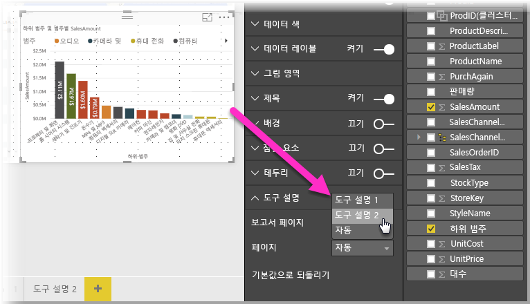

도구 설명을 수동으로 설정하는 기능은 다양한 용도로 사용됩니다. 도구 설명에 대한 빈 페이지를 설정하여 기본 Power BI 도구 설명 선택을 재정의할 수 있습니다. 또한 Power BI에서 자동으로 선택된 도구 설명을 도구 설명으로 사용하지 않으려는 경우에 사용합니다. 예를 들어 두 개의 필드를 포함하는 시각적 개체가 있고, 해당 필드에 연결된 도구 설명이 있는 경우, Power BI는 하나만 표시하도록 선택합니다. 사용자는 이를 원치 않을 경우 표시할 도구 설명을 수동으로 선택할 수 있습니다.

## 기본 도구 설명으로 되돌리기

시각적 개체에 대한 수동 도구 설명을 만들었지만 기본 도구 설명을 대신 사용하려는 경우, Power BI가 제공하는 기본 도구 설명으로 언제든지 되돌릴 수 있습니다. 이렇게 하려면 시각적 개체를 선택하고 **도구 설명** 카드가 확장되었을 때, **페이지** 드롭다운에서 *자동*을 선택하여 기본값으로 되돌리면 됩니다.

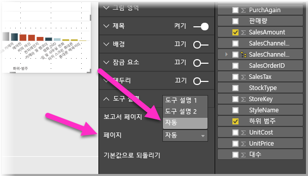

## 사용자 지정 보고서 도구 설명 및 꺾은선형 차트

보고서 도구 설명이 꺾은선형 차트 시각적 개체와 교차 강조 표시되며 상호 작용할 때 유의해야 할 몇 가지 고려 사항이 있습니다.

### 보고서 도구 설명 및 꺾은선형 차트

꺾은선형 차트에 대한 보고서 도구 설명이 표시될 때는 차트의 모든 줄에 대한 하나의 도구 설명만 표시됩니다. 이는 하나의 도구 설명만 표시하는 꺾은선형 차트의 기본 도구 설명 동작과 유사합니다. 

이 동작은 범례에 있는 필드가 도구 설명의 필터로 전달되지 않기 때문에 발생합니다. 다음 이미지에서 표시되는 도구 설명에는 보고서 도구 설명에 표시된 세 가지 클래스(이 예에서는 Deluxe, Economy 및 Regular) 전체에서 해당 날짜에 판매된 모든 단위가 표시됩니다. 

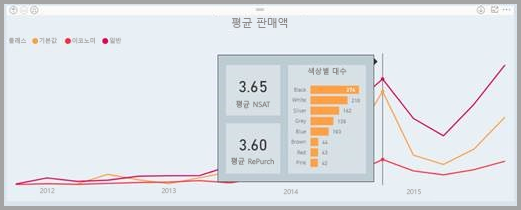

### 보고서 도구 설명 및 교차 강조 표시

보고서에서 시각적 개체가 교차 강조 표시될 때 보고서 도구 설명은 사용자가 데이터 요소의 흐린 섹션을 가리키더라도 교차 강조 표시된 데이터를 항상 표시합니다. 다음 이미지에서는 막대 그래프의 흐린 섹션(강조 표시되지 않은 섹션)을 마우스로 가리키더라도 보고서 도구 설명에서는 여전히 해당 데이터 요소에서 강조 표시된 부분의 데이터(강조 표시된 데이터)를 표시합니다.

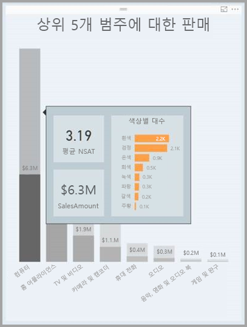

## 제한 사항 및 고려 사항
**도구 설명** 보고서의 이 미리 보기 버전에서는 몇 가지 제한 사항 및 고려 사항을 기억해야 합니다.

* 모바일 앱 또는 포함된 환경(예: 웹에 게시)에서 보고서를 볼 때 보고서 도구 설명이 지원되지 않습니다. 
* 사용자 지정 시각적 개체에는 보고서 도구 설명이 지원되지 않습니다. 
* 클러스터는 현재 보고서 도구 설명에 표시할 수 있는 필드로 지원되지 않습니다. 
* 보고서 도구 설명에 표시할 필드를 선택할 때 필드와 범주를 사용하는 경우, 해당 필드가 포함된 시각적 개체는 선택한 필드가 포함된 요약이 일치할 때만 지정된 도구 설명을 표시합니다. 

## 다음 단계
보고서 도구 설명과 유사한 기능 또는 상호 작용하는 기능에 대한 자세한 내용은 다음 아티클을 참조하세요.

* [Power BI Desktop에서 드릴스루 사용](desktop-drillthrough.md)
* [포커스 모드에서 대시보드 타일 또는 보고서 시각적 개체 표시](service-focus-mode.md)

