# 자습서: Power BI Desktop에서 계산 열 만들기

분석 중인 데이터에 원하는 결과를 얻는 데 필요한 특정 필드가 없는 경우도 있습니다. 이때 ‘계산 열’이 사용됩니다. 계산 열은 DAX(Data Analysis Expressions) 수식을 사용하여 다른 몇 개 열에서 텍스트 값을 결합하는 것부터 다른 값에서 숫자 값을 계산하는 것까지 열의 값을 정의합니다. 예를 들어 데이터에 **City** 및 **State** 필드가 포함되어 있지만 “Miami, FL”과 같이 하나의 **Location** 필드에 두 필드를 모두 포함하려 한다고 가정합니다. 계산된 열은 바로 이런 용도로 사용됩니다.

계산 열은 둘 다 DAX 수식을 기반으로 한다는 점에서 [측정값](desktop-tutorial-create-measures.md)과 비슷하지만 사용하는 방법이 서로 다릅니다. 시각화의 **값** 영역에서 측정값을 사용하여 다른 필드를 기준으로 결과를 계산하기도 합니다. 계산 열을 시각화의 행, 축, 범례 및 그룹 영역에서 새 **필드**로 사용합니다.

이 자습서에서는 Power BI Desktop에서 일부 계산 열을 만들고 보고서 시각화에서 사용하는 과정을 안내합니다. 

### 필수 조건
- 이 자습서는 Power BI Desktop을 사용하여 고급 모델을 만드는 방법을 이미 알고 있는 Power BI 사용자를 위한 것입니다. **데이터 가져오기** 및 **파워 쿼리 편집기**를 사용하여 데이터를 가져오고, 여러 가지 관련 테이블을 사용하고, 보고서 캔버스에 필드를 추가하는 방법을 이미 알고 있어야 합니다. Power BI Desktop을 처음 사용하는 경우 [Power BI Desktop 시작](desktop-getting-started.md)을 확인해야 합니다.
  
- 이 자습서에서는 [Power BI Desktop에서 사용자 고유의 측정값 만들기](desktop-tutorial-create-measures.md) 자습서에 사용되는 동일한 샘플인 [Power BI Desktop용 Contoso 판매 샘플](http://download.microsoft.com/download/4/6/A/46AB5E74-50F6-4761-8EDB-5AE077FD603C/Contoso%20Sales%20Sample%20for%20Power%20BI%20Desktop.zip)을 사용합니다. 가상 회사인 Contoso, Inc.의 이 판매 데이터는 데이터베이스에서 가져온 것이므로 데이터 원본에 연결하거나 파워 쿼리 편집기에서 볼 수 없습니다. 사용자 컴퓨터에 파일을 다운로드하여 추출한 다음, Power BI Desktop에서 엽니다.

## 관련 테이블의 값을 사용하여 계산 열 만들기

판매 보고서에서 “휴대폰 – 액세서리”, “휴대폰 – 스마트폰 및 PDA” 등과 같이 제품 범주와 제품 하위 범주를 하나의 값으로 표시하려 합니다. 해당 데이터를 제공하는 **필드** 목록에는 필드가 없지만 고유한 각 테이블에 **ProductCategory** 필드와 **ProductSubcategory** 필드가 있습니다. 이러한 두 열의 값을 결합하는 계산 열을 만들 수 있습니다. DAX 수식은 서로 다른 테이블 간의 기존 관계를 포함하여 이미 보유한 모델을 최대한 활용할 수 있습니다. 

 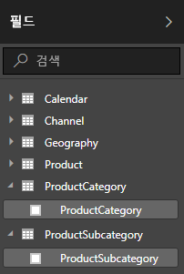

1.  **추가 옵션** 줄임표(...)를 선택하거나 필드 목록의 **ProductSubcategory** 테이블을 마우스 오른쪽 단추로 클릭한 다음, **새 열**을 선택합니다. ProductSubcategory 테이블에 새 열이 만들어집니다.
    
    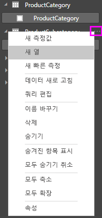
    
    수식 입력줄이 보고서 캔버스 위쪽에 표시됩니다. 여기서 열 이름을 지정하고 DAX 수식을 입력할 수 있습니다.
    
    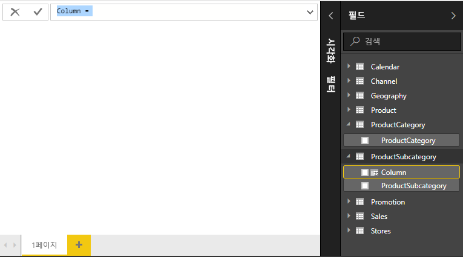
    
2.  기본적으로 새 계산 열의 이름은 열로 지정됩니다. 이름을 바꾸지 않으면 추가하는 새 열의 이름이 열 2, 열 3 등으로 지정됩니다. 열을 더 쉽게 확인할 수 있게 하려면 **열** 이름은 수식 입력줄에서 이미 강조 표시되어 있으므로 **ProductFullCategory**를 입력하여 이름을 바꾼 다음, 등호(**=**)를 입력합니다.
    
3.  새 열의 값을 ProductCategory 이름으로 시작하려고 합니다. 이 열은 다르지만 관련된 테이블에 있으므로 [RELATED](https://msdn.microsoft.com/library/ee634202.aspx) 함수를 사용하여 가져올 수 있습니다.
    
    등호 뒤에 **r**을 입력합니다. 드롭다운 제안 목록에는 문자 R로 시작하는 모든 DAX 함수가 표시됩니다. 각 함수를 선택하면 해당 효과에 대한 설명이 표시됩니다. 입력하면 제안 목록이 필요한 함수에 더 가깝게 축소됩니다. **RELATED**를 선택한 다음, **Enter** 키를 누릅니다.
    
    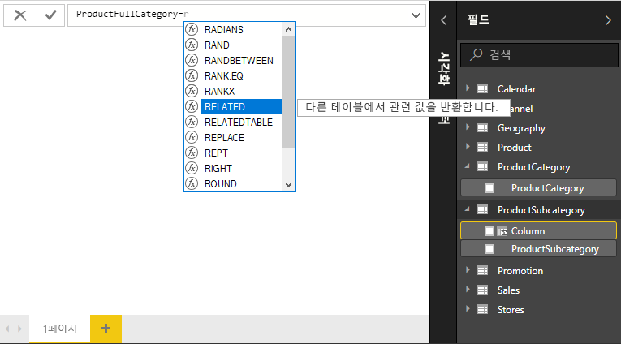
    
    RELATED 함수에 전달할 수 있는 관련 열의 다른 제안 목록과 예상 매개 변수에 대한 설명 및 세부 정보와 함께 여는 괄호가 나타납니다. 
    
    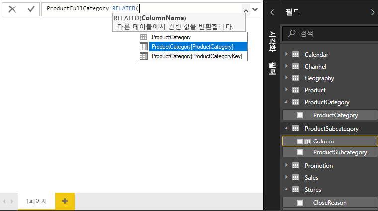
    
4.  **ProductCategory** 테이블의 **ProductCategory** 열을 사용하려고 합니다. **ProductCategory[ProductCategory]** 를 선택하고 **Enter** 키를 누른 다음, 닫는 괄호를 입력합니다.
    
    > [!TIP]
    > 경우에 따라 Power BI Desktop에서 닫는 괄호를 자동으로 추가하지만 구문 오류는 닫는 괄호가 누락되거나 잘못 배치되어 발생하는 경우가 가장 많습니다.
    
4. 새 값에서 ProductCategory 및 ProductSubcategory를 구별하는 데 대시 및 공백을 사용하려 하므로 첫 번째 식의 닫는 괄호 뒤에 공백, 앰퍼샌드(**&**), 큰따옴표(**"**), 공백, 대시(**-**), 다른 공백, 다른 큰따옴표 및 다른 앰퍼샌드를 입력합니다. 이제 수식이 다음과 같이 표시됩니다.
    
    `ProductFullCategory = RELATED(ProductCategory[ProductCategory]) & " - " &`
    
    > [!TIP]
    > 추가 공간이 필요한 경우 수식 입력줄의 오른쪽에 있는 아래쪽 펼침 단추를 선택하여 수식 편집기를 확장합니다. 편집기에서 **Alt+Enter**를 눌러 한 줄 아래로 이동하고 **Tab** 키를 눌러 항목을 이동합니다.
    
5.  여는 대괄호(**[**)를 입력한 다음, **[ProductSubcategory]** 열을 선택하여 수식을 마칩니다. 
    
    
    
    이 테이블에서 계산 열을 만들고 있으므로 다른 RELATED 함수를 사용하여 두 번째 식에서 ProductSubcategory 테이블을 호출할 필요가 없습니다. 테이블 이름 접두사를 포함(정규화됨)하거나 포함하지 않고(정규화되지 않음) [ProductSubcategory]를 입력할 수 있습니다.
    
6.  **Enter** 키를 누르거나 수식 입력줄에 있는 확인 표시를 선택하여 수식을 완료합니다. 수식이 유효성 검사되고 **ProductFullCategory** 열 이름이 필드 목록의 **ProductSubcategory** 테이블에 표시됩니다. 
    
    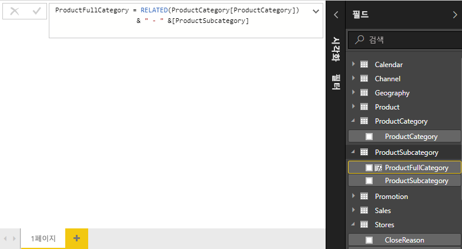
    
    >[!NOTE]
    >Power BI Desktop에서 계산 열은 필드 목록에 수식이 포함됨을 보여주는 특수 아이콘을 표시합니다. Power BI 서비스(Power BI 사이트)에서는 수식을 변경할 수 없으므로 계산 열에는 아이콘이 없습니다.
    
## 보고서에서 새 열 사용

이제 새로운 ProductFullCategory 열을 사용하여 ProductFullCategory별로 SalesAmount를 살펴볼 수 있습니다.

1. **ProductSubcategory** 테이블의 **ProductFullCategory** 열을 선택하거나 보고서 캔버스로 끌어 놓아 모든 ProductFullCategory 이름을 표시하는 테이블을 만듭니다.
   
   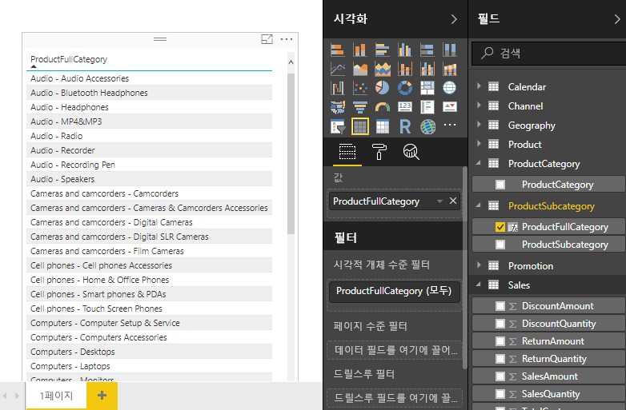
    
2. **Sales** 테이블의 **SalesAmount** 필드를 선택하거나 테이블로 끌어 놓아 각 제품 전체 범주에 대한 판매액을 표시합니다.
   
   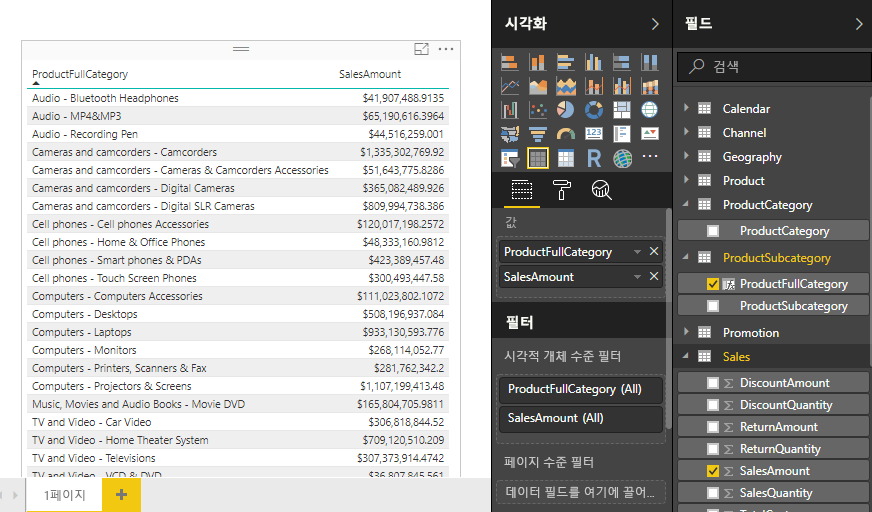
    
## IF 함수를 사용하는 계산 열 만들기

Contoso Sales Sample에는 활성 및 비활성 매장에 대한 판매 데이터가 포함되어 있습니다. Active StoreName 필드를 만들어 활성 매장 판매액이 보고서의 비활성 매장 판매액과 명확하게 구분되는지 확인하려고 합니다. 새 Active StoreName 계산 열에서 각 활성 매장에는 매장의 전체 이름이 표시되지만 비활성 매장은 “Inactive”로 그룹화됩니다. 

다행히도 Stores 테이블에는 새 Active StoreName 열에 대한 값을 만드는 데 사용할 수 있고 활성 매장에 대해 “On” 값을 사용하고 비활성 매장에 대해 “Off” 값을 사용하는 **Status** 열이 있습니다. DAX 수식에서는 논리적 [IF](https://msdn.microsoft.com/library/ee634824.aspx) 함수를 사용하여 각 매장의 상태를 테스트하고 결과에 따라 특정 값을 반환합니다. 매장의 상태가 “On”인 경우 수식은 매장 이름을 반환합니다. “Off”이면 수식은 “Inactive”의 Active StoreName을 할당합니다. 

1.  **Stores** 테이블에서 새 계산 열을 만들고 수식 입력줄에서 이름을 **Active StoreName**으로 지정합니다.
    
2.  **=** 부호 뒤에 **IF** 입력을 시작합니다. 제안 목록에 추가할 수 있는 항목이 표시됩니다. **IF**를 선택합니다.
    
    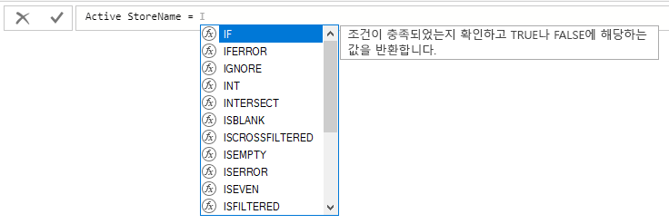
    
3.  IF의 첫 번째 인수는 매장 상태가 “On” 인지 여부에 대한 논리적 테스트입니다. Stores 테이블의 열을 나열하는 여는 대괄호 **[** 를 입력하고 **[Status]** 를 선택합니다.
    
    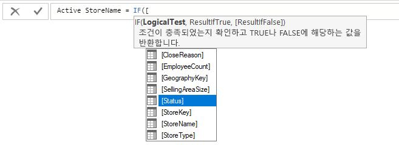
    
4.  **[Status]** 바로 뒤에 **="On"** 를 입력한 다음, 쉼표(**,**)를 입력하여 인수를 종료합니다. 도구 설명에서는 결과가 TRUE일 때 반환할 값을 추가해야 한다고 제안합니다.
    
    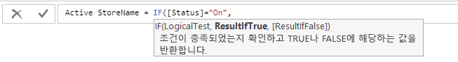
    
5.  매장의 상태가 “On”인 경우 매장 이름을 표시하려고 합니다. 여는 대괄호(**[**)를 입력하고 **[StoreName]** 열을 선택한 다음, 다른 쉼표를 입력합니다. 도구 설명에서는 결과가 FALSE일 때 반환할 값을 추가해야 한다고 나타냅니다. 
    
    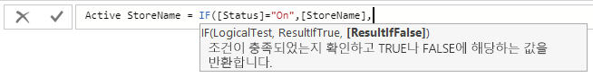
    
6.  값을 *Inactive*로 설정하려 하므로 **“Inactive”** 를 입력한 다음, **Enter** 키를 누르거나 수식 입력줄에서 확인 표시를 선택하여 수식을 완료합니다. 수식이 유효성 검사되고 새 이름이 필드 목록의 **Stores** 테이블에 표시됩니다.
    
    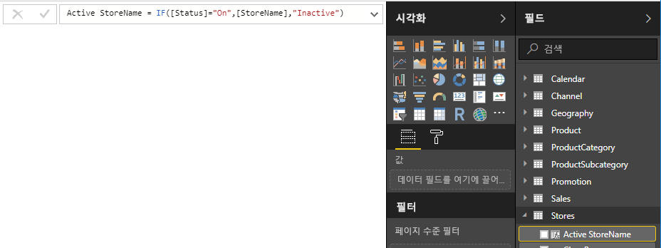
    
8.  다른 필드와 마찬가지로 새 Active StoreName 열을 시각화에 사용할 수 있습니다. Active StoreName별로 SalesAmount를 표시하려면 **Active StoreName** 필드를 선택하거나 캔버스로 끌어 놓은 다음, **SalesAmount** 필드를 선택하거나 테이블로 끌어 놓습니다. 이 테이블에서 활성 매장은 이름으로 개별적으로 표시되지만 비활성 매장은 결국 *Inactive*로 그룹화됩니다. 
    
    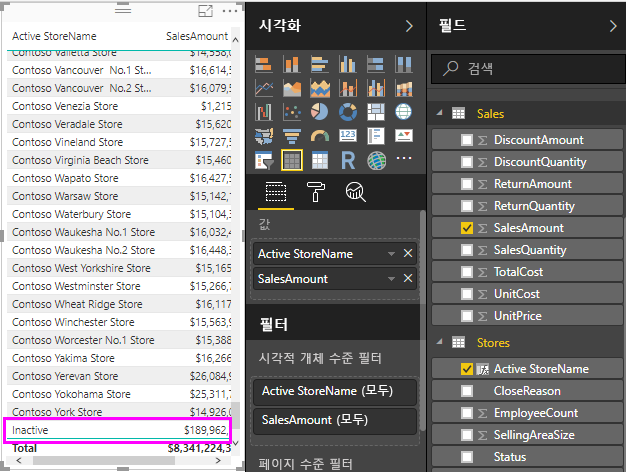
    
## 학습한 내용
계산 열은 데이터를 보강하고 더 쉽게 이해할 수 있는 인사이트를 제공할 수 있습니다. 필드 목록과 수식 입력줄에서 계산 열을 만들고, 제안 목록과 도구 설명을 사용하여 수식을 구성하고, 적절한 인수를 사용하여 RELATED 및 IF 같은 DAX 함수를 호출하고, 보고서 시각화에 계산 열을 사용하는 방법을 알아보았습니다.

## 다음 단계
DAX 수식을 심층 분석하고 고급 수식을 사용하여 계산 열을 만들려는 경우 [Power BI Desktop의 DAX 기본 사항](desktop-quickstart-learn-dax-basics.md)을 참조하세요. 이 문서에서는 구문, 함수 및 컨텍스트에 대한 보다 철저한 이해와 같은 DAX의 기본 개념에 중점을 둡니다.

잊지 말고 [DAX(Data Analysis Expressions) 참조](https://msdn.microsoft.com/library/gg413422.aspx)를 즐겨찾기에 추가하세요. 여기서는 DAX 구문, 연산자 및 200개가 넘는 DAX 함수에 대한 자세한 내용을 확인할 수 있습니다.

