# 자습서: Power BI Desktop에서 고유한 측정값 만들기
Power BI Desktop에서 가장 강력한 데이터 분석 솔루션 중 일부는 측정값을 사용하여 만들 수 있습니다. 측정값은 보고서를 조작할 때 데이터에서 계산을 수행하여 도움을 줍니다. 이 자습서에서는 Power BI Desktop에서 몇 가지 고유한 기본 측정값을 이해하고 만드는 과정을 안내합니다.

이 문서는 Power BI Desktop을 사용하여 고급 모델을 만드는 방법을 이미 알고 있는 Power BI 사용자를 위한 것입니다. 데이터 가져오기 및 쿼리 편집기를 사용하여 데이터 가져오기, 여러 가지 관련 테이블 사용, 보고서 캔버스에 필드 추가와 같은 작업을 이미 알고 있어야 합니다. Power BI Desktop을 처음 사용하는 경우 [Power BI Desktop 시작](desktop-getting-started.md)을 확인해야 합니다.

이 자습서의 단계를 완료하려면 [Power BI Desktop용 Contoso 판매 샘플](http://download.microsoft.com/download/4/6/A/46AB5E74-50F6-4761-8EDB-5AE077FD603C/Contoso%20Sales%20Sample%20for%20Power%20BI%20Desktop.zip) 파일을 다운로드해야 합니다. 이 파일에는 가상 회사 Contoso, Inc.의 온라인 판매 데이터가 이미 포함되어 있습니다. 파일의 데이터는 데이터베이스에서 가져온 것이므로 데이터 소스에 연결하거나 쿼리 편집기에서 볼 수 없습니다. 파일이 사용자 컴퓨터에 있는 경우 계속 진행하여 Power BI Desktop에서 엽니다.

## 측정값에 대한 모든 정보
필드 목록에서 **Sales** 테이블의 **SalesAmount** 필드 옆에 있는 확인란을 선택하거나 **SalesAmount** 를 보고서 캔버스로 끌어오는 경우처럼 측정값은 대부분 자동으로 만들어집니다.

새 차트 시각화가 다음과 같이 나타납니다.

SalesAmount 필드에서 총 판매 금액 값의 합계를 보여 주는 세로 막대형 차트가 표시됩니다.  실제로 SalesAmount 필드는 이미 가져온 Sales 테이블의 SalesAmount라는 열일 뿐입니다.

SalesAmount 열에는 2백만 개가 넘는 판매액 값 행이 포함되어 있습니다. 이러한 모든 값의 행이 있는 테이블이 표시되지 않는 이유가 궁금하실 수도 있습니다. Power BI Desktop은 SalesAmount의 모든 값이 숫자 데이터 형식임을 인식하므로 합계를 구하거나, 평균을 계산하거나, 개수를 세는 등 몇 가지 방식으로 값을 집계할 수 있습니다.

필드 목록의 필드가 시그마 아이콘 과 함께 표시되면 항상 필드가 숫자이고 해당 값을 집계할 수 있음을 의미합니다. 이 경우 SalesAmount를 선택하면 Power BI Desktop에서 고유한 측정값을 만들고 모든 판매액의 합계를 계산하여 차트에 표시합니다.

합계는 숫자 데이터 형식의 필드를 선택하는 경우 수행되는 기본 집계이며 다른 유형의 집계로 매우 쉽게 변경할 수 있습니다.

**값** 영역에서 **SalesAmount**옆에 있는 아래쪽 화살표를 클릭하면 **평균**을 선택할 수 있습니다.

시각화가 SalesAmount 필드에 있는 모든 판매액 값의 평균으로 변경됩니다.

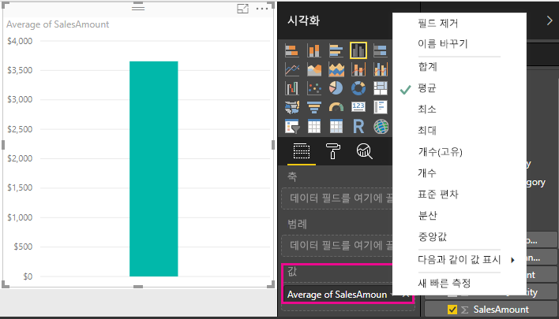

원하는 결과에 따라 집계 유형을 변경할 수 있지만 일부 집계 유형은 숫자 데이터 형식에 적용되지 않습니다. 예를 들어 SalesAmount 필드의 경우 합계 및 평균이 적합합니다. 최소값 및 최대값도 적용할 수 있습니다. 그러나 해당 값은 숫자이지만 실제로는 통화이기 때문에 개수는 SalesAmount 필드에 적합하지 않습니다.

모든 측정값은 일종의 집계를 수행하므로 집계를 이해하는 것은 측정값을 이해하는 것에 필수적입니다. 합계 집계를 사용하는 추가 예제는 나중에 고유한 측정값을 만들 때 살펴보겠습니다.

측정값에서 계산된 값은 보고서 조작에 대한 응답으로 항상 변경됩니다. 예를 들어 **Geography** 테이블에서 차트로 **RegionCountryName** 필드를 끌면 각 국가에 대한 판매액의 평균이 계산되어 표시됩니다.

보고서 조작으로 인해 측정값의 결과가 변경되면 측정값의 *컨텍스트* 에 영향을 주는 것입니다. 실제로 보고서를 조작할 때마다 측정값이 결과를 계산하여 표시하는 컨텍스트가 변경됩니다.

대부분의 경우 Power BI에서 해당 작업을 수행하며 추가한 필드 및 선택한 집계 유형에 따라 계산하고 값을 반환합니다. 그러나 보다 복잡한 고유 계산을 수행하기 위해 고유한 측정값을 만들어야 하는 경우도 있습니다.

Power BI Desktop에서는 DAX(Data Analysis Expressions) 수식 언어로 고유한 측정값을 만듭니다. DAX 수식은 Excel 수식과 매우 비슷합니다. 실제로 DAX에서는 Excel 수식과 동일한 함수, 연산자 및 구문을 많이 사용합니다. 그러나 DAX의 함수는 관계형 데이터에서 작동하고 보고서를 조작할 때 보다 동적인 계산을 수행하도록 설계되었습니다.

합계 및 평균과 같은 간단한 집계에서 보다 복잡한 통계 및 필터링 함수까지 모든 작업을 수행하는 DAX 함수는 200가지가 넘습니다. 여기서는 DAX 언어에 대해 너무 자세히 다루지는 않지만 자세히 알아보는 데 도움이 되는 많은 리소스가 있습니다. 이 자습서를 완료한 후에는 [Power BI Desktop의 DAX 기본 사항](desktop-quickstart-learn-dax-basics.md)을 참조해야 합니다.

고유한 측정값을 만들면 원하는 테이블의 필드 목록에 추가됩니다. 이를 *모델* 측정값이라고 하며 테이블에서 필드로 유지됩니다. 모델 측정값의 가장 큰 장점 중 일부는 원하는 이름을 지정하여 보다 쉽게 식별할 수 있다는 것입니다. 또한 다른 DAX 식에서 인수로 사용할 수 있으며 복잡한 계산을 수행하는 측정값을 매우 빠르게 만들 수 있습니다.

## 고유한 측정값 만들기
순매출액을 분석하려는 경우를 가정해 보겠습니다. 필드 목록에서 Sales 테이블을 확인하면 NetSales라는 필드가 없습니다. 그러나 고유한 측정값을 만들어 순매출액을 계산할 수 있는 구성 요소가 있습니다.

판매액에서 할인 및 반품액을 빼는 측정값이 필요합니다. 측정값이 시각화에 있는 컨텍스트에 관계없이 결과를 계산하도록 하려고 하므로 SalesAmount의 합계에서 DiscountAmount 및 ReturnAmount의 합계를 빼야 합니다. 지금은 약간 혼란스러울 수 있지만 잠시 후면 보다 명확해집니다.

### 순매출액
1.  필드 목록에서 **판매액** 테이블을 마우스 오른쪽 단추로 클릭하거나 해당 아래쪽 화살표를 클릭한 다음 **새 측정값**을 클릭합니다. 그러면 새 측정값이 Sales 테이블에 저장되므로 더 쉽게 찾을 수 있습니다.
    
    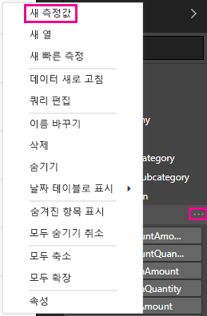
    
    > [!TIP]
    > Power BI Desktop 리본의 홈 탭에서 새 측정값 단추를 클릭하여 새 측정값을 만들 수도 있습니다.
    > 
    > 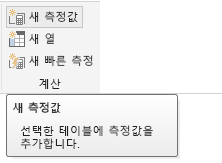
    > 
    > 리본에서 측정값을 만들면 모든 테이블에서 측정값을 만들 수 있습니다. 측정값이 특정 테이블에 속할 필요는 없지만 가장 적합한 테이블에 만들면 더 쉽게 찾을 수 있습니다. 측정값을 특정 테이블에 배치하려면 먼저 테이블을 클릭하여 활성화합니다. 그런 다음 새 측정값을 클릭합니다. 여기서는 Sales 테이블에 첫 번째 측정값을 만듭니다.
    > 
    > 
    
    보고서 캔버스 맨 위에 수식 입력줄이 나타납니다. 여기서 측정값의 이름을 바꾸고 DAX 수식을 입력할 수 있습니다.
    
    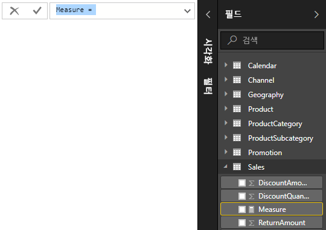
    
    새 측정값 이름을 지정해 보겠습니다. 기본적으로 새 측정값의 이름은 간단히 측정값입니다. 이름을 바꾸지 않으면 다른 측정값을 만들 때 이름이 측정값 2, 측정값 3 등으로 지정됩니다. 여기서는 측정값을 더 쉽게 식별할 수 있도록 새 측정값의 이름을 Net Sales로 지정하겠습니다.
    
2. 수식 입력줄에서 **측정값** 을 강조 표시한 다음 **순매출액**을 입력합니다.
    
    이제 수식 입력을 시작할 수 있습니다.
    
3.  등호 기호 뒤에 **S**를 입력합니다. 드롭다운 추천 목록에 문자 S로 시작하는 모든 DAX 함수가 나타나는 것을 확인할 수 있습니다. 더 많이 입력할수록 필요한 함수에 더 가깝게 조정된 추천 목록이 더 많이 표시됩니다. 아래로 스크롤하여 **합계**를 선택하고 Enter 키를 누릅니다.
    
    
    
    Enter 키를 누르면 SUM 함수에 전달할 수 있는 사용 가능한 모든 열 추천 목록과 함께 여는 괄호가 나타납니다.
    
    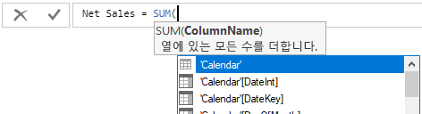
    
    식은 항상 여는 괄호와 닫는 괄호 사이에 나타납니다. 이 경우 SUM 함수에 전달할 단일 인수 즉, 합계를 계산할 열을 식에 포함하려고 합니다. 원하는 열의 첫 문자를 입력하여 열 목록의 범위를 좁힐 수 있습니다. 이 경우 SalesAmount 열을 사용하려고 하므로 salesam 입력을 시작하면 목록이 더 작아지고 선택할 수 있는 두 개의 항목이 표시됩니다. 실제로는 동일한 열입니다. 한 경우는 [SalesAmount]가 바로 표시되는데, SalesAmount 열이 속한 것과 동일한 테이블에 측정값을 만들고 있기 때문입니다. 다른 경우는 열 이름 앞에 테이블 이름이 있는 항목이 표시됩니다.
    
    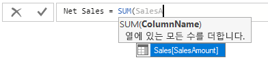
    
    일반적으로 열의 정규화된 이름을 입력하는 것이 좋습니다. 그러면 수식을 읽기가 더 쉽습니다.
    
4. **판매액[SalesAmount]** 를 선택하고 닫는 괄호를 입력합니다.
    
    > [!TIP]
    > 구문 오류는 닫는 괄호가 누락되거나 잘못 배치되어 발생하는 경우가 가장 많습니다.
    > 
    > 
    
    이제 다른 두 열을 빼려고 합니다.
    
5.  첫 번째 식의 닫는 괄호 뒤에 공백을 입력한 다음 빼기 연산자(**-**)와 공백을 차례로 입력합니다. 그런 다음 **Sales[DiscountAmount]** 열을 인수로 사용하는 또 다른 SUM 함수를 입력합니다.
    
    
    
    이제 수식의 공간이 부족하기 시작합니다. 그러나 문제가 되지 않습니다.
    
6.  수식 입력줄의 오른쪽에 있는 아래쪽 펼침 단추를 클릭합니다.
    
    
    
    이제 공간이 더 많아졌습니다. Alt+Enter를 눌러 수식의 새 요소를 새 줄에 입력할 수 있습니다. Tab 키를 사용하여 항목을 이동할 수도 있습니다.
    
    
    
    이제 수식의 마지막 요소를 추가할 수 있습니다.
    
7.  또 다른 빼기 연산자를 추가한 다음 또 다른 SUM 함수와 **판매액[ReturnAmount]** 열을 인수로 추가합니다.
    
    
    
    이제 수식이 준비되었습니다.

8.  Enter 키를 누르거나 수식 입력줄에서 확인 표시를 클릭하여 완료합니다. 수식의 유효성이 검사되고 Sales 테이블의 필드 목록에 추가됩니다.

### 보고서에 새 측정값 추가
이제 Net Sales 측정값을 보고서 캔버스에 추가할 수 있습니다. 그러면 보고서에 추가하는 다른 모든 필드에 대해 순매출액이 계산됩니다. 국가별로 순매출액을 살펴보겠습니다.

1.  **매출액** 테이블에서 보고서 캔버스로 **순매출액** 측정값을 끕니다.
    
2. 이제 **지리** 테이블에서 차트로 **RegionCountryName** 필드를 끕니다.
    
    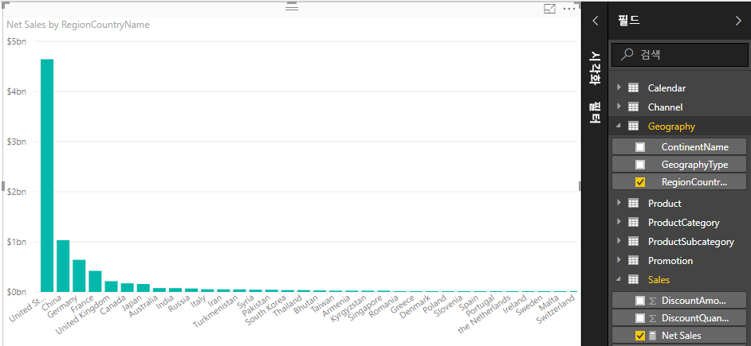
    
    데이터를 더 추가해보겠습니다.
    
3.  **SalesAmount** 필드를 차트로 끌어 순매출액과 판매액의 차이를 확인합니다.
    
    이제 차트에 두 개의 측정값이 있습니다. 자동으로 합계가 계산된 SalesAmount와 직접 만든 Net Sales 측정값이 있습니다. 각각의 경우 결과는 RegionCountryName의 국가와 같이 차트에 있는 다른 필드의 컨텍스트에서 계산되었습니다.
    
    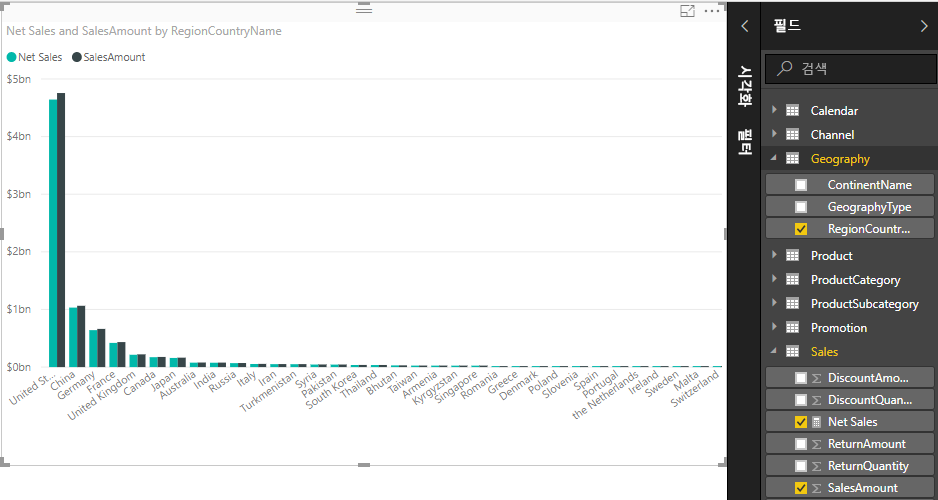
    
    순매출액 및 판매액을 연도별로 자세히 분석할 수 있도록 슬라이서를 추가해보겠습니다.
    
4.  차트 옆에 있는 빈 영역을 클릭한 다음 **시각화**에서 테이블 시각화를 클릭합니다.
    
    
    
    보고서 캔버스에 빈 테이블 시각화가 만들어집니다.
    
    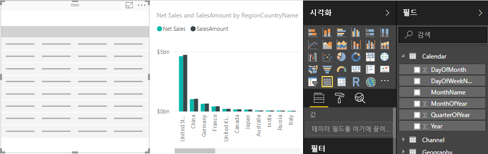
    
5.  **달력** 테이블에서 새 빈 테이블로 **연도** 필드를 끕니다.
    
    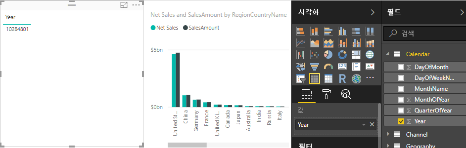
    
    Year는 숫자 필드이므로 Power BI Desktop에서 해당 값의 합계를 계산하여 차트에 제공했습니다. 그러나 슬라이서만큼 적절한 역할을 수행하지는 않습니다.
    
6. **값** 에서 **연도** 옆에 있는 아래쪽 화살표를 클릭한 다음 **요약하지 않음** 을 클릭합니다.
    
    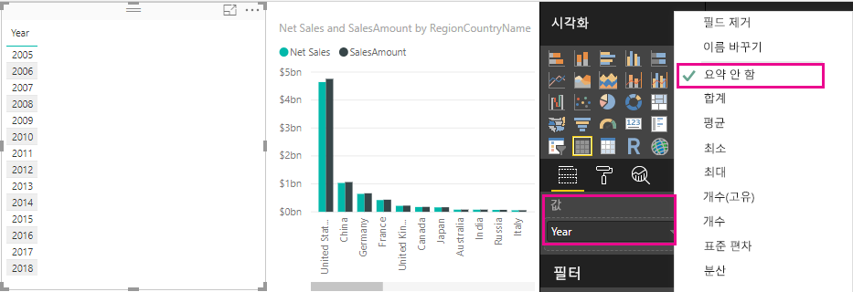
    
    이제 테이블 시각화의 Year 필드를 슬라이서로 변경할 수 있습니다.

    7.  **시각화**에서 **슬라이서** 시각화를 클릭합니다.

    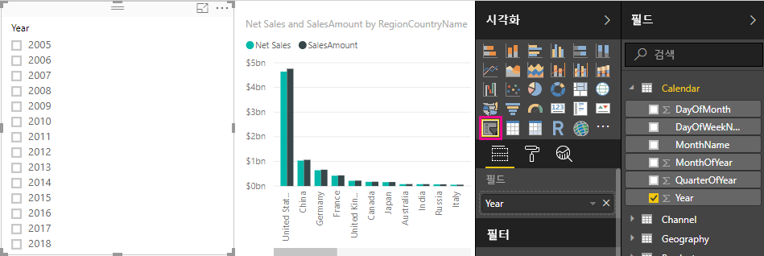
    
    이제 연도를 슬라이서로 사용할 수 있습니다. 개별 연도나 연도 그룹을 선택할 수 있으며 그에 따라 보고서의 시각화가 모두 조각화됩니다.
    
8. 계속 진행하여 **2013**을 클릭합니다. 차트가 변경되는 것을 확인할 수 있습니다. Net Sales 및 SalesAmount 측정값이 다시 계산되어 2013에 대한 새 결과만 표시합니다. 여기서 다시 측정값이 계산되어 결과를 표시하는 컨텍스트를 변경했습니다.
    
    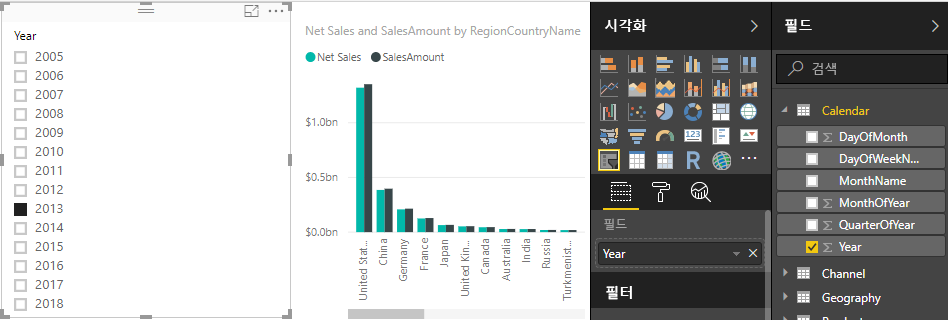

## 또 다른 측정값 만들기
고유한 측정값을 만드는 방법을 배웠으므로 다른 측정값을 만들어 보겠습니다.

### 단위당 순매출액
단위당 판매액이 가장 많은 제품을 확인하려면 어떻게 해야 할까요?

다른 측정값을 만들면 됩니다. 이 경우 순매출액을 판매 단위 수량으로 나누려고 합니다. 실제로는 Net Sales 측정값의 결과를 Sales[SalesQuantity]의 합계로 나눕니다.

1.  매출액 또는 상품 테이블에 **단위당 순매출액**이라는 새 측정값을 만듭니다.
    
    이 측정값에서는 앞에서 만든 Net Sales 측정값을 사용하겠습니다. DAX를 사용하면 수식에서 다른 측정값을 참조할 수 있습니다.
    
2.  **순매출액**을 입력하기 시작합니다. 제안 목록에 추가할 수 있는 항목이 표시됩니다. **[Net Sales]**를 선택합니다.
    
    
    
    여는 대괄호(**[**)만 입력하여 다른 측정값을 참조할 수도 있습니다. 추천 목록에는 수식에 추가할 수 있는 측정값만 표시됩니다.
    
    
    
3.  **[Net Sales]** 바로 뒤에 공백을 입력하고, 나누기 연산자(**/**)를 입력한 다음 SUM 함수와 **Quantity**를 차례로 입력합니다. 이름에 Quantity가 포함된 모든 열이 추천 목록에 표시됩니다. **Sales[SalesQuantity]**를 선택합니다. 이제 수식이 다음과 같이 표시됩니다.
    
    > **Net Sales per Unit = [Net Sales] / SUM(Sales[SalesQuantity])**
    > 
    > 
    
    정말 멋지지 않나요? DAX 편집기의 검색 및 추천 기능을 사용하면 DAX 수식을 매우 쉽게 입력할 수 있습니다. 이제 새로운 Net Sales per Unit 측정값으로 얻을 수 있는 항목을 살펴보겠습니다.
    
4. **단위 당 순매출액** 측정값을 보고서 캔버스의 빈 영역으로 끕니다.
    
    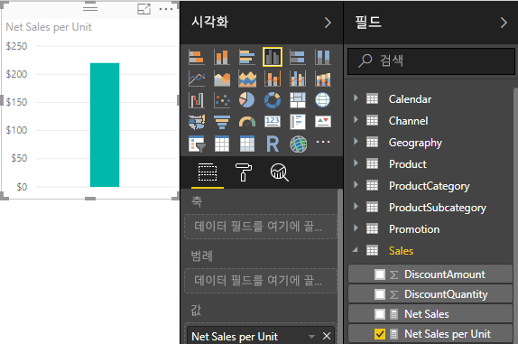
    
    그다지 흥미로워 보이지는 않는 것 같죠? 걱정하지 마세요.
    
5.  차트 시각화 형식을 **트리 맵**으로 변경합니다.
    
    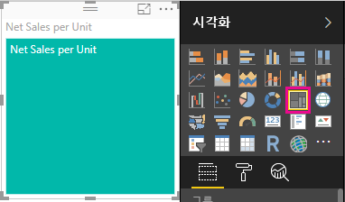
    
6. 이제 **ProductCategory** 테이블에서 **그룹** 영역 아래로 **ProductCategory** 필드를 끕니다.
    
    
    
    좋은 정보를 제공하기는 하지만 제품별로 순매출액을 확인하려면 어떻게 해야 할까요?
    
7. **ProductCategory** 필드를 제거한 다음 대신 **ProductName** 필드를 **상품** 테이블에서 **그룹** 영역 아래쪽으로 끕니다. 
    
    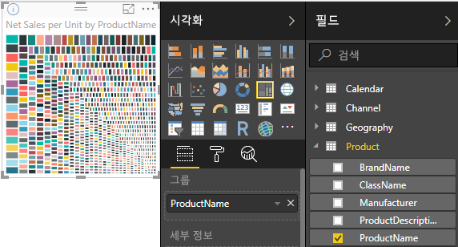
    
    이제 모두 완료했습니다. 즐거운 경험이었을 것입니다! 물론 이 트리 맵을 원하는 방식으로 필터링할 수 있지만 이는 이 자습서의 범위를 벗어나는 것입니다.

## 학습한 내용
측정값은 데이터에서 원하는 정보를 가져올 수 있는 강력한 기능을 제공합니다. 수식 입력줄을 사용하여 측정값을 만드는 방법을 배웠습니다. 가장 적합한 이름으로 측정값의 이름을 지정할 수 있으며, 추천 목록을 사용하면 수식에 추가할 적합한 요소를 쉽게 찾아 선택할 수 있습니다. 또한 측정값의 계산 결과가 다른 필드에 따라 변경되거나 측정값 수식의 다른 식에 의해 변경되는 컨텍스트에 대해 검토했습니다.

## 다음 단계
DAX 수식에 대해 깊이 있게 이해하고 고급 측정값을 만들려면 [Power BI Desktop의 DAX 기본 사항](desktop-quickstart-learn-dax-basics.md)을 참조하세요. 이 문서에서는 구문, 함수 및 컨텍스트에 대한 보다 철저한 이해와 같은 DAX의 기본 개념에 중점을 둡니다.

잊지 말고 [DAX(Data Analysis Expressions) 참조](https://msdn.microsoft.com/library/gg413422.aspx)를 즐겨찾기에 추가하세요. 여기서는 DAX 구문, 연산자 및 200개가 넘는 DAX 함수에 대한 자세한 내용을 확인할 수 있습니다.

