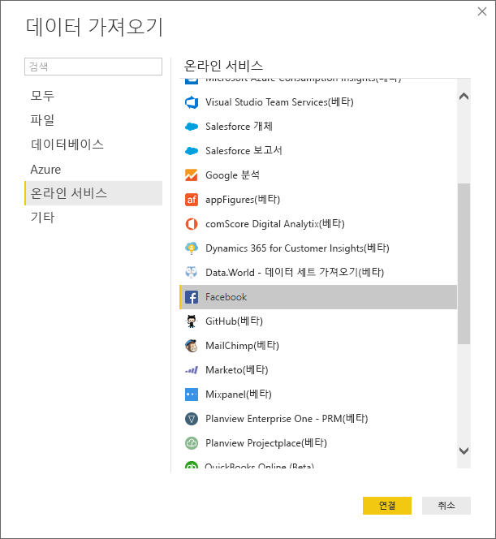
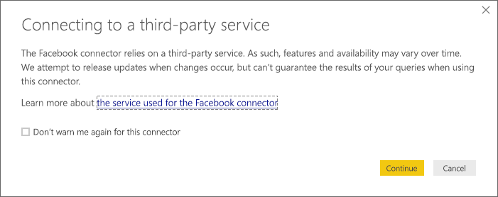
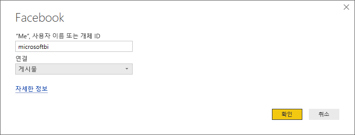
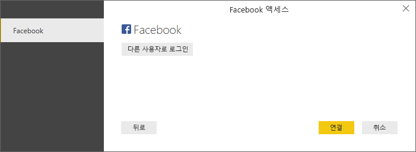
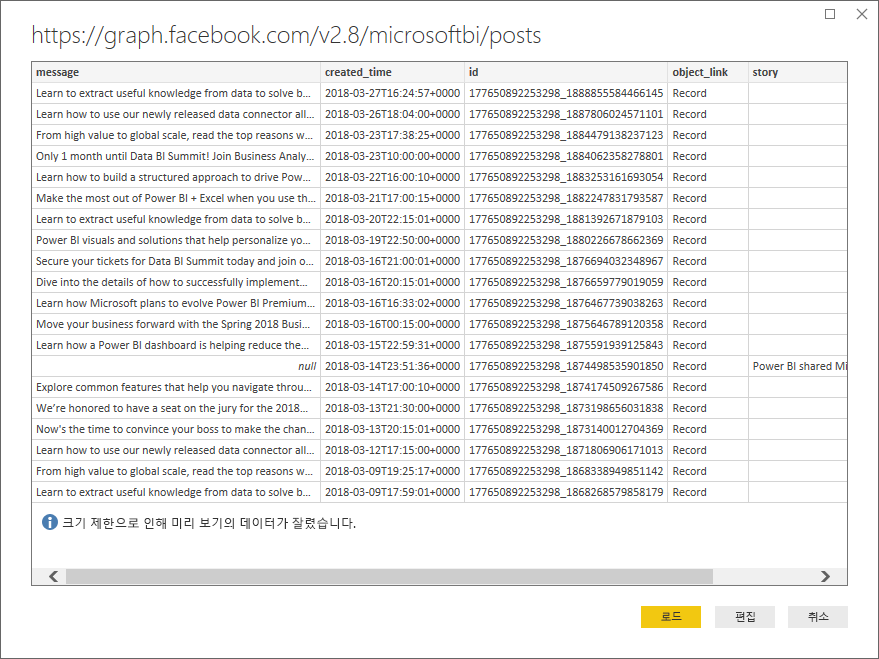
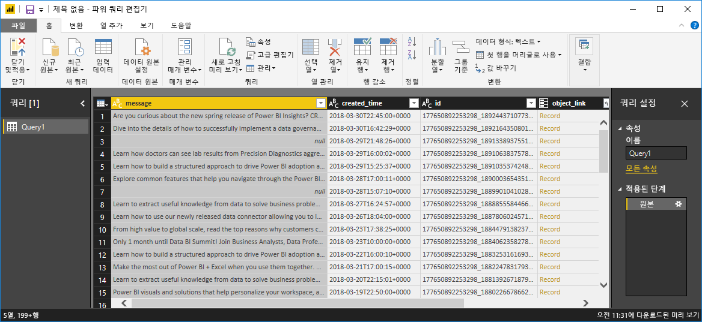
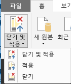
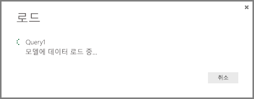
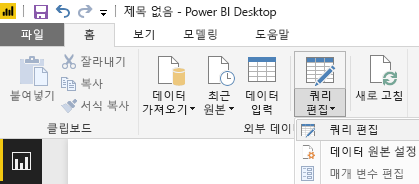

# 자습서: Power BI Desktop을 사용한 Facebook 분석
이 자습서에서는 **Facebook**에서 데이터를 가져오고 시각화하는 방법을 배웁니다. 자습서를 수행하는 과정에서 특정 Facebook 페이지(Power BI 페이지)에 연결하고, 데이터 변환 단계를 적용하며, 몇 가지 시각화를 만드는 방법을 배웁니다.

수행하는 단계는 다음과 같습니다.

* **작업 1** : Facebook 페이지에 연결
* **작업 2**: 보고서 뷰를 사용하여 시각화 만들기
  
  * **1단계**: 트리 맵 시각화 만들기
* **작업 3**: 쿼리 뷰에서 데이터 셰이핑
  
  * **1단계**: 날짜-시간 열을 두 개로 분할
  * **2단계**: 관련 테이블의 집계 값 더하기
* **작업 4**: 보고서 뷰를 사용하여 추가 시각화 만들기
  
  * **1단계**: 보고서에 쿼리 로드
  * **2단계**: 꺾은선형 차트 및 가로 막대형 차트 만들기

## **작업 1 : Facebook 페이지에 연결**
이 작업에서는 [Microsoft Power BI Facebook](https://www.facebook.com/microsoftbi) 사이트(URL: *https://www.facebook.com/microsoftbi*)에서 데이터를 가져옵니다.

누구든지 해당 페이지에 연결하고 다음 단계를 따를 수 있습니다. 이 단계에서 사용하는 사용자 고유의 Facebook 계정 이외에 특별한 자격 증명은 필요하지 않습니다.

1. **시작** 대화 상자 또는 **홈** 리본 탭에서 **데이터 가져오기**를 선택합니다.
2. 모든 종류의 데이터 소스에서 선택할 수 있는 **데이터 가져오기** 대화 상자가 나타납니다. **기타** 그룹에서 **Facebook** 을 선택합니다.
   
   
   
   **연결**을 선택하면 타사 서비스를 사용하는 것에 대한 위험을 경고하는 대화 상자가 나타납니다.
   
   
3. 계속을 선택하면 페이지 이름( **microsoftbi** )을**사용자 이름**텍스트 상자에 붙여넣을 수 있는 **Facebook** 대화 상자가 나타납니다. **연결** 드롭다운에서 **게시물** 을 선택합니다.
   
   
4. **확인**을 클릭합니다.
5. 자격 증명을 묻는 메시지가 표시되면 Facebook 계정을 사용하여 로그인하고 해당 계정을 통한 Power BI 액세스를 허용합니다.
   
   

페이지에 연결하면 데이터가 모델에 로드되는 것을 볼 수 있습니다. 

여기서 **쿼리 편집기** 가 데이터를 표시합니다. **쿼리 편집기** 는 Power BI Desktop의 일부이지만 별도 창에서 로드되며 데이터 연결에 대한 모든 변환을 수행하는 곳입니다.

데이터가 원하는 상태인 경우 Power BI Desktop으로 로드할 수 있습니다. **홈** 리본에서 **Close & Load(닫은 후 로드)**를 선택합니다.

Power BI Desktop 데이터 모델에 데이터를 로드하는 작업의 진행률을 표시하는 대화 상자가 표시됩니다.

로드되고 나면 테이블의 열이 오른쪽의 **필드** 목록에 나열된 **보고서** 뷰로 이동됩니다.

## **작업 2: 보고서 뷰를 사용하여 시각화 만들기**
이제 페이지의 데이터를 배치했으므로 시각화를 사용하여 데이터를 쉽고 빠르게 파악할 수 있습니다.

**1단계:** 트리 맵 시각화 만들기

시각화를 만드는 것은 쉽습니다. **필드 목록**에서 필드를 끌어 **보고서 캔버스**에 놓으면 됩니다.

**type** 필드를 **보고서** 캔버스로 끕니다. **보고서 캔버스**에 새 시각화가 만들어집니다. 이제 **필드** (방금 **보고서** 캔버스로 끈 것과 같은 필드)에서 **값** 영역으로 **type** 을 끌어 **막대형** 시각화를 만듭니다.

**시각화** 창에서 다른 아이콘을 선택하여 시각화 형식을 쉽게 변경할 수 있습니다. 다음 이미지에 표시된 것처럼 **시각화** 에서 해당 아이콘을 선택하여 형식을 **트리 맵**으로 변경해 보겠습니다.

이제 범례를 추가한 다음 데이터 요소의 색을 변경합니다. **시각화** 창에서 **형식** 아이콘을 선택합니다. **형식** 아이콘은 페인트 브러시처럼 보입니다.

**범례**옆에 있는 아래쪽 화살표를 선택하면 섹션이 확장되어 선택한 시각화에 대한 범례를 사용자 지정하는 방법을 보여 줍니다. 여기서는 다음과 같이 선택했습니다.

* 범례가 표시되도록 **범례** 슬라이더를 **켜기** 로 이동함
* **범례 위치** 드롭다운에서 **오른쪽** 을 선택함
* 범례의 제목이 표시되도록 **제목** 슬라이더도 **켜기** 로 이동함
* 범례의 제목으로 **type** 을 입력함

다음 이미지에는 해당 설정이 이미 지정되어 시각화에 반영되어 있습니다.

이제 데이터 요소 중 하나의 색을 변경해 보겠습니다. 링크 데이터 요소는 하이퍼링크에 대한 일반적인 색에 가깝도록 파랑이어야 합니다.

**데이터 색** 옆에 있는 화살표를 선택하여 해당 섹션을 확장합니다. 데이터 요소는 각 색 옆에 각 데이터 요소에 대해 서로 다른 색을 선택할 수 있는 선택 화살표가 있는 상태로 표시됩니다.

데이터 요소 옆에 있는 색 상자 아래쪽 화살표를 클릭하면 색을 선택할 수 있는 색 선택 대화 상자가 나타납니다. 여기서는 연한 파랑을 선택합니다.

훨씬 좋습니다. 다음 이미지에서는 **데이터 색** 섹션의 색대로 시각화에서 데이터 요소에 색이 어떻게 적용되고 범례도 자동으로 업데이트되는지를 확인할 수 있습니다.

## **작업 3: 테이블에서 데이터 셰이핑**
선택한 테이블을 가져와서 시각화를 시작했으므로 데이터를 최대한 활용하기 위해 다양한 데이터 셰이핑 및 정리 단계를 수행해야 합니다.

**1단계:** 날짜-시간 열을 두 개로 분할

이 단계에서는 **created\_time** 열을 분할하여 날짜 값과 시간 값을 모두 가져옵니다. Power BI Desktop에 있을 때 기존 쿼리를 수정하려는 경우에는 항상 **쿼리 편집기**를 시작해야 합니다. 이렇게 하려면 **홈** 탭에서 **쿼리 편집** 을 선택합니다.

1. **쿼리 편집기** 표에서 **created\_time** 열이 표시될 때까지 오른쪽으로 스크롤합니다.
2. **쿼리 미리 보기** 표에서 열 머리글을 마우스 오른쪽 단추로 클릭하고 **열 분할 \>구분 기호를 기준으로 분할**을 클릭하여 열을 분할합니다. 구분 기호 드롭다운에서 **사용자 지정**을 선택하고 **"T"**를 입력합니다. 이 작업은 **홈** 리본 탭의 **열 관리** 그룹에서도 사용할 수 있습니다.
   
   
   
   
3. 만든 열의 이름을 각각 **created\_date** 및 **created\_time**으로 바꿉니다.
4. 새 열 **created\_time**을 선택하고 **** **쿼리 뷰** 리본에서 **열 추가** 탭으로 이동하여 **From Date & Time(시작 날짜 및 시간)** 그룹에서 **시간\>시간**을 선택합니다. 시간의 시간 구성 요소만 포함하는 새 열이 추가됩니다.
   
   
5. **홈** 탭으로 이동하여 **데이터 형식** 드롭다운을 선택하거나 열을 마우스 오른쪽 단추로 클릭하고 **변환\>정수**를 선택하여 새 **시간** 열의 형식을 **정수**로 변경합니다.
   
   

**2단계:** 관련 테이블의 집계 값 더하기

이 단계에서는 시각화에 사용할 수 있도록 중첩된 값의 공유 개수를 더합니다.

1. **shares** 열이 표시될 때까지 오른쪽으로 계속 스크롤합니다. 중첩된 값은 실제 값을 가져오기 위해 다른 변환을 수행해야 함을 나타냅니다.
2. 열 머리글의 오른쪽 위에 있는  아이콘을 선택하여 **확장/집계** 작성기를 엽니다. **개수** 를 선택하고 **확인**을 누릅니다. 테이블의 각 행에 대한 공유 개수가 더해집니다.
   
   
   
   데이터가 로드된 후 열 이름을 두 번 클릭하고 열을 마우스 오른쪽 단추로 클릭하거나 **쿼리 뷰** 리본에서 **변환** 탭 및 **Any Column(임의 열)** 그룹 아래의 **이름 바꾸기** 를 선택하여 열 이름을 **shares** 로 바꿉니다.
3. 마지막으로 새 **shares** 열의 형식을 **정수**로 변경합니다. 열을 선택한 상태에서 열을 마우스 오른쪽 단추로 클릭하고 **변환\>정수**를 선택하거나 **** **홈** 탭으로 이동하여 **데이터 형식** 드롭다운을 선택하여 형식을 변경할 수 있습니다.

### 만들어진 쿼리 단계
쿼리 뷰에서 변환을 수행하면 쿼리 단계가 만들어지고 **쿼리 설정** 창의 **적용된 단계** 목록에 나열됩니다. 각 쿼리 단계에는 "M" 언어라고도 하는 해당 쿼리 수식이 있습니다.

| 작업 | 쿼리 단계 | 수식 |
| --- | --- | --- |
| Facebook 소스에 연결 |소스 |Facebook.Graph  (&quot;https://graph.facebook.com/microsoftbi/posts&quot;) |
| **열을 분할** 하여 필요한 값 가져오기 |구분 기호로 열 분할 |Table.SplitColumn  (Source,&quot;created_time&quot;,Splitter.SplitTextByDelimiter(&quot;T&quot;),{&quot;created_time.1&quot;, &quot;created_time.2&quot;}) |
| 새 열의 **형식 변경**(자동 단계) |변경된 형식 |Table.TransformColumnTypes  (#&quot;Split Column by Delimiter&quot;,{{&quot;created_time.1&quot;, type date}, {&quot;created_time.2&quot;, type time}}) |
| **열 **이름 바꾸기**** |이름이 바뀐 열 |Table.RenameColumns  (#&quot;Changed Type&quot;,{{&quot;created_time.1&quot;, &quot;created_date&quot;}, {&quot;created_time.2&quot;, &quot;created_time&quot;}}) |
| **열 **삽입**** |삽입된 시간 |Table.AddColumn  (#&quot;Renamed Columns&quot;, &quot;Hour&quot;, each Time.Hour([created_time]), type number) |
| **형식 변경** |변경된 형식1 |Table.TransformColumnTypes  (#&quot;Inserted Hour&quot;,{{&quot;Hour&quot;, type text}}) |
| **중첩된 테이블에서 값 **확장**** |공유 확장 |Table.ExpandRecordColumn  (#&quot;Changed Type1&quot;, &quot;shares&quot;, {&quot;count&quot;}, {&quot;shares.count&quot;}) |
| **열 **이름 바꾸기**** |이름이 바뀐 열1 |Table.RenameColumns  (#&quot; Expand shares&quot;,{{&quot;shares.count&quot;, &quot;shares&quot;}}) |
| **형식 변경** |변경된 형식2 |Table.TransformColumnTypes  (#&quot;Renamed Columns1&quot;,{{&quot;shares&quot;, Int64.Type}}) |

## **작업 4: 보고서 뷰를 사용하여 추가 시각화 만들기**
분석의 나머지 부분에 필요한 모양으로 데이터를 변환했으므로 결과 테이블을 보고서에 로드하고 추가 시각화를 만들 수 있습니다.

**1단계:** 보고서에 쿼리 로드

쿼리 결과를 보고서에 로드하려면 **쿼리 편집기**에서 **Load & Close(로드 및 닫기)**를 선택해야 합니다. 그러면 Power BI Desktop에 변경 내용이 로드되고 **쿼리 편집기**가 닫힙니다.

Power BI Desktop에서 현재 **보고서** 뷰에 있는지 확인해야 합니다. Power BI Desktop의 왼쪽 모음에서 맨 위에 있는 아이콘을 선택합니다.

**2단계:** 꺾은선형 차트 및 가로 막대형 차트 만들기

시각화를 만들려면 **필드 목록** 에서 **보고서 캔버스**로 필드를 끌어서 놓으면 됩니다.

1. **shares** 필드를 **보고서** 캔버스로 끌어 가로 막대형 차트를 만듭니다. 그런 다음 created\_date를 차트로 끕니다. 그러면 Power BI Desktop에서 시각화가 **꺾은선형 차트**로 변경됩니다.
   
   
2. 이제 **shares** 필드를 **보고서 캔버스**로 끌어서 놓습니다. 이제 **시간** 필드를 **필드 목록** 아래의 **축**섹션으로 끕니다.
   
   
3. **시각화** 창에서 다른 아이콘을 클릭하여 시각화 형식을 쉽게 변경할 수 있습니다. 아래 이미지에서 화살표는 **가로 막대형 차트** 아이콘을 가리킵니다.
   
   
4. 시각화 형식을 **가로 막대형 차트**로 변경합니다.
5. **가로 막대형 차트**가 만들어지지만 축은 원하는 대로 설정되어 있지 않습니다. 축을 다른 방향(높음-낮음)으로 정렬하려고 합니다. **Y축** 옆에 있는 아래쪽 화살표를 선택하여 해당 섹션을 확장합니다. 축 유형을 **연속**에서 **범주**로 변경해야 합니다. 그러면 원하는 대로 정렬됩니다. 아래 이미지는 선택하기 전의 축 모양을 보여 줍니다. 원하는 모양을 보려면 다음 이미지를 참조하세요.

훨씬 좋습니다. 이제 이 페이지에 세 가지 시각화가 있으며 이러한 시각화의 크기를 조정하여 보고서 페이지를 원하는 대로 채울 수 있습니다.

살펴봤듯이 보고서에서 시각화를 쉽게 사용자 지정하여 원하는 방식으로 데이터를 표시할 수 있습니다. Power BI Desktop은 다양한 데이터 소스에서 데이터를 가져오고 이 데이터를 풍부한 대화형 방식으로 시각화하기 위해 분석 요구 사항에 맞게 셰이핑하는 원활한 종단 간 환경을 제공합니다. 보고서가 준비되면 [Power BI로 업로드](desktop-upload-desktop-files.md)하고 보고서에 따라 대시보드를 만든 후 다른 Power BI 사용자와 공유할 수 있습니다.

[여기](http://download.microsoft.com/download/1/4/E/14EDED28-6C58-4055-A65C-23B4DA81C4DE/FacebookAnalytics.pbix)서 이 자습서의 최종 결과를 다운로드할 수 있습니다.

### 자세한 정보를 얻을 수 있는 기타 위치
* [다른 Power BI Desktop 자습서 참고](http://go.microsoft.com/fwlink/?LinkID=521937)
* [Power BI Desktop 동영상 시청](http://go.microsoft.com/fwlink/?LinkID=519322)
* [Power BI 포럼 방문](http://go.microsoft.com/fwlink/?LinkID=519326)
* [Power BI 블로그 참고](http://go.microsoft.com/fwlink/?LinkID=519327)

