# 자습서:  Power BI Desktop을 사용하여 웹 페이지 데이터 분석

오래된 축구 팬으로서 몇 년 동안 UEFA 유럽 선수권 대회(유로컵)에 대해 보고하려고 합니다. Power BI Desktop을 사용하면 웹 페이지에서 보고서로 이 데이터를 가져와서 데이터를 표시하는 시각화를 만들 수 있습니다. 이 자습서에서는 Power BI Desktop을 사용하여 다음을 수행하는 방법을 알아봅니다.

- 웹 데이터 원본에 연결하고 사용 가능한 테이블을 탐색합니다.
- Power Query 편집기에서 데이터를 셰이핑 및 변환합니다.
- 쿼리 이름을 지정하고 Power BI Desktop 보고서로 가져옵니다.
- 맵 및 원형 차트 시각화를 만들고 사용자 지정합니다.

## 웹 데이터 원본에 연결

[https://en.wikipedia.org/wiki/UEFA_European_Football_Championship](https://en.wikipedia.org/wiki/UEFA_European_Football_Championship ) 의 UEFA 유럽 축구 선수권 대회 Wikipedia 페이지에 있는 Results 테이블에서 UEFA 우승팀 데이터를 가져올 수 있습니다. 

웹 연결은 기본 인증을 통해서만 설정됩니다. 인증이 필요한 웹 사이트는 웹 커넥터와 제대로 작동하지 않을 수 있습니다.

데이터를 가져오려면:

1. Power BI Desktop 리본 메뉴의 **홈** 탭 **외부 데이터** 그룹의 **데이터 가져오기** 를 클릭한 후 **웹**을 선택합니다.

   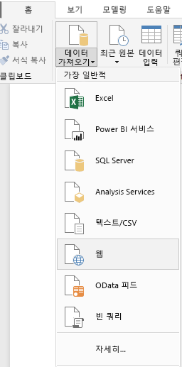 

   >[!NOTE]
   >**데이터 가져오기** 항목 자체를 선택하거나 Power BI 시작 대화 상자에서 **데이터 가져오기**를 선택하고 **데이터 가져오기** 대화 상자의 **모두** 또는 **기타** 섹션에서 **웹**을 선택한 다음, **연결**을 선택할 수도 있습니다.

1. **웹에서** 대화 상자의 **URL** 텍스트 상자에 URL `https://en.wikipedia.org/wiki/UEFA_European_Football_Championship`을 붙여넣은 다음, **확인**을 선택합니다.

    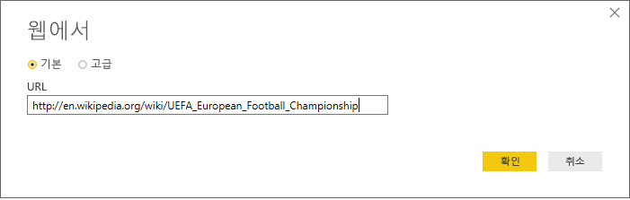

   Wikipedia 웹 페이지에 연결한 후 **탐색기** 대화 상자에는 페이지에서 사용 가능한 테이블 목록이 표시됩니다. 테이블 이름을 선택하여 데이터를 미리 볼 수 있습니다. 정확히 원하는 셰이프는 아니지만 원하는 데이터가 **Results[edit]** 테이블에 있습니다. 보고서에 로드하기 전에 데이터를 다시 셰이핑하고 정리합니다.

   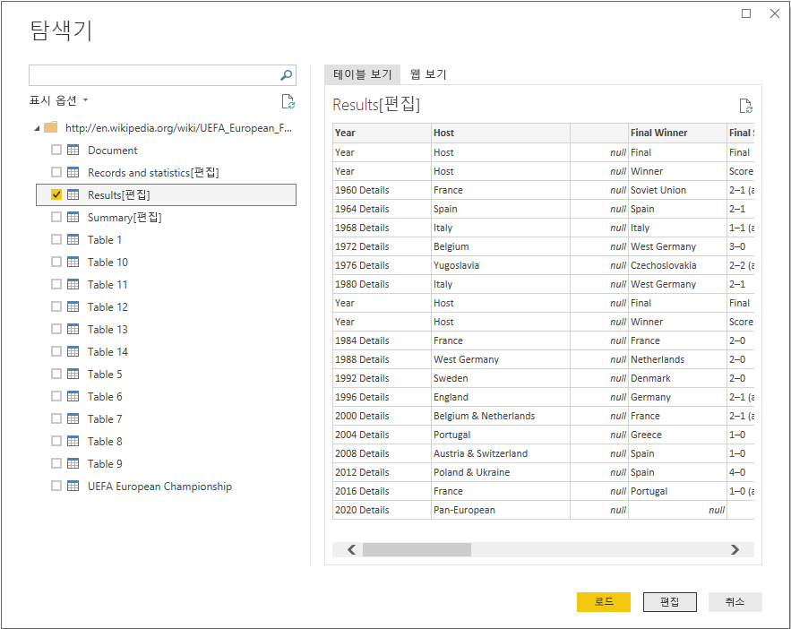

   >[!NOTE]
   >**미리 보기** 창에는 선택된 가장 최근 테이블이 표시되지만 **데이터 변환** 또는 **로드**를 선택하면 선택된 모든 테이블이 Power Query 편집기로 로드됩니다.

1. **탐색기** 목록에서 **Results[edit]** 테이블을 선택한 후 **데이터 변환**을 선택합니다.

   테이블의 미리 보기가 **Power Query 편집기**에서 열리고, 여기에서 변환을 적용하여 데이터를 정리할 수 있습니다.

   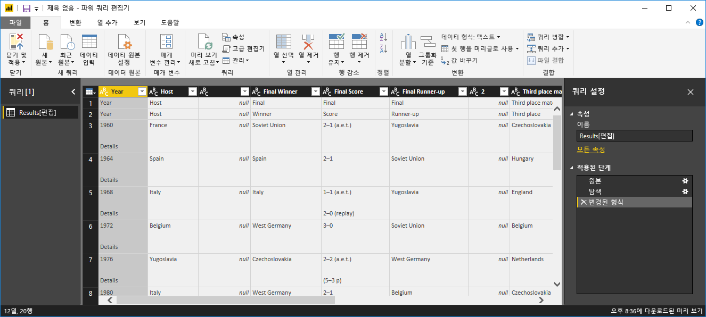

## 파워 쿼리 편집기에서 데이터 셰이핑

우승한 연도와 국가만 표시하여 데이터를 더 쉽게 검색하려 합니다. Power Query 편집기를 사용하여 이러한 데이터 셰이핑 및 정리 단계를 수행할 수 있습니다.

먼저 테이블에서 두 열을 제외한 모든 열을 제거합니다. 프로세스 뒷부분에서 이 두 열의 이름을 *Year* 및 *Country*로 변경합니다.

1. **Power Query 편집기** 표에서 열을 선택합니다. 여러 항목을 선택하려면 Ctrl을 선택합니다.

1. 마우스 오른쪽 단추를 클릭하고 **다른 열 제거**를 선택하거나 **홈** 리본 탭의 **열 관리**그룹에서 **열 제거** > **다른 열 제거**를 선택하여 테이블에서 다른 모든 열을 제거합니다.

   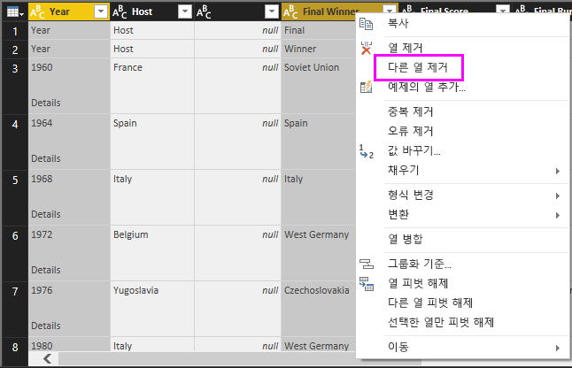

   또는

   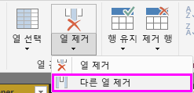

다음으로 첫 번째 열 셀에서 추가 단어 *Details*를 제거합니다.

1. 첫 번째 열을 선택합니다.

1. 마우스 오른쪽 단추를 클릭하고 **값 바꾸기**를 선택하거나 리본의 **홈** 탭에 있는 **변환** 그룹에서 **값 바꾸기**를 선택합니다. 이 옵션은 **변환** 탭의 **열** 그룹에도 있습니다.

   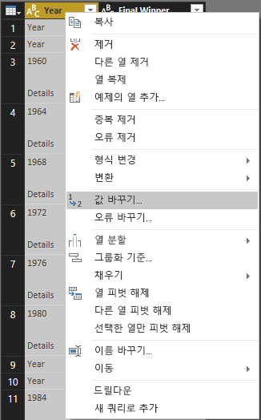 

   또는

   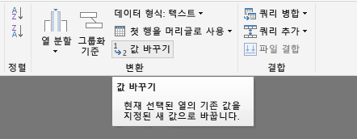

1. **값 바꾸기** 대화 상자에서 **찾을 값** 텍스트 상자에 **Details**를 입력하고 **바꿀 내용** 텍스트 상자를 비워둔 다음, **확인**을 선택하여 이 열에서 *Details* 단어를 삭제합니다.

   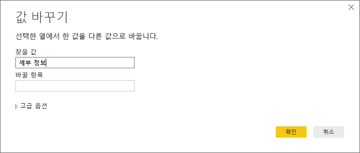

일부 셀에는 연도 값이 아닌 “Year”라는 단어만 포함됩니다. 열을 필터링하여 “Year” 단어를 포함하지 않는 행만 표시할 수 있습니다.

1. 열에서 필터 드롭다운 화살표를 선택합니다.

1. 드롭다운 메뉴에서 아래로 스크롤하여 **Year** 옵션 옆에 있는 확인란의 선택을 취소한 다음 **확인**을 선택합니다.

   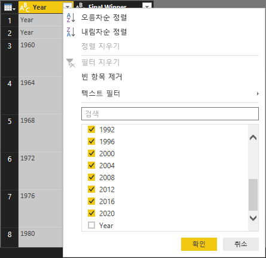

지금은 최종 우승자 데이터만 확인하고 있으므로 두 번째 열의 이름을 **Country**로 바꿀 수 있습니다. 열 이름을 바꾸려면:

1. 두 번째 열 머리글을 두 번 클릭하거나 길게 탭합니다. 또는
   - 열 머리글을 마우스 오른쪽 단추로 클릭하고 **이름 바꾸기**를 선택하거나
   - *열을 선택하고 리본의 **변환** 탭에 있는 **열** 그룹에서 **이름 바꾸기**를 선택합니다.

   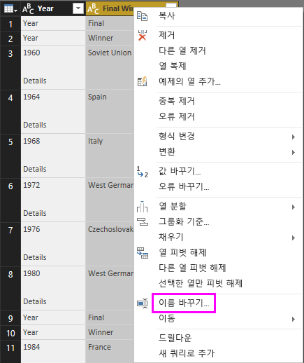 
  
   또는

   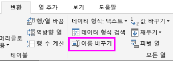

1. 머리글에 **Country**를 입력하고 **Enter** 키를 눌러 열 이름을 바꿉니다.

또한 **Country** 열에서 null 값이 포함된 행(예: “2020”)을 필터링하려 합니다. **Year** 값으로 작업한 대로 필터 메뉴를 사용하거나 다음을 수행할 수 있습니다.

1. 값이 *null*인 **2020** 행에서 **Country** 셀을 마우스 오른쪽 단추로 클릭합니다.

1. 상황에 맞는 메뉴에서 **텍스트 필터** > **같지 않음...** 을 선택하여 해당 셀 값이 포함된 모든 행을 제거합니다.

   

## 보고서 보기로 쿼리 가져오기

이제 원하는 방식으로 데이터를 셰이핑했으므로 쿼리 이름을 “Euro Cup Winners”로 지정하고 보고서로 가져올 준비가 되었습니다.

1. **쿼리 설정** 창의 **이름** 텍스트 상자에 **Euro Cup Winners**를 입력합니다.

   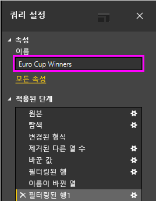

1. 리본 메뉴 **홈** 탭에서 **닫기 및 적용** > **닫기 및 적용**을 선택합니다.

   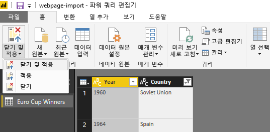

이 쿼리는 Power BI Desktop *보고서* 뷰로 로드되고 **필드** 창에서 볼 수 있습니다.

   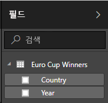

>[!TIP]
>언제든지 Power Query 편집기로 돌아가서 다음과 같이 쿼리를 편집하고 구체화할 수 있습니다.
>- **필드** 창의 **Euro Cup Winners** 옆에 있는 **추가 옵션** 줄임표( **...** )를 선택하고 **쿼리 편집** 을 선택하거나
>- 보고서 보기의 **홈** 리본 탭에 있는**외부 데이터** 그룹에서 **쿼리 편집** > **쿼리 편집**을 선택합니다. 

## 시각화 만들기

데이터를 기반으로 시각화를 만들려면:

1. **필드** 창에서 **Country** 필드를 선택하거나 보고서 캔버스로 끌어옵니다. Power BI Desktop은 데이터를 국가 이름으로 인식하고 **맵** 시각화를 자동으로 만듭니다.

   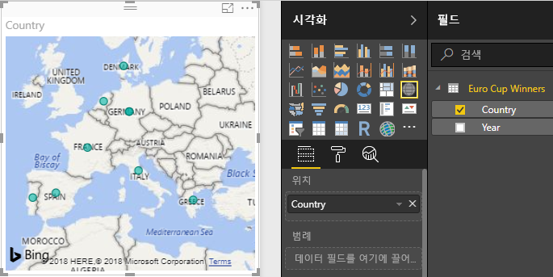

1. 모든 우승 국가 이름이 표시되도록 모서리의 핸들을 끌어 맵을 확대합니다.  

   

1. 맵에는 유로컵 토너먼트에서 우승한 모든 국가에 대한 동일한 데이터 요소가 표시됩니다. 각 데이터 요소의 크기에 해당 국가가 우승한 빈도를 반영하려면 **시각화** 창의 아래쪽 부분에 있는 **크기** 아래의 **여기에 데이터 필드 추가**로 **Year** 필드를 끌어옵니다. 이 필드는 **Count of Year** 측정값으로 자동으로 변경되고 이제 맵 시각화에는 더 많은 토너먼트에서 우승한 국가에 대한 더 큰 데이터 요소가 표시됩니다.

   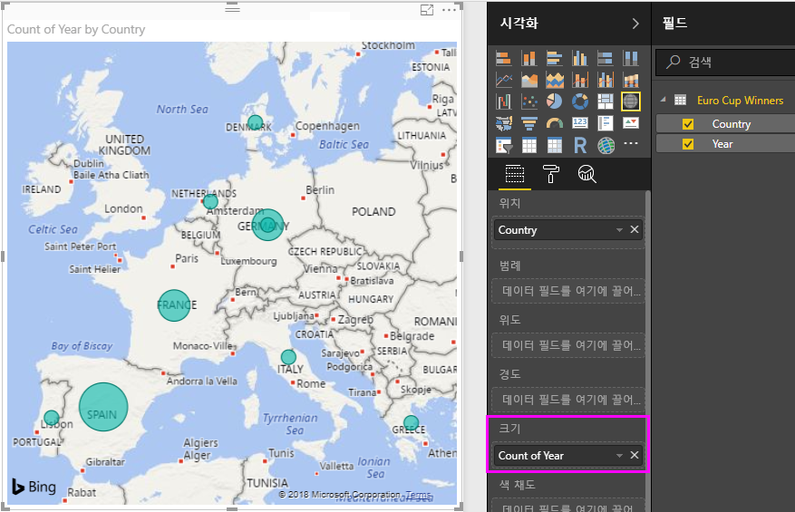

## 시각화 사용자 지정

살펴본 것처럼 데이터를 기반으로 시각화를 쉽게 만들 수 있습니다. 원하는 방식으로 데이터를 더 잘 표시하도록 시각화를 쉽게 사용자 지정할 수도 있습니다.

### 맵 서식 지정

시각화를 선택한 다음, **시각화** 창에서 **서식**(페인트 롤러) 아이콘을 선택하여 시각화 모양을 변경할 수 있습니다. 예를 들어 West Germany가 토너먼트에서 2회 우승하고 Germany가 1회 우승했는데 맵이 이 두 데이터 요소를 분리하거나 합치지 않고 겹치기 때문에 시각화의 “Germany” 데이터 요소가 오해를 일으킬 수 있습니다. 이러한 두 데이터 요소의 색상을 다르게 지정하여 이 사실을 강조 표시할 수 있습니다. 맵에 보다 구체적이고 매력적인 제목을 제공할 수도 있습니다.

1. 시각화를 선택한 상태로 **서식** 아이콘을 선택한 다음, **데이터 색**을 선택하여 데이터 색 옵션을 확장합니다.

   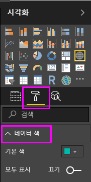

1. **모두 표시**를 **설정**으로 변경한 다음 **West Germany** 옆의 드롭다운 메뉴를 선택하고 노란색을 선택합니다.

   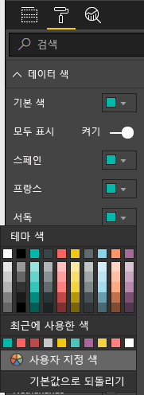

1. **제목**을 선택하여 제목 옵션을 확장하고 **제목 텍스트** 필드에 현재 제목 대신 **Euro Cup Winners**를 입력합니다.

1. **글꼴 색**을 빨간색으로 변경하고, **텍스트 크기**를 **12**로 변경하고, **글꼴 패밀리**를 **Segoe (Bold)** 로 변경합니다.

   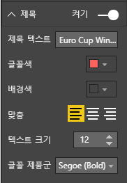

이제 맵 시각화는 다음과 같이 표시됩니다.

### 시각화 유형 변경

시각화를 선택한 다음 **시각화** 창의 맨 위에서 다른 아이콘을 선택하여 시각화 유형을 변경할 수 있습니다. 예를 들어 해당 국가가 더 이상 세계 지도에 존재하지 않으므로 맵 시각화에는 소비에트 연방 및 체코슬로바키아에 대한 데이터가 없습니다. 트리 맵 또는 원형 차트 같은 다른 시각화 형식은 모든 값을 표시하므로 더욱 정확할 수 있습니다.

맵을 원형 차트로 변경하려면 맵을 선택한 다음 **시각화** 창에서 **원형 차트** 아이콘을 선택합니다.

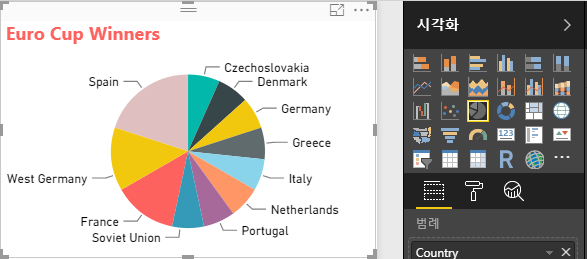

>[!TIP]
>- **데이터 색** 서식 옵션을 사용하여 “Germany” 및 “West Germany”를 같은 색으로 설정할 수 있습니다. 
>- 원형 차트에서 가장 많이 우승한 국가를 함께 그룹화하려면 시각화의 오른쪽 위에 있는 줄임표( **...** )를 선택한 다음 **연도 수별 정렬**을 선택합니다.

Power BI Desktop은 다양한 데이터 원본에서 데이터를 가져오고 이 데이터를 풍부한 대화형 방식으로 시각화하기 위해 분석 요구 사항에 맞게 모양을 지정하는 원활한 엔드투엔드 환경을 제공합니다. 보고서가 준비되면 [Power BI로 업로드](desktop-upload-desktop-files.md)하고 보고서에 따라 대시보드를 만든 후 다른 Power BI 사용자와 공유할 수 있습니다.

## 참고 항목

* [다른 Power BI Desktop 자습서 참고](/power-bi/guided-learning/)
* [Power BI Desktop 동영상 시청](desktop-videos.md)
* [Power BI 포럼 방문](https://go.microsoft.com/fwlink/?LinkID=519326)
* [Power BI 블로그 참고](https://go.microsoft.com/fwlink/?LinkID=519327)

