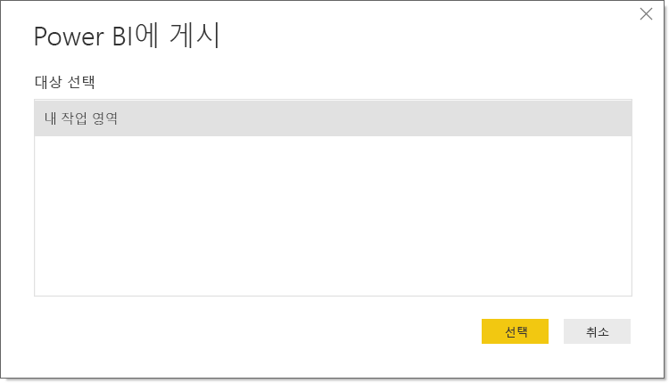

# Power BI Desktop에서 데이터 세트 및 보고서 게시
Power BI Desktop 파일을 Power BI 서비스에 게시하면 모델의 데이터가 Power BI 작업 영역에 게시됩니다. **보고서** 보기에서 만든 모든 보고서의 경우에도 마찬가지입니다. 작업 영역 탐색기에서 동일한 이름의 새 데이터 세트와 모든 보고서를 볼 수 있습니다.

Power BI Desktop에서 게시하는 것은 Power BI의 **데이터 가져오기**를 사용하여 연결하고 Power BI Desktop 파일을 업로드하는 것과 동일한 효과를 가집니다.

> [!NOTE]
> Power BI 보고서에서 변경한 내용은 원래 Power BI Desktop 파일에 다시 저장되지 않습니다. 여기에는 보고서에서 시각화를 추가, 삭제 또는 변경하는 경우도 포함됩니다.
> 
> 

## Power BI Desktop 데이터 세트 및 보고서를 게시하려면
1. Power BI Desktop에서 **파일** \> **게시** \> **Power BI에 게시**를 선택하거나 리본에서 **게시**를 선택합니다.  

   

2. Power BI에 로그인합니다.
3. 대상을 선택합니다.

   

게시가 완료되면 보고서 링크가 표시됩니다. 링크를 선택하여 Power BI 사이트에서 보고서를 엽니다.

## Power BI Desktop에서 게시된 데이터 세트의 다시 게시 또는 대체
Power BI Desktop 파일을 게시할 때 Power BI Desktop에서 만든 데이터 세트 및 모든 보고서가 Power BI 사이트에 업로드됩니다. Power BI Desktop 파일을 다시 게시할 때는 Power BI 사이트의 데이터 세트가 Power BI Desktop 파일에서 업데이트된 데이터 세트로 대체됩니다.

매우 단순하지만 몇 가지 알아둘 프로세스가 있습니다.

* Power BI Desktop 파일과 이름이 같은 두 개 이상의 Power BI의 데이터 세트가 있을 경우 게시에 실패할 수 있습니다. Power BI에 동일한 이름의 데이터 세트가 하나뿐인지 확인하세요. 파일의 이름을 변경하고 파일과 동일한 이름의 새 데이터 세트를 게시, 생성할 수도 있습니다.
* 열 또는 측정값의 이름을 변경하거나 삭제하는 경우, Power BI에서 해당 필드에 갖고 있던 모든 시각화가 손상될 수 있습니다. 
* Power BI는 기존 열 형식의 일부 변경을 무시합니다. 예를 들어, 열 형식을 0.25%에서 25%로 변경한 경우입니다.
* Power BI의 기존 데이터 세트에 대해 구성된 새로 고침 일정이 있다고 가정합니다. 파일에 새 데이터 원본을 추가한 후 다시 게시하는 경우, 다음 예약된 새로 고침 전에 해당 데이터 원본에 로그인해야 합니다.
* Power BI Desktop에서 게시된 데이터 세트를 다시 게시하고 새로 고침 일정을 정의한 경우 다시 게시하는 즉시 데이터 세트 새로 고침이 시작됩니다. 

