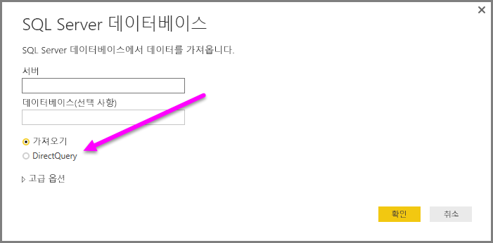
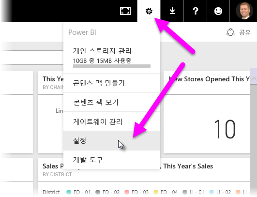
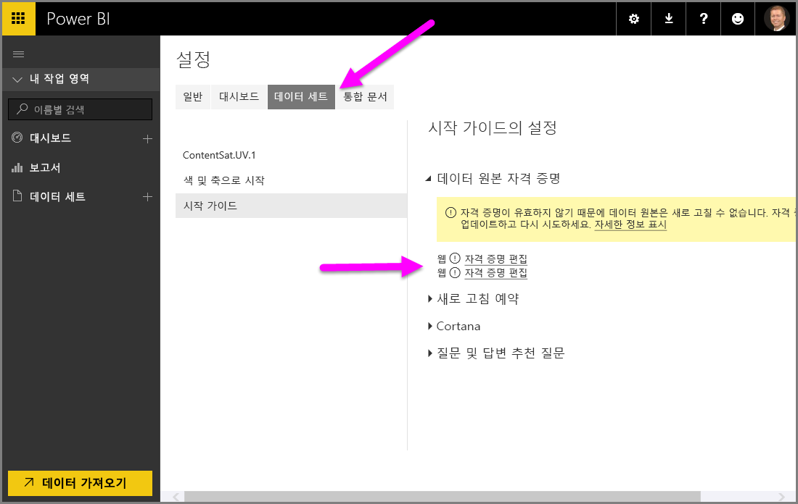

# Power BI Desktop에서 DirectQuery 사용
**Power BI Desktop**을 사용하여 데이터 원본에 연결할 때 항상 데이터의 복사본을 **Power BI Desktop**으로 가져올 수 있습니다. 일부 데이터 원본의 경우 다른 방법을 사용할 수 있습니다. **DirectQuery**를 사용하여 데이터 원본에 직접 연결합니다.

## 지원되는 데이터 원본
**DirectQuery**를 지원하는 데이터 원본의 전체 목록을 보려면 [DirectQuery에서 지원하는 데이터 원본](desktop-directquery-data-sources.md)을 참조하세요.

## DirectQuery를 사용하여 연결하는 방법
**데이터 가져오기**를 사용하여 **DirectQuery**에서 지원하는 데이터 원본에 연결할 때 연결할 방법을 선택하는 연결 창이 나타납니다.  

**가져오기**와 **DirectQuery**를 선택하는 차이점은 다음과 같습니다.

**가져오기** – 선택한 테이블 및 열을 **Power BI Desktop**으로 가져옵니다. 시각화를 만들거나 상호 작용할 때 **Power BI Desktop**은 가져온 데이터를 사용합니다. 전체 데이터 집합을 다시 가져오는 데이터를 새로 고쳐서 초기 가져오기 또는 최신 새로 고침 이후에 기본 데이터에 발생한 변경 내용을 보아야 합니다.

**DirectQuery** – **Power BI Desktop**에 데이터를 가져오거나 복사하지 않습니다. 관계형 원본의 경우 선택한 테이블 및 열이 **필드** 목록에 표시됩니다. SAP Business Warehouse와 같은 다차원 원본의 경우 선택한 큐브의 차원 및 측정값이 **필드** 목록에 나타납니다. 시각화를 만들거나 상호 작용할 때 **Power BI Desktop**은 기본 데이터 원본을 쿼리하므로 항상 현재 데이터를 볼 수 있습니다.

여러 데이터 모델링 및 데이터 변환은 몇 가지 제한 사항이 있는 **DirectQuery**를 사용할 때 사용할 수 있습니다. 시각화를 만들거나 상호 작용할 때 기본 원본은 쿼리되어야 하고 시각화를 새로 고치는 데 필요한 시간은 기본 데이터 원본의 성능에 따라 달라집니다. 데이터가 최근에 요청된 서비스에 필요할 때 Power BI Desktop은 시각화를 표시하는 데 필요한 시간을 줄이기 위해 최신 데이터를 사용합니다. **홈** 리본에서 **새로 고침**을 선택하는 작업은 모든 시각화가 최신 데이터로 새로 고쳐지도록 합니다.

[Power BI 및 DirectQuery](desktop-directquery-about.md) 문서에는 **DirectQuery**가 자세히 설명되어 있습니다. 또한 **DirectQuery**를 사용하는 경우 이점, 제한 사항 및 중요 고려 사항에 대한 자세한 내용은 다음 섹션을 참조하세요.

## DirectQuery 사용의 이점
**DirectQuery**를 사용하는 경우 몇 가지 이점이 있습니다.

* **DirectQuery**를 사용하면 매우 큰 데이터 세트에 대한 시각화를 빌드할 수 있습니다. 그렇지 않으면 사전 집계를 사용하여 모든 데이터를 처음 가져오는 작업을 실행할 수 없습니다.
* 기본 데이터를 변경하려면 데이터를 새로 고쳐야 할 수 있으며, 일부 보고서의 경우 현재 데이터를 표시하려면 대량의 데이터 전송이 필요할 수 있으므로 데이터 다시 가져오기를 실행할 수 없습니다. 이와 반대로 **DirectQuery** 보고서는 항상 현재 데이터를 사용합니다.
* 1GB 데이터 세트 제한은 **DirectQuery**에 적용되지 *않습니다*.

## DirectQuery의 제한 사항
현재 **DirectQuery**를 사용하는 데 몇 가지 제한 사항이 있습니다.

* [복합 모델](desktop-composite-models.md)을 사용하지 않는 한, 모든 테이블은 단일 데이터베이스에서 가져와야 합니다.

* **쿼리 편집기** 쿼리가 너무 복잡하면 오류가 발생합니다. 오류를 수정하려면 **쿼리 편집기**에서 문제가 되는 단계를 삭제하거나, **DirectQuery**를 사용하지 않고 데이터를 *가져옵니다*. SAP Business Warehouse와 같은 다차원 원본의 경우 **쿼리 편집기**가 없습니다.

* 시간 인텔리전스 기능은 **DirectQuery**에서 사용할 수 없습니다. 예를 들어 날짜 열의 특별한 처리(예: 년, 분기, 월, 일 등)는 **DirectQuery** 모드에서 지원되지 않습니다.

* 기본 데이터 원본에 전송된 쿼리의 성능이 적절한지 확인하기 위해 측정값에서 허용되는 DAX 식에 제한 사항이 적용됩니다.

* **DirectQuery**를 사용하는 경우 데이터 반환에 대한 백만 행 제한이 있습니다. 이 제한은 반환된 행에만 영향을 주고 **DirectQuery**를 사용하여 반환된 데이터 세트를 만드는 데 사용되는 집계 또는 계산에 영향을 주지 않습니다. 예를 들어 Power BI에 반환된 데이터가 백만 행보다 작은 데이터 소스에 실행되는 쿼리를 사용해 천만 행을 집계하여 **DirectQuery**를 사용해 Power BI에 해당 집계 결과를 정확하게 반환할 수 있습니다. **DirectQuery**에서 백만 행 이상이 반환된다면 Power BI는 오류를 반환합니다.

## DirectQuery를 사용하는 경우 중요 고려 사항
**DirectQuery**를 사용하는 경우 다음 세 가지 사항을 고려해야 합니다.

* **성능 및 부하** - 모든 **DirectQuery** 요청은 원본 데이터베이스로 보내지므로 시각적 개체를 새로 고치는 데 필요한 시간은 백 엔드 원본이 쿼리(또는 복수의 쿼리)의 결과로 응답하는 데 걸리는 시간에 따라 달라집니다. 시각적 개체에 대한 **DirectQuery** 사용에 권장되는 응답 시간(반환되는 요청된 데이터)은 30초의 최대 권장 결과 응답 시간과 함께 5초 이하입니다. 더 긴 경우 보고서를 사용하는 사용자의 경험은 크게 저하됩니다. 또한 보고서가 Power BI 서비스에 게시되면 몇 분 이상 더 오래 걸리는 모든 쿼리는 시간 제한되며 사용자에게 오류가 나타납니다.
  
  원본 데이터베이스에 대한 로드는 게시된 보고서를 사용하는 Power BI 사용자의 수에 따라 고려해야 합니다. *행 수준 보안*(RLS) 사용도 또한 중요한 영향을 줄 수 있으며 여러 사용자에서 공유되는 비 RLS 대시보드 타일은 데이터베이스에 대한 단일 쿼리를 가져오지만 대시보드 타일에 대한 RLS 사용은 일반적으로 *사용자당* 하나의 쿼리가 필요한 타일의 새로 고침을 의미하므로 원본 데이터베이스에 부하가 크게 증가하고 성능에 잠재적인 영향을 줍니다.
  
  Power BI는 최대한 효율적으로 쿼리를 만듭니다. 그러나 특정 상황에서 생성된 쿼리는 실패하는 새로 고침을 방지하는 데 효율성이 충분하지 않습니다. 이러한 상황의 한 예는 생성된 쿼리가 백 엔드 데이터 원본에서 과도하게 많은 수의 행을 검색하는 경우입니다. 이때는 다음 오류가 발생합니다.
  
      The resultset of a query to external data source has exceeded
  
  이 상황은 집계 옵션이 *요약하지 않음*으로 설정된 매우 높은 카디널리티 열을 포함하는 간단한 차트로 발생할 수 있습니다. 시각적 개체는 백만 개 아래의 카디널리티를 가진 열이 있거나 적절한 필터가 적용되어야 합니다.
* **보안** - 게시된 보고서를 사용하는 모든 사용자는 Power BI 서비스에 게시 후 입력한 자격 증명을 사용하여 백 엔드 데이터 원본에 연결합니다. 가져온 데이터와 같은 상황입니다. 모든 사용자는 백 엔드 원본에 정의된 모든 보안 규칙에 관계 없이 동일한 데이터를 봅니다. DirectQuery 원본으로 구현된 사용자별 보안을 원하는 고객은 RLS를 사용해야 합니다. [RLS에 대해 자세히 알아보세요](service-admin-rls.md).
* **지원되는 기능** - **Power BI Desktop**의 모든 기능은 **DirectQuery** 모드에서 지원되지 않거나 몇 가지 제한이 있습니다. 또한 Power BI 서비스에서 **DirectQuery**를 사용하는 데이터 세트에 대해 사용할 수 없는 일부 기능(예: *신속한 정보 활용*)이 있습니다. 따라서 **DirectQuery**를 사용할 때 이러한 기능의 제한을 **DirectQuery**의 사용 여부를 결정할 때 고려해야 합니다.   

## Power BI 서비스에 게시
**DirectQuery**를 사용하여 만든 보고서는 Power BI 서비스에 게시할 수 있습니다.

사용하는 데이터 원본에 **온-프레미스 데이터 게이트웨이**(**Azure SQL Database**, **Azure SQL Data Warehouse** 또는 **Redshift**)가 필요하지 않을 경우 게시된 보고서가 Power BI 서비스에 표시되기 전에 자격 증명을 제공해야 합니다.

Power BI에서 **설정** 기어 아이콘을 선택하여 자격 증명을 제공한 다음 **설정**을 선택할 수 있습니다.

Power BI는 **설정** 창을 표시합니다. 여기에서 **데이터 세트** 탭을 선택하고, **DirectQuery**를 사용하는 데이터 세트를 선택하고, **자격 증명 편집**을 선택합니다.

자격 증명이 제공될 때까지 게시된 보고서를 열거나 **DirectQuery** 연결을 사용하여 만든 데이터 세트를 탐색하는 작업은 오류가 발생합니다.

DirectQuery를 사용하는 **Azure SQL Database**, **Azure SQL Data Warehouse** 및 **Redshift** 이외의 데이터 원본의 경우 **온-프레미스 데이터 게이트웨이**는 설치되어야 하고 데이터 원본을 등록하여 데이터 연결을 설정해야 합니다. 자세한 내용은 [온-프레미스 데이터 게이트웨이](http://go.microsoft.com/fwlink/p/?LinkID=627094)를 참조하세요.

## 다음 단계
**DirectQuery**에 대한 자세한 내용은 다음 리소스를 확인하세요.

* [Power BI의 DirectQuery](desktop-directquery-about.md)
* [DirectQuery에서 지원하는 데이터 원본](desktop-directquery-data-sources.md)
* [DirectQuery 및 SAP BW](desktop-directquery-sap-bw.md)
* [DirectQuery 및 SAP HANA](desktop-directquery-sap-hana.md)
* [온-프레미스 데이터 게이트웨이](service-gateway-onprem.md)

