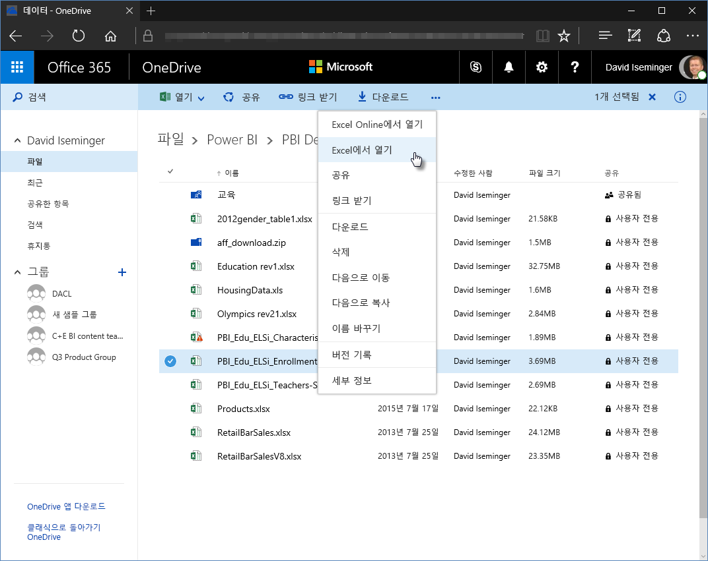
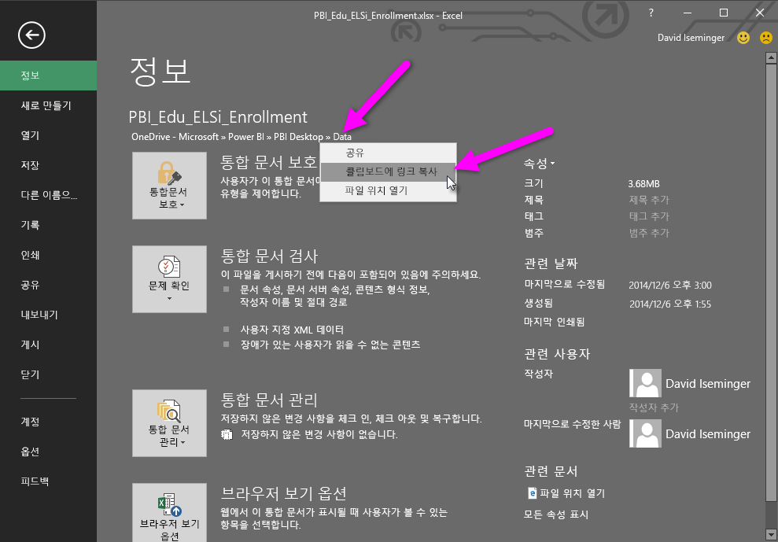
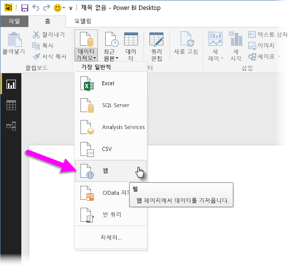
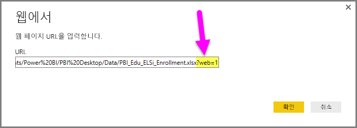
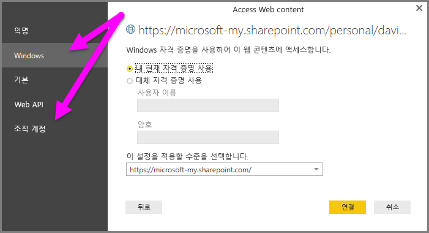

# Power BI Desktop에서 비즈니스용 OneDrive 링크 사용
많은 사용자가 Excel 통합 문서를 Power BI Desktop에 사용하기 좋은 비즈니스용 OneDrive 드라이브에 저장합니다. **Power BI Desktop**을 통해 **비즈니스용 OneDrive**에 저장된 **Excel** 파일에 대한 온라인 링크를 사용하여 보고서 및 시각적 개체를 만들 수 있습니다. **비즈니스용 OneDrive** 그룹 계정 또는 개별 **비즈니스용 OneDrive** 계정을 사용할 수 있습니다.

**비즈니스용 OneDrive**에서 온라인 링크를 가져오는 데는 몇 가지 특정 단계가 필요합니다. 다음 섹션에서 이러한 단계에 대해 설명하며 그룹 간, 서로 다른 컴퓨터 간 파일 링크를 동료와 공유할 수 있습니다.

## Excel에서 링크 받기, 브라우저에서 시작
1. 브라우저를 사용하여 비즈니스용 OneDrive 위치로 이동합니다. 사용할 파일을 마우스 오른쪽 단추로 클릭하고 **Excel에서 열기**를 선택합니다.
   
   > [!NOTE]
   > 브라우저 인터페이스는 다음 이미지와 약간 다를 수 있습니다. **비즈니스용 OneDrive** 브라우저 인터페이스에서 여러 가지 방법으로 파일에 대해 **Excel에서 열기**를 선택할 수 있습니다. Excel에서 파일을 열 수 있는 어떤 옵션이라도 사용하면 됩니다.
   > 
   > 
   
   
2. **Excel**에서 **파일 > 정보**를 선택하고 **통합 문서 보호** 단추 위의 링크를 선택합니다. **클립보드에 링크 복사**를 선택합니다(버전에 따라 **클립보드에 경로 복사**로 표시될 수도 있음).
   
   

## Power BI Desktop에서 링크 사용
Power BI Desktop에서 방금 클립보드에 복사한 링크를 사용할 수 있습니다. 다음 단계를 수행합니다.

1. Power BI Desktop에서 **데이터 가져오기 > 웹**을 선택합니다.
   
   
2. 링크를 **웹** 대화 상자에 붙여 넣습니다(아직 확인을 선택하지 **마세요**).
   
    
3. 링크 끝에 *?web=1* 문자열이 있는 것을 확인할 수 있습니다. **확인**을 선택하기 **전에** 이 웹 URL 문자열을 제거해야 **Power BI Desktop**에서 해당 파일을 제대로 탐색합니다.
4. **Power BI Desktop**에서 자격 증명을 묻는 메시지가 표시되면 **Windows**(온-프레미스 SharePoint 사이트인 경우) 또는 **조직 계정**(Office 365 또는 비즈니스용 OneDrive 사이트인 경우) 중 하나를 선택합니다.
   
   

테이블, 시트 및 Excel 통합 문서에 있는 범위 목록을 선택할 수 있는 **탐색기** 창이 나타납니다. 여기에서 다른 Excel 파일처럼 비즈니스용 OneDrive 파일을 사용하고 다른 데이터 원본에서 수행한 것처럼 보고서를 만들어 데이터 세트에서 사용할 수 있습니다.

> [!NOTE]
> Power BI 서비스에서 **비즈니스용 OneDrive** 파일을 데이터 원본으로 사용하려면 해당 파일에 대해 **서비스 새로 고침**을 사용하여 새로 고침 설정 구성 시 **OAuth2**를 **인증 방법**으로 선택하세요. 그러지 않으면 연결하거나 새로 고칠 때 오류가 발생할 수 있습니다(예: ‘데이터 원본 자격 증명을 업데이트하지 못했습니다.’). 인증 방법으로 **OAuth2** 메서드를 선택하여 해당 자격 증명 오류를 해결합니다.
> 
> 

