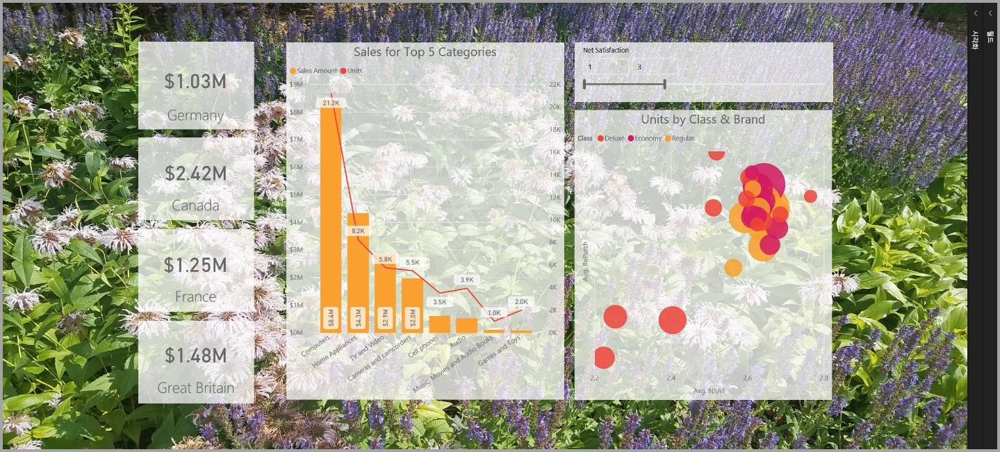
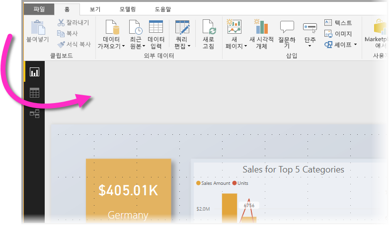
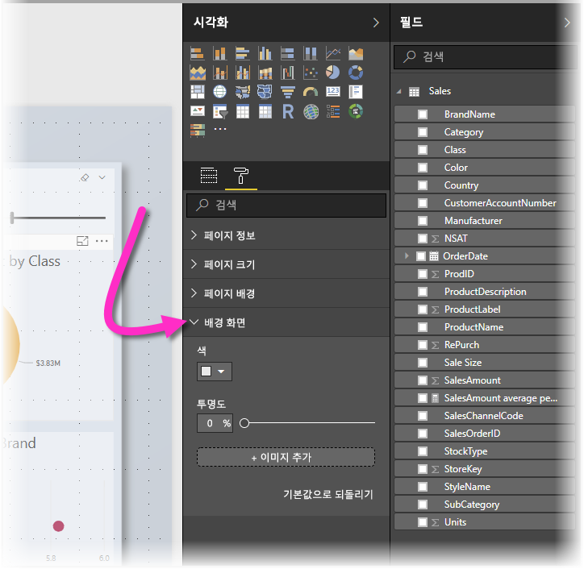
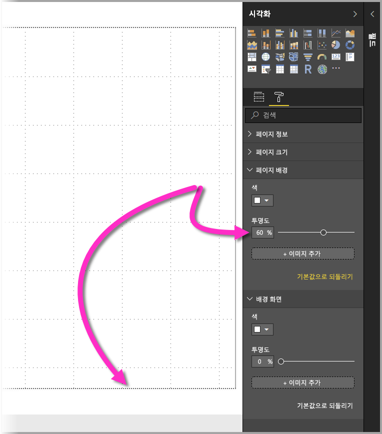
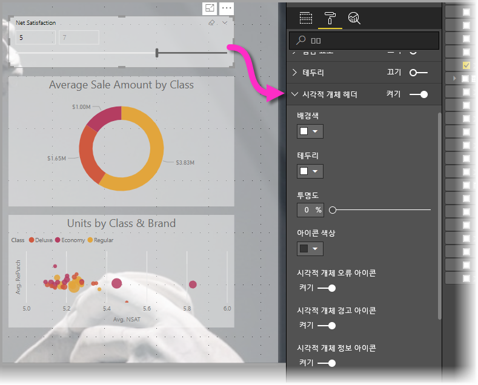
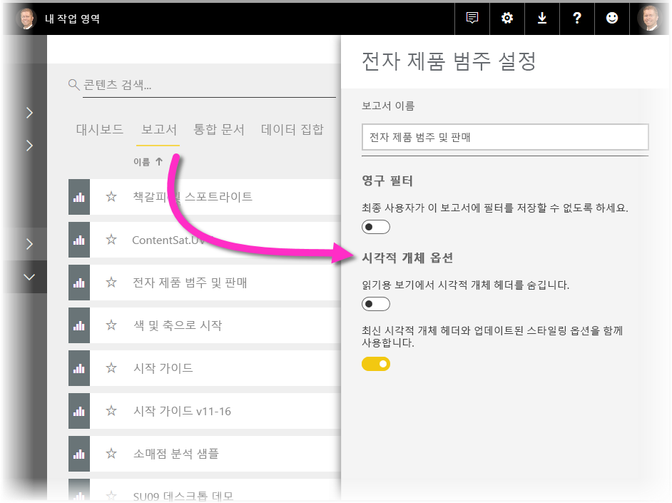
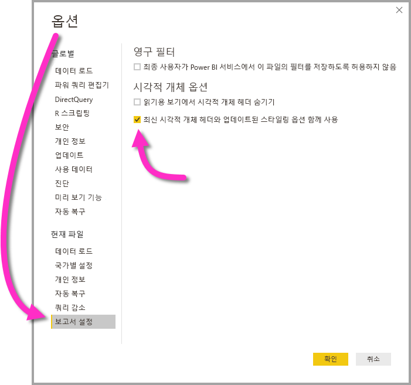

# 시각적 개체를 사용하여 Power BI 보고서 개선

**Power BI Desktop**을 사용하면 시각화에 배경 화면 및 향상된 시각적 머리글과 같은 시각적 요소를 사용하여 보고서의 모양을 개선할 수 있습니다.

**Power BI Desktop**의 2018년 7월 릴리스부터 보고서에 사용할 개선 사항을 포함하고 이전보다 훨씬 더 매력적인 분석과 보고서를 만들 수 있습니다. 이 문서에 설명된 개선 사항은 다음과 같습니다. 

* 데이터로 알리려는 스토리의 요소를 배경에서 개선하거나 강조 표시할 수 있도록 보고서에 **배경 화면** 적용
* 개별 시각화에 향상된 **시각적 머리글**을 사용하여 보고서 캔버스에서 완벽하게 정렬된 시각적 개체를 만듭니다. 

다음 섹션에서는 이러한 개선 사항을 사용하는 방법과 보고서에 이를 적용하는 방법을 설명합니다.

## Power BI 보고서에서 배경 화면 사용

**배경 화면**을 사용하여 보고서 페이지 밖의 회색 영역에 서식을 지정할 수 있습니다. 다음 이미지에는 배경 화면 영역이 적용되는 위치를 분명히 나타내는 화살표가 있습니다. 

보고서 페이지별로 배경 화면을 설정하거나 보고서의 모든 페이지에 동일한 배경 화면을 포함할 수 있습니다. 배경 화면을 설정하려면 보고서에서 시각적 개체가 선택되지 않았을 때 **서식** 아이콘을 탭하거나 클릭합니다. 그러면 **배경 화면** 카드가 창에 나타납니다.

**색** 드롭다운을 선택하여 **배경 화면**으로 적용할 색을 선택하거나 **이미지 추가** 단추를 선택하여 배경 화면으로 적용할 이미지를 선택할 수 있습니다. **투명도** 슬라이더를 사용하여 색이든, 이미지이든 관계없이 배경 화면에 투명도를 적용할 수도 있습니다.

**배경 화면**에 관련된 다음 정의를 고려하는 것이 좋습니다.

* 보고서 영역 밖의 회색 영역은 **배경 화면** 영역임
* 시각적 개체를 배치할 수 있는 캔버스의 영역은 보고서 **페이지**라고 하며, **형식 창**에서 **페이지 배경** 드롭다운을 사용하여 수정할 수 있습니다.

보고서 **페이지**는 항상 전경에 있지만(배경 화면과 비교할 때), **배경 화면**은 보고서 페이지 및 보고서 페이지의 맨 뒤 요소 뒤에 있습니다. 페이지에 투명도를 적용하면 보고서의 시각적 개체에도 투명도가 적용되므로 시각적 개체를 통해 배경 화면을 배경에 표시할 수 있습니다.

모든 새 보고서의 경우 기본 설정은 다음과 같습니다.

* 보고서 **페이지**는 **흰색**으로 설정되고 투명도는 **100%** 로 설정됨
* **배경 화면**은 **흰색**으로 설정되고 투명도는 **0%** 로 설정됨

페이지 배경을 50% 이상 투명도로 설정하면 보고서를 만들거나 편집하는 동안 보고서 캔버스 테두리의 경계를 표시하는 점선 테두리가 나타납니다. 

점선 경계는 보고서를 편집할 때’만’ 표시되고 **Power BI 서비스**에서 보는 경우와 같이 게시된 보고서를 보는 사람에게 표시되지 ‘않습니다’.

> [!NOTE]
> 배경 화면에 진한 색 배경을 사용하고 텍스트 색을 흰색이나 옅은 색으로 설정하는 경우 **PDF로 내보내기** 기능에는 배경 화면이 포함되지 않으므로 흰색 글꼴을 포함한 내보내기는 내보낸 PDF 파일에 거의 표시되지 않습니다. **PDF로 내보내기**에 대한 자세한 내용은 [PDF로 내보내기](desktop-export-to-pdf.md)를 참조하세요.

## Power BI 보고서에서 향상된 시각적 머리글 사용

**Power BI Desktop**의 2018년 7월 릴리스부터 보고서에 있는 시각적 개체의 머리글이 크게 향상되었습니다. 기본 개선 사항은 레이아웃 및 위치 지정의 기본 설정에 따라 위치를 조정할 수 있도록 머리글이 시각적 개체에서 분리되었고 이제 머리글이 시각적 개체 위에서 움직이는 대신 시각적 개체 자체의 내부에 표시된다는 것입니다. 

기본적으로 머리글은 시각적 개체 내부에 제목에 맞춰 정렬되어 표시됩니다. 다음 이미지에서 시각적 개체 내부에 있는 머리글(고정 아이콘, 확장 아이콘 및 줄임표 아이콘)이 시각적 개체의 제목과 동일한 가로 위치를 따라 오른쪽에 맞춰 정렬되어 있음을 알 수 있습니다.

시각적 개체에 제목이 경우 머리글은 다음 이미지에 표시된 대로 오른쪽에 맞춰 정렬된 시각적 개체의 맨 위에서 움직입니다. 

시각적 개체가 완전히 보고서의 맨 위에 배치된 경우 시각적 머리글은 시각적 개체의 맨 아래에 맞춰집니다. 

각 시각적 개체에는 **시각화** 창의 **서식** 섹션에 **시각적 머리글**이라는 카드도 있습니다. 해당 카드에서 시각적 머리글에 대한 모든 종류의 특징을 조정할 수 있음

> [!NOTE]
> 보고서를 작성하거나 편집하는 동안 토글 표시 여부는 보고서에 영향을 주지 않습니다. 효과를 확인하려면 보고서를 게시하고 읽기 모드로 표시해야 합니다. 이 동작을 사용하면 시각적 머리글에 제공된 많은 옵션(특히 편집하는 동안 문제에 대한 경고를 표시하는 경고 아이콘)이 중요해집니다.

**Power BI 서비스**에만 표시되는 보고서의 경우 **내 작업 영역 > 보고서**로 이동한 후 **설정** 아이콘을 선택하여 시각적 머리글의 사용 방식을 조정할 수 있습니다. 여기에서 **설정**을 선택한 보고서에 대한 설정을 확인하고 다음 이미지와 같이 설정을 조정할 수 있습니다.

### 기존 보고서에 향상된 시각적 머리글 사용

새 시각적 머리글은 모든 새 보고서의 기본 동작입니다. 기존 보고서의 경우 **파일 > 옵션 및 설정 > 옵션**으로 이동하여 **Power BI Desktop**에서 이 동작을 사용하도록 설정한 후 **보고서 설정** 섹션에서 **최신 시각적 머리글과 업데이트된 스타일링 옵션 함께 사용** 확인란을 선택해야 합니다.

## 다음 단계
**Power BI Desktop**에 대한 자세한 내용 및 시작하는 방법은 다음 문서를 확인하세요.

* [Power BI Desktop이란?](desktop-what-is-desktop.md)
* [Power BI Desktop을 사용한 쿼리 개요](desktop-query-overview.md)
* [Power BI Desktop의 데이터 원본](desktop-data-sources.md)
* [Power BI Desktop에서 데이터에 연결](desktop-connect-to-data.md)
* [Power BI Desktop에서 데이터 셰이핑 및 결합](desktop-shape-and-combine-data.md)
* [Power BI Desktop의 일반적인 쿼리 작업](desktop-common-query-tasks.md)   

