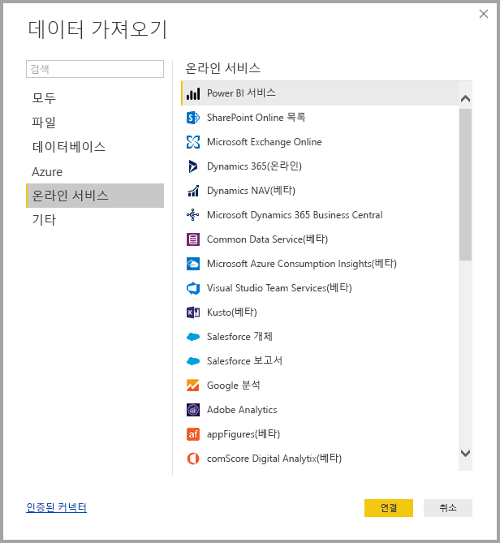
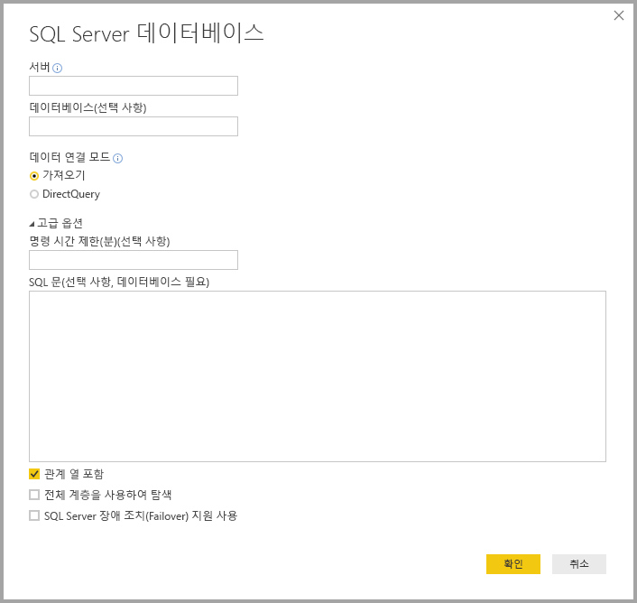
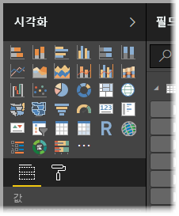
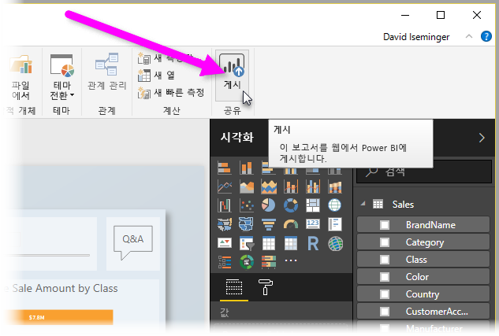

# Power BI Desktop이란?

**Power BI Desktop**은 데이터를 연결, 변환 및 시각화할 수 있도록 로컬 컴퓨터에 설치할 수 있는 무료 애플리케이션입니다. **Power BI Desktop**을 사용하면 여러 다른 데이터 원본에 연결하고 이들을 데이터 모델에 결합하여 시각적 개체 및 조직 내의 다른 사용자와 보고서로 공유할 수 있는 시각적 개체 모음을 빌드할 수 있습니다. 비즈니스 인텔리전스 프로젝트에서 작업하는 대부분의 사용자는 **Power BI Desktop**을 사용하여 보고서를 만든 다음, **Power BI 서비스**를 사용하여 다른 사용자와 보고서를 공유합니다.

**Power BI Desktop**의 가장 일반적인 용도는 다음과 같습니다.

* 데이터에 연결
* 데이터 모델을 만들기 위해 해당 데이터 변환 및 정리
* 데이터의 시각적 표시를 제공하는 차트 또는 그래프와 같은 시각적 개체 만들기
* 하나 이상의 보고서 페이지에서 시각적 개체 모음인 보고서 만들기
* **Power BI 서비스**를 사용하여 다른 사용자와 보고서 공유

해당 작업을 담당하는 사용자는 종종 ‘데이터 분석가’(‘분석가’라고도 함) 또는 비즈니스 인텔리전스 전문가(‘보고서 작성자’라고도 함)로 간주합니다.    그러나 자신을 분석가나 보고서 작성자로 간주하지 않는 많은 사용자는 **Power BI Desktop**을 사용하여 매력적인 보고서를 만들거나 다양한 원본에서 데이터를 끌어오고 동료 및 조직과 공유할 수 있는 데이터 모델을 빌드합니다.

Power BI Desktop에는 캔버스의 왼쪽에 표시되는 세 가지 보기가 있습니다. 각 보기는 표시되는 순서에 따라 다음과 같습니다.
* **보고서 보기** - 보고서 및 시각적 개체를 만들고 대부분의 작성 시간이 소요되는 보기입니다.
* **데이터 보기** - 여기에서 보고서와 연결된 데이터 모델에 사용되는 테이블, 측정값 및 기타 데이터를 확인하고 보고서 모델에서 최상으로 사용하기 위해 데이터를 변환할 수 있습니다.
* **모델 보기** - 이 보기에서는 데이터 모델에서 테이블 간 관계를 확인하고 관리합니다.

다음 이미지는 캔버스의 왼쪽에 표시되는 세 가지 보기를 보여줍니다.

**Power BI Desktop**을 통해 여러 원본의 데이터를 사용하여 조직의 다른 사용자와 공유할 수 있는 통합 보고서인 복잡하고 시각적으로 풍부한 보고서를 만들 수 있습니다. 

## 데이터에 연결
**Power BI Desktop**을 시작하기 위한 첫 번째 단계는 데이터에 연결하는 것입니다. **Power BI Desktop**에서 연결할 수 있는 다양한 데이터 원본이 있습니다. 데이터에 연결하려면 **홈** 리본을 선택한 다음, **데이터 가져오기 > 자세히**를 선택합니다. 다음 이미지에는 Power BI Desktop이 연결할 수 있는 여러 범주를 보여주는 **데이터 가져오기** 창이 표시됩니다.

데이터 형식을 선택하면 Power BI Desktop이 자동으로 데이터 원본에 연결하는 데 필요한 URL 및 자격 증명 같은 정보를 요청하는 메시지가 표시됩니다.

하나 이상의 데이터 원본에 연결한 후 데이터를 유용한 정보로 변환할 수 있습니다.

## 데이터 변환 및 정리, 모델 만들기

Power BI Desktop에서 기본 제공 **쿼리 편집기**를 사용하여 데이터를 정리하고 변환할 수 있습니다. 쿼리 편집기를 사용하면 데이터 형식 변경, 열 제거 또는 여러 원본의 데이터 결합과 같은 작업으로 데이터를 변경할 수 있습니다. 이는 약간 조각과 비슷합니다. 큰 점토(또는 데이터) 블록으로 시작한 다음, 데이터 셰이프가 원하는 대로 나타날 때까지 필요에 따라 조각을 깎아내거나 다른 조각을 추가할 수 있습니다. 

데이터 변환 시 수행하는 각 단계(예: 테이블 이름 바꾸기, 데이터 형식 변환 또는 열 삭제)는 **쿼리 편집기**에 의해 기록되고, 이 쿼리가 데이터 원본에 연결할 때마다 데이터가 항상 지정한 방식으로 셰이핑되도록 이러한 단계가 수행됩니다.

다음 이미지는 셰이핑되고 모델로 전환된 쿼리에 대한 **쿼리 설정** 창을 보여줍니다.

 

데이터가 원하는 상태가 되면 시각적 개체를 만들 수 있습니다. 

## 시각적 개체 만들기 

데이터 모델이 있는 경우 ‘필드’를 보고서 캔버스로 끌어 ‘시각적 개체’를 만들 수 있습니다.   ‘시각적 개체’는 모델의 데이터를 그래픽으로 표현한 것입니다.  다음 시각적 개체는 단순 세로 막대형 차트를 표시합니다. 

Power BI Desktop에서 선택할 수 있는 다양한 유형의 시각적 개체가 있습니다. 시각적 개체를 만들거나 변경하려면 **시각화** 창에서 시각적 개체 아이콘을 선택하면 됩니다. 보고서 캔버스에 시각적 개체가 선택되어 있으면 선택된 시각적 개체는 사용자가 선택한 유형으로 변경됩니다. 시각적 개체가 선택되어 있지 않으면 선택 항목에 따라 새 시각적 개체가 만들어집니다.

## 보고서 만들기

Power BI Desktop에서 모델을 만드는 데 사용한 데이터의 다양한 측면을 보여주는 시각적 개체 모음을 만들려고 하는 경우가 더 많습니다. 하나의 Power BI Desktop 파일에 있는 시각적 개체 모음을 ‘보고서’라고 합니다.  Excel 파일이 하나 이상의 워크시트를 포함하는 것처럼 보고서는 하나 이상의 페이지를 포함할 수 있습니다. 다음 이미지에는 개요(이미지 아래쪽 근처에 표시되는 탭)라는 Power BI Desktop 보고서의 첫 번째 페이지가 표시됩니다. 이 보고서에는 10개의 페이지가 있습니다.

## 보고서 공유

다른 사용자와 공유할 준비가 된 보고서를 **Power BI 서비스**에 **게시**하고 Power BI 라이선스가 있는 조직의 모든 사용자가 사용할 수 있도록 설정할 수 있습니다. Power BI Desktop 보고서를 게시하려면 Power BI Desktop의 **홈** 리본에서 **게시** 단추를 선택합니다.

**게시**를 선택하면 Power BI Desktop에서 Power BI 계정을 사용하여 **Power BI 서비스**에 연결한 다음, 작업 영역, 팀 작업 영역 또는 Power BI 서비스의 다른 위치 등 보고서를 공유할 Power BI 서비스의 위치를 선택하라는 메시지를 표시합니다. Power BI 서비스에 보고서를 공유하려면 Power BI 라이선스가 있어야 합니다.

## 다음 단계

**Power BI Desktop**을 시작하려면 먼저 애플리케이션을 다운로드하여 설치해야 합니다. **Power BI Desktop**을 가져오는 방법은 두 가지가 있습니다.

* [웹에서 Power BI Desktop 다운로드](desktop-get-the-desktop.md)
* [Windows 스토어에서 Power BI Desktop 가져오기](https://aka.ms/pbidesktopstore)
