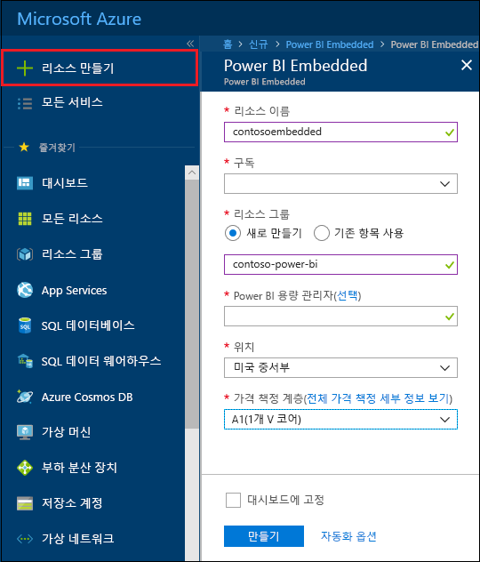

# Azure Portal에서 Power BI Embedded 용량 만들기

이 문서는 Microsoft Azure에서 [Power BI Embedded](azure-pbie-what-is-power-bi-embedded.md) 용량을 만드는 방법을 안내합니다. Power BI Embedded는 뛰어난 시각적 개체, 보고서 및 대시보드를 사용자의 앱에 빠르게 추가할 수 있도록 지원하여 Power BI 기능을 단순화합니다.

Azure 구독이 없는 경우 시작하기 전에 [체험 계정](https://azure.microsoft.com/free/)을 만듭니다.

> [!VIDEO https://www.youtube.com/embed/aXrvFfg_iSk]

## 시작하기 전에

이 빠른 시작을 완료하려면 다음이 필요합니다.

* **Azure 구독:** [Azure 평가판](https://azure.microsoft.com/free/)에 방문하여 계정을 만듭니다.
* **Azure Active Directory:** 구독은 AAD(Azure Active Directory) 테넌트와 연결되어 있어야 합니다. 또한 ***해당 테넌트에 계정이 있는 Azure에 로그인해야 합니다***. Microsoft 계정은 지원되지 않습니다. 자세한 내용은 [인증 및 사용자 권한](https://docs.microsoft.com/azure/analysis-services/analysis-services-manage-users)을 참조하세요.
* **Power BI 테넌트:** AAD 테넌트에서 하나 이상의 계정이 Power BI에 등록되어 있어야 합니다.
* **리소스 그룹:** 이미 있는 리소스 그룹을 사용하거나 [새로 만듭니다](https://docs.microsoft.com/azure/azure-resource-manager/resource-group-overview).

## 용량 만들기

1. [Azure Portal](https://portal.azure.com/)에 로그인합니다.

2. 검색 상자에서 *Power BI Embedded*를 검색합니다.

3. Power BI Embedded 내에서 **만들기**를 선택합니다.

4. 필요한 정보를 입력하고 **만들기**를 선택합니다.

    

    |설정 |설명 |
    |---------|---------|
    |**리소스 이름**|용량을 식별하는 이름입니다. 리소스 이름은 Azure Portal 외에도 Power BI 관리 포털 내에 표시됩니다.|
    |**구독**|용량을 만들려는 구독입니다.|
    |**리소스 그룹**|이 새 용량을 포함하는 리소스 그룹입니다. 기존 리소스 그룹에서 선택하거나 새로 만듭니다. 자세한 내용은 [Azure Resource Manager 개요](https://docs.microsoft.com/azure/azure-resource-manager/resource-group-overview)를 참조하세요.|
    |**Power BI 용량 관리자**|Power BI 용량 관리자는 Power BI 관리 포털에서 용량을 확인하고 다른 사용자에게 할당 권한을 부여할 수 있습니다. 기본적으로 용량 관리자는 사용자 계정입니다. 용량 관리자는 Power BI 테넌트 내에 있어야 합니다.|
    |**위치**|테넌트에 대해 Power BI가 호스팅되는 위치입니다. 기본 위치는 홈 지역이지만 [Multi-Geo 옵션](embedded-multi-geo.md)을 사용하여 위치를 변경할 수 있습니다.
    |**가격 책정 계층**|사용자의 요구를 충족하는 SKU(v 코어 수 및 메모리 크기)를 선택합니다.  자세한 내용은 [Power BI Embedded 가격 책정](https://azure.microsoft.com/pricing/details/power-bi-embedded/)을 참조하세요.|

**모든 서비스** > **Power BI Embedded**로 이동하여 용량이 준비되었는지 확인할 수 있습니다. 또는 알림 섹션 또는 블레이드 내에서 **대시보드에 고정**을 선택하여 대시보드로 이동하여 새 용량을 확인할 수 있습니다.

## 다음 단계

새 Power BI Embedded 용량을 사용하려면 Power BI 관리 포털로 이동하여 작업 영역을 할당합니다. 자세한 내용은 [Power BI Premium 및 Power BI Embedded 내에서 용량 관리](https://powerbi.microsoft.com/documentation/powerbi-admin-premium-manage/)를 참조하세요.

이 용량을 사용할 필요가 없는 경우에는 일시 중지하여 청구를 중단할 수 있습니다. 자세한 내용은 [Azure Portal에서 Power BI Embedded 용량 일시 중지 및 시작](azure-pbie-pause-start.md)을 참조하세요.

애플리케이션 내에서 Power BI 콘텐츠를 포함하려면 [Power BI 대시보드, 보고서 및 타일 포함 방법](https://powerbi.microsoft.com/documentation/powerbi-developer-embedding-content/)을 참조하세요.

궁금한 점이 더 있나요? [Power BI 커뮤니티에 질문합니다.](http://community.powerbi.com/)