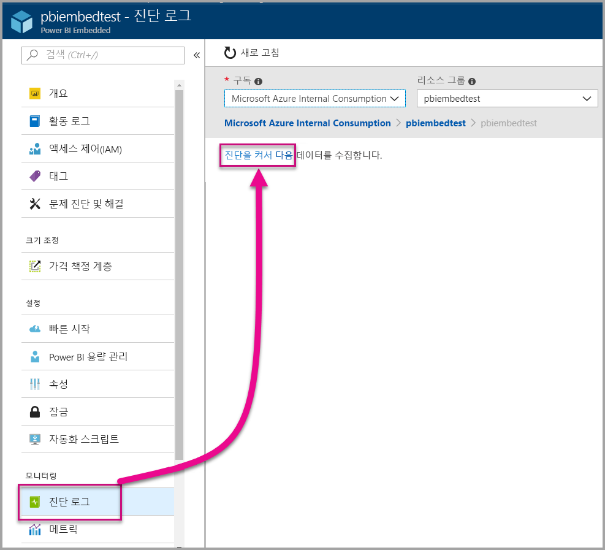
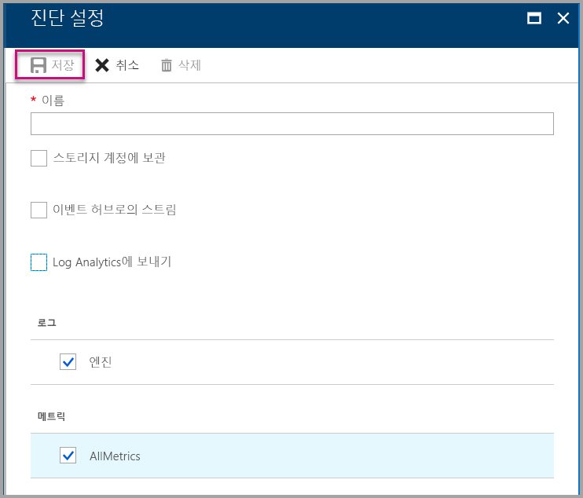
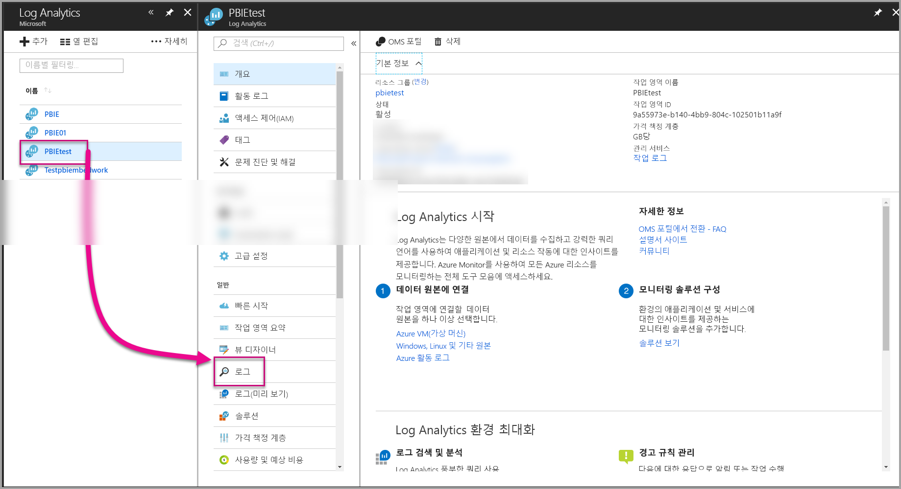
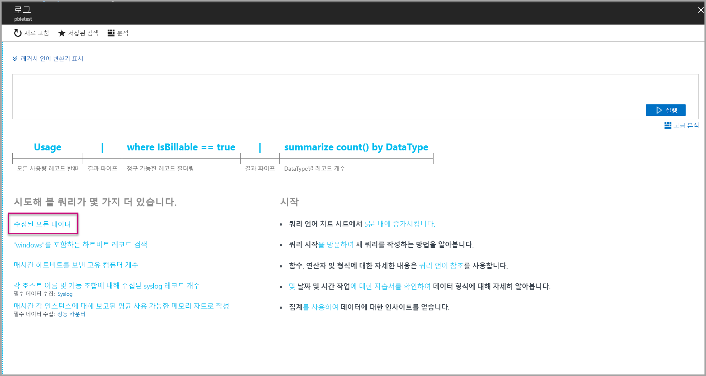
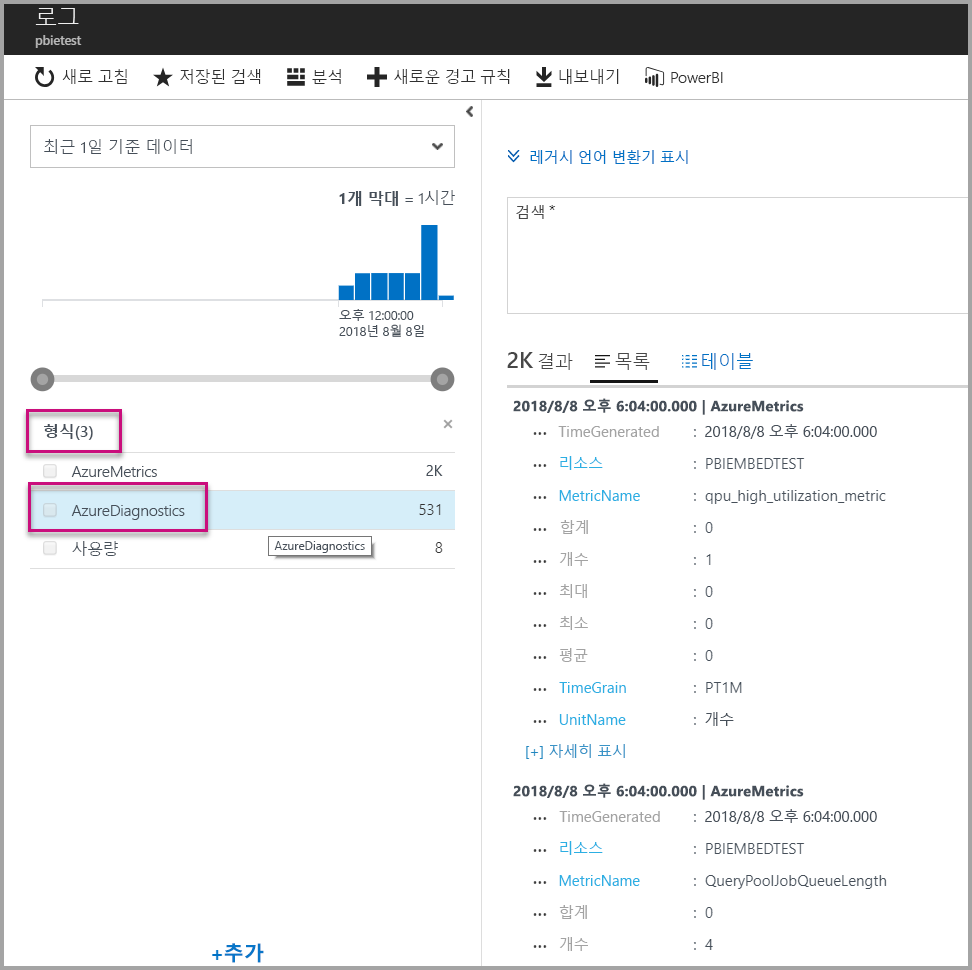
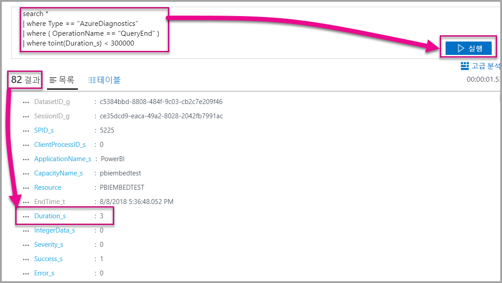

# <a name="diagnostic-logging-for-power-bi-embedded-in-azure"></a>Azure의 Power BI Embedded에 대한 진단 로깅

[Azure 리소스 진단 로그](https://docs.microsoft.com/azure/monitoring-and-diagnostics/monitoring-overview-of-diagnostic-logs)를 사용하면 용량에서 많은 이벤트를 기록하고, 분석 도구에 추가하고, 리소스 동작에 대한 인사이트를 얻을 수 있습니다.

진단을 사용하여 다음과 같은 몇 가지 시나리오에 응답할 수 있습니다.

* 장기 실행 또는 문제가 있는 쿼리 검색.
* 용량 제한에 도달할 때 오류 검색.
* [용량 메트릭](https://powerbi.microsoft.com/blog/power-bi-developer-community-april-update/) 파생.
* 특정 데이터 집합의 사용량 추적.

## <a name="set-up-diagnostics-logging"></a>진단 로깅 설정

### <a name="azure-portal"></a>Azure Portal

1. [Azure Portal](https://portal.azure.com) > Power BI Embedded 리소스에서 왼쪽 탐색에 있는 **진단 로그**를 선택하고 **진단 켜기**를 선택합니다.

    

2. **진단 설정**에서 다음 옵션을 지정합니다.

    * **이름** - 만들 진단 설정의 이름을 입력합니다.

    * **저장소 계정에 보관** - 이 옵션을 사용하려면 기존 저장소 계정에 연결해야 합니다. [저장소 계정 만들기](https://docs.microsoft.com/azure/storage/common/storage-create-storage-account)를 참조하고 지침에 따라 저장소 계정을 만듭니다. 그런 다음, 포털에서 이 페이지로 돌아가서 저장소 계정을 선택합니다. 새로 만들어진 저장소 계정이 드롭다운 메뉴에 나타나는 데 몇 분이 걸릴 수 있습니다. 로그 파일 저장소는 JSON 형식입니다.
    * **이벤트 허브로의 스트림** - 이 옵션을 사용하려면 기존 이벤트 허브 네임스페이스 및 이벤트 허브에 연결해야 합니다. 자세한 내용은 [Azure Portal을 사용하여 이벤트 허브 네임스페이스 및 이벤트 허브 만들기](https://docs.microsoft.com/azure/event-hubs/event-hubs-create)를 참조하세요.
    * **Log Analytics에 보내기** - 이 옵션을 사용하려면 기존 작업 영역을 사용하거나 포털에서 [새 작업 영역을 만드는](https://docs.microsoft.com/azure/log-analytics/log-analytics-quick-collect-azurevm#create-a-workspace) 단계에 따라 새 Log Analytics 작업 영역을 만듭니다. 이 작업에는 기본 제공 분석, 대시보드 및 알림 기능을 제공하는 [Azure Log Analytics](https://docs.microsoft.com/azure/log-analytics/log-analytics-overview)를 이용합니다. Log Analytics를 사용하면 다른 리소스의 추가 데이터를 연결하고 모든 애플리케이션의 리소스 전체에서 데이터의 단일 및 전체 보기를 가져올 수 있습니다. [단일 클릭으로 Power BI](https://docs.microsoft.com/azure/log-analytics/log-analytics-powerbi)에 연결할 수도 있습니다.
    Log Analytics에서 로그를 보는 방법에 대한 자세한 내용은 [Log Analytics의 로그 보기](https://docs.microsoft.com/azure/log-analytics/log-analytics-activity)를 참조하세요.
    * **Engine** - 아래에 [나열된 엔진 이벤트](#whats-logged) 집합을 기록하려면 이 옵션을 선택합니다.
    * **AllMetrics** - [메트릭](https://docs.microsoft.com/azure/analysis-services/analysis-services-monitor#server-metrics)에 자세한 정보 데이터를 저장하려면 이 옵션을 선택합니다. 저장소 계정에 보관할 경우 진단 로그의 보존 기간을 선택할 수 있습니다. 로그는 보존 기간이 만료된 후에 자동 삭제됩니다.

3. **저장**을 선택합니다.

    진단 로그 저장 방법을 변경하려면 이 페이지로 돌아가서 설정을 수정할 수 있습니다.

    

### <a name="using-powershell-to-enable-diagnostics"></a>PowerShell을 사용하여 진단을 사용하도록 설정

PowerShell을 사용하여 메트릭 및 진단 로깅을 사용하도록 설정하려면 다음 명령을 사용합니다.

* 저장소 계정에서 진단 로그의 저장소를 사용하도록 설정하려면 다음 명령을 사용합니다.

    ```powershell
    Set-AzureRmDiagnosticSetting -ResourceId [your resource id] -StorageAccountId [your storage account id] -Enabled $true
    ```
    저장소 계정 ID는 로그를 보내려는 저장소 계정의 리소스 ID입니다.

* 이벤트 허브로 진단 로그 스트리밍을 사용하도록 설정하려면 다음 명령을 사용합니다.

    ```powershell
    Set-AzureRmDiagnosticSetting -ResourceId [your resource id] -ServiceBusRuleId [your service bus rule id] -Enabled $true
    ```
* Azure Service Bus 규칙 ID는 다음 형식의 문자열입니다.

    ```powershell
    {service bus resource ID}/authorizationrules/{key name}
    ```

* Log Analytics 작업 영역으로 진단 로그 보내기를 사용하도록 설정하려면 다음 명령을 사용합니다.

    ```powershell
        Set-AzureRmDiagnosticSetting -ResourceId [your resource id] -WorkspaceId [resource id of the log analytics workspace] -Enabled $true
    ```

* 다음 명령을 사용하여 Log Analytics 작업 영역의 리소스 ID를 얻을 수 있습니다.

    ```powershell
    (Get-AzureRmOperationalInsightsWorkspace).ResourceId
    ```

이러한 매개 변수를 결합하여 여러 출력 옵션을 사용하도록 설정할 수 있습니다.

### <a name="rest-api"></a>REST API

[Azure Monitor REST API를 사용하여 진단 설정을 변경](https://docs.microsoft.com/rest/api/monitor/)하는 방법을 알아봅니다. 

### <a name="resource-manager-template"></a>Resource Manager 템플릿

[Resource Manager 템플릿을 사용하여 리소스 생성 시 진단 설정을 사용하도록 설정](https://docs.microsoft.com/azure/monitoring-and-diagnostics/monitoring-enable-diagnostic-logs-using-template)하는 방법을 알아봅니다.

## <a name="whats-logged"></a>기록된 내용은 무엇인가요?

**Engine** 및/또는 **AllMetrics** 범주를 선택할 수 있습니다.

### <a name="engine"></a>Engine

엔진 범주는 다음 이벤트를 기록하도록 리소스에 지시하고 각 이벤트에는 다음 속성이 있습니다.

|     이벤트 이름     |     이벤트 설명     |
|----------------------------|----------------------------------------------------------------------------------|
|    Audit Login    |    추적이 시작된 후 엔진 이벤트에 대한 모든 새 연결을 기록합니다.    |
|    Session Initialize    |    추적이 시작된 후 모든 세션 초기화 이벤트를 기록합니다.    |
|    Vertipaq Query Begin    |    추적이 시작된 후 모든 VertiPaq SE 쿼리 시작 이벤트를 기록합니다.    |
|    Query Begin    |    추적이 시작된 후 모든 쿼리 시작 이벤트를 기록합니다.    |
|    Query End    |    추적이 시작된 후 모든 쿼리 종료 이벤트를 기록합니다.    |
|    Vertipaq Query End    |    추적이 시작된 후 모든 VertiPaq SE 쿼리 종료 이벤트를 기록합니다.    |
|    Audit Logout    |    추적이 시작된 후 엔진 이벤트의 모든 연결 끊기를 기록합니다.    |
|    오류    |    추적이 시작된 후 모든 엔진 오류 이벤트를 기록합니다.    |

</br>
</br>

| 속성 이름 | Vertipaq Query End Example | 속성 설명 |
|-------------------|---------------------------------------------------------------------------------------------------------------------------------------------------------------------------------------------------------|--------------------------------------------------------------------------------------------------------------------------|
| EventClass | XM_SEQUERY_END | 이벤트 분류에 사용되는 이벤트 클래스입니다. |
| EventSubclass | 0 | 이벤트 하위 클래스는 각 이벤트 클래스에 대한 추가 정보를 제공합니다. (예: 0: VertiPaq Scan) |
| RootActivityId | ff217fd2-611d-43c0-9c12-19e202a94f70 | 루트 활동 ID입니다. |
| CurrentTime | 2018-04-06T18:30:11.9137358Z | 이벤트가 시작된 시간입니다(사용 가능한 경우). |
| StartTime | 2018-04-06T18:30:11.9137358Z | 이벤트가 시작된 시간입니다(사용 가능한 경우). |
| JobID | 0 | 진행할 작업 ID입니다. |
| ObjectID | 464 | 개체 ID |
| ObjectType | 802012 | ObjectType |
| ObjectName | SalesLT Customer | ObjectName |
| ObjectPath | 5eaa550e-06ac-4adf-aba9-dbf0e8fd1527.Model.SalesLT Customer | 개체 경로입니다. 개체의 부모로 시작되는 쉼표로 구분된 부모 목록입니다. |
| ObjectReference | <Object><Table>SalesLT Customer</Table><Model>Model</Model><Database>5eaa550e-06ac-4adf-aba9-dbf0e8fd1527</Database></Object> | 개체 참조입니다. 개체를 설명하는 태그를 사용하여 모든 부모에 대해 XML로 인코딩됩니다. |
| EndTime | 2018-04-06T18:30:11.9137358Z | 이벤트가 끝난 시간입니다. |
| 기간 | 0 | 이벤트에서 사용한 시간(밀리초)입니다. |
| SessionType | 사용자 | 세션 유형(작업을 발생시킨 엔터티)입니다. |
| ProgressTotal | 0 | 총 진행률입니다. |
| IntegerData | 0 | 정수 데이터입니다. |
| Severity | 0 | 예외의 심각도입니다. |
| 성공 | 1 | 1 = 성공. 0 = 실패. (예를 들어 1은 사용 권한 확인이 성공했음을 의미하고, 0은 확인이 실패했음을 의미합니다.) |
| 오류 | 0 | 지정된 이벤트의 오류 번호입니다. |
| TextData | SET DC_KIND=\"AUTO\";  SELECT  [SalesLT Customer (464)].[rowguid (606)] AS [SalesLT Customer (464)$rowguid (606)]  FROM [SalesLT Customer (464)]; [Estimated size (volume marshalling bytes): 850 6800] | 이벤트와 관련된 텍스트 데이터입니다. |
| ConnectionID | 3 | 고유한 연결 ID입니다. |
| DatasetID | 5eaa550e-06ac-4adf-aba9-dbf0e8fd1527 | 사용자의 문이 실행 중인 데이터 집합의 ID입니다. |
| SessionID | 3D063F66-A111-48EE-B960-141DEBDA8951 | 세션 GUID입니다. |
| SPID | 180 | 서버 프로세스 ID입니다. 사용자 세션을 고유하게 식별합니다. 이는 XML/A에서 사용하는 세션 GUID에 해당합니다. |
| ClientProcessID | null | 클라이언트 애플리케이션의 프로세스 ID입니다. |
| ApplicationName | null | 서버에 대한 연결을 만든 클라이언트 애플리케이션의 이름입니다. |
| CapacityName | pbi641fb41260f84aa2b778a85891ae2d97 | Power BI Embedded 용량 리소스의 이름입니다. |
| RequestParameters |  |  |
| RequestProperties |  |  |

### <a name="allmetrics"></a>AllMetrics

**AllMetrics** 옵션을 선택하면 Power BI Embedded 리소스와 함께 사용할 수 있는 모든 메트릭의 데이터가 기록됩니다.

   

## <a name="manage-your-logs"></a>로그 관리

일반적으로 로그는 로깅을 설정한 후 몇 시간 내에 사용할 수 있습니다. 저장소 계정에서 로그를 관리하는 것은 사용자의 책임입니다.

* 표준 Azure 액세스 제어 방법을 사용하여 액세스할 수 있는 사용자를 제한하는 방식으로 로그를 보호합니다.
* 저장소 계정에 더 이상 보존하지 않을 로그를 삭제합니다.
* 보존 기간을 설정해야 하므로, 이전 로그는 저장소 계정에서 삭제됩니다.

## <a name="view-logs-in-log-analytics"></a>Log Analytics에서 로그 보기

메트릭 및 서버 이벤트는 병렬 분석을 위해 Log Analytics에서 xEvents와 통합됩니다. 또한 아키텍처에 있는 진단 로깅 데이터의 전체적인 보기를 제공하는 다른 Azure 서비스의 이벤트를 받도록 Log Analytics를 구성할 수도 있습니다.

Log Analytics에서 진단 데이터를 보려면 아래와 같이 관리 영역 또는 왼쪽 메뉴에서 **로그** 페이지를 엽니다.



이제 데이터 수집을 사용하도록 설정했으므로 **로그**에서 **수집된 모든 데이터**를 선택합니다.



**형식**에서 **AzureDiagnostics**를 선택하고 **적용**을 선택합니다. AzureDiagnostics에는 Engin 이벤트가 포함됩니다. Log Analytics 쿼리는 즉시 만들어집니다.



**EventClass\_s** 또는 이벤트 이름 중 하나를 선택하면 Log Analytics가 쿼리를 계속 생성합니다. 나중에 다시 사용하려면 쿼리를 저장해야 합니다.

수집된 데이터에 대한 향상된 쿼리, 대시보드 및 경고 기능을 포함하는 웹 사이트를 제공하는 [Log Analytics](https://docs.microsoft.com/azure/log-analytics/)를 확인합니다.

### <a name="queries"></a>쿼리

사용할 수 있는 수백 개의 쿼리가 있습니다. 시작하는 몇 가지 방법은 다음과 같습니다. 새 로그 검색 쿼리 언어를 사용하는 방법에 대한 자세한 내용은 [Log Analytics의 로그 검색 이해](https://docs.microsoft.com/azure/log-analytics/log-analytics-log-search)를 참조하세요.

* 완료하는 데 5분(300,000밀리초) 미만이 걸린 쿼리 반환입니다.

    ```
    search *
    | where Type == "AzureDiagnostics"
    | where ( OperationName == "QueryEnd" )
    | where toint(Duration_s) < 300000
    ```

    

* 용량 이름을 식별합니다.

    ```
    search *
    | where ( Type == "AzureDiagnostics" )
    | summarize count() by CapacityName_s 
    ```

    

## <a name="next-steps"></a>다음 단계

Azure 리소스 진단 로깅을 자세히 알아볼 수 있습니다.

> [!div class="nextstepaction"]
> [Azure 리소스 진단 로깅](https://docs.microsoft.com/azure/monitoring-and-diagnostics/monitoring-overview-of-diagnostic-logs)

> [!div class="nextstepaction"]
> [Set-AzureRmDiagnosticSetting](https://docs.microsoft.com/powershell/module/azurerm.insights/Set-AzureRmDiagnosticSetting)