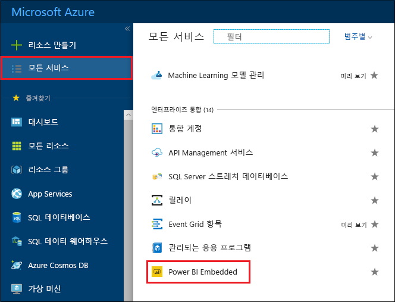
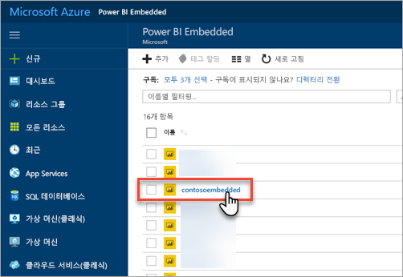
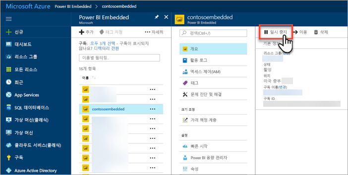
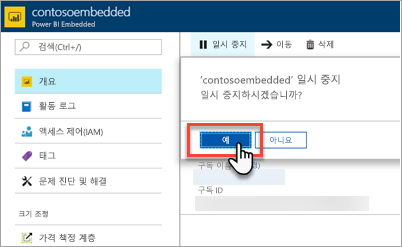
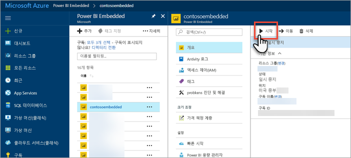
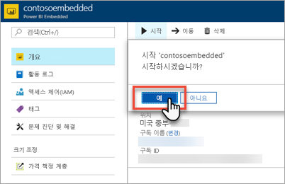

# Azure Portal에서 Power BI Embedded 용량 일시 중지 및 시작

이 아티클은 Microsoft Azure에서 Power BI Embedded 용량을 일시 중지 및 시작하는 방법을 안내합니다. 여기에서는 사용자가 Power BI Embedded 용량을 만들었다고 가정합니다. 아직 만들지 않은 경우 [Azure Portal에서 Power BI Embedded 용량 만들기](azure-pbie-create-capacity.md)를 참조하여 시작하세요.

Azure 구독이 없는 경우 시작하기 전에 [체험 계정](https://azure.microsoft.com/free/)을 만듭니다.

## 용량 일시 중지

용량을 일시 중지하면 비용이 청구되지 않습니다. 일정 기간 동안 해당 용량이 필요하지 않을 경우 용량을 일시 중지하는 것이 좋습니다. 용량을 일시 중지하려면 다음 단계를 사용하세요.

> [!NOTE]
> 용량을 일시 중지하면 Power BI 내에서 콘텐츠를 사용할 수 없게 될 수 있습니다. 중단을 방지하려면 일시 중지 전에 반드시 용량에서 작업 영역 할당을 해제하세요.

1. [Azure Portal](https://portal.azure.com/)에 로그인합니다.

2. **모든 서비스** > **Power BI Embedded**를 선택하여 용량을 확인합니다.

    

3. 일시 중지하려는 용량을 선택합니다.

    

4. 용량 세부 정보 내에서 **일시 중지**를 선택합니다.

    

5. **예**를 선택하여 용량 일시 중지를 확인합니다.

    

## 용량 시작

용량을 시작하여 사용을 재개합니다. 용량을 시작하면 청구도 재개됩니다.

1. [Azure Portal](https://portal.azure.com/)에 로그인합니다.

2. **모든 서비스** > **Power BI Embedded**를 선택하여 용량을 확인합니다.

    

3. 시작할 용량을 선택합니다.

    

4. 용량 세부 정보 내에서 **시작**을 선택합니다.

    

5. **예**를 선택하여 용량 시작을 확인합니다.

    

이 용량에 콘텐츠가 할당되어 있는 경우 일단 시작하면 사용 가능합니다.

## 다음 단계

크기를 확장 또는 축소하려는 경우 참조 [Power BI Embedded 용량 크기 조정](azure-pbie-scale-capacity.md)을 참조하세요.

애플리케이션 내에서 Power BI 콘텐츠를 포함하려면 [Power BI 대시보드, 보고서 및 타일 포함 방법](https://powerbi.microsoft.com/documentation/powerbi-developer-embedding-content/)을 참조하세요.

궁금한 점이 더 있나요? [Power BI 커뮤니티에 질문합니다.](http://community.powerbi.com/)