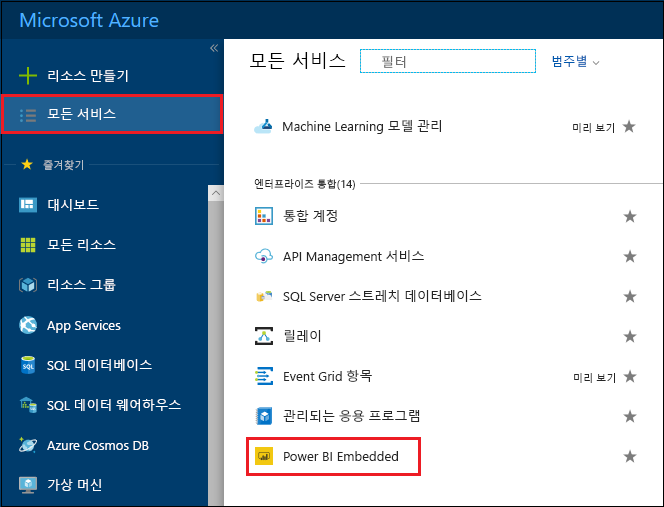
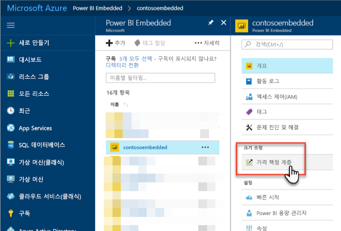
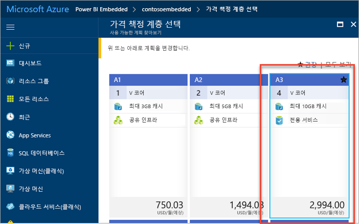
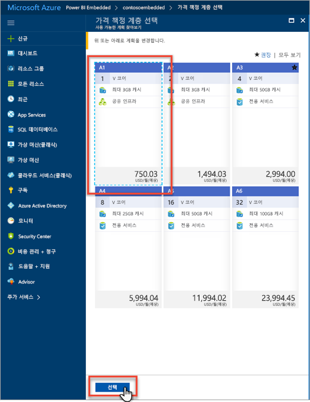
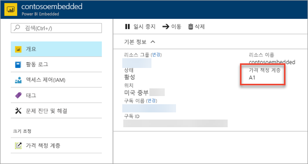

# Azure Portal에서 Power BI Embedded 용량 크기 조정을 참조하세요.

이 아티클은 Microsoft Azure에서 Power BI Embedded 용량 조정 방법을 안내합니다. 크기 조정을 통해 용량의 크기를 늘리거나 줄일 수 있습니다.

여기에서는 사용자가 Power BI Embedded 용량을 만들었다고 가정합니다. 아직 만들지 않은 경우 [Azure Portal에서 Power BI Embedded 용량 만들기](azure-pbie-create-capacity.md)를 참조하여 시작하세요.

> [!NOTE]
> 크기 조정 작업은 약 1 분이 걸릴 수 있습니다. 이 시간 동안 용량은 사용할 수 없습니다. 포함된 콘텐츠를 로드하지 못할 수 있습니다.

## 용량 크기 조정

1. [Azure Portal](https://portal.azure.com/)에 로그인합니다.

2. **모든 서비스** > **Power BI Embedded**를 선택하여 용량을 확인합니다.

    

3. 크기를 조정할 용량을 선택합니다.

    

4. 용량 내 **크기**에서 **가격 책정 계층**을 선택합니다.

    

    현재 가격 책정 계층은 파란색으로 윤곽이 표시되어 있습니다.

    

5. 크기를 확장 또는 축소하려면 이동할 새 계층을 선택합니다. 새 계층을 선택하면 선택 영역 주위에 파란색 점선 윤곽이 표시됩니다. 새 계층으로 크기를 조정하려면 **선택**을 선택합니다.

    

    용량 크기 조정을 완료하는 데 1~2분 정도 걸릴 수 있습니다.

6. 개요 탭을 확인하여 계층을 확인합니다. 현재 가격 책정 계층이 나열됩니다.

    

## 다음 단계

용량을 일시 중지 또는 시작하려면 [Azure Portal에서 Power BI Embedded 용량 일시 중지 및 시작](azure-pbie-pause-start.md)을 참조하세요.

애플리케이션 내에서 Power BI 콘텐츠를 포함하려면 [Power BI 대시보드, 보고서 및 타일 포함 방법](https://powerbi.microsoft.com/documentation/powerbi-developer-embedding-content/)을 참조하세요.

궁금한 점이 더 있나요? [Power BI 커뮤니티에 질문합니다.](http://community.powerbi.com/)
