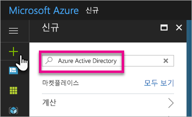
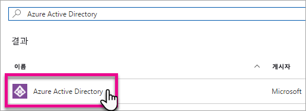
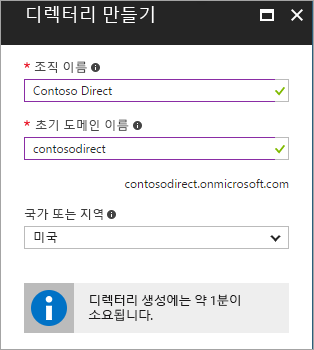
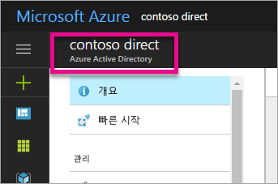
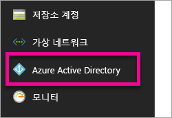
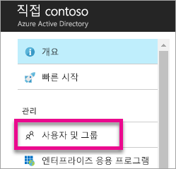
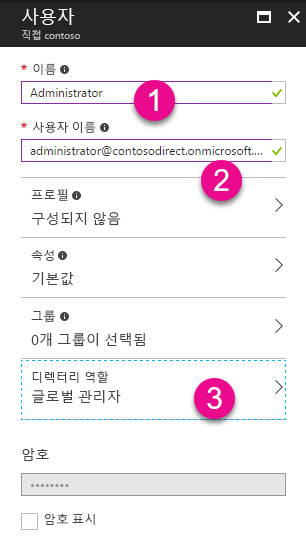
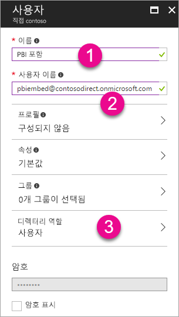
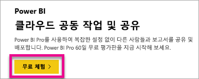

# Power BI에서 사용할 Azure Active Directory 테넌트 만들기

Power BI REST API를 사용하여 사용자 지정 애플리케이션에 사용할 새 Azure AD(Azure Active Directory) 테넌트를 만드는 방법을 알아봅니다.

테넌트는 Azure Active Directory 내에서 조직을 나타냅니다. 이것은 조직이 Azure, Microsoft Intun 또는 Office 365와 같은 Microsoft 클라우드 서비스에 가입할 때 수신하고 소유하는 Azure AD 서비스의 전용 인스턴스입니다. 각 Azure AD 테넌트는 고유하며 다른 Azure AD 테넌트와 별개입니다.

Azure AD 테넌트가 있다면 애플리케이션을 정의하고 애플리케이션에서 Power BI REST API를 사용할 수 있도록 사용 권한을 할당할 수 있습니다.

조직에는 애플리케이션에 사용할 수 있는 Azure AD 테넌트가 이미 있을 수 있습니다. 애플리케이션에 필요한 테넌트를 사용하거나 특별히 애플리케이션에 맞게 새 테넌트를 만들 수 있습니다. 이 문서에서는 새 테넌트를 만드는 방법을 살펴봅니다.

## Azure Active Directory 테넌트 만들기

Power BI를 사용자 지정 애플리케이션에 통합하기 위해서는 Azure AD 내에서 애플리케이션을 정의해야 합니다. 이렇게 하려면 Azure AD 내에 디렉터리가 필요합니다. 바로 테넌트입니다. 조직에서 Power BI 또는 Office 365를 사용하지 않아 아직 테넌트가 없는 경우 [만들어야 합니다](https://docs.microsoft.com/azure/active-directory/develop/active-directory-howto-tenant). 애플리케이션을 조직의 테넌트와 혼합하여 사용하지 않으려는 경우에도 테넌트를 만들어야 할 수 있습니다. 이렇게 하면 격리된 상태를 유지할 수 있습니다.

또는 테스트 용도로 테넌트를 만들려고 할 수 있습니다.

새 Azure AD 테넌트를 만들려면 다음을 수행합니다.

1. [Azure Portal](https://portal.azure.com)로 이동하여 Azure 구독이 있는 계정으로 로그인합니다.

2. **더하기 아이콘(+)** 을 선택하고 *Azure Active Directory*를 검색합니다.

    

3. 검색 결과에서 **Azure Active Directory**를 선택합니다.

    

4. **만들기**를 선택합니다.

5. **초기 도메인 이름**과 함께 **조직에 대한 이름**을 제공합니다. 그런 다음 **만들기**를 선택합니다. 이렇게 하면 디렉터리가 만들어집니다.

    

   > [!NOTE]
   > 초기 도메인은 onmicrosoft.com의 일부가 됩니다. 나중에 다른 도메인 이름을 추가할 수 있습니다. 테넌트의 디렉터리에는 여러 도메인이 할당될 수 있습니다.

6. 디렉터리 만들기를 완료한 후 새 디렉터리를 관리하는 정보 상자를 선택합니다.

디렉터리가 만들어집니다. 다음으로 테넌트에 사용자를 추가하려고 합니다.

## Azure Active Directory 테넌트에서 일부 사용자 만들기

이제 디렉터리가 있으며 두 명 이상의 사용자를 만들어 보겠습니다. 한 명은 테넌트에 대한 전역 관리자가 되고 다른 사용자는 포함할 마스터 사용자가 됩니다. 이것을 서비스 계정으로 간주합니다.

1. Azure Portal 내에서 Azure Active Directory를 사용하고 있는지 확인합니다.

    

    그렇지 않은 경우 왼쪽 서비스 막대에서 Azure Active Directory 아이콘을 선택합니다.

    
2. **관리** 아래에서 **사용자 및 그룹**을 선택합니다.

    
3. **모든 사용자**를 선택한 후 **+ 새 사용자**를 선택합니다.
4. 이 사용자의 이름 및 사용자 이름을 제공합니다. 이 사용자는 테넌트에 대한 전역 관리자가 됩니다. 또한 **디렉터리 역할**을 *전역 관리자*로 변경하려고 합니다. 임시 암호를 표시할 수도 있습니다. 완료되면 **만들기**를 선택합니다.

    

5. 테넌트의 일반 사용자에 대해 동일한 작업을 다시 수행하려고 합니다. 이것은 마스터 포함 계정에 사용할 수도 있습니다. 현재는 **디렉터리 역할**에 대해 *사용자*로 남겨 둡니다. 암호를 기록해 두어야 합니다. 그런 다음 **만들기**를 선택합니다.

    
6. 5단계에서 만든 사용자 계정으로 Power BI에 등록합니다. [powerbi.com](https://powerbi.microsoft.com/get-started/)으로 이동하고 *Power BI - 클라우드 공동 작업 및 공유* 아래에서 **무료 사용해 보기**를 선택하여 이 작업을 수행할 수 있습니다.

    

    등록하면 Power BI Pro를 60일 동안 무료로 사용해보라는 메시지가 표시됩니다. Pro 사용자가 되도록 가입할 수 있습니다. 이제 원하는 경우 임베디드 솔루션 개발을 시작할 수도 있습니다.

   > [!NOTE]
   > 사용자 계정을 제공한 이메일 주소로 등록해야 합니다.

## 다음 단계

이제 Azure AD 테넌트가 있고 이 테넌트를 사용하여 Power BI 내의 항목을 테스트하며 애플리케이션에 포함된 Power BI 대시보드 및 보고서를 앞으로 이동할 수 있습니다. 항목을 포함하는 방법에 대한 자세한 내용은 [Power BI 대시보드, 보고서 및 타일을 포함하는 방법](embedding-content.md)을 참조하세요.

[Azure AD 디렉터리란?](https://docs.microsoft.com/azure/active-directory/active-directory-whatis)  
[Azure Active Directory 테넌트를 가져오는 방법](https://docs.microsoft.com/azure/active-directory/develop/active-directory-howto-tenant)  

궁금한 점이 더 있나요? [Power BI 커뮤니티에 질문합니다.](http://community.powerbi.com/)