# <a name="tutorial-developing-a-power-bi-custom-visual"></a>자습서: Power BI 사용자 지정 시각적 개체 개발

이제 개발자가 사용자 지정 시각적 개체를 Power BI에 쉽게 추가하여 대시보드 및 보고서에서 사용할 수 있습니다. 개발자를 돕기 위해 모든 시각화 관련 코드를 GitHub에 게시했습니다.

또한 시각화 프레임워크와 함께 테스트 도구 모음 및 도구를 제공하여 커뮤니티에서 고품질의 Power BI용 사용자 지정 시각적 개체를 빌드하도록 지원합니다.

이 자습서에서는 원 안에 서식이 지정된 측정값을 표시하기 위해 Circle Card라는 Power BI 사용자 지정 시각적 개체를 개발하는 방법을 보여 줍니다. Circle Card 시각적 개체는 해당 윤곽선의 채우기 색 및 두께를 사용자 지정하도록 지원합니다.

Power BI Desktop 보고서에서 카드는 Circle Card가 되도록 수정됩니다.

  

이 자습서에서는 다음 작업을 수행하는 방법을 알아봅니다.
> [!div class="checklist"]
> * Power BI 사용자 지정 시각적 개체를 만듭니다.
> * D3 시각적 개체 요소를 사용하여 사용자 지정 시각적 개체를 개발합니다.
> * 시각적 개체 요소로 데이터 바인딩을 구성합니다.
> * 데이터 값의 서식을 지정합니다.

## <a name="prerequisites"></a>필수 조건

* 아직 **Power BI Pro**에 등록하지 않은 경우 시작하기 전에 [평가판에 등록](https://powerbi.microsoft.com/en-us/pricing/)합니다.
* [Visual Studio Code](https://www.visualstudio.com/)가 설치되어 있어야 합니다.
* Windows 사용자의 경우 [Windows PowerShell](https://docs.microsoft.com/powershell/scripting/setup/installing-windows-powershell?view=powershell-6) 버전 4 이상이 필요하고, OSX 사용자의 경우 [터미널](https://macpaw.com/how-to/use-terminal-on-mac)이 필요합니다.

## <a name="setting-up-the-developer-environment"></a>개발자 환경 설정

필수 구성 요소 외에도 몇 가지 도구를 추가로 설치해야 합니다.

### <a name="installing-nodejs"></a>node.js 설치

1. Node.js를 설치하려면 웹 브라우저에서 [Node.js](https://nodejs.org)로 이동합니다.

2. 최신 기능 MSI 설치 관리자를 다운로드합니다.

3. 설치 관리자를 실행한 다음, 설치 단계를 따릅니다. 사용권 계약의 약관에 동의하고 기본값을 그대로 사용합니다.

   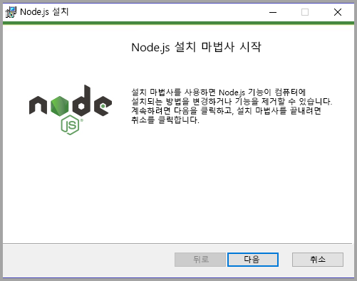

4. 컴퓨터를 다시 시작합니다.

### <a name="installing-packages"></a>패키지 설치

이제 **pbiviz** 패키지를 설치해야 합니다.

1. 컴퓨터를 다시 시작한 후 Windows PowerShell을 엽니다.

2. pbiviz를 설치하려면 다음 명령을 입력합니다.

    ```powershell
    npm i -g powerbi-visuals-tools
    ```

### <a name="creating-and-installing-a-certificate"></a>인증서 만들기 및 설치

#### <a name="windows"></a>Windows

1. 인증서를 만들려면 다음 명령을 입력합니다.

    ```powershell
    pbiviz --create-cert
    ```

  ‘암호’를 생성하는 결과를 반환합니다. 이 경우 *암호*는 **_15105661266553327_** 입니다.

  

2. 이제 인증서를 설치해야 합니다. 인증서를 설치하려면 다음 명령을 입력합니다.

    ```powershell
    pbiviz --install-cert
    ```

3. 인증서 가져오기 마법사에서 저장소 위치가 현재 사용자로 설정되어 있는지 확인합니다. 그러고 나서 ‘다음’을 선택합니다.

      

4. **가져올 파일** 단계에서 ‘다음’을 선택합니다.

5. **개인 키 보호** 단계에서 [암호] 상자에 인증서 만들기에서 받은 암호를 붙여넣습니다.  이 경우 해당 암호는 **_15105661266553327_** 입니다.

      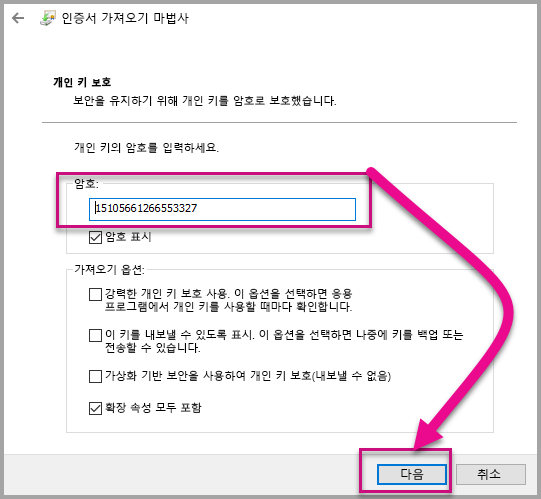

6. **인증서 저장소** 단계에서 **모든 인증서를 다음 저장소에 저장**을 선택합니다. 그런 다음, ‘찾아보기’를 선택합니다.

      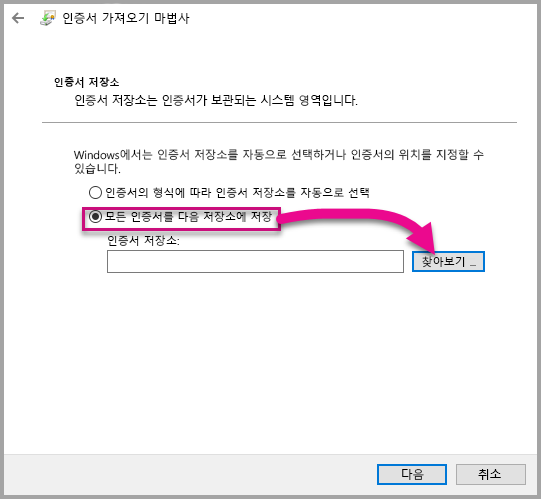

7. **인증서 저장소 선택** 창에서 **신뢰할 수 있는 루트 인증 기관**을 선택한 다음, ‘확인’을 선택합니다. 그런 다음, **인증서 저장소** 화면에서 ‘다음’을 선택합니다.

      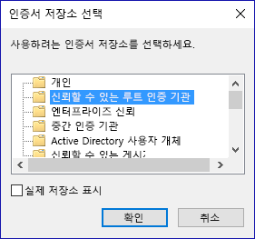

8. 가져오기를 완료하려면 **마침**을 선택합니다.

9. 보안 경고가 표시되면 **예**를 선택합니다.

    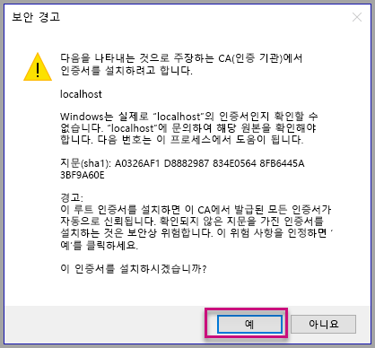

10. 가져오기에 성공했다는 알림이 표시되면 **확인**을 선택합니다.

    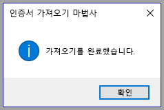

> [!Important]
> Windows PowerShell 세션을 닫지 마세요.

#### <a name="osx"></a>OSX

1. 왼쪽 위의 자물쇠가 잠겨 있으면 이 자물쇠를 선택하여 잠금을 해제합니다. *localhost*를 검색하고 해당 인증서를 두 번 클릭합니다.

    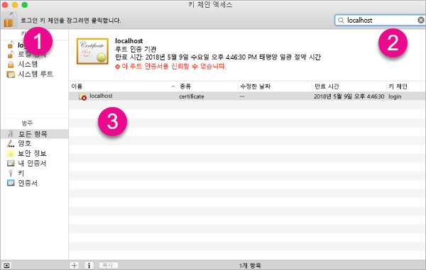

2. **항상 신뢰**를 선택하고 창을 닫습니다.

    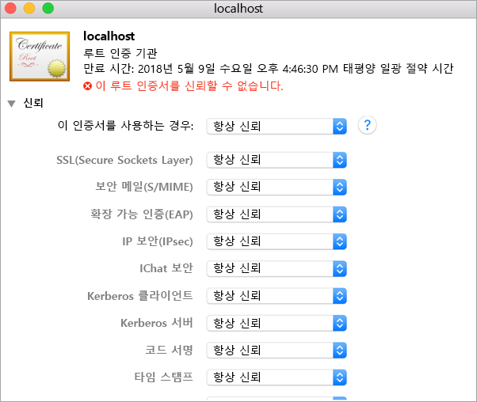

3. 사용자 이름과 암호를 입력 합니다. **설정 업데이트**를 선택합니다.

    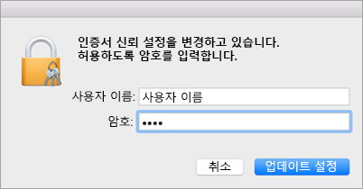

4. 열려 있는 브라우저를 모두 닫습니다.

> [!NOTE]
> 인증서가 인식되지 않으면 컴퓨터를 다시 시작해야 합니다.

## <a name="creating-a-custom-visual"></a>사용자 지정 시각적 개체 만들기

사용자 환경을 설정했으므로 사용자 지정 시각적 개체를 만들어 보겠습니다.

이 자습서의 전체 소스 코드를 [다운로드](https://github.com/Microsoft/PowerBI-visuals-circlecard)할 수 있습니다.

1. Power BI Visual Tools 패키지가 설치되었는지 확인합니다.

    ```powershell
    pbiviz
    ```
    도움말 출력이 표시됩니다.

    <pre><code>
        +syyso+/
    oms/+osyhdhyso/
    ym/       /+oshddhys+/
    ym/              /+oyhddhyo+/
    ym/                     /osyhdho
    ym/                           sm+
    ym/               yddy        om+
    ym/         shho /mmmm/       om+
        /    oys/ +mmmm /mmmm/       om+
    oso  ommmh +mmmm /mmmm/       om+
    ymmmy smmmh +mmmm /mmmm/       om+
    ymmmy smmmh +mmmm /mmmm/       om+
    ymmmy smmmh +mmmm /mmmm/       om+
    +dmd+ smmmh +mmmm /mmmm/       om+
            /hmdo +mmmm /mmmm/ /so+//ym/
                /dmmh /mmmm/ /osyhhy/
                    //   dmmd
                        ++

        PowerBI Custom Visual Tool

    Usage: pbiviz [options] [command]

    Commands:

    new [name]        Create a new visual
    info              Display info about the current visual
    start             Start the current visual
    package           Package the current visual into a pbiviz file
    update [version]  Updates the api definitions and schemas in the current visual. Changes the version if specified
    help [cmd]        display help for [cmd]

    Options:

    -h, --help      output usage information
    -V, --version   output the version number
    --install-cert  Install localhost certificate
    </code></pre>

    <a name="ssl-setup"></a>

2. 지원되는 명령 목록을 포함하여 출력을 검토합니다.

     

3. 사용자 지정 시각적 개체 프로젝트를 만들려면 다음 명령을 입력합니다. **CircleCard**는 프로젝트의 이름입니다.

    ```PowerShell
    pbiviz new CircleCard
    ```
    

4. 프로젝트 폴더로 이동합니다.

    ```powershell
    cd CircleCard
    ```
5. 사용자 지정 시각적 개체를 시작합니다. CircleCard 시각적 개체는 컴퓨터에서 호스트되는 동안 실행 중입니다.

    ```powershell
    pbiviz start
    ```

    

> [!Important]
> Windows PowerShell 세션을 닫지 마세요.

### <a name="testing-the-custom-visual"></a>사용자 지정 시각적 개체 테스트

이 섹션에서는 Power BI Desktop 보고서를 업로드한 후 사용자 지정 시각적 개체를 표시하도록 보고서를 편집하여 CircleCard 사용자 지정 시각적 개체를 테스트해 보겠습니다.

1. [PowerBI.com](https://powerbi.microsoft.com/)에 로그인하고, **기어 아이콘**으로 이동한 다음, **설정**을 선택합니다.

      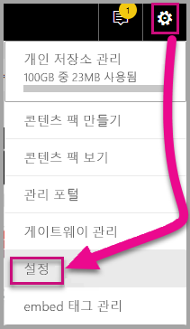

2. **개발자**를 선택한 다음, **테스트용 개발자 시각적 개체 사용** 확인란을 선택합니다.

    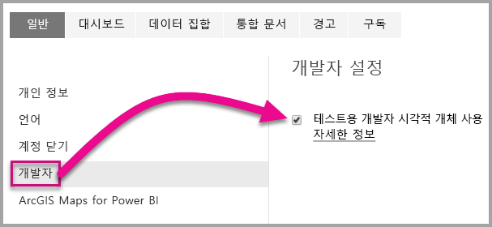

3. Power BI Desktop 보고서를 업로드합니다.  

    데이터 가져오기 > 파일 > 로컬 파일.

    이전에 만들어진 보고서가 없는 경우 샘플 Power BI Desktop 보고서를 [다운로드](https://microsoft.github.io/PowerBI-visuals/docs/step-by-step-lab/images/US_Sales_Analysis.pbix)할 수 있습니다.

    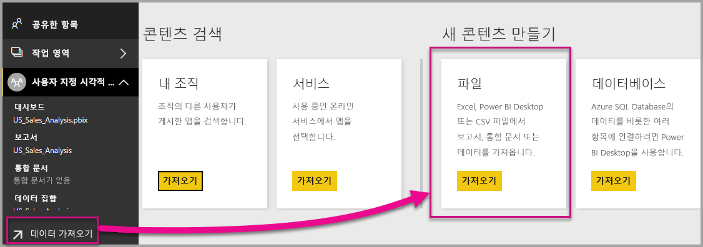 

    보고서를 보려면 왼쪽에 있는 탐색 창의 **보고서** 섹션에서 **US_Sales_Analysis**를 선택합니다.

    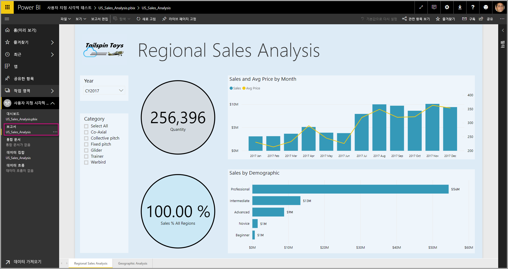

4. 이제 Power BI 서비스에 있는 동안 보고서를 편집해야 합니다.

    **보고서 편집**으로 이동합니다.

    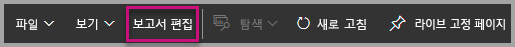

5. **시각화** 창에서 **개발자 시각적 개체**를 선택합니다.

    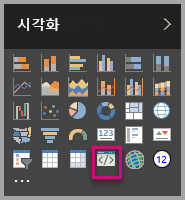

    > [!Note]
    > 이 시각화는 컴퓨터에서 시작한 사용자 지정 시각적 개체를 나타냅니다. 개발자 설정이 사용하도록 설정된 경우에만 사용할 수 있습니다.

6. 시각화가 보고서 캔버스에 추가되었는지 확인합니다.

    

    > [!Note]
    > 이는 Update 메서드가 호출된 횟수를 표시하는 매우 단순한 시각적 개체입니다. 이 단계에서는 시각적 개체는 아직 데이터를 검색하지 않습니다.

7. 보고서에서 새 시각적 개체를 선택하는 동안 [필드] 창으로 이동하고, [판매]를 확장하고, [수량]을 선택합니다.

    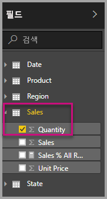

8. 그런 다음, 새 시각적 개체를 테스트하려면 시각적 개체의 크기를 조정하고 업데이트 값이 증가하는지 확인합니다.

    

PowerShell에서 실행 중인 사용자 지정 시각적 개체를 중지하려면 Ctrl+C를 입력합니다. 일괄 작업을 종료하라는 메시지가 표시되면 Y를 입력한 다음, Enter 키를 누릅니다.

## <a name="adding-visual-elements"></a>시각적 요소 추가

이제 **D3 JavaScript 라이브러리**를 설치해야 합니다. D3은 웹 브라우저에서 동적 대화형 데이터 시각화를 생성하기 위한 JavaScript 라이브러리입니다. 이를 통해 널리 구현되는 SVG HTML5 및 CSS 표준을 사용할 수 있습니다.

이제 텍스트가 포함된 원을 표시하는 사용자 지정 시각적 개체를 개발할 수 있습니다.

> [!Note]
> 이 자습서의 많은 텍스트 항목은 [여기](https://github.com/uve/circlecard)에서 복사할 수 있습니다.

1. PowerShell에 **D3 라이브러리**를 설치하려면 아래 명령을 입력합니다.

    ```powershell
    npm i d3@3.5.5 --save
    ```

    

2. **D3 라이브러리**의 형식 정의를 설치하려면 아래 명령을 입력합니다.

    ```powershell
    npm i @types/d3@3.5
    ```

    

    이 명령은 JavaScript 파일을 기반으로 TypeScript 정의를 설치하므로 TypeScript(JavaScript의 상위 집합)에서 사용자 지정 시각적 개체를 개발할 수 있습니다. Visual Studio Code는 TypeScript 애플리케이션 개발에 적합한 IDE입니다.

3. [Visual Studio Code](https://code.visualstudio.com/)를 시작합니다.

    다음 명령을 사용하여 PowerShell에서 **Visual Studio Code**를 시작할 수 있습니다.

    ```powershell
    code .
    ```

4. **탐색기 창**에서 **node_modules** 폴더를 확장하여 **d3 라이브러리**가 설치되었는지 확인합니다.

    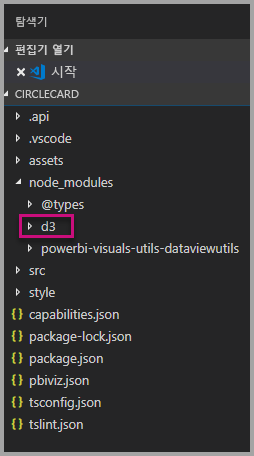

5. **탐색기 창**에서 node_modules > @types > d3을 확장하여 TypeScript 파일 **index.d.ts**를 확인합니다.

    

6. **pbiviz.json** 파일을 선택합니다.

7. **d3 라이브러리**를 등록하려면 externalJS 배열에 다음 파일 참조를 입력합니다. 기존 파일 참조와 새 파일 참조 사이에 ‘쉼표’를 추가해야 합니다.

    ```javascript
    "node_modules/d3/d3.min.js"
    ```
    

8. **pbiviz.json** 파일 변경 내용을 저장합니다.

### <a name="developing-the-visual-elements"></a>시각적 요소 개발

이제 원과 샘플 텍스트를 표시하는 사용자 지정 시각적 개체를 개발하는 방법을 살펴볼 수 있습니다.

1. **탐색기 창**에서 **src** 폴더를 확장한 다음, **visual.ts**를 선택합니다.

    > [!Note]
    > **visual.ts** 파일의 맨 위에 있는 설명을 확인합니다. Power BI 사용자 지정 시각적 개체 패키지를 사용할 권한은 MIT 라이선스의 약관에 따라 무료로 부여됩니다. 계약의 일부로 파일 맨 위에 설명을 남겨 두어야 합니다.

2. Visual 클래스에서 다음 기본 사용자 지정 시각적 개체 논리를 제거합니다.
    * 네 개의 클래스 수준 private 변수 선언.
    * 생성자의 모든 코드 줄.
    * update 메서드의 모든 코드 줄.
    * parseSettings 및 enumerateObjectInstances 메서드를 포함하여 모듈 내의 모든 나머지 줄.

    모듈 코드가 다음과 같은지 확인합니다.

    ```typescript
    module powerbi.extensibility.visual {
    "use strict";
    export class Visual implements IVisual {

        constructor(options: VisualConstructorOptions) {

        }

        public update(options: VisualUpdateOptions) {

            }
        }
    }
    ```

3. *Visual* 클래스 선언 바로 아래에 다음 클래스 수준 속성을 삽입합니다.

    ```typescript
     private host: IVisualHost;
     private svg: d3.Selection<SVGElement>;
     private container: d3.Selection<SVGElement>;
     private circle: d3.Selection<SVGElement>;
     private textValue: d3.Selection<SVGElement>;
     private textLabel: d3.Selection<SVGElement>; 
    ```

    

4. 다음 코드를 ‘생성자’에 추가합니다.

    ```typescript
    this.svg = d3.select(options.element)
                 .append('svg')
                 .classed('circleCard', true);
    this.container = this.svg.append("g")
                         .classed('container', true);
    this.circle = this.container.append("circle")
                             .classed('circle', true);
    this.textValue = this.container.append("text")
                                 .classed("textValue", true);
    this.textLabel = this.container.append("text")
                                 .classed("textLabel", true);
    ```

    이 코드는 시각적 개체 내부에 SVG 그룹을 추가한 다음, 세 개의 셰이프(원 및 두 개의 텍스트 요소)를 추가합니다.

    문서에서 코드의 서식을 지정하려면 **Visual Studio Code 문서**의 아무 곳이나 마우스 오른쪽 단추로 선택한 다음, **문서 서식**을 선택합니다.

      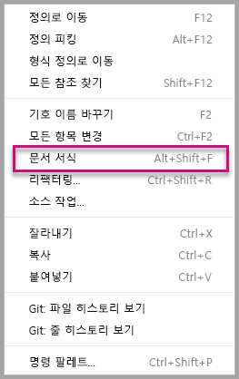

    가독성을 개선하기 위해 코드 조각에 붙여넣을 때마다 문서의 서식을 지정하는 것이 좋습니다.

5. 다음 코드를 *update* 메서드에 추가합니다.

    ```typescript
    let width: number = options.viewport.width;
    let height: number = options.viewport.height;
    this.svg.attr({
     width: width,
     height: height
    });
    let radius: number = Math.min(width, height) / 2.2;
    this.circle
     .style("fill", "white")
     .style("fill-opacity", 0.5)
     .style("stroke", "black")
     .style("stroke-width", 2)
    .attr({
     r: radius,
     cx: width / 2,
     cy: height / 2
    });
    let fontSizeValue: number = Math.min(width, height) / 5;
    this.textValue
     .text("Value")
     .attr({
         x: "50%",
         y: "50%",
         dy: "0.35em",
         "text-anchor": "middle"
     }).style("font-size", fontSizeValue + "px");
    let fontSizeLabel: number = fontSizeValue / 4;
    this.textLabel
     .text("Label")
     .attr({
         x: "50%",
         y: height / 2,
         dy: fontSizeValue / 1.2,
         "text-anchor": "middle"
     })
     .style("font-size", fontSizeLabel + "px");
    ```

    ‘이 코드는 시각적 개체의 너비와 높이를 설정한 다음, 시각적 요소의 속성과 스타일을 초기화합니다.’

6. **visual.ts** 파일을 저장합니다.

7. **capabilities.json** 파일을 선택합니다.

    줄 14에서 전체 objects 요소(줄 14-60)를 제거합니다.

8. **capabilities.json** 파일을 저장합니다.

9. PowerShell에서 사용자 지정 시각적 개체를 시작합니다.

    ```powershell
    pbiviz
    ```

### <a name="toggle-auto-reload"></a>자동 다시 로드 토글

1. Power BI 보고서로 다시 이동합니다.
2. 개발자 시각적 개체 위에서 움직이는 도구 모음에서 **자동 다시 로드 토글**을 선택합니다.

    

    이 옵션을 사용하면 프로젝트 변경 내용을 저장할 때마다 시각적 개체가 자동으로 다시 로드됩니다.

3. **필드 창**에서 **수량** 필드를 개발자 시각적 개체로 끌어옵니다.

4. 시각적 개체가 다음과 같이 표시되는지 확인합니다.

    

5. 시각적 개체 크기를 조정합니다.

    원 및 텍스트 값이 시각적 개체의 사용 가능한 치수에 맞게 조정되는지 확인합니다.

    update 메서드는 시각적 개체의 크기가 조정될 때 지속적으로 호출되며 시각적 요소의 크기를 유동적으로 조정합니다.

    이제 시각적 요소를 개발했습니다.

6. 시각적 개체를 계속 실행합니다.

## <a name="configuring-data-binding"></a>데이터 바인딩 구성

데이터 역할 및 데이터 보기 매핑을 정의한 다음, 사용자 지정 시각적 개체 논리를 수정하여 측정값의 값과 표시 이름을 표시합니다.

### <a name="configuring-the-capabilities"></a>기능 구성

**capabilities.json** 파일을 수정하여 데이터 역할 및 데이터 보기 매핑을 정의합니다.

1. Visual Studio Code의 **capabilities.json** 파일에 있는 **dataRoles** 배열 내부에서 모든 콘텐츠(줄 3-12)를 제거합니다.

2. **dataRoles** 배열 내부에 다음 코드를 삽입합니다.

    ```json
    {
     "displayName": "Measure",
     "name": "measure",
     "kind": "Measure"
    }
    ```
    이제 **dataRoles** 배열은 **measure** 형식의 단일 데이터 역할인 **measure**를 정의하고 **측정값**으로 표시합니다. 이 데이터 역할은 측정값 필드 또는 요약된 필드를 전달할 수 있습니다.

3. **dataViewMappings** 배열 내부에서 모든 콘텐츠(줄 10-31)를 제거합니다.

4. **dataViewMappings** 배열 내부에 다음 콘텐츠를 삽입합니다.

    ```json
            {
            "conditions": [
                { "measure": { "max": 1 } }
            ],
            "single": {
                "role": "measure"
            }
           }
    ```
    이제 **dataViewMappings** 배열은 하나의 필드를 **measure**라는 데이터 역할에 전달할 수 있도록 정의합니다.

5. **capabilities.json** 파일을 저장합니다.

6. Power BI에서 이제 **측정값**을 사용하여 시각적 개체를 구성할 수 있습니다.

    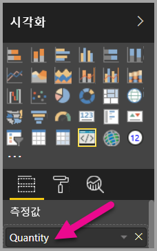

    > [!Note]
    > 시각적 개체 프로젝트에는 아직 데이터 바인딩 논리가 포함되지 않습니다.

### <a name="exploring-the-dataview"></a>데이터 보기 살펴보기

1. 시각적 개체 위에서 움직이는 도구 모음에서 **데이터 보기 표시**를 선택합니다.

    

2. **단일**로 아래로 확장한 다음, 값을 확인합니다.

    

3. **메타데이터**로 아래로 확장한 후 **열** 배열로 확장하고 특히 **format** 및 **displayName** 값을 확인합니다.

    

4. 시각적 개체로 다시 토글하려면 시각적 개체 위에서 움직이는 도구 모음에서 **데이터 보기 표시**를 선택합니다.

    

### <a name="configuring-data-binding"></a>데이터 바인딩 구성

1. **Visual Studio Code**의 **visual.ts** 파일에서 다음 문을 update 메서드의 첫 번째 문으로 추가합니다.

    ```typescript
    let dataView: DataView = options.dataViews[0];
    ```
    

    이 문은 쉽게 액세스할 수 있도록 변수에 *dataView*를 할당하고 *dataView* 개체를 참조하는 변수를 선언합니다.

2. **update** 메서드에서 .text(“Value”)**를 다음으로 바꿉니다.

    ```typescript
    .text(dataView.single.value as string)
    ```
    

3. **update** 메서드에서 **.text(“Label”)** 를 다음으로 바꿉니다.

    ```typescript
    .text(dataView.metadata.columns[0].displayName)
    ```
    

4. **visual.ts** 파일을 저장합니다.

5. **Power BI**에서 이제 값과 표시 이름을 표시하는 시각적 개체를 검토합니다.

이제 데이터 역할을 구성하고 시각적 개체를 데이터 보기에 바인딩했습니다.

다음 자습서에서는 서식 옵션을 사용자 지정 시각적 개체에 추가하는 방법을 알아봅니다.

## <a name="debugging"></a>디버깅

사용자 지정 시각적 개체의 디버깅에 대한 팁은 [디버깅 가이드](https://microsoft.github.io/PowerBI-visuals/docs/how-to-guide/how-to-debug/)를 을 참조하세요.

## <a name="next-steps"></a>다음 단계

> [!div class="nextstepaction"]
> [서식 옵션 추가](custom-visual-develop-tutorial-format-options.md)