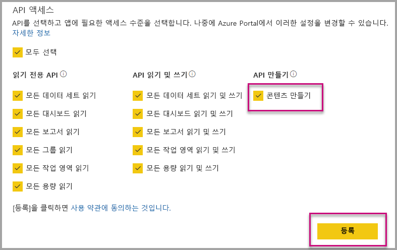

# 조직에 포함할 때 Power BI 앱 자동 설치

앱에서 콘텐츠를 포함하려면 포함하려는 사용자가 [앱에 액세스](../service-create-distribute-apps.md)해야 합니다. 앱이 사용자용으로 설치되면 임베딩이 원활하게 작동합니다. 자세한 내용은 [앱에서 보고서 또는 대시보드 포함](embed-from-apps.md)을 참조하세요. PowerBI.com에서 모든 앱을 [자동으로 설치](https://powerbi.microsoft.com/blog/automatically-install-apps/)할 수 있음을 정의할 수 있습니다. 그러나 이 작업은 테넌트 수준에서 수행되고 모든 앱에 적용됩니다.

## 포함 시 앱 자동 설치

사용자가 앱에 액세스할 수 있지만 앱이 설치되지 않으면 포함이 실패합니다. 따라서 앱에서 포함할 때 이러한 오류를 방지할 수 있으며, 포함 시 앱의 자동 설치를 허용할 수 있습니다. 이 작업은 사용자가 포함하려는 앱이 설치되어 있지 않으면 자동으로 설치됨을 의미합니다. 따라서 원하는 콘텐츠가 즉시 포함되어 사용자에게 원활한 환경을 제공합니다.

## Power BI 사용자(사용자 소유 데이터)를 위한 포함

사용자에게 앱의 자동 설치를 허용하려면 [애플리케이션을 등록](register-app.md#register-with-the-power-bi-application-registration-tool)할 때 애플리케이션에 '콘텐츠 만들기' 권한을 부여하거나 이미 앱을 등록한 경우 추가해야 합니다.

그런 다음, 포함 URL에 앱 ID를 제공해야 합니다. 앱 ID를 제공하려면 앱 작성자가 먼저 앱을 설치한 다음, 지원되는 [Power BI Rest API](https://docs.microsoft.com/rest/api/power-bi/) 호출([보고서 가져오기](https://docs.microsoft.com/rest/api/power-bi/reports/getreports) 또는 [대시보드 가져오기](https://docs.microsoft.com/rest/api/power-bi/dashboards/getdashboards)) 중 하나를 사용해야 합니다. 그런 다음, 앱 작성자는 REST API 응답에서 포함 Url을 가져와야 합니다. 앱에서 가져온 콘텐츠인 경우 URL에 앱 ID가 나타납니다.  포함 URL을 설정한 후에는 이를 사용하여 정기적으로 포함할 수 있습니다.

## 보안 포함

앱의 자동 설치를 사용하려면 앱 작성자는 먼저 앱을 설치한 다음, PowerBI.com의 앱으로 이동하여 보고서를 탐색하고 일반적인 방식으로 링크를 가져와야 합니다. 링크를 사용할 수 있는 앱에 대한 액세스 권한이 있는 다른 모든 사용자는 보고서를 포함할 수 있습니다.

## 고려 사항 및 제한 사항

* 이 시나리오에 대한 보고서와 대시보드만 포함할 수 있습니다.

* 이 기능은 현재 앱 소유 데이터 및 SharePoint 포함 시나리오에서 지원되지 않습니다.