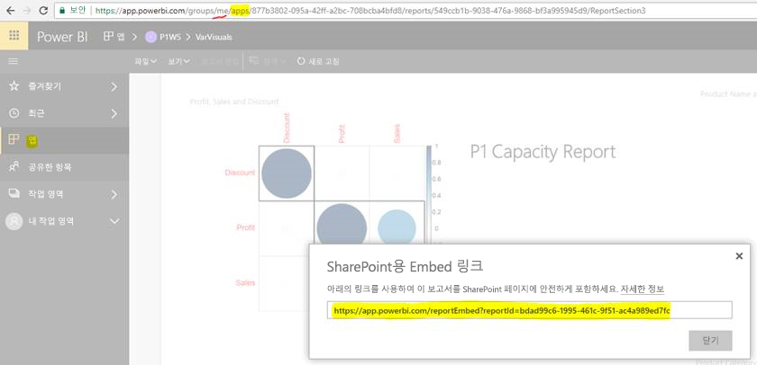

# 앱에서 보고서 또는 대시보드 포함

Power BI에서 앱을 만들어 관련 대시보드 및 보고서를 모두 한곳에 모을 수 있습니다. 그런 다음, 조직의 대규모 사용자 그룹에 게시합니다. 이러한 앱의 사용은 모든 사용자가 Power BI 사용자인 경우에 해당합니다. 따라서 Power BI 앱을 사용하여 콘텐츠를 공유할 수 있습니다. 이 문서에서는 게시된 Power BI 앱의 콘텐츠를 타사 애플리케이션에 포함하는 몇 가지 빠른 단계를 제공합니다.

## 포함할 보고서 embedURL 가져오기

1. 사용자 작업 영역인 **내 작업 영역**에서 애플리케이션을 인스턴스화합니다. 사용자 자신과 공유하거나 다른 사용자가 이 흐름을 진행하도록 안내합니다.

2. Power BI 서비스에서 원하는 보고서를 엽니다.

3. **파일** > **SharePoint Online에 포함**으로 이동하고 보고서 embedURL을 가져옵니다. embedURL 샘플은 아래 스냅숏에 표시됩니다. 또는 GetReports/GetReport REST API를 호출하고 해당 보고서 embedURL 필드를 응답에서 추출할 수 있습니다. 앱이 사용자 작업 영역에서 인스턴스화되었기 때문에 REST 호출에서 URL의 일부로 작업 영역 식별자를 포함하면 안 됩니다.

    

4. 3단계에서 검색된 embedURL을 JavaScript SDK에 사용합니다.

## 포함할 대시보드 embedURL 가져오기

1. 사용자 작업 영역인 **내 작업 영역**에서 애플리케이션을 인스턴스화합니다. 사용자 자신과 공유하거나 다른 사용자가 이 흐름을 진행하도록 안내합니다.

2. GetDashboards REST API를 호출하고 해당 대시보드 embedURL 필드를 응답에서 추출합니다. 앱이 사용자 작업 영역에서 인스턴스화되었기 때문에 REST 호출에서 URL의 일부로 작업 영역 식별자를 포함하면 안 됩니다.

3. 2단계에서 검색된 embedURL을 JavaScript SDK에 사용합니다.

## 다음 단계

타사 고객 및 해당 조직을 위해 앱 작업 영역에서 포함하는 방법을 검토합니다.

> [!div class="nextstepaction"]
>[타사 고객을 위해 포함](embed-sample-for-customers.md)

> [!div class="nextstepaction"]
>[조직에 포함](embed-sample-for-your-organization.md)
