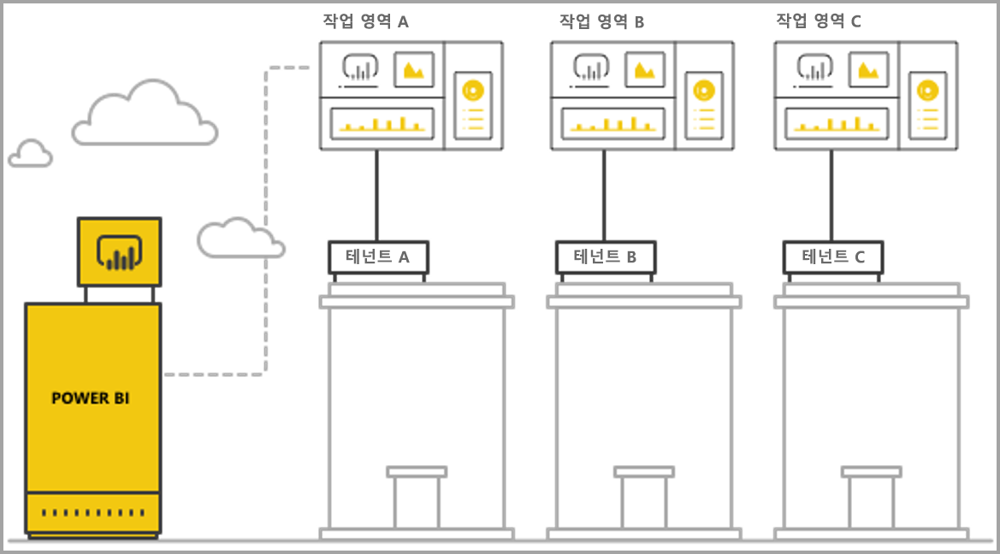
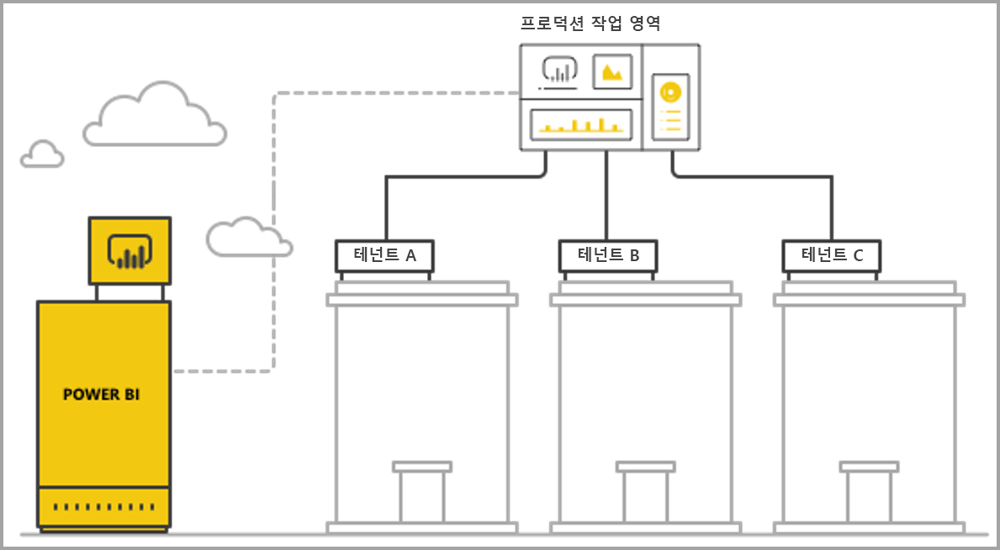

# Power BI 임베디드 분석을 사용하여 다중 테넌트 관리

다중 테넌트 SaaS 애플리케이션을 디자인할 때 SaaS 애플리케이션의 요구에 가장 잘 맞는 테넌트 모델을 신중하게 선택해야 합니다. 이 프로세스는 SaaS 애플리케이션의 임베디드 분석 부분으로 Power BI에 적합합니다. 테넌트 모델에 따라 각 테넌트의 데이터가 Power BI 및 스토리지 계정 내에서 매핑되고, 관리되는 방식이 결정됩니다. 테넌트 모델은 애플리케이션 디자인 및 관리에 영향을 줍니다. 나중에 다른 모델로 전환하면 비용이 많이 들고 작업이 중단될 수 있습니다.

Power BI Embedded를 사용하여 테넌트 간의 분리를 유지 관리하는 두 가지 주요 기본 접근 방식은 다음과 같습니다.

   1. **작업 영역 기반 격리** - 테넌트별 별도 Power BI 작업 영역 만들기.
   2. **행 수준 보안 기반 격리** - 사용자 또는 그룹별로 데이터 액세스를 제어 및 관리하는 데 기본 데이터가 사용되는 경우.

이 문서에서는 다양한 접근 방식을 설명하고 여러 가지 평가 조건에 따라 분석합니다.

## 개념 및 용어

**[AAD](https://docs.microsoft.com/en-us/azure/active-directory/fundamentals/active-directory-whatis)** - Azure Active Directory.

**AAD 애플리케이션** - AAD의 애플리케이션 ID입니다. AAD 애플리케이션은 인증에 필요합니다.

**SaaS 애플리케이션(Software-as-a-Service)** - 일반적으로 온라인 서비스인 엔터프라이즈 또는 ISV에 의해 구현되는 시스템입니다. 여러 고객 테넌트(조직)에 서비스를 제공하기 위한 관련 소프트웨어 서비스이기도 합니다. 이 문서에서 **SaaS 애플리케이션은 Power BI Embedded를 사용하여 다양한 테넌트의 분석을 제공합니다**. 또한 Power BI Embedded는 온라인으로 연결된 모든 유형의 애플리케이션에서 사용할 수 있습니다.

**테넌트** – SaaS 애플리케이션 및 고객이 SaaS 애플리케이션에 제공하는 모든 리소스 또는 데이터를 사용하는 단일 고객(조직)입니다.

**[Power BI](../power-bi-overview.md)** - Power BI Embedded용 플랫폼으로 사용되는 Power BI 클라우드 서비스입니다.

**Power BI 테넌트** - 단일 AAD 테넌트와 연결된 Power BI 리소스 세트입니다.

**[Power BI 작업 영역](../service-create-workspaces.md)** - Power BI에 있는 콘텐츠용 컨테이너입니다.

**Power BI 아티팩트** – Power BI 작업 영역에는 대시보드, 보고서, 데이터 세트 및 데이터 흐름과 같은 여러 가지 Power BI 아티팩트가 있습니다.

**[Power BI Embedded](azure-pbie-what-is-power-bi-embedded.md)** - 개발자가 Power BI를 관리하고 Power BI 요소를 포함하는 애플리케이션을 빌드할 수 있는 공용 API 세트입니다.

**[RLS(행 수준 보안)](embedded-row-level-security.md)** - 테이블의 개별 행 데이터에 대한 사용자 액세스를 제어하는 기능을 제공합니다. 데이터 원본 수준 또는 Power BI 의미 체계 모델에서 행 수준 보안을 구현할 수 있습니다.

**마스터 사용자** - Power BI에서 SaaS 애플리케이션을 나타내고 Power BI API 호출 시 SaaS 애플리케이션이 사용하는 ID입니다. Power BI Pro 라이선스를 가진 AAD 사용자여야 합니다.

**AAD 애플리케이션 사용자(서비스 주체)** - Power BI에서 SaaS 애플리케이션을 나타내고 Power BI API 호출 시 SaaS 애플리케이션이 사용하는 ID입니다. AAD 웹 애플리케이션이어야 합니다. 인증할 ‘마스터’ 사용자 사용을 Power BI로 대체할 수 있습니다.

**용량** - Power BI 서비스를 실행하기 위한 전용 리소스 세트입니다. [Power BI Premium 용량](../service-premium.md)은 Power BI를 내부적으로 사용하는 엔터프라이즈 회사에 적합하지만, [Power BI Embedded 용량](azure-pbie-create-capacity.md)은 제3자를 위한 SaaS 애플리케이션을 개발하는 애플리케이션 개발자에게 적합합니다.

**[Power BI Pro 라이선스](../service-admin-purchasing-power-bi-pro.md)** - 앱 작업 영역에 콘텐츠를 게시하고, 프리미엄 용량 없이 앱을 소비하고, 대시보드를 공유하고, 대시보드 및 보고서를 구독하는 권한을 부여하는 사용자 기반 라이선스입니다.

**[데이터 연결 모드](../desktop-directquery-about.md)** - Power BI에 대한 데이터 원본 연결로, 다양한 모드에서 수행할 수 있습니다.

   * 가져오기 - 데이터를 가져오는 가장 일반적인 방법입니다.
   * DirectQuery - 원본 리포지토리의 데이터에 직접 연결합니다.
   * 라이브 연결 - Analysis Services 데이터(Azure 및 온-프레미스 둘 다)에 직접 연결하는 다른 모드입니다.

## 평가 조건

SaaS 애플리케이션에 적합한 테넌트 모델에 대한 최적의 선택은 특정 비즈니스 및 기술 요구 사항, 데이터 아키텍처 등에 따라 달라집니다. 이러한 요구 사항과 함께 사용할 수 있는 테넌트 모델 옵션 및 장단점을 자세히 파악하면 SaaS 애플리케이션의 강력하고, 성능이 뛰어나고, 비용 효율적이고, 확장성 있는 아키텍처를 정의하는 데 도움이 될 수 있습니다.

다양한 테넌트 모델 중에서 선택할 때 고려할 영역은 다음과 같습니다.

### 데이터 아키텍처

일반적으로 Power BI Embedded를 사용하여 애플리케이션을 빌드하는 개발자는 이미 단일 또는 다중 테넌트 데이터베이스를 사용하고 있습니다. 데이터베이스의 테넌트 모델과 비슷한 Power BI Embedded의 테넌트 모델을 사용하는 것이 더 쉽습니다. 데이터베이스 테넌트 모델이 아직 정의되지 않은 경우에는 데이터 아키텍처를 결정하기 전에 다른 측면을 고려할 수 있습니다.

### 데이터 격리

저장되는 데이터는 얼마나 중요한가요? 다양한 고객 테넌트를 분리하는 데 어떤 수준의 격리가 필요한가요? 대답은 다양한 산업에 따라 또는 특정 요구 사항을 가진 특정 고객에 따라 달라질 수 있습니다.

### 확장성

가장 적합한 솔루션을 찾으려면 예측 가능한 미래에 도달할 규모를 정의하세요. 지금 적합할 수 있는 솔루션이 사용량 및 데이터가 강화될 경우 충분하지 않을 수 있다는 점을 기억하세요. 확장성을 분석하는 경우 다음 목록을 고려합니다.

   * 테넌트(고객) 수
   * 각 테넌트의 보고서, 대시보드 및 데이터 세트 수
   * 각 데이터 세트의 데이터 크기 및 새로 고침 빈도
   * 사용자 수
   * 사용량이 가장 많은 시간의 동시 사용자 수

일부 SaaS 애플리케이션은 고객 수가 적고 사용량이 적지만, 데이터양이 많을 수 있습니다. 다른 SaaS 애플리케이션은 고객이 많고 사용량이 많지만, 각 고객의 데이터 및 보고서 양이 적을 수 있습니다. 이러한 상황에서 높은 수치는 미래 비용 및 운영 복잡성에 영향을 줄 수 있습니다.

### 자동화 및 운영 복잡성

자동화해야 하는 자주 발생하는 프로세스를 식별하세요.

   * 새 테넌트 온보딩 빈도는 얼마나 되나요? 각 테넌트를 완전히 온보딩하는 데 필요한 작업은 무엇인가요?
   * 배포해야 하는 새롭거나 업데이트된 Power BI 콘텐츠의 릴리스 주기는 얼마나 되나요?
   * 각 테넌트에 정의된 행 수준 보안 역할은 몇 개인가요?  

이러한 프로세스 및 프로세스 처리 방법을 식별하면 각 모델을 유지 관리할 때 관련 운영 복잡성을 이해하는 데 도움이 될 수 있습니다.

### 데이터 보존 요구 사항 및 여러 지역 지원의 필요성

Power BI Embedded는 Multi-Geo 배포(미리 보기 기능)를 지원합니다. [Multi-Geo](embedded-multi-geo.md)를 사용하면 특정 콘텐츠가 특정 지역에 보존하도록 할당된 Power BI Embedded 리소스를 여러 지역에 배포할 수 있습니다. 이 기능은 모든 모델에서 사용할 수 있지만, 관리하는 콘텐츠 양과 비용에 영향을 줄 수 있습니다. 현재 Multi-Geo는 데이터 보존 요구 사항을 충족하도록 설계되었으며, 소비자에게 더 가깝게 데이터를 이동하여 성능을 향상하지 않습니다.

### 비용

[Power BI Embedded](https://azure.microsoft.com/en-us/services/power-bi-embedded/)에는 리소스 기반 구매 모델이 있습니다(예: **Power BI Premium**). 컴퓨팅 성능 및 메모리가 고정된 용량을 하나 이상 구매합니다. 이 용량은 **Power BI Embedded**를 사용할 때 발생하는 주요 비용 항목입니다. 용량을 사용하는 사용자 수에는 제한이 없습니다. 유일한 제한은 용량의 성능입니다. [Power BI Pro 라이선스](../service-admin-licensing-organization.md)는 각 ‘마스터’ 사용자에게 필요하거나 Power BI 포털에 액세스해야 하는 특정 사용자에게 필요합니다.

라이브 환경 및 사용량을 시뮬레이트하고 용량에 대한 부하 테스트를 실행하여 용량의 예상 부하를 테스트하고 측정하는 것이 좋습니다. Azure 용량 또는 [프리미엄 용량 메트릭 앱](../service-admin-premium-monitor-capacity.md)에서 제공하는 다양한 메트릭을 사용하여 부하와 성능을 측정할 수 있습니다.

### 콘텐츠 사용자 지정 및 제작

사용자에게 보고서를 편집하고 만들거나 데이터를 흐름의 일부로 서비스에 업로드하는 기능을 제공하는 SaaS 애플리케이션의 두 가지 접근 방식은 다음과 같습니다.

   * [포함된 iFrame의 편집/만들기 모드](https://github.com/Microsoft/PowerBI-JavaScript/wiki/Create-Report-in-Embed-View) - 사용자가 SaaS 애플리케이션 내부에 보고서 보기 또는 새로운 빈 캔버스를 가져옵니다. 이 방법의 경우 Power BI 도구 모음을 사용하여 작업 영역에서 데이터 세트에 따라 콘텐츠를 만들 수 있습니다. 익숙한 환경의 사용자 컨텍스트에 있으므로 이 옵션을 사용하는 것이 좋습니다. 작업과 편집을 더 쉽게 시작할 수 있고, 사용자는 기존 데이터 세트에 연결된 보고서를 만듭니다.

   * Power BI Desktop을 사용하여 콘텐츠를 만들고 SaaS 애플리케이션 UI통해 작업 영역에 업로드합니다. 이 접근 방식에서 사용자는 Power BI Desktop과 연동되는 더 많은 도구를 사용할 수 있습니다. 그러나 사용자가 SaaS 애플리케이션 컨텍스트 외부의 추가 도구를 익혀야 하므로 이 접근 방식은 사용하지 않는 것이 좋습니다. PBIX 파일을 업로드하는 것은 사용자가 작업 영역에 이미 있는 데이터 세트의 중복이 될 수 있는 추가 데이터 세트를 추가하는 것입니다.

## Power BI 작업 영역 기반 격리

Power BI 작업 영역 기반 격리를 통해 SaaS 애플리케이션은 단일 Power BI 테넌트의 여러 테넌트를 지원합니다. 작업 영역 기반 격리는 여러 테넌트가 사용하는 모든 Power BI 콘텐츠를 포함합니다. Power BI 작업 영역 수준에서 여러 작업 영역을 만들어 테넌트를 분리합니다. 각 작업 영역은 해당 테넌트의 관련 데이터 세트, 보고서 및 대시보드를 포함합니다. 또한 각 작업 영역은 해당 테넌트의 데이터에만 연결됩니다. 추가적인 격리가 필요한 경우 각 작업 영역 및 해당 콘텐츠의 ‘마스터’ 사용자 또는 서비스 주체를 만들 수 있습니다.

### 데이터 아키텍처

테넌트 데이터를 관리하는 두 가지 주요 접근 방식은 다음과 같습니다.

* 테넌트별 별도 데이터베이스
* 단일 다중 테넌트 데이터베이스

SaaS 애플리케이션 스토리지가 테넌트별로 별도 데이터베이스를 유지하는 경우 일치하는 데이터베이스를 가리키는 각 데이터 세트의 연결 문자열과 함께 단일 테넌트 데이터 세트를 Power BI에서 사용하는 것은 자연스러운 선택입니다.

SaaS 애플리케이션 스토리지가 모든 테넌트에 다중 테넌트 데이터베이스를 사용하는 경우에는 작업 영역별로 테넌트를 쉽게 분리할 수 있습니다. 관련 테넌트의 데이터만 검색하는 매개 변수화된 데이터베이스 쿼리를 사용하여 Power BI 데이터 세트의 데이터베이스 연결을 구성할 수 있습니다. [Power BI Desktop](../desktop-query-overview.md)을 사용하거나 쿼리에서 [API](https://docs.microsoft.com/rest/api/power-bi/datasets/updatedatasourcesingroup)를 [매개 변수](https://docs.microsoft.com/en-us/rest/api/power-bi/datasets/updateparametersingroup)와 함께 사용하여 연결을 업데이트할 수 있습니다.

### 데이터 격리

이 테넌트 모델의 데이터는 작업 영역 수준에서 분리됩니다. 작업 영역과 테넌트 간에 간단한 매핑을 사용하면 한 테넌트의 사용자가 다른 테넌트의 콘텐츠를 볼 수 없습니다. 단일 ‘마스터’ 사용자를 사용하려면 모든 다른 작업 영역에 대한 액세스 권한이 있어야 합니다. 최종 사용자를 표시할 데이터의 구성은 최종 사용자가 보거나 변경할 수 없는 백 엔드 전용 프로세스인 [포함 토큰 생성](https://docs.microsoft.com/en-us/rest/api/power-bi/embedtoken) 중에 정의됩니다.

격리를 더 추가하기 위해 애플리케이션 개발자는 ‘마스터’ 사용자를 정의하거나 여러 작업 영역에 대한 액세스 권한을 가진 단일 ‘마스터’ 사용자나 애플리케이션이 아닌 작업 영역별 애플리케이션을 정의할 수 있습니다. 이 방법으로 사용자 오류나 자격 증명 유출로 인해 여러 고객의 데이터가 노출되지 않도록 할 수 있습니다.

### 확장성

이 모델의 한 가지 장점은 데이터를 각 테넌트의 여러 데이터 세트로 분리하면 [단일 데이터 세트의 크기 제한](https://docs.microsoft.com/en-us/power-bi/service-premium-large-datasets)(현재는 10GB 용량)이 극복된다는 점입니다. 용량이 오버로드되면 활성 데이터 세트의 메모리를 해제하도록 [미사용 데이터 세트를 제거할 수 있습니다](../service-premium-understand-how-it-works.md). 이 작업은 하나의 대규모 데이터 세트를 사용하여 수행할 수 없습니다. 여러 데이터 세트를 사용하면 필요한 경우 테넌트를 여러 Power BI 용량으로 분리할 수도 있습니다. [용량의 작동 방식을 자세히 알아봅니다](../service-admin-premium-manage.md).

이러한 장점에도 불구하고 SaaS 애플리케이션이 나중에 도달할 수 있는 규모를 고려해야 합니다. 예를 들어 관리할 수 있는 아티팩트 수에 가까운 제한에 도달할 수 있습니다. 자세한 내용은 이 문서의 뒷부분에서 배포 [제한 사항](#summary-comparison-of-the-different-approaches)을 참조하세요. 사용되는 용량 SKU에 따라 데이터 세트를 조정해야 하는 기준 메모리 크기, [동시에 실행할 수 있는 새로 고침 횟수](../service-premium-understand-how-it-works.md) 및 데이터 새로 고침의 최대 빈도에 대한 제한이 추가됩니다. 수백 또는 수천 개의 데이터 세트를 관리하는 경우 테스트하는 것이 좋습니다. 또한 평균 및 최대 사용 볼륨뿐 아니라, 대규모 데이터 세트가 포함된 특정 테넌트, 또는 다른 테넌트와는 다르게 관리되는 다양한 사용 패턴을 고려하는 것이 좋습니다.

### 자동화 및 운영 복잡성

Power BI 작업 영역 기반 격리를 사용하여 애플리케이션 개발자는 수백 또는 수천 개의 아티팩트를 관리해야 할 수 있습니다. 애플리케이션 수명 주기 관리에서 자주 발생하는 프로세스를 정의하고 이 테넌트 모델에서 이러한 작업을 대규모로 수행하기 위한 적합한 도구 세트가 있는지 확인해야 합니다. 일부 예제 작업은 다음과 같습니다.

   * 새 테넌트(고객) 추가
   * 일부 또는 모든 테넌트의 보고서 또는 대시보드 업데이트
   * 일부 또는 모든 테넌트의 데이터 세트 스키마 업데이트
   * 특정 테넌트의 계획되지 않은 사용자 지정
   * 데이터 세트 새로 고침 빈도

예를 들어 새 테넌트의 작업 영역을 만드는 것은 자동화가 필요한 공통 작업입니다. [Power BI REST API](https://docs.microsoft.com/rest/api/power-bi/)를 사용하여 [작업 영역을 만들 때 전체 자동화](https://powerbi.microsoft.com/blog/duplicate-workspaces-using-the-power-bi-rest-apis-a-step-by-step-tutorial/)를 달성할 수 있습니다.

### Multi-Geo 요구 사항

Multi-Geo에서는 원하는 지역에서 용량을 구매하고 해당 용량에 작업 영역을 할당합니다. 여러 지역의 다양한 테넌트를 지원해야 하는 경우 원하는 지역에서 테넌트의 작업 영역을 용량에 할당해야 합니다. 이 작업은 간단한 작업으로, 동일한 용량에 모든 작업 영역을 포함하는 것보다 비용이 크지 않습니다. 그러나 여러 지역에 보존하는 데이터가 필요한 테넌트가 있는 경우에는 해당 작업 영역의 모든 아티팩트를 각 지역 용량에서 복제해야 하므로 비용과 관리 복잡성이 증가합니다.

### 비용

Power BI Embedded를 사용하는 애플리케이션 개발자는 [프로덕션 환경으로 이동하려면 Power BI Embedded 용량을 구매](embed-sample-for-customers.md#move-to-production)해야 합니다.  작업 영역 기반 격리 모델의 영향과 용량에 미치는 영향을 이해해야 합니다.

작업 영역 기반 격리 모델이 용량에 적합한 이유는 다음과 같습니다.

   * 용량에 독립적으로 할당할 수 있는 가장 작은 개체는 보고서 등을 할당할 수 없는 작업 영역이므로, 테넌트를 작업 영역별로 분리하면 완전 유연하게 각 테넌트 및 성능 요구 사항을 관리하고 강화/규모 축소를 통해 용량 사용률을 최적화할 수 있습니다. 예를 들어 높은 볼륨 및 변동성이 포함된 크고 필수적인 테넌트는 별도 용량에서 관리하여 일관된 서비스 수준을 보장하면서, 더 작은 테넌트를 또 다른 용량으로 그룹화하여 비용을 최적화할 수 있습니다.

   * 작업 영역 분리는 하나의 대규모 데이터 세트가 아니라 더 작은 청크에 데이터 모델이 포함될 수 있도록 테넌트 간에 데이터 세트를 분리하는 것이기도 합니다. 이 작업을 통해 용량에서 메모리 사용량을 더 잘 관리할 수 있어 필요하지 않을 때 작은 미사용 데이터 세트를 제거할 수 있고 사용자는 계속해서 성능에 만족할 수 있습니다.

여러 데이터 세트가 있는 경우 새로 고침 프로세스에 추가 용량이 필요할 수 있으므로 애플리케이션 개발자는 병렬 새로 고침 횟수에 대한 제한을 고려해야 합니다.

### 콘텐츠 사용자 지정 및 제작

콘텐츠 만들기 기본 사용 사례의 경우 애플리케이션 개발자는 편집 기능을 제공할 테넌트 및 편집할 수 있는 각 테넌트의 사용자 수를 신중하게 고려해야 합니다. 각 테넌트의 여러 사용자가 편집하도록 허용하면 많은 콘텐츠가 생성될 수 있고, 이로 인해 데이터 세트별 보고서 수 또는 작업 영역의 데이터 세트 수와 같은 데이터 세트 제한에 도달할 수 있습니다. 사용자에게 이 기능을 제공하는 경우 콘텐츠 생성을 밀접하게 모니터링하고 필요한 경우 강화하는 것이 좋습니다. 같은 이유로, 각 사용자가 보고서를 약간 변경하고 스스로 저장할 수 있는 콘텐츠 개인 설정에는 이 기능을 사용하지 않는 것이 좋습니다. SaaS 애플리케이션이 콘텐츠 개인 설정을 허용하는 경우에는 최종 사용자가 새 위치로 이동하여 회사를 떠나거나 플랫폼을 더는 사용하지 않을 때 콘텐츠 삭제 흐름을 용이하게 하도록 사용자별 콘텐츠에 대한 작업 영역 보존 정책을 도입하고 알리는 것이 좋습니다.

## 행 수준 보안 기반 격리

행 수준 보안 기반 격리를 통해 SaaS 애플리케이션은 단일 작업 영역을 사용하여 여러 테넌트를 호스트합니다. 즉, 각 Power BI 아티팩트 보고서, 대시보드 및 데이터 세트는 모든 테넌트가 이를 사용한 후 생성됩니다. 테넌트 간의 데이터 분리는 다중 테넌트 데이터 세트에서 [행 수준 보안](embedded-row-level-security.md)을 사용하여 수행됩니다. 최종 사용자가 SaaS 애플리케이션에 로그인하고 콘텐츠를 열면 사용자가 보도록 허용된 데이터만 보도록 하는 역할 및 필터와 함께 해당 사용자 세션의 포함 토큰이 생성됩니다. 동일한 테넌트의 사용자가 동일한 데이터를 보도록 허용되지 않을 경우 애플리케이션 개발자는 테넌트 간에, 그리고 동일한 테넌트 내에서 모두 계층 구조 역할을 구현해야 합니다.

### 데이터 아키텍처

모든 테넌트의 데이터가 단일 데이터 웨어하우스에 저장된 경우 행 수준 보안 기반 격리를 구현하는 것이 가장 익숙합니다. 이 경우 애플리케이션 개발자는 직접 쿼리 또는 데이터 가져오기를 통해 데이터 웨어하우스에서 Power BI 데이터 세트로 관련 데이터만 전달할 수 있습니다. 데이터베이스의 데이터가 테넌트별로 분리되는 경우에는 데이터를 단일 데이터 세트로 결합해야 합니다. 이렇게 하면 데이터베이스에 있는 테넌트 간에 낮은 정도의 분리가 이루어집니다.

### 데이터 격리

행 수준 보안 기반 격리를 적용하면 데이터 세트에서 [행 수준 보안 정의](embedded-row-level-security.md)를 사용하여 데이터가 분리됩니다. 이는 모든 데이터가 공존함을 의미합니다. 이 형태의 데이터 분리는 개발자 오류를 통한 데이터 유출에 더 취약합니다. 행 수준 보안이 백 엔드에서 수행되고 최종 사용자로부터 보호되더라도, 데이터가 매우 중요하거나 고객이 데이터 분리를 요청하는 경우에는 작업 영역 기반 격리를 사용하는 것이 좋을 수 있습니다.

### 확장성

행 수준 보안 기반 격리를 통해 데이터는 데이터 세트 크기 제한(현재 10GB)에 맞게 조정되어야 합니다. [증분 새로 고침](../service-premium-incremental-refresh.md)이 도입되었고 Power BI 데이터 세트의 XMLA 엔드포인트가 릴리스될 예정이므로 데이터 세트 크기 제한은 크게 증가할 예정입니다. 그러나 데이터는 데이터 새로 고침을 실행할 충분한 잔여 메모리를 포함하여 용량의 메모리에 맞게 조정되어야 합니다. 대규모 배포에서 사용자에게 현재 용량 제한을 초과하는 메모리로 인한 문제가 발생하지 않으려면 큰 용량이 필요합니다. 확장을 처리하는 대체 방법에는 **[집계](../desktop-aggregations.md)** 를 사용하는 방법이나, 모든 데이터를 Power BI 용량에 캐시하지 않고 DirectQuery 또는 라이브 연결을 사용하여 직접 데이터 원본에 연결하는 방법이 포함됩니다.

### 자동화 및 운영 복잡성

테넌트별 버전 대신에, 각 환경(개발/테스트/프로덕션)에는 하나의 아티팩트 버전만 있으므로 작업 영역 기반 격리보다 행 수준 보안 기반 격리를 사용하는 것이 훨씬 더 익숙합니다. 대규모로 아티팩트를 관리한다는 것은 수천 개에서 수십만 개가 아닌 수십 개의 아티팩트를 관리하고 업데이트하는 것입니다.

Power BI에는 RLS 역할 및 규칙을 수정하거나 만들 수 있는 API가 아직 없습니다. Power BI Desktop에서 수동으로 역할을 추가하거나 변경해야 합니다. RLS 계층 구조를 적용해야 하는 경우 신중하게 계획하지 않으면 관리가 복잡하고 오류가 발생하기 쉽습니다.

애플리케이션 개발자가 자주 만들거나 업데이트해야 하는 많은 역할 및 역할 정의를 관리해야 하는 경우 행 수준 보안 기반 격리는 관리 가능성 측면에서 확장성이 없습니다.

또 다른 운영 복잡성은 메모리 사용률을 자세히 모니터링하고 사용자가 원활한 환경을 사용할 수 있도록 강력한 경고 및 확장 메커니즘을 빌드해야 한다는 것입니다.  

### Multi-Geo 요구 사항

모든 데이터는 단일 데이터 세트에 저장되므로 특정 데이터를 특정 위치에 바인딩해야 하는 데이터 보존 요구 사항을 충족하는 것이 어렵습니다. 모든 데이터는 각 지역에 복제 및 저장되므로 여러 지역을 사용하는 비용이 크게 증가할 수도 있습니다. 제한된 수의 테넌트에만 여러 지역에 필요한 경우 위에 설명된 작업 영역 기반 격리 모델을 사용하여 해당 테넌트의 데이터를 다른 지역에서만 유지할 수 있습니다.

### 비용

행 수준 보안 기반 격리를 사용하는 기본 비용 동인은 데이터 세트의 메모리 공간입니다. 데이터 세트를 저장하고 메모리 수요 최대값을 위한 추가 메모리 버퍼를 유지할 충분한 용량이 필요합니다. 이 상황을 완화하는 한 가지 방법은 SQL Server 데이터베이스 또는 SQL Server Analysis Services 큐브에 데이터를 저장하고 직접 쿼리 또는 라이브 연결을 사용하여 실시간으로 데이터 원본에서 데이터를 검색하는 것입니다. 이 접근 방식을 사용하면 데이터 원본 비용이 증가하지만, 메모리 요구 사항으로 인한 큰 용량이 필요하지 않게 되므로 Power BI 용량 비용이 감소합니다.

### 콘텐츠 사용자 지정 및 제작

최종 사용자가 보고서를 편집하거나 만들 때 프로덕션 다중 테넌트 데이터 세트를 사용할 수 있습니다. 이런 이유로, 포함된 [보고서를 만들](https://github.com/Microsoft/PowerBI-JavaScript/wiki/Create-Report-in-Embed-View)거나 편집하는 데는 포함된 iFrame 옵션을 사용해야 합니다. 이 옵션이 행 수준 보안이 적용된 동일한 데이터 세트를 사용하기 때문입니다. 사용자가 추가 데이터 세트와 함께 PBIX 파일을 업로드하는 작업은 행 수준 보안 기반 격리로 관리하기가 어렵고 비용이 많이 들 수 있습니다. 또한 사용자가 동일한 작업 영역에 있는 새 콘텐츠를 생성하는 경우 프로덕션 작업 영역이 한도에 도달하지 않도록 하고 어떤 콘텐츠가 어떤 테넌트에 연결되는지 구분하는 강력한 메커니즘을 빌드해야 합니다.

## 다른 접근 방식의 요약 비교

> [!Important]
> 다음 분석은 제품의 현재 상태를 기반으로 합니다. 월별 주기로 새로운 기능을 릴리스하고 있으므로 계속해서 기존 제한 사항과 약점에 대응하는 새로운 기능을 제공합니다. Microsoft의 월별 블로그 게시물을 확인하여 새로운 기능을 알아보고 이 문서로 돌아와서 새로운 기능이 테넌트 모델 권장 사항에 어떤 영향을 주는지 확인해야 합니다.

| 평가 조건 | 작업 영역 기반   | 행 수준 보안 기반  |  |  |
|--------------------------------------|----------------------------------------------------------------------------------------------------------------------|---------------------------------------------------------------------------------------|---|---|
| 데이터 아키텍처  | 테넌트별 별도 데이터베이스가 있는 경우 가장 쉬움  | 모든 테넌트의 모든 데이터가 단일 데이터 웨어하우스에 있는 경우 가장 쉬움   |  |  |
| 데이터 격리  | 양호. 각 테넌트에는 전용 데이터 세트가 있습니다.  | 보통. 모든 데이터는 동일한 공유 데이터 세트에 있지만, 액세스 제어를 통해 관리됩니다.  |  |  |
| 확장성  | 중간. 데이터를 여러 데이터 세트로 분할하면 최적화가 가능합니다.  | 가장 낮음. 데이터 세트 제한으로 제한됩니다.  |  |  |
| Multi-Geo 요구 사항  | 대부분의 테넌트가 한 지역에만 있는 경우 적합합니다.  | 권장되지 않습니다. 전체 데이터 세트를 여러 지역에 계속 저장해야 합니다.  |  |  |
| 자동화 및 운영 복잡성  | 개별 테넌트에 적합한 자동화입니다.   많은 아티팩트를 대규모로 관리하기에 복잡합니다.  | Power BI 아티팩트를 관리하기 쉽지만 RLS를 대규모로 관리하기에 복잡합니다.  |  |  |
| 비용  | 낮음-중간. 사용률을 최적화하여 테넌트별 비용을 절감할 수 있습니다.  자주 새로 고쳐야 하는 경우 증가할 수 있습니다.  | 가져오기 모드를 사용하는 경우 중간-높음입니다.  직접 쿼리 모드를 사용하는 경우 낮음-보통입니다.  |  |  |
| 콘텐츠 사용자 지정 및 제작  | 적합합니다. 대규모로 제한에 도달할 수 있습니다.  | 포함된 iFrame의 콘텐츠 생성만  |  |  |

## 배포 고려 사항 및 제한 사항

**Power BI 아티팩트 제한:**

* 단일 사용자/애플리케이션이 멤버/관리자일 수 있는 작업 영역 V1(그룹) 수는 250개입니다.
* 단일 사용자/애플리케이션이 멤버/관리자일 수 있는 작업 영역 V2(폴더) 수는 1000개입니다.
* 단일 작업 영역의 데이터 세트 수는 1000개입니다.
* 단일 데이터 세트에 연결된 보고서/대시보드 수는 1000개입니다.
* *.pbix* 파일을 업로드할 데이터 세트 메모리 크기 제한은 10GB입니다.

**Power BI 용량 고려 사항 및 제한 사항:**

* 각 용량은 [구매한 SKU](../service-premium.md)에 따라 할당된 메모리 및 V 코어만 사용할 수 있습니다.
* 각 SKU의 권장 데이터 세트 크기는 [프리미엄 대규모 데이터 세트](../service-premium-large-datasets.md)를 참조하세요.
* 전용 용량의 최대 데이터 세트 크기는 10GB입니다.
* 일별 ‘가져오기 모드’ 데이터 세트의 예약된 새로 고침 횟수는 48회입니다.
* ‘가져오기 모드’ 데이터 세트의 예약된 새로 고침 간 시간은 30분입니다.
* 용량에서 동시에 실행될 수 있는 새로 고침 횟수는 [리소스 관리 및 최적화](../service-premium-understand-how-it-works.md)를 참조하세요.
* 평균 용량 크기 조정 시간은 1~2분 사이입니다. 이 시간 동안 용량을 사용할 수 없습니다. [가동 중지 시간을 피하려면](https://powerbi.microsoft.com/blog/power-bi-developer-community-november-update-2018/#scale-script) 스케일 아웃 접근 방식을 사용하는 것이 좋습니다.

## 다음 단계

* [Power BI를 사용한 임베디드 분석](embedding.md)
* [Power BI Embedded](azure-pbie-what-is-power-bi-embedded.md)
* [Power BI 프리미엄](../service-premium.md)
* [행 수준 보안](embedded-row-level-security.md)