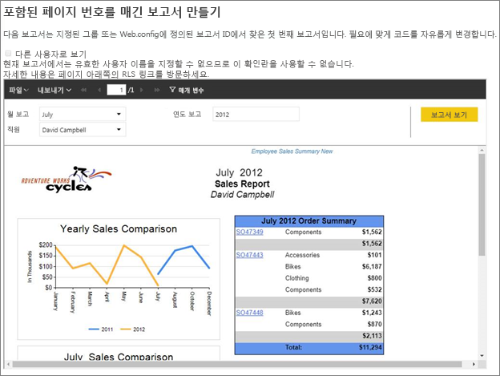
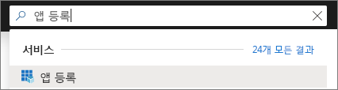
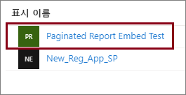
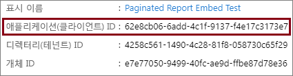
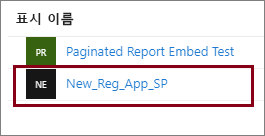
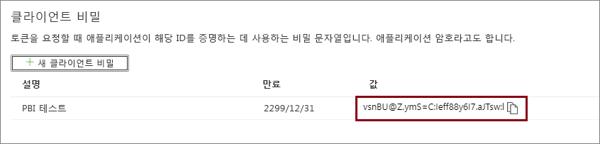

# <a name="tutorial-embed-power-bi-paginated-reports-into-an-application-for-your-customers-preview"></a>자습서:  고객을 위해 애플리케이션에 페이지를 매긴 Power BI 보고서 포함(미리 보기)

**Azure의 Power BI Embedded** 또는 **Office의 Power BI 포함**을 통해 앱 소유 데이터를 사용하여 애플리케이션에 페이지를 매긴 보고서를 포함할 수 있습니다. **앱 소유 데이터**는 해당 임베디드 분석 플랫폼으로 Power BI를 사용하는 애플리케이션을 갖는 것입니다. **ISV** 또는 **개발자**는 사용자에게 Power BI 라이선스를 요구하지 않고도 완벽하게 통합된 대화형 애플리케이션에서 페이지를 매긴 보고서를 표시하는 Power BI 콘텐츠를 만들 수 있습니다. 이 자습서에서는 Power BI JavaScript API와 함께 Power BI .NET SDK를 사용하여 페이지를 매긴 보고서를 애플리케이션에 통합하는 방법을 보여 줍니다.



이 자습서에서는 다음 작업을 수행하는 방법을 알아봅니다.
> [!div class="checklist"]
> * Azure에서 애플리케이션을 등록합니다.
> * 애플리케이션에 페이지를 매긴 Power BI 보고서를 포함합니다.

## <a name="prerequisites"></a>필수 조건

시작하려면 다음이 필요합니다.

* [서비스 주체(앱 전용 토큰)](embed-service-principal.md)
* [Microsoft Azure](https://azure.microsoft.com/) 구독
* 사용자의 [Azure Active Directory 테넌트](create-an-azure-active-directory-tenant.md) 설정
* [페이지를 매긴 보고서](../service-admin-premium-workloads.md#paginated-reports) 워크로드 사용 시 최소 A4 또는 P1 [용량](#create-a-dedicated-capacity)

Azure 구독이 없는 경우 시작하기 전에 [체험 계정](https://azure.microsoft.com/free/?WT.mc_id=A261C142F)을 만듭니다.

> [!IMPORTANT]
> * **서비스 주체**를 사용해야 합니다. 마스터 사용자는 지원되지 않습니다.
> * SSO(Single Sign-On)가 필요한 데이터 원본은 지원되지 않습니다.
> * Power BI 데이터 세트는 [데이터 원본](../service-get-data.md)으로 지원되지 않습니다.

## <a name="set-up-your-power-bi-environment"></a>Power BI 환경 설정

페이지를 매긴 보고서를 포함하려면 전용 용량에 작업 영역을 할당하고 보고서를 작업 영역에 업로드해야 합니다.

### <a name="create-an-app-workspace"></a>앱 작업 영역 만들기

[서비스 주체](embed-service-principal.md)를 사용하여 애플리케이션에 로그인하므로 [새 작업 영역](../service-create-the-new-workspaces.md)을 사용해야 합니다. 또한 *서비스 주체*로서 애플리케이션과 관련된 앱 작업 영역의 관리자 또는 구성원이어야 합니다.

### <a name="create-a-dedicated-capacity"></a>전용 용량 만들기

포함할 페이지를 매긴 보고서를 가져오거나 업로드하기 전에 보고서가 들어 있는 작업 영역을 최소 A4 또는 P1 용량에 할당해야 합니다. 다음과 같은 두 가지 유형의 용량 중에서 선택할 수 있습니다.
* **Power BI Premium** - 페이지를 매긴 보고서를 포함하려면 *P* SKU 용량이 필요합니다. Power BI 콘텐츠를 포함하는 경우 이 솔루션을 *Power BI 포함*이라고 합니다. 이 구독과 관련된 자세한 내용은 [Power BI Premium이란?](../service-premium-what-is.md)을 참조하세요.
* **Azure Power BI Embedded** - [Microsoft Azure Portal](https://portal.azure.com)에서 전용 용량을 구입할 수 있습니다. 이 구독은 *A* SKU를 사용합니다. 페이지를 매긴 보고서를 포함하려면 최소 *A4* 구독이 필요합니다. Power BI Embedded 용량을 만드는 방법에 대한 자세한 내용은 [Azure Portal에서 Power BI Embedded 용량 만들기](azure-pbie-create-capacity.md)를 참조하세요.

아래 표에서는 각 SKU의 리소스 및 한도를 설명합니다. 요구 사항에 가장 적합한 용량을 확인하려면 [내 시나리오를 위해 구입해야 하는 SKU](https://docs.microsoft.com/power-bi/developer/embedded-faq#power-bi-now-offers-three-skus-for-embedding-a-skus-em-skus-and-p-skus-which-one-should-i-purchase-for-my-scenario) 표를 참조하세요.

| 용량 노드 | 총 V 코어 | 백 엔드 V 코어 | RAM(GB) | 프런트 엔드 V 코어 | 
| --- | --- | --- | --- | --- |
| P1/A4 | 8 | 4 | 25 | 4 |
| P2/A5 | 16 | 8 | 50 | 8 |
| P3/A6 | 32 | 16 | 100 | 16 |
| | | | | |

### <a name="assign-an-app-workspace-to-a-dedicated-capacity"></a>전용 용량에 앱 작업 영역 할당

전용 용량을 만들면 해당 전용 용량에 앱 작업 영역을 할당할 수 있습니다.

[서비스 주체](embed-service-principal.md)를 사용하여 작업 영역에 전용 용량을 할당하려면 [Power BI REST API](https://docs.microsoft.com/rest/api/power-bi/capacities/groups_assigntocapacity)를 사용합니다. Power BI REST API를 사용할 때는 [서비스 주체 개체 ID](embed-service-principal.md#how-to-get-the-service-principal-object-id)를 사용해야 합니다.

### <a name="create-and-upload-your-paginated-reports"></a>페이지를 매긴 보고서 만들기 및 업로드

[Power BI 보고서 작성기](../paginated-reports-report-builder-power-bi.md#create-reports-in-power-bi-report-builder)를 사용하여 페이지를 매긴 보고서를 만들고 [서비스에 업로드](../paginated-reports-quickstart-aw.md#upload-the-report-to-the-service)할 수 있습니다.

[Power BI REST API](https://docs.microsoft.com/rest/api/power-bi/imports/postimportingroup)를 사용하여 페이지를 매긴 보고서를 새 작업 영역으로 가져올 수 있습니다.

## <a name="embed-content-using-the-sample-application"></a>샘플 애플리케이션을 사용하여 콘텐츠 포함

이 샘플은 간단한 데모용으로 의도적으로 유지됩니다. 애플리케이션 비밀을 보호하는 것은 사용자 또는 개발자에게 달려 있습니다.

샘플 애플리케이션을 사용하여 콘텐츠 포함을 시작하려면 다음 단계를 수행합니다.

1. [Visual Studio](https://www.visualstudio.com/)(버전 2013 이상)를 다운로드합니다. 최신 [NuGet 패키지](https://www.nuget.org/profiles/powerbi)를 다운로드해야 합니다.

2. GitHub에서 [앱 소유 데이터 샘플](https://github.com/Microsoft/PowerBI-Developer-Samples)을 다운로드하여 시작하세요.

    

3. 샘플 애플리케이션에서 **Web.config** 파일을 엽니다. 애플리케이션을 실행하려면 필드를 입력해야 합니다. **AuthenticationType**에 대해 **ServicePrincipal**을 선택합니다.

    다음 필드를 작성합니다.
    * [applicationId](#application-id)
    * [workspaceId](#workspace-id)
    * [reportId](#report-id)
    * [applicationsecret](#application-secret)
    * [테넌트](#tenant)

    > [!Note]
    > 이 샘플의 기본 **AuthenticationType**은 MasterUser입니다. **ServicePrincipal**로 변경합니다. 


    

### <a name="application-id"></a>애플리케이션 ID

**Azure**의 **애플리케이션 ID**를 사용하여 **applicationId** 정보를 입력합니다. **applicationId**는 응용 프로그램에서 권한을 요청 중인 사용자에게 응용 프로그램을 인식시키는 데 사용됩니다.

**applicationId**를 가져오려면 다음 단계를 수행합니다.

1. [Azure Portal](https://portal.azure.com)에 로그인합니다.

2. 왼쪽 탐색 창에서 **모든 서비스**를 선택하고 **앱 등록**을 검색합니다.

    

3. **applicationId**가 필요한 응용 프로그램을 선택합니다.

    

4. GUID로 나열된 **애플리케이션 ID**가 있습니다. 이 **응용 프로그램 ID**를 애플리케이션의 **applicationId**로 사용합니다.

    

### <a name="workspace-id"></a>작업 영역 ID

Power BI의 앱 작업 영역(그룹) GUID를 사용하여 **workspaceId** 정보를 입력합니다. Power BI 서비스에 로그인하거나 Powershell을 사용할 때 URL에서 이 정보를 가져올 수 있습니다.

URL <br>


Powershell <br>

```powershell
Get-PowerBIworkspace -name "Paginated Report Embed"
```

   

### <a name="report-id"></a>보고서 ID

Power BI의 보고서 GUID를 사용하여 **reportId** 정보를 입력합니다. Power BI 서비스에 로그인하거나 Powershell을 사용할 때 URL에서 이 정보를 가져올 수 있습니다.

URL<br>


Powershell <br>

```powershell
Get-PowerBIworkspace -name "Paginated Report Embed" | Get-PowerBIReport
```


### <a name="application-secret"></a>애플리케이션 암호

**Azure**의 **앱 등록** 섹션에 있는 **키** 섹션에서 **ApplicationSecret** 정보를 입력합니다.

**ApplicationSecret**을 가져오려면 다음 단계를 수행합니다.

1. [Azure Portal](https://portal.azure.com)에 로그인합니다.

2. 왼쪽 탐색 창에서 **모든 서비스**를 선택하고 **앱 등록**을 검색합니다.

    

3. **ApplicationSecret**을 사용해야 하는 애플리케이션을 선택합니다.

    

4. **관리** 아래의 **인증서 및 비밀**을 선택합니다.

5. **새 클라이언트 비밀**을 선택합니다.

6. **설명** 상자에 이름을 입력하고 지속 기간을 선택합니다. 그런 다음, **저장**을 선택하여 애플리케이션의 **값**을 가져옵니다. 키 값을 저장한 후 **키** 창을 닫으면 값 필드가 숨김으로만 표시됩니다. 이때는 키 값을 검색할 수 없습니다. 키 값을 분실한 경우 Azure Portal에서 새 키 값을 만듭니다.

    

### <a name="tenant"></a>테넌트

**테넌트** 정보를 Azure 테넌트 ID로 입력합니다. Power BI 서비스에 로그인하거나 Powershell을 사용할 때 [Azure AD 관리 센터](/onedrive/find-your-office-365-tenant-id)에서 이 정보를 가져올 수 있습니다.

### <a name="run-the-application"></a>애플리케이션 실행

1. **Visual Studio**에서 **실행**을 선택합니다.

    

2. 그런 다음, **보고서 포함**을 선택합니다.

    

3. 이제 애플리케이션 예제에서 보고서를 볼 수 있습니다.

    

## <a name="embed-power-bi-paginated-reports-within-your-application"></a>애플리케이션 내에 페이지를 매긴 Power BI 보고서 포함

페이지를 매긴 Power BI 보고서를 포함하는 단계는 [Power BI REST API](https://docs.microsoft.com/rest/api/power-bi/)를 사용하여 수행되지만 이 문서에 설명된 예제 코드는 **.NET SDK**를 사용하여 만듭니다.

고객용 Power BI 페이지를 매긴 보고서를 애플리케이션 내에 포함하려면 **Azure AD** [서비스 주체](embed-service-principal.md)가 있어야 하며, [Power BI REST API](https://docs.microsoft.com/rest/api/power-bi/)를 호출하기 전에 Power BI 애플리케이션을 위한 [Azure AD 액세스 토큰](get-azuread-access-token.md#access-token-for-non-power-bi-users-app-owns-data)을 가져와야 합니다.

**액세스 토큰**을 사용하여 Power BI 클라이언트를 만들려면 [Power BI REST API](https://docs.microsoft.com/rest/api/power-bi/)와 상호 작용할 수 있는 Power BI 클라이언트 개체를 만듭니다. ***Microsoft.Rest.TokenCredentials*** 개체로 **AccessToken**을 래핑하여 Power BI 클라이언트 개체를 만듭니다.

```csharp
using Microsoft.IdentityModel.Clients.ActiveDirectory;
using Microsoft.Rest;
using Microsoft.PowerBI.Api.V2;

var tokenCredentials = new TokenCredentials(authenticationResult.AccessToken, "Bearer");

// Create a Power BI Client object. it's used to call Power BI APIs.
using (var client = new PowerBIClient(new Uri(ApiUrl), tokenCredentials))
{
    // Your code to embed items.
}
```

### <a name="get-the-paginated-report-you-want-to-embed"></a>포함하려는 페이지를 매긴 보고서 가져오기

Power BI 클라이언트 개체를 사용하여 포함하려는 항목에 대한 참조를 검색할 수 있습니다.

지정된 작업 영역에서 첫 번째 보고서를 검색하는 방법을 보여주는 코드 샘플은 다음과 같습니다.

*포함하려는 보고서, 대시보드 또는 타일에 관계없이 콘텐츠 항목을 가져오는 샘플은 [샘플 애플리케이션](https://github.com/Microsoft/PowerBI-Developer-Samples)의 Services\EmbedService.cs 파일 내에서 사용할 수 있습니다.*

```csharp
using Microsoft.PowerBI.Api.V2;
using Microsoft.PowerBI.Api.V2.Models;

// You need to provide the workspaceId where the dashboard resides.
ODataResponseListReport reports = await client.Reports.GetReportsInGroupAsync(workspaceId);

// Get the first report in the group.
Report report = reports.Value.FirstOrDefault();
```

### <a name="create-the-embed-token"></a>포함 토큰을 만듭니다.

JavaScript API에서 사용할 수 있는 포함 토큰을 생성합니다. 페이지를 매긴 Power BI 보고서를 포함하기 위한 포함 토큰을 만들려면 [보고서 GenerateTokenForCreateInGroup](https://docs.microsoft.com/rest/api/power-bi/embedtoken/reports_generatetokenforcreateingroup) API를 사용합니다.

포함 토큰을 만드는 샘플은 [샘플 애플리케이션](https://github.com/Microsoft/PowerBI-Developer-Samples)의  *Services\EmbedService.cs* 파일 내에서 사용할 수 있습니다.

```csharp
using Microsoft.PowerBI.Api.V2;
using Microsoft.PowerBI.Api.V2.Models;

// Generate Embed Token.
var generateTokenRequestParameters = new GenerateTokenRequest(accessLevel: "view");
EmbedToken tokenResponse = client.Reports.GenerateTokenInGroup(workspaceId, report.Id, generateTokenRequestParameters);

// Generate Embed Configuration.
var embedConfig = new EmbedConfig()
{
    EmbedToken = tokenResponse,
    EmbedUrl = report.EmbedUrl,
    Id = report.Id
};
```

### <a name="load-an-item-using-javascript"></a>JavaScript를 사용하여 항목 로드

JavaScript를 사용하여 페이지를 매긴 보고서를 웹 페이지의 div 요소로 로드합니다.

JavaScript API 사용에 대한 전체 샘플의 경우 [Playground 도구](https://microsoft.github.io/PowerBI-JavaScript/demo)를 사용할 수 있습니다. 플레이그라운드 도구로 다양한 유형의 Power BI Embedded 샘플을 빠르게 재생할 수 있습니다. [PowerBI-JavaScript Wiki](https://github.com/Microsoft/powerbi-javascript/wiki) 페이지를 방문하여 JavaScript API에 대한 추가 정보를 얻을 수도 있습니다.

## <a name="next-steps"></a>다음 단계

이 자습서에서는 고객의 애플리케이션에 페이지를 매긴 Power BI 보고서를 포함하는 방법을 알아보았습니다. 고객용 또는 조직용 Power BI 콘텐츠를 포함할 수도 있습니다.

> [!div class="nextstepaction"]
>[고객용 콘텐츠 포함](embed-sample-for-customers.md)

> [!div class="nextstepaction"]
>[조직용 콘텐츠 포함](embed-sample-for-your-organization.md)

궁금한 점이 더 있나요? [Power BI 커뮤니티에 질문합니다.](https://community.powerbi.com/)
