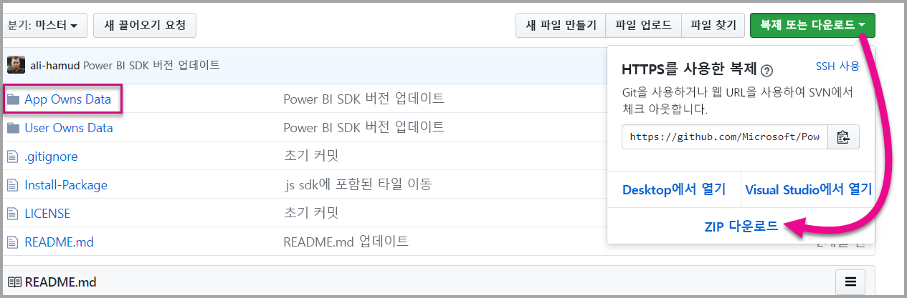

# <a name="tutorial-embed-a-power-bi-content-into-your-application-for-national-clouds"></a>자습서:  내셔널 클라우드용 애플리케이션에 Power BI 콘텐츠 포함

내셔널 클라우드용 비즈니스 프로세스 애플리케이션 내에 분석 콘텐츠를 포함하는 방법을 알아봅니다. Power BI JavaScript API와 함께 Power BI .NET SDK를 사용하여 보고서, 대시보드 또는 타일을 웹 애플리케이션에 포함할 수 있습니다.

Power BI는 [내셔널 클라우드](https://docs.microsoft.com/azure/active-directory/develop/authentication-national-cloud)도 지원합니다.

다른 내셔널 클라우드는 다음과 같습니다.

* 미국 GCC(정부 커뮤니티 클라우드)

* U. S. DoDCON(군용 계약업체)

* U. S. DoD(군대)

* 독일 클라우드용 Power BI

* 중국 클라우드용 Power BI


이 연습을 시작하려면 **Power BI 계정**이 필요합니다. 계정을 설정하지 않은 경우 정부 또는 국가의 유형에 따라 적절한 내셔널 클라우드를 선택할 수 있습니다. [미국 정부 Power BI 계정](../service-govus-signup.md), [독일 클라우드용 Power BI 계정](https://powerbi.microsoft.com/power-bi-germany/?ru=https%3A%2F%2Fapp.powerbi.de%2F%3FnoSignUpCheck%3D1) 또는 [중국 클라우드용 Power BI 계정](https://www.21vbluecloud.com/powerbi/)에 등록할 수 있습니다.

> [!NOTE]
> 대신 조직의 대시보드를 포함하려고 하십니까? [조직의 앱에 대시보드 통합](integrate-dashboard.md)을 참조하세요.

대시보드를 웹앱에 통합하려면 **Power BI** API와 Azure Active Directory(AD) 인증 **액세스 토큰**을 사용하여 대시보드를 가져옵니다. 그런 다음 포함 토큰을 사용하여 대시보드를 로드합니다. **Power BI** API는 특정 **Power BI** 리소스에 대한 프로그래밍 방식 액세스를 제공합니다. 자세한 내용은 [Power BI REST API](https://docs.microsoft.com/rest/api/power-bi/), [Power BI .NET SDK] 및 [Power BI JavaScript API](https://github.com/Microsoft/PowerBI-JavaScript)를 참조하세요.

## <a name="download-the-sample"></a>샘플 다운로드

이 문서는 GitHub의 [앱 소유 데이터 샘플](https://github.com/Microsoft/PowerBI-Developer-Samples)에 사용된 코드를 보여줍니다. 이 연습을 따라 하기 위해 샘플을 다운로드할 수 있습니다. 



* GCC(정부 커뮤니티 클라우드):

    > [!Note]
    > GCC 계정은 P 및 EM 용량만을 지원합니다.

1. GCCCloud.config 콘텐츠로 Cloud.config 파일을 덮어씁니다.

2. Web.config 파일에서 applicationId(네이티브 앱 applicationId), workspaceId, 사용자(마스터 사용자) 및 암호를 업데이트합니다.

3. Web.config 파일에서 다음과 같이 GCC 매개 변수를 추가합니다.

```xml
<add key="authorityUrl" value="https://login.microsoftonline.net/common/" />
<add key="resourceUrl" value="https://analysis.usgovcloudapi.net/powerbi/api" />
<add key="apiUrl" value="https://api.powerbigov.us/" />
<add key="embedUrlBase" value="https://app.powerbigov.us" />
```

* DoDCON(군용 계약업체):

1. TBCloud.config 콘텐츠로 Cloud.config 파일을 덮어씁니다.

2. Web.config 파일에서 applicationId(네이티브 앱 applicationId), workspaceId, 사용자(마스터 사용자) 및 암호를 업데이트합니다.

3. Web.config 파일에서 다음과 같이 DoDCON 매개 변수를 추가합니다.

```xml
<add key="authorityUrl" value="https://login.microsoftonlineS.net/common/" />
<add key="resourceUrl" value="https://high.analysis.usgovcloudapi.net/powerbi/api" />
<add key="apiUrl" value="https://api.high.powerbigov.us/" />
<add key="embedUrlBase" value="https://app.high.powerbigov.us" />
```

* DoD(군대):

1. PFCloud.config 콘텐츠로 Cloud.config 파일을 덮어씁니다.

2. Web.config 파일에서 applicationId(네이티브 앱 applicationId), workspaceId, 사용자(마스터 사용자) 및 암호를 업데이트합니다.

3. Web.config 파일에서 다음과 같이 DoDCON 매개 변수를 추가합니다.

```xml
<add key="authorityUrl" value="https://login.microsoftonline.net/common/" />
<add key="resourceUrl" value="https://mil.analysis.usgovcloudapi.net/powerbi/api" />
<add key="apiUrl" value="https://api.mil.powerbigov.us/" />
<add key="embedUrlBase" value="https://app.mil.powerbigov.us" />
```

* 독일 클라우드용 Power BI 매개 변수

1. Cloud.config 파일을 독일 클라우드용 Power BI 콘텐츠로 덮어씁니다.

2. Web.config 파일에서 applicationId(네이티브 앱 applicationId), workspaceId, 사용자(마스터 사용자) 및 암호를 업데이트합니다.

3. 독일 클라우드용 Power BI 매개 변수를 다음과 같이 web.config 파일에 추가합니다.

```xml
<add key="authorityUrl" value="https://login.microsoftonline.de/common/" />
<add key="resourceUrl" value="https://analysis.cloudapi.de/powerbi/api" />
<add key="apiUrl" value="https://api.powerbi.de/" />
<add key="embedUrlBase" value="https://app.powerbi.de" />
```

* 중국 클라우드용 Power BI 매개 변수

1. Cloud.config 파일을 [중국 클라우드용 Power BI](https://github.com/Microsoft/PowerBI-Developer-Samples/blob/master/App%20Owns%20Data/PowerBIEmbedded_AppOwnsData/CloudConfigs/Power%20BI%20operated%20by%2021Vianet%20in%20China/Cloud.config) 콘텐츠로 덮어씁니다.

2. Web.config 파일에서 applicationId(네이티브 앱 applicationId), workspaceId, 사용자(마스터 사용자) 및 암호를 업데이트합니다.

3. 중국 클라우드용 Power BI 매개 변수를 다음과 같이 web.config 파일에 추가합니다.

```xml
<add key="authorityUrl" value="https://login.chinacloudapi.cn/common/" />
<add key="resourceUrl" value="https://analysis.chinacloudapi.cn/powerbi/api" />
<add key="apiUrl" value="https://api.powerbi.cn/" />
<add key="embedUrlBase" value="https://app.powerbi.cn" />
```

## <a name="step-1---register-an-app-in-azure-ad"></a>1단계 - Azure AD에 앱 등록

REST API 호출을 실행하려면 Azure AD를 사용해 애플리케이션을 등록합니다. 자세한 내용은 [Power BI 콘텐츠를 포함하려면 Azure AD 앱 등록](register-app.md)을 참조하세요. 내셔널 클라우드 소속이 서로 다르기 때문에 애플리케이션을 등록하기 위한 개별 URL이 있습니다.

* GCC(정부 커뮤니티 클라우드) - ```https://app.powerbigov.us/apps```

* DoDCON(군용 계약업체) - ```https://app.high.powerbigov.us/apps```

* DoD(군대) - ```https://app.mil.powerbigov.us/apps```

* 독일 클라우드용 Power BI - ```https://app.powerbi.de/apps```

* 중국 클라우드용 Power BI - ```https://app.powerbi.cn/apps```

[고객에 대한 콘텐츠 포함 샘플](https://github.com/Microsoft/PowerBI-Developer-Samples/tree/master/App%20Owns%20Data)을 다운로드했다면 Azure AD에서 샘플이 인증을 받을 수 있도록 얻은 **applicationId**를 사용합니다. 샘플을 구성하려면 *web.config* 파일에서 **applicationId**를 변경합니다.

## <a name="step-2---get-an-access-token-from-azure-ad"></a>2 단계-Azure AD로 액세스 토큰 가져오기

애플리케이션 내에서 Azure AD에서 **액세스 토큰**을 가져와야 Power BI REST API로 호출할 수 있습니다. 자세한 내용은 [사용자를 인증하고 Power BI 앱에 대한 Azure AD 액세스 토큰 가져오기](get-azuread-access-token.md)를 참조하세요. 내셔널 클라우드 소속이 서로 다르기 때문에 애플리케이션에 대한 액세스 토큰을 가져오기 위한 개별 URL이 있습니다.

* GCC(정부 커뮤니티 클라우드) - ```https://login.microsoftonline.com```

* DoDCON(군용 계약업체) - ```https://login.microsoftonline.us```

* DoD(군대) - ```https://login.microsoftonline.us```

* 독일 클라우드용 Power BI - ```https://login.microsoftonline.de```

* 중국 클라우드용 Power BI - ```https://login.chinacloudapi.cn```

**Controllers\HomeController.cs** 파일의 각 콘텐츠 항목 작업 내에서 이러한 액세스 토큰 예제를 볼 수 있습니다.

## <a name="step-3---get-a-content-item"></a>3 단계-콘텐츠 항목 가져오기

Power BI 콘텐츠를 포함하려면 제대로 포함되었는지 확인하기 위해 몇 가지를 수행해야 합니다. 이러한 모든 단계를 REST API를 사용하여 직접 수행할 수 있지만, 여기에 나오는 샘플 애플리케이션과 예제는 NET SDK를 사용합니다.

### <a name="create-the-power-bi-client-with-your-access-token"></a>액세스 토큰으로 Power BI 클라이언트 만들기

사용자 액세스 토큰을 사용해 사용자는 Power BI API와 상호 작용할 수 있는 Power BI 클라이언트 개체를 만들 수 있습니다. *Microsoft.Rest.TokenCredentials* 개체로 AccessToken을 래핑하여 Power BI 클라이언트 개체를 만듭니다.

```csharp
using Microsoft.IdentityModel.Clients.ActiveDirectory;
using Microsoft.Rest;
using Microsoft.PowerBI.Api.V2;

var tokenCredentials = new TokenCredentials(authenticationResult.AccessToken, "Bearer");

// Create a Power BI Client object. This is used to call the Power BI APIs.
using (var client = new PowerBIClient(new Uri(ApiUrl), tokenCredentials))
{
    // Your code to embed items.
}
```

### <a name="get-the-content-item-you-want-to-embed"></a>포함하려는 콘텐츠 항목 가져오기

Power BI 클라이언트 개체를 사용하여 포함하려는 항목에 참조를 검색할 수 있습니다. 대시보드, 타일 또는 보고서를 포함할 수 있습니다. 다음은 주어진 작업 영역에서 첫 번째 대시보드, 타일 또는 보고서를 검색하는 방법을 보여 주는 예제입니다.

샘플은 [앱 소유 데이터 샘플](https://github.com/Microsoft/PowerBI-Developer-Samples/tree/master/App%20Owns%20Data)의 **Controllers\HomeController.cs**에서 찾을 수 있습니다.

#### <a name="reports"></a>보고서

```csharp
using Microsoft.PowerBI.Api.V2;
using Microsoft.PowerBI.Api.V2.Models;

// You need to provide the workspaceId where the dashboard resides.
ODataResponseListReport reports = client.Reports.GetReportsInGroupAsync(workspaceId);

// Get the first report in the group.
Report report = reports.Value.FirstOrDefault();
```

#### <a name="dashboards"></a>대시보드

```csharp
using Microsoft.PowerBI.Api.V2;
using Microsoft.PowerBI.Api.V2.Models;

// You need to provide the workspaceId where the dashboard resides.
ODataResponseListDashboard dashboards = client.Dashboards.GetDashboardsInGroup(workspaceId);

// Get the first report in the group.
Dashboard dashboard = dashboards.Value.FirstOrDefault();
```

#### <a name="tiles"></a>타일

```csharp
using Microsoft.PowerBI.Api.V2;
using Microsoft.PowerBI.Api.V2.Models;

// To retrieve the tile, you first need to retrieve the dashboard.

// You need to provide the workspaceId where the dashboard resides.
ODataResponseListDashboard dashboards = client.Dashboards.GetDashboardsInGroup(workspaceId);

// Get the first report in the group.
Dashboard dashboard = dashboards.Value.FirstOrDefault();

// Get a list of tiles from a specific dashboard
ODataResponseListTile tiles = client.Dashboards.GetTilesInGroup(workspaceId, dashboard.Id);

// Get the first tile in the group.
Tile tile = tiles.Value.FirstOrDefault();
```

### <a name="create-the-embed-token"></a>포함 토큰을 만듭니다.

JavaScript API를 사용하여 포함 토큰을 생성할 수 있습니다. 포함 토큰은 포함한 항목에 한정됩니다. Power BI 콘텐츠의 구성 요소를 포함하는 경우 이에 대한 새 포함 토큰을 만들어야 합니다. 어떤 **accessLevel**을 사용할지를 포함한 자세한 내용은 [포함 토큰](https://docs.microsoft.com/rest/api/power-bi/embedtoken)을 참조하세요.

> [!IMPORTANT]
> 포함 토큰은 개발자 테스트 전용이므로 Power BI 마스터 계정에서 생성할 수 있는 포함 토큰의 수는 제한적입니다. 프로덕션 포함 시나리오를 위해 [용량을 구입해야](https://docs.microsoft.com/power-bi/developer/embedded-faq#technical) 합니다. 용량을 구입할 때 토큰 생성은 제한 없이 포함시킬 수 있습니다.

샘플은 [조직에 대한 콘텐츠 포함 샘플](https://github.com/Microsoft/PowerBI-Developer-Samples/tree/master/App%20Owns%20Data)의 **Controllers\HomeController.cs** 내에서 찾을 수 있습니다.

**EmbedConfig** 및 **TileEmbedConfig**에 대한 클래스가 만들어집니다. 샘플은 **Models\EmbedConfig.cs** 및 **Models\TileEmbedConfig.cs** 내에서 찾아볼 수 있습니다.

#### <a name="reports"></a>보고서

```csharp
using Microsoft.PowerBI.Api.V2;
using Microsoft.PowerBI.Api.V2.Models;

// Generate Embed Token.
var generateTokenRequestParameters = new GenerateTokenRequest(accessLevel: "view");
EmbedToken tokenResponse = client.Reports.GenerateTokenInGroup(workspaceId, report.Id, generateTokenRequestParameters);

// Generate Embed Configuration.
var embedConfig = new EmbedConfig()
{
    EmbedToken = tokenResponse,
    EmbedUrl = report.EmbedUrl,
    Id = report.Id
};
```

#### <a name="dashboards"></a>대시보드

```csharp
using Microsoft.PowerBI.Api.V2;
using Microsoft.PowerBI.Api.V2.Models;

// Generate Embed Token.
var generateTokenRequestParameters = new GenerateTokenRequest(accessLevel: "view");
EmbedToken tokenResponse = client.Dashboards.GenerateTokenInGroup(workspaceId, dashboard.Id, generateTokenRequestParameters);

// Generate Embed Configuration.
var embedConfig = new EmbedConfig()
{
    EmbedToken = tokenResponse,
    EmbedUrl = dashboard.EmbedUrl,
    Id = dashboard.Id
};
```

#### <a name="tiles"></a>타일

```csharp
using Microsoft.PowerBI.Api.V2;
using Microsoft.PowerBI.Api.V2.Models;

// Generate Embed Token for a tile.
var generateTokenRequestParameters = new GenerateTokenRequest(accessLevel: "view");
EmbedToken tokenResponse = client.Tiles.GenerateTokenInGroup(workspaceId, dashboard.Id, tile.Id, generateTokenRequestParameters);

// Generate Embed Configuration.
var embedConfig = new TileEmbedConfig()
{
    EmbedToken = tokenResponse,
    EmbedUrl = tile.EmbedUrl,
    Id = tile.Id,
    dashboardId = dashboard.Id
};
```

## <a name="step-4---load-an-item-using-javascript"></a>4 단계-JavaScript를 사용하여 항목을 로드합니다.

JavaScript를 사용하여 웹 페이지의 div 요소로 대시보드를 로드합니다. 샘플은 EmbedConfig/TileEmbedConfig 모델을 대시보드, 타일 또는 보고서에 대한 보기와 함께 사용합니다. JavaScript API 사용에 관한 전체 샘플인 경우 [Microsoft Power BI Embedded 샘플](https://microsoft.github.io/PowerBI-JavaScript/demo)을 사용할 수 있습니다.

이 애플리케이션 샘플은 [조직에 대한 콘텐츠 포함 샘플](https://github.com/Microsoft/PowerBI-Developer-Samples/tree/master/App%20Owns%20Data) 내에서 사용할 수 있습니다.

### <a name="viewshomeembeddashboardcshtml"></a>Views\Home\EmbedDashboard.cshtml

```csharp
<script src="~/scripts/powerbi.js"></script>
<div id="dashboardContainer"></div>
<script>
    // Read embed application token from Model
    var accessToken = "@Model.EmbedToken.Token";

    // Read embed URL from Model
    var embedUrl = "@Html.Raw(Model.EmbedUrl)";

    // Read dashboard Id from Model
    var embedDashboardId = "@Model.Id";

    // Get models. models contains enums that can be used.
    var models = window['powerbi-client'].models;

    // Embed configuration used to describe the what and how to embed.
    // This object is used when calling powerbi.embed.
    // This also includes settings and options such as filters.
    // You can find more information at https://github.com/Microsoft/PowerBI-JavaScript/wiki/Embed-Configuration-Details.
    var config = {
        type: 'dashboard',
        tokenType: models.TokenType.Embed,
        accessToken: accessToken,
        embedUrl: embedUrl,
        id: embedDashboardId
    };

    // Get a reference to the embedded dashboard HTML element
    var dashboardContainer = $('#dashboardContainer')[0];

    // Embed the dashboard and display it within the div container.
    var dashboard = powerbi.embed(dashboardContainer, config);
</script>
```

### <a name="viewshomeembedtilecshtml"></a>Views\Home\EmbedTile.cshtml

```csharp
<script src="~/scripts/powerbi.js"></script>
<div id="tileContainer"></div>
<script>
    // Read embed application token from Model
    var accessToken = "@Model.EmbedToken.Token";

    // Read embed URL from Model
    var embedUrl = "@Html.Raw(Model.EmbedUrl)";

    // Read tile Id from Model
    var embedTileId = "@Model.Id";

    // Read dashboard Id from Model
    var embedDashboardId = "@Model.dashboardId";

    // Get models. models contains enums that can be used.
    var models = window['powerbi-client'].models;

    // Embed configuration used to describe the what and how to embed.
    // This object is used when calling powerbi.embed.
    // This also includes settings and options such as filters.
    // You can find more information at https://github.com/Microsoft/PowerBI-JavaScript/wiki/Embed-Configuration-Details.
    var config = {
        type: 'tile',
        tokenType: models.TokenType.Embed,
        accessToken: accessToken,
        embedUrl: embedUrl,
        id: embedTileId,
        dashboardId: embedDashboardId
    };

    // Get a reference to the embedded tile HTML element
    var tileContainer = $('#tileContainer')[0];

    // Embed the tile and display it within the div container.
    var tile = powerbi.embed(tileContainer, config);
</script>
```

### <a name="viewshomeembedreportcshtml"></a>Views\Home\EmbedReport.cshtml

```csharp
<script src="~/scripts/powerbi.js"></script>
<div id="reportContainer"></div>
<script>
    // Read embed application token from Model
    var accessToken = "@Model.EmbedToken.Token";

    // Read embed URL from Model
    var embedUrl = "@Html.Raw(Model.EmbedUrl)";

    // Read report Id from Model
    var embedReportId = "@Model.Id";

    // Get models. models contains enums that can be used.
    var models = window['powerbi-client'].models;

    // Embed configuration used to describe the what and how to embed.
    // This object is used when calling powerbi.embed.
    // This also includes settings and options such as filters.
    // You can find more information at https://github.com/Microsoft/PowerBI-JavaScript/wiki/Embed-Configuration-Details.
    var config = {
        type: 'report',
        tokenType: models.TokenType.Embed,
        accessToken: accessToken,
        embedUrl: embedUrl,
        id: embedReportId,
        permissions: models.Permissions.All,
        settings: {
            filterPaneEnabled: true,
            navContentPaneEnabled: true
        }
    };

    // Get a reference to the embedded report HTML element
    var reportContainer = $('#reportContainer')[0];

    // Embed the report and display it within the div container.
    var report = powerbi.embed(reportContainer, config);
</script>
```

## <a name="next-steps"></a>다음 단계

* 검토하기 위한 샘플 애플리케이션은 GitHub에서 사용할 수 있습니다. 위의 예제는 이 샘플을 기반으로 하고 있습니다. 자세한 내용은 [조직에 대한 콘텐츠 포함 샘플](https://github.com/Microsoft/PowerBI-Developer-Samples/tree/master/App%20Owns%20Data)을 참조하세요.

* JavaScript API에 대한 자세한 내용은 [Power BI JavaScript API](https://github.com/Microsoft/PowerBI-JavaScript)를 참조하세요.

* 독일 클라우드용 Power BI에 대한 자세한 내용은 [독일 클라우드용 Power BI FAQ](https://docs.microsoft.com/power-bi/service-govde-faq)를 참조하세요.

* [Power BI 작업 영역 컬렉션 콘텐츠를 Power BI로 마이그레이션하는 방법](migrate-from-powerbi-embedded.md)

고려 사항 및 제한 사항

궁금한 점이 더 있나요? [Power BI 커뮤니티에 질문합니다.](https://community.powerbi.com/)
