# <a name="tutorial-embed-a-power-bi-report-dashboard-or-tile-into-an-application-for-your-customers"></a>자습서: Power BI 보고서, 대시보드 또는 타일을 고객의 응용 프로그램에 포함
**Azure의 Power BI Embedded**를 통해 **앱 소유 데이터**를 사용하여 응용 프로그램에 보고서, 대시보드 또는 타일을 포함할 수 있습니다. **앱 소유 데이터**는 해당 임베디드 분석 플랫폼으로 Power BI를 사용하는 응용 프로그램을 갖는 것입니다. 이는 일반적으로 **ISV 개발자** 시나리오입니다. **ISV 개발자**로서, 응용 프로그램 사용자가 Power BI 라이선스를 가질 필요가 없고, 내부적으로 Power BI임을 아는 경우에도 응용 프로그램에서 보고서, 대시보드 또는 타일을 표시하며 완벽하게 통합되고, 대화형인 Power BI 콘텐츠를 만들 수 있습니다. 이 자습서에서는 **앱 소유 데이터**를 사용하는 고객에 대해 **Azure의 Power BI Embedded**를 사용하는 경우 **Power BI** JavaScript API와 함께 **Power BI** .NET SDK를 사용하여 보고서를 응용 프로그램에 통합하는 방법을 보여 줍니다.

이 자습서에서는 다음 작업을 수행하는 방법을 알아봅니다.
>[!div class="checklist"]
>* Azure에서 응용 프로그램을 등록합니다.
>* 응용 프로그램에 Power BI 보고서를 포함합니다.

## <a name="prerequisites"></a>필수 조건
시작하려면 사용자의 **마스터 계정**인 **Power BI Pro** 계정 및 **Microsoft Azure** 구독이 필요합니다.

* 아직 **Power BI Pro**에 등록하지 않은 경우 시작하기 전에 [평가판에 등록](https://powerbi.microsoft.com/en-us/pricing/)합니다.
* Azure 구독이 없는 경우 시작하기 전에 [체험 계정](https://azure.microsoft.com/free/?WT.mc_id=A261C142F)을 만듭니다.
* 고유한 [Azure Active Directory 테넌트 ](create-an-azure-active-directory-tenant.md) 설정을 사용해야 합니다.
* [Visual Studio](https://www.visualstudio.com/)를 설치해야 합니다(버전 2013 이상).

## <a name="setup-your-embedded-analytics-development-environment"></a>임베디드 분석 개발 환경 설정

응용 프로그램으로 보고서, 대시보드 또는 타일 포함을 시작하기 전에 사용자 환경이 포함을 허용하도록 설정되었는지 확인해야 합니다. 설치의 일부로 다음을 수행해야 합니다.

[온보딩 환경 도구](https://aka.ms/embedsetup/AppOwnsData)를 진행하여 환경을 만들고 보고서를 포함하는 방법을 설명할 수 있는 샘플 응용 프로그램을 신속하게 시작하고 다운로드할 수 있습니다.

그러나 환경을 수동으로 설정하도록 선택하면 아래를 계속할 수 있습니다.
### <a name="register-an-application-in-azure-active-directory-azure-ad"></a>Azure AD(Azure Active Directory)에서 응용 프로그램 등록

Azure Active Directory에 응용 프로그램을 등록하여 응용 프로그램에서 Power BI REST API에 액세스할 수 있도록 합니다. 그러면 응용 프로그램에 대한 ID를 설정하고 Power BI REST 리소스에 대한 권한을 지정할 수 있습니다.

1. [Microsoft Power BI API 약관](https://powerbi.microsoft.com/api-terms)에 동의합니다.

2. [Azure Portal](https://portal.azure.com)에 로그인합니다.
 
    

3. 왼쪽 탐색 창에서 **모든 서비스**를 선택하고 **앱 등록**, **새 응용 프로그램 등록**을 차례로 선택합니다.
   
    </br>
    

4. 메시지에 따라 새 응용 프로그램을 만듭니다. 앱 소유 데이터의 경우 응용 프로그램 유형으로 **네이티브**를 사용해야 합니다. **Azure AD**에서 토큰 응답을 반환하는 데 사용하는 **리디렉션 URI**도 제공해야 합니다. 응용 프로그램에 지정된 값을 입력합니다(예: `http://localhost:13526/Redirect`).

    

### <a name="apply-permissions-to-your-application-within-azure-active-directory"></a>Azure Active Directory 내 응용 프로그램에 권한 적용

앱 등록 페이지에 제공된 것 외에도 응용 프로그램에 추가 권한을 사용하도록 설정해야 합니다. 포함에 사용된 ‘마스터’ 계정(전역 관리자 계정이어야 함)으로 로그인해야 합니다.

### <a name="use-the-azure-active-directory-portal"></a>Azure Active Directory 포털 사용

1. Azure Portal 내에서 [앱 등록](https://portal.azure.com/#blade/Microsoft_AAD_IAM/ApplicationsListBlade)으로 이동한 후 포함에 사용할 앱을 선택합니다.
   
    

2. **설정**을 선택한 다음, **API 액세스**에서 **필요한 권한**을 선택합니다.
   
    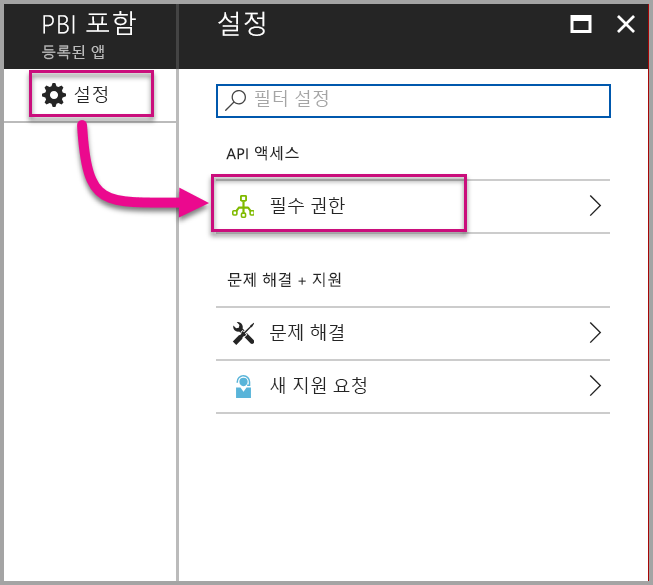

3. **Windows Azure Active Directory**를 선택한 다음 **로그인한 사용자 권한으로 디렉터리에 액세스**가 선택되어 있는지 확인합니다. **저장**을 선택합니다.
   
    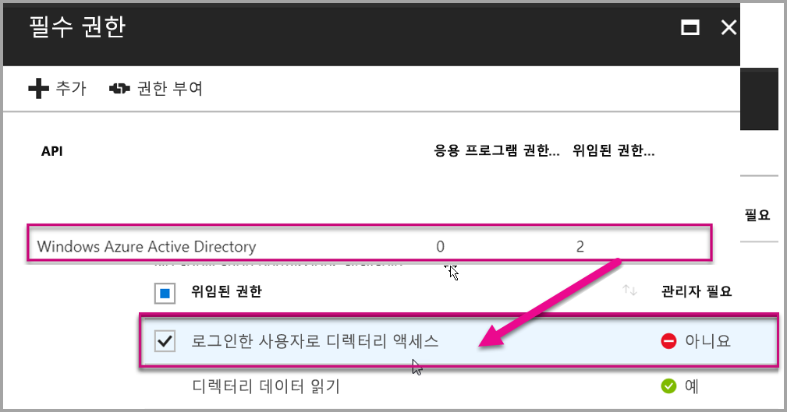

4. **추가**를 선택합니다.

    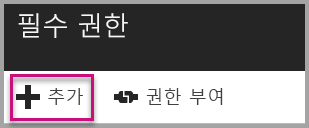

5. **API 선택**을 선택합니다.

    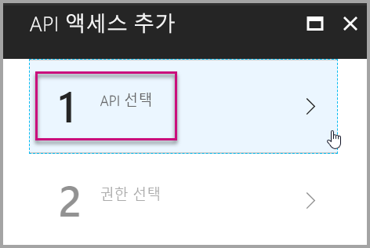

6. **Power BI 서비스**를 선택한 다음, **선택**을 선택합니다.

    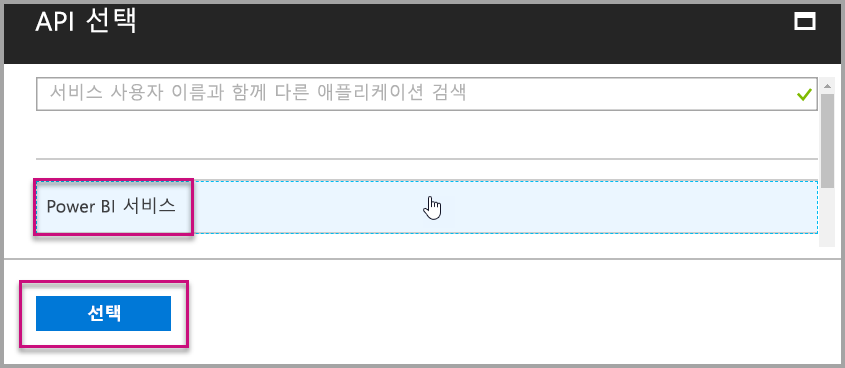

7. **위임된 권한**에서 모든 권한을 선택합니다. 선택 항목을 저장하려면 하나씩 선택해야 합니다. 완료되면 **저장**을 선택합니다.
   
    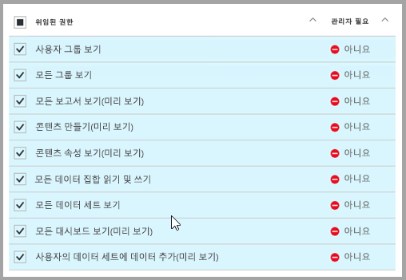

8. **필요한 권한**에서 **사용 권한 부여**를 선택합니다.
   
    Azure AD에서 동의하도록 요구하는 메시지가 표시되지 않게 하려면 **권한 부여** 작업에는 *마스터 계정*이 필요합니다. 이 작업을 수행하는 계정이 전역 관리자인 경우, 조직 내 모든 사용자에게 이 응용 프로그램에 대한 권한을 부여해야 합니다. 이 작업을 수행하는 계정이 *마스터 계정*이고 전역 관리자가 아닌 경우, 이 응용 프로그램의 *마스터 계정*에만 권한을 부여해야 합니다.
   
    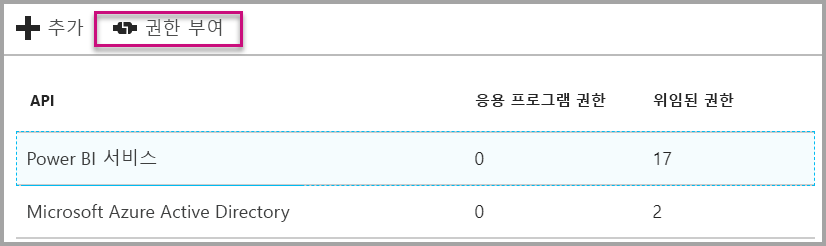

## <a name="setup-your-power-bi-environment"></a>Power BI 환경 설정

### <a name="create-an-app-workspace"></a>앱 작업 영역 만들기

고객의 보고서, 대시보드 또는 타일을 포함하는 경우 콘텐츠를 앱 작업 영역 내에 배치해야 합니다. ‘마스터’ 계정은 앱 작업 영역의 관리자여야 합니다.

1. 먼저 작업 영역을 만듭니다. **작업 영역** > **앱 작업 영역 만들기**를 선택합니다. 응용 프로그램이 액세스해야 하는 콘텐츠를 배치할 위치입니다.

    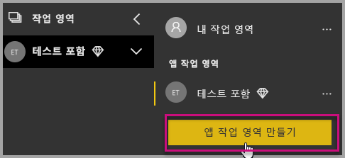

2. 작업 영역에 이름을 지정합니다. 해당하는 **작업 영역 ID**를 사용할 수 없는 경우 편집하여 고유한 ID를 입력합니다. 또한 앱의 이름이어야 합니다.

    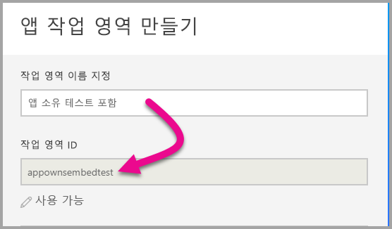

3. 설정할 몇 가지 옵션이 있습니다. **공개**를 선택할 경우 조직의 누구나 작업 영역에 있는 것을 볼 수 있습니다. 한편으로, **비공개**는 해당 작업 영역의 구성원만 콘텐츠를 볼 수 있음을 의미합니다.

    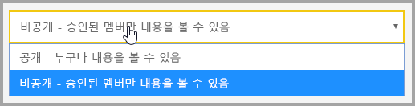

    그룹을 만든 후에 공개/개인 설정을 변경할 수 없습니다.

4. 또한, 구성원이 **편집**할 수 있거나 **보기 전용** 액세스 권한을 가질지 선택할 수도 있습니다.

    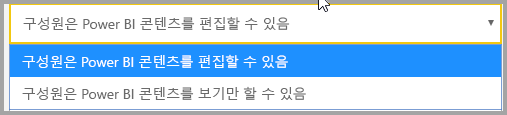

5. 작업 영역에 대한 액세스 권한을 원하는 사람의 메일 주소를 추가하고 **추가**를 선택합니다. 개인이 아닌 그룹 별칭은 추가할 수 없습니다.

6. 각 사용자가 구성원 또는 관리자인지 결정합니다. 관리자는 다른 구성원 추가를 포함해 작업 영역 자체를 편집할 수 있습니다. 구성원은 보기 전용 액세스 권한이 있는 경우를 제외하고 작업 영역의 콘텐츠를 편집할 수 있습니다. 관리자 및 멤버는 앱을 게시할 수 있습니다.

    이제 새 작업 영역을 볼 수 있습니다. Power BI는 작업 영역을 만들고 엽니다. 구성원으로 속해 있는 작업 영역 목록에 나타납니다. 사용자가 관리자이므로, 줄임표(…)를 선택하여 뒤로 이동한 후 새 구성원을 추가하거나 권한을 변경하여 변경 사항을 적용할 수 있습니다.

    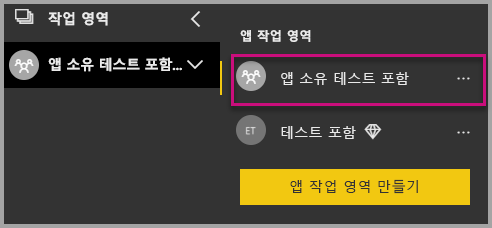

### <a name="create-and-publish-your-reports"></a>보고서 만들기 및 게시

Power BI Desktop을 사용하여 보고서 및 데이터 집합을 만든 다음, 이러한 보고서를 앱 작업 영역으로 게시할 수 있습니다. 보고서를 게시하는 최종 사용자는 앱 작업 영역에 게시하기 위해 Power BI Pro 라이선스가 필요합니다.

1. GitHub에서 샘플 [블로그 데모](https://github.com/Microsoft/powerbi-desktop-samples)를 다운로드합니다.

    

2. **Power BI Desktop**에서 샘플 PBIX 보고서 열기

   

3. **앱 작업 영역**에 게시

   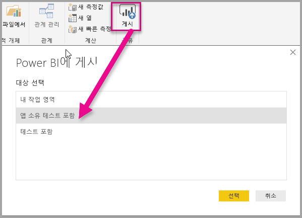

    이제 Power BI 서비스에서 온라인으로 보고서를 볼 수 있습니다.

   

## <a name="embed-your-content-using-the-sample-application"></a>샘플 응용 프로그램을 사용하여 콘텐츠 포함

샘플 응용 프로그램을 사용하여 콘텐츠 포함을 시작하려면 다음 단계를 수행합니다.

1. GitHub에서 [앱 소유 데이터 샘플](https://github.com/Microsoft/PowerBI-Developer-Samples)을 다운로드하여 시작하세요.

    

2. 응용 프로그램 예제에서 Web.config 파일을 엽니다. 응용 프로그램을 성공적으로 실행하려면 5개의 필드를 입력해야 합니다. **clientId**, **groupId**, **reportId**, **pbiUsername** 및 **pbiPassword**입니다.

    

    **Azure**의 **응용 프로그램 ID**를 사용하여 **clientId** 정보를 입력합니다. **clientId**는 응용 프로그램에서 권한을 요청 중인 사용자에게 응용 프로그램을 인식시키는 데 사용됩니다. **clientId**를 가져오려면 다음 단계를 수행합니다.

    [Azure Portal](https://portal.azure.com)에 로그인합니다.

    

    왼쪽 탐색 창에서 **모든 서비스**를 선택하고 **앱 등록**을 선택합니다.

     **clientId**를 가져올 응용 프로그램을 선택합니다.

    

    GUID로 나열된 **응용 프로그램 ID**가 표시되어야 합니다. 이 **응용 프로그램 ID**를 응용 프로그램의 **clientId**로 사용합니다.

    

    Power BI의 **앱 작업 영역 GUID**를 사용하여 **groupId** 정보를 입력합니다.

    

    Power BI의 **보고서 GUID**를 사용하여 **reportId** 정보를 입력합니다.

    

    * Power BI 마스터 사용자 계정으로 **pbiUsername**을 입력합니다.
    * Power BI 마스터 사용자 계정의 암호로 **pbiPassword**를 입력합니다.

3. 응용 프로그램을 실행하세요!

    먼저 **Visual Studio**에서 **실행**을 선택합니다.

    

    그런 다음, **보고서 포함**을 선택합니다. 테스트하기 위해 선택한 콘텐츠(보고서, 대시보드 또는 타일)에 따라 응용 프로그램에서 해당 옵션을 선택합니다.

    

    이제 응용 프로그램 예제에서 보고서를 볼 수 있습니다.

    

## <a name="embed-your-content-within-your-application"></a>응용 프로그램 내에서 콘텐츠 포함
콘텐츠를 포함하는 단계가 [Power BI REST API](https://docs.microsoft.com/rest/api/power-bi/)를 사용하여 수행할 수 있더라도 이 아티클에 설명된 예제 코드는 **.NET SDK**를 사용하여 만듭니다.

응용 프로그램 내에서 고객에 대한 콘텐츠 포함을 수행하려면 **Azure AD**의 마스터 계정에 대한 **액세스 토큰**을 가져와야 합니다. [Power BI REST API](https://docs.microsoft.com/rest/api/power-bi/)에 대한 호출을 수행하기 전에 **앱 소유 데이터**를 사용하여 사용자의 Power BI 응용 프로그램에 대한 [Azure AD 액세스 토큰](get-azuread-access-token.md#access-token-for-non-power-bi-users-app-owns-data)을 가져오는 데 필요합니다.

**액세스 토큰**을 사용하여 Power BI 클라이언트를 만들려면 [Power BI REST API](https://docs.microsoft.com/rest/api/power-bi/)와 상호 작용할 수 있는 Power BI 클라이언트 개체를 만들 수 있습니다. 이렇게 하려면 **AccessToken**을 ***Microsoft.Rest.TokenCredentials*** 개체로 래핑합니다.

```csharp
using Microsoft.IdentityModel.Clients.ActiveDirectory;
using Microsoft.Rest;
using Microsoft.PowerBI.Api.V2;

var tokenCredentials = new TokenCredentials(authenticationResult.AccessToken, "Bearer");

// Create a Power BI Client object. It is used to call Power BI APIs.
using (var client = new PowerBIClient(new Uri(ApiUrl), tokenCredentials))
{
    // Your code to embed items.
}
```

### <a name="get-the-content-item-you-want-to-embed"></a>포함하려는 콘텐츠 항목 가져오기
Power BI 클라이언트 개체를 사용하여 포함하려는 항목에 대한 참조를 검색할 수 있습니다.

지정된 작업 영역에서 첫 번째 보고서를 검색하는 방법을 보여주는 코드 샘플은 다음과 같습니다.

*포함하려는 보고서, 대시보드 또는 타일에 관계 없이 콘텐츠 항목을 가져오는 샘플은 [샘플 응용 프로그램](#embed-your-content-within-a-sample-application)의 Controllers\HomeController.cs 파일 내에서 사용 가능합니다.*

```csharp
using Microsoft.PowerBI.Api.V2;
using Microsoft.PowerBI.Api.V2.Models;

// You need to provide the GroupID where the dashboard resides.
ODataResponseListReport reports = client.Reports.GetReportsInGroupAsync(GroupId);

// Get the first report in the group.
Report report = reports.Value.FirstOrDefault();
```

### <a name="create-the-embed-token"></a>포함 토큰을 만듭니다.
JavaScript API에서 사용할 수 있는 embed 토큰이 생성되어야 합니다. embed 토큰은 포함한 항목에 한정됩니다. 따라서 Power BI 콘텐츠의 구성 요소를 포함하는 경우 이에 대한 새 embed 토큰을 만들어야 합니다. 어떤 **accessLevel**을 사용할지를 포함한 자세한 내용은 사용 하려면 [GenerateToken API](https://msdn.microsoft.com/library/mt784614.aspx)를 참조하세요.

응용 프로그램에 대한 보고서의 embed 토큰을 추가하는 샘플은 다음과 같습니다.

*보고서, 대시보드 또는 타일에 대한 embed 토큰을 만드는 샘플은 [샘플 응용 프로그램](#embed-your-content-within-a-sample-application)의 Controllers\HomeController.cs 파일 내에서 사용 가능합니다.*

```csharp
using Microsoft.PowerBI.Api.V2;
using Microsoft.PowerBI.Api.V2.Models;

// Generate Embed Token.
var generateTokenRequestParameters = new GenerateTokenRequest(accessLevel: "view");
EmbedToken tokenResponse = client.Reports.GenerateTokenInGroup(GroupId, report.Id, generateTokenRequestParameters);

// Generate Embed Configuration.
var embedConfig = new EmbedConfig()
{
    EmbedToken = tokenResponse,
    EmbedUrl = report.EmbedUrl,
    Id = report.Id
};
```

이는 **EmbedConfig** 및 **TileEmbedConfig**에 대한 클래스가 생성되었음을 의미합니다. 이 항목에 대한 샘플은 **Models\EmbedConfig.cs** 파일 및 **Models\TileEmbedConfig.cs 파일** 내에서 사용 가능합니다.

### <a name="load-an-item-using-javascript"></a>JavaScript를 사용하여 항목 로드
JavaScript를 사용하여 웹 페이지의 div 요소로 보고서를 로드합니다. 

보고서에 대한 보기와 함께 **EmbedConfig** 모델 및 **TileEmbedConfig** 모델을 사용하는 샘플은 다음과 같습니다.

*보고서, 대시보드 또는 타일에 대한 보기를 추가하는 샘플은 [샘플 응용 프로그램](#embed-your-content-within-a-sample-application)의 Views\Home\EmbedReport.cshtml, Views\Home\EmbedDashboard.cshtml 또는 Views\Home\Embedtile.cshtml 파일 내에서 사용 가능합니다.*

```javascript
<script src="~/scripts/powerbi.js"></script>
<div id="reportContainer"></div>
<script>
    // Read embed application token from Model
    var accessToken = "@Model.EmbedToken.Token";

    // Read embed URL from Model
    var embedUrl = "@Html.Raw(Model.EmbedUrl)";

    // Read report Id from Model
    var embedReportId = "@Model.Id";

    // Get models. models contains enums that can be used.
    var models = window['powerbi-client'].models;

    // Embed configuration used to describe the what and how to embed.
    // This object is used when calling powerbi.embed.
    // This also includes settings and options such as filters.
    // You can find more information at https://github.com/Microsoft/PowerBI-JavaScript/wiki/Embed-Configuration-Details.
    var config = {
        type: 'report',
        tokenType: models.TokenType.Embed,
        accessToken: accessToken,
        embedUrl: embedUrl,
        id: embedReportId,
        permissions: models.Permissions.All,
        settings: {
            filterPaneEnabled: true,
            navContentPaneEnabled: true
        }
    };

    // Get a reference to the embedded report HTML element
    var reportContainer = $('#reportContainer')[0];

    // Embed the report and display it within the div container.
    var report = powerbi.embed(reportContainer, config);
</script>
```

JavaScript API 사용에 대한 전체 샘플의 경우 [Playground 도구](https://microsoft.github.io/PowerBI-JavaScript/demo)를 사용할 수 있습니다. 이 방법으로 다양한 유형의 Power BI Embedded 샘플을 빠르게 재생할 수 있습니다. [PowerBI-JavaScript Wiki](https://github.com/Microsoft/powerbi-javascript/wiki) 페이지를 방문하여 JavaScript API에 대한 추가 정보를 얻을 수도 있습니다.

## <a name="move-to-production"></a>프로덕션으로 이동

이제 응용 프로그램 개발을 완료했으므로 전용 용량을 포함한 앱 작업 영역으로 돌아갈 차례입니다. 전용 용량은 프로덕션으로 이동해야 합니다.

### <a name="create-a-dedicated-capacity"></a>전용 용량 만들기
전용 용량을 만들면 고객을 위해 전용 리소스의 혜택을 활용할 수 있습니다. 전용 용량에 할당되지 않은 작업 영역의 경우 공유 용량에 설치되어야 합니다. Azure에서 [Power BI Embedded 전용 용량](https://docs.microsoft.com/azure/power-bi-embedded/create-capacity) 솔루션을 사용하여 전용 용량을 만들 수 있습니다.

PRO 라이선스가 있는 embed 토큰을 사용하는 것은 개발 테스트용이므로 Power BI 마스터 계정에서 생성할 수 있는 embed 토큰의 수는 제한적입니다. 프로덕션 환경에 포함하려면 전용 용량을 구입해야 합니다. 전용 용량으로 생성할 수 있는 포함 토큰 수에는 제한이 없습니다. [사용 가능한 기능](https://docs.microsoft.com/rest/api/power-bi/availablefeatures/getavailablefeatures)으로 이동하여 현재 포함된 사용 현황을 백분율로 표시하는 사용 값을 확인합니다. 사용량은 마스터 계정을 기반으로 합니다.

### <a name="assign-an-app-workspace-to-a-dedicated-capacity"></a>전용 용량에 앱 작업 영역 할당

전용 용량이 만들어지면 전용 용량에 앱 작업 영역을 할당합니다. 이를 완료하려면 다음 단계를 수행합니다.

1. **Power BI 서비스** 내에서 작업 영역을 확장하고 콘텐츠를 포함하는 데 사용하는 작업 영역에 대한 줄임표를 선택합니다. 그런 다음, **작업 영역 편집**을 선택합니다.

    

2. **고급**을 확장한 다음, **전용 용량**을 사용하도록 설정한 다음, 직접 만든 전용 용량을 선택합니다. 그런 다음, **저장**을 선택합니다.

    

Power BI Embedded에 대한 추가 질문이 있는 경우 [FAQ](embedded-faq.md) 페이지를 참조하세요.  응용 프로그램 내에 Power Bi Embedded 관련 문제가 있는 경우 [문제 해결](embedded-troubleshoot.md) 페이지를 참조하세요.

궁금한 점이 더 있나요? [Power BI 커뮤니티에 질문합니다.](http://community.powerbi.com/)