# <a name="tutorial-embed-power-bi-content-into-an-application-for-your-customers"></a>자습서: 고객의 애플리케이션에 Power BI 콘텐츠 포함

**Azure의 Power BI Embedded**를 통해 앱 소유 데이터를 사용하여 애플리케이션에 보고서, 대시보드 또는 타일을 포함할 수 있습니다. **앱 소유 데이터**는 해당 임베디드 분석 플랫폼으로 Power BI를 사용하는 애플리케이션을 갖는 것입니다. **ISV 개발자**는 사용자에게 Power BI 라이선스를 요구하지 않고도 완벽하게 통합된 대화형 애플리케이션에서 보고서, 대시보드 또는 타일을 표시하는 Power BI 콘텐츠를 만들 수 있습니다. 이 자습서에서는 고객을 위해 **Azure의 Power BI Embedded**를 사용하여 Power BI JavaScript API와 함께 Power BI .NET SDK를 사용하여 보고서를 애플리케이션에 통합하는 방법을 보여줍니다.

이 자습서에서는 다음 작업을 수행하는 방법을 알아봅니다.
> [!div class="checklist"]
> * Azure에서 애플리케이션을 등록합니다.
> * 애플리케이션에 Power BI 보고서를 포함합니다.

## <a name="prerequisites"></a>필수 조건

시작하려면 다음이 필요합니다.

* [Power BI Pro 계정](../service-self-service-signup-for-power-bi.md)(Power BI Pro 계정에 로그인하기 위한 사용자 이름 및 암호인 마스터 계정) 또는 [서비스 주체(앱 전용 토큰)](embed-service-principal.md).
* [Microsoft Azure](https://azure.microsoft.com/) 구독.
* 고유한 [Azure Active Directory 테넌트 ](create-an-azure-active-directory-tenant.md) 설정이 필요합니다.

아직 **Power BI Pro**에 등록하지 않은 경우 시작하기 전에 [평가판에 등록](https://powerbi.microsoft.com/pricing/)합니다.

Azure 구독이 없는 경우 시작하기 전에 [체험 계정](https://azure.microsoft.com/free/?WT.mc_id=A261C142F)을 만듭니다.

## <a name="set-up-your-embedded-analytics-development-environment"></a>임베디드 분석 개발 환경 설정

애플리케이션으로 보고서, 대시보드 또는 타일 포함을 시작하기 전에 사용자 환경이 Power BI에 포함을 허용하도록 설정해야 합니다.

[포함 설치 도구](https://aka.ms/embedsetup/AppOwnsData)를 통해 환경을 만들고 보고서를 포함하는 방법을 설명할 수 있는 샘플 애플리케이션을 신속하게 시작하고 다운로드할 수 있습니다.

그러나 환경을 수동으로 설정하도록 선택하면 아래를 계속할 수 있습니다.

### <a name="register-an-application-in-azure-active-directory-azure-ad"></a>Azure AD(Azure Active Directory)에서 애플리케이션 등록

Azure Active Directory로 [애플리케이션을 등록](register-app.md)하여 애플리케이션에서 [Power BI REST API](https://docs.microsoft.com/rest/api/power-bi/)에 액세스할 수 있도록 합니다. 애플리케이션을 등록하면 애플리케이션의 ID를 설정하고 Power BI REST 리소스에 대한 권한을 지정할 수 있습니다. 마스터 계정 또는 [서비스 주체](embed-service-principal.md)를 사용할지에 따라 애플리케이션 등록을 시작하는 방법을 결정합니다.

취하는 메서드에 따라 Azure에 등록하는 애플리케이션 유형에 영향을 줍니다.

마스터 계정을 사용하여 진행하는 경우 **네이티브** 앱 등록으로 진행합니다. 비대화형 로그인으로 작업 중이므로 기본 앱을 사용합니다.

그러나 서비스 주체를 사용하여 진행하는 경우에는 **서버 쪽 웹 애플리케이션** 앱 등록으로 진행해야 합니다. 서버 쪽 웹 애플리케이션을 등록하여 애플리케이션 비밀을 만듭니다.

## <a name="set-up-your-power-bi-environment"></a>Power BI 환경 설정

### <a name="create-an-app-workspace"></a>앱 작업 영역 만들기

고객의 보고서, 대시보드 또는 타일을 포함하는 경우 콘텐츠를 앱 작업 영역 내에 배치해야 합니다. 설정할 수 있는 작업 영역에는 [기존 작업 영역](../service-create-workspaces.md) 또는 [새 작업 영역](../service-create-the-new-workspaces.md)이 있습니다. *마스터* 계정을 사용하는 경우에는 사용하는 작업 영역의 형식은 중요하지 않습니다. 그러나 *[서비스 주체](embed-service-principal.md)* 를 사용하여 애플리케이션에 로그인하는 경우에는 새 작업 영역을 사용해야 합니다. 두 시나리오 모두에서 *마스터* 계정 또는 *서비스 주체*는 애플리케이션과 관련된 앱 작업 영역의 관리자여야 합니다.

### <a name="create-and-publish-your-reports"></a>보고서 만들기 및 게시

Power BI Desktop을 사용하여 보고서 및 데이터 세트를 만든 다음, 이러한 보고서를 앱 작업 영역으로 게시할 수 있습니다. 이 작업을 수행하는 방법에는 두 가지가 있습니다. 최종 사용자는 마스터 계정(Power BI Pro 라이선스)을 사용하여 기존 앱 작업 영역에 보고서를 게시할 수 있습니다. 서비스 주체를 사용하는 경우 [Power BI REST API](https://docs.microsoft.com/rest/api/power-bi/imports/postimportingroup)를 사용하여 새 작업 영역에 보고서를 게시할 수 있습니다.

다음 단계는 PBIX 보고서를 Power BI 작업 영역에 게시하는 방법을 안내합니다.

1. GitHub에서 샘플 [블로그 데모](https://github.com/Microsoft/powerbi-desktop-samples)를 다운로드합니다.

    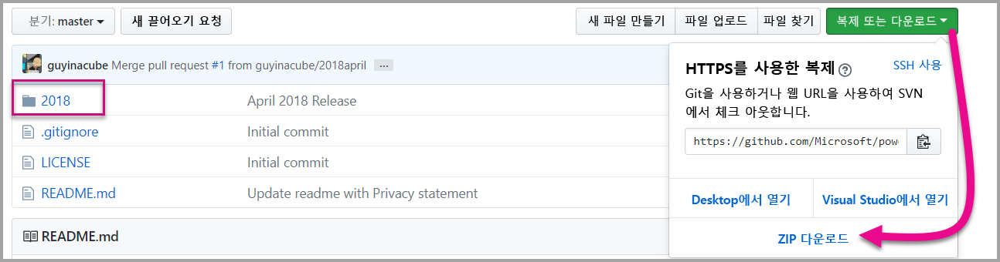

2. **Power BI Desktop**에서 샘플 PBIX 보고서를 엽니다.

   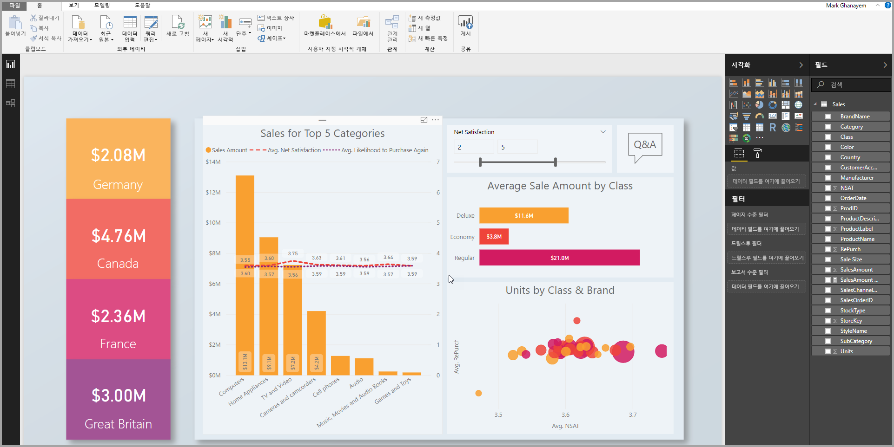

3. **앱 작업 영역**에 게시합니다. 이 프로세스는 마스터 계정(Power Pro 라이선스) 또는 서비스 주체를 사용하는지에 따라 다릅니다. 마스터 계정을 사용하는 경우 Power BI Desktop을 통해 보고서를 게시할 수 있습니다.  이제 서비스 주체를 사용하는 경우 Power BI REST API를 사용해야 합니다.

## <a name="embed-content-using-the-sample-application"></a>샘플 애플리케이션을 사용하여 콘텐츠 포함

이 샘플은 간단한 데모용으로 의도적으로 유지됩니다. 애플리케이션 비밀 또는 마스터 계정 자격 증명을 보호하는 것은 사용자 또는 개발자에게 달려 있습니다.

샘플 애플리케이션을 사용하여 콘텐츠 포함을 시작하려면 다음 단계를 수행합니다.

1. [Visual Studio](https://www.visualstudio.com/)(버전 2013 이상)를 다운로드합니다. 최신 [NuGet 패키지](https://www.nuget.org/profiles/powerbi)를 다운로드해야 합니다.

2. GitHub에서 [앱 소유 데이터 샘플](https://github.com/Microsoft/PowerBI-Developer-Samples)을 다운로드하여 시작하세요.

    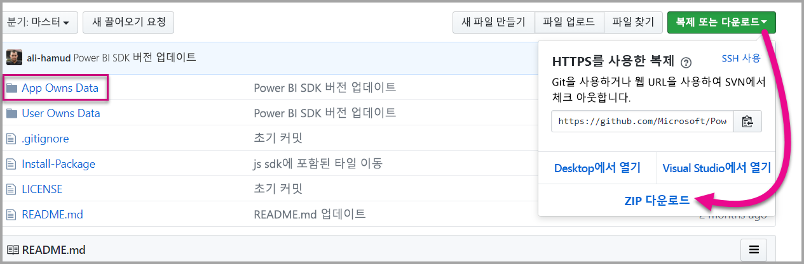

3. 샘플 애플리케이션에서 **Web.config** 파일을 엽니다. 애플리케이션을 실행하려면 필드를 입력해야 합니다. **AuthenticationType**에 대해 **MasterUser** 또는 **ServicePrincipal**을 선택할 수 있습니다. 선택한 인증 방법의 유형에 따라 완료해야 할 다양한 필드가 있습니다.

    > [!Note]
    > 이 샘플의 기본 **AuthenticationType**은 MasterUser입니다.

    <center>

    | **MasterUser** <br> (Power BI Pro 라이선스) | **ServicePrincipal** <br> (앱 전용 토큰)|
    |---------------|-------------------|
    | [applicationId](#application-id) | [applicationId](#application-id) |
    | [workspaceId](#workspace-id) | [workspaceId](#workspace-id) |
    | [reportId](#report-id) | [reportId](#report-id) |
    | [pbiUsername](#power-bi-username-and-password) |  |
    | [pbiPassword](#power-bi-username-and-password) |  |
    |  | [applicationsecret](#application-secret) |
    |  | [테넌트](#tenant) |

   </center>

    

### <a name="application-id"></a>애플리케이션 ID

이 특성은 AuthenticationTypes(마스터 계정 및 [서비스 주체](embed-service-principal.md)) 모두에 필요합니다.

**Azure**의 **애플리케이션 ID**를 사용하여 **applicationId** 정보를 입력합니다. **applicationId**는 애플리케이션에서 권한을 요청 중인 사용자에게 애플리케이션을 인식시키는 데 사용됩니다.

**applicationId**를 가져오려면 다음 단계를 수행합니다.

1. [Azure Portal](https://portal.azure.com)에 로그인합니다.

2. 왼쪽 탐색 창에서 **모든 서비스**를 선택하고 **앱 등록**을 선택합니다.

    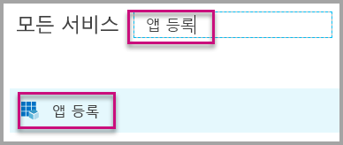

3. **applicationId**가 필요한 애플리케이션을 선택합니다.

    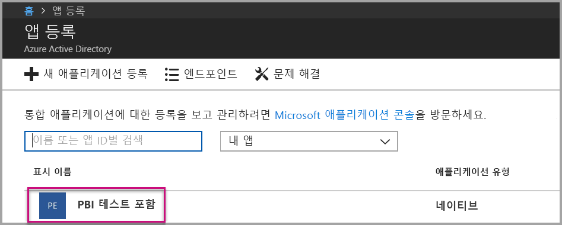

4. GUID로 나열된 **애플리케이션 ID**가 있습니다. 이 **애플리케이션 ID**를 애플리케이션의 **applicationId**로 사용합니다.

    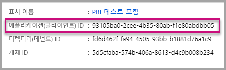

### <a name="workspace-id"></a>작업 영역 ID

이 특성은 AuthenticationTypes(마스터 계정 및 [서비스 주체](embed-service-principal.md)) 모두에 필요합니다.

Power BI의 앱 작업 영역(그룹) GUID를 사용하여 **workspaceId** 정보를 입력합니다. Power BI 서비스에 로그인하거나 Powershell을 사용할 때 URL에서 이 정보를 가져올 수 있습니다.

URL <br>

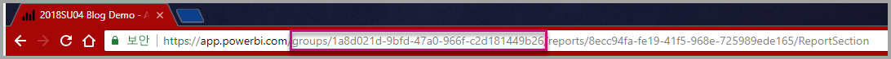

Powershell <br>

```powershell
Get-PowerBIworkspace -name "App Owns Embed Test"
```

   

### <a name="report-id"></a>보고서 ID

이 특성은 AuthenticationTypes(마스터 계정 및 [서비스 주체](embed-service-principal.md)) 모두에 필요합니다.

Power BI의 보고서 GUID를 사용하여 **reportId** 정보를 입력합니다. Power BI 서비스에 로그인하거나 Powershell을 사용할 때 URL에서 이 정보를 가져올 수 있습니다.

URL<br>

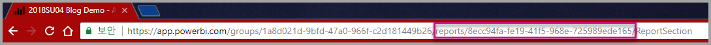

Powershell <br>

```powershell
Get-PowerBIworkspace -name "App Owns Embed Test" | Get-PowerBIReport
```


### <a name="power-bi-username-and-password"></a>Power BI 사용자 이름 및 암호

이러한 특성은 마스터 계정 AuthenticationType에 대해서만 필요합니다.

[서비스 주체](embed-service-principal.md)를 사용하여 인증하는 경우 사용자 이름 또는 암호 특성을 입력할 필요가 없습니다.

* Power BI 마스터 계정으로 **pbiUsername**을 입력합니다.
* Power BI 마스터 사용자 계정의 암호로 **pbiPassword**를 입력합니다.

### <a name="application-secret"></a>애플리케이션 비밀

이 특성은 [서비스 주체](embed-service-principal.md) AuthenticationType에 대해서만 필요합니다.

**Azure**의 **앱 등록** 섹션에 있는 **키** 섹션에서 **ApplicationSecret** 정보를 입력합니다.  이 특성은 [서비스 주체](embed-service-principal.md)를 사용할 때 작동합니다.

**ApplicationSecret**을 가져오려면 다음 단계를 수행합니다.

1. [Azure Portal](https://portal.azure.com)에 로그인합니다.

2. 왼쪽 탐색 창에서 **모든 서비스**를 선택한 다음, **앱 등록**을 선택합니다.

    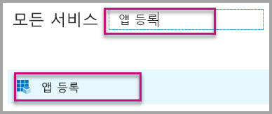

3. **ApplicationSecret**을 사용해야 하는 애플리케이션을 선택합니다.

    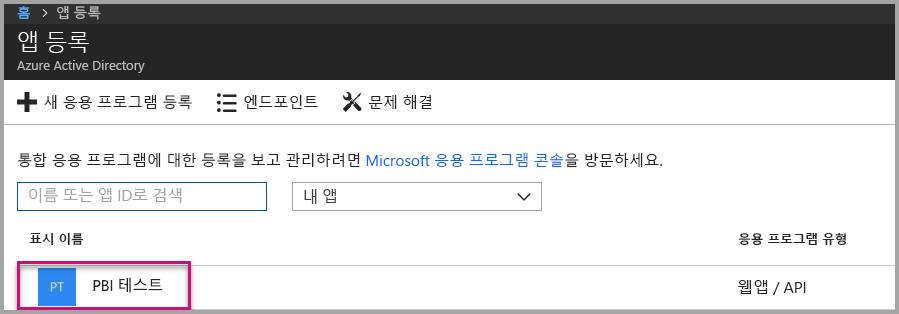

4. **설정**을 선택합니다.

    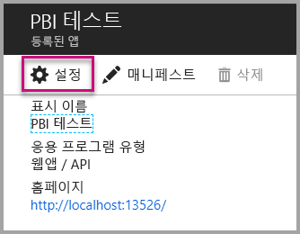

5. **키**를 선택합니다.

    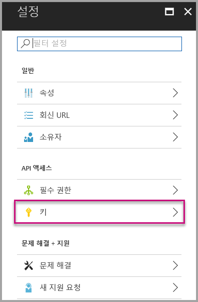

6. **설명** 상자에 이름을 입력하고 지속 기간을 선택합니다. 그런 다음, **저장**을 선택하여 애플리케이션의 **값**을 가져옵니다. 키 값을 저장한 후 **키** 창을 닫으면 값 필드가 숨김으로만 표시됩니다. 이때는 키 값을 검색할 수 없습니다. 키 값을 분실한 경우 Azure Portal에서 새 키 값을 만듭니다.

    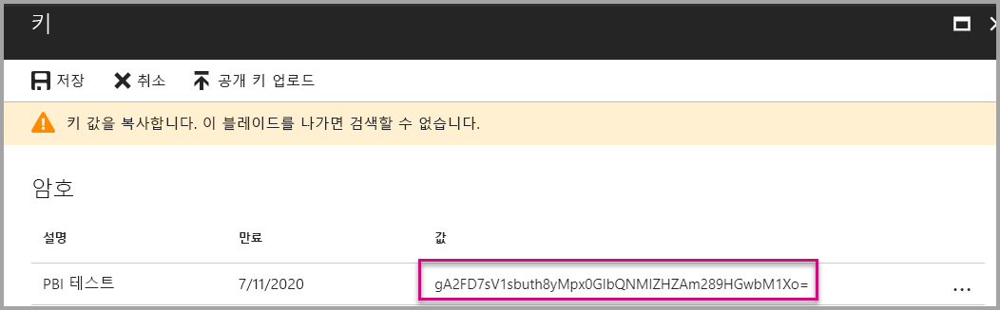

### <a name="tenant"></a>테넌트

이 특성은 [서비스 주체](embed-service-principal.md) AuthenticationType에 대해서만 필요합니다.

**테넌트** 정보를 Azure 테넌트 ID로 입력합니다. Power BI 서비스에 로그인하거나 Powershell을 사용할 때 [Azure AD 포털](https://docs.microsoft.com/onedrive/find-your-office-365-tenant-id#use-the-azure-ad-portal)에서 이 정보를 가져올 수 있습니다.

### <a name="run-the-application"></a>애플리케이션 실행

1. **Visual Studio**에서 **실행**을 선택합니다.

    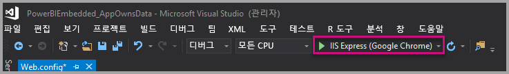

2. 그런 다음, **보고서 포함**을 선택합니다. 테스트하기 위해 선택한 콘텐츠(보고서, 대시보드 또는 타일)에 따라 애플리케이션에서 해당 옵션을 선택합니다.

    

3. 이제 애플리케이션 예제에서 보고서를 볼 수 있습니다.

    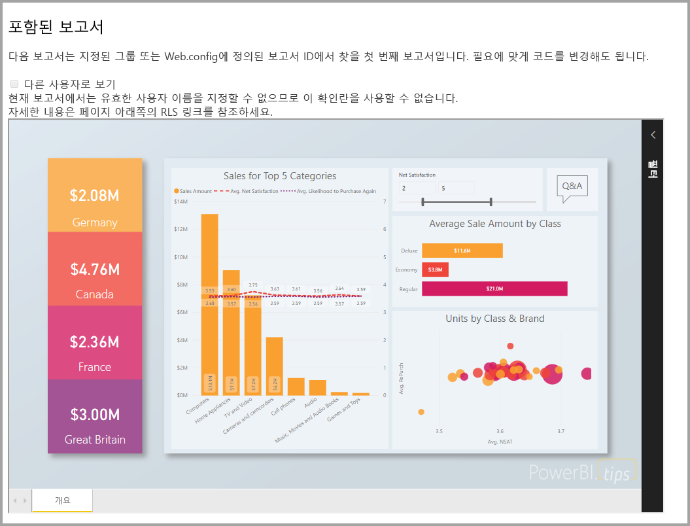

## <a name="embed-content-within-your-application"></a>애플리케이션 내에서 콘텐츠 포함

콘텐츠를 포함하는 단계는 [Power BI REST API](https://docs.microsoft.com/rest/api/power-bi/)를 사용하여 수행되지만 이 문서에 설명된 예제 코드는 **.NET SDK**를 사용하여 만듭니다.

애플리케이션 내에서 고객을 포함시키려면 **Azure AD**에서 마스터 계정에 대한 **액세스 토큰** 또는 [서비스 주체](embed-service-principal.md)를 가져와야 합니다. [Power BI REST API](https://docs.microsoft.com/rest/api/power-bi/)를 호출하기 전에 Power BI 애플리케이션에 대한 [Azure AD 액세스 토큰](get-azuread-access-token.md#access-token-for-non-power-bi-users-app-owns-data)을 가져와야 합니다.

**액세스 토큰**을 사용하여 Power BI 클라이언트를 만들려면 [Power BI REST API](https://docs.microsoft.com/rest/api/power-bi/)와 상호 작용할 수 있는 Power BI 클라이언트 개체를 만들 수 있습니다. ***Microsoft.Rest.TokenCredentials*** 개체로 **AccessToken**을 래핑하여 Power BI 클라이언트 개체를 만듭니다.

```csharp
using Microsoft.IdentityModel.Clients.ActiveDirectory;
using Microsoft.Rest;
using Microsoft.PowerBI.Api.V2;

var tokenCredentials = new TokenCredentials(authenticationResult.AccessToken, "Bearer");

// Create a Power BI Client object. it's used to call Power BI APIs.
using (var client = new PowerBIClient(new Uri(ApiUrl), tokenCredentials))
{
    // Your code to embed items.
}
```

### <a name="get-the-content-item-you-want-to-embed"></a>포함하려는 콘텐츠 항목 가져오기

Power BI 클라이언트 개체를 사용하여 포함하려는 항목에 대한 참조를 검색할 수 있습니다.

지정된 작업 영역에서 첫 번째 보고서를 검색하는 방법을 보여주는 코드 샘플은 다음과 같습니다.

*포함하려는 보고서, 대시보드 또는 타일에 관계없이 콘텐츠 항목을 가져오는 샘플은 [샘플 애플리케이션](https://github.com/Microsoft/PowerBI-Developer-Samples)의 Services\EmbedService.cs 파일 내에서 사용할 수 있습니다.*

```csharp
using Microsoft.PowerBI.Api.V2;
using Microsoft.PowerBI.Api.V2.Models;

// You need to provide the workspaceId where the dashboard resides.
ODataResponseListReport reports = await client.Reports.GetReportsInGroupAsync(workspaceId);

// Get the first report in the group.
Report report = reports.Value.FirstOrDefault();
```

### <a name="create-the-embed-token"></a>포함 토큰을 만듭니다.

Javascript API에서 사용할 수 있는 포함 토큰을 생성했습니다. 포함 토큰은 포함한 항목에 한정됩니다. 따라서 Power BI 콘텐츠의 구성 요소를 포함하는 경우 이에 대한 새 embed 토큰을 만들어야 합니다. 어떤 **accessLevel**을 사용할지를 포함한 자세한 내용은 사용 하려면 [GenerateToken API](https://msdn.microsoft.com/library/mt784614.aspx)를 참조하세요.

*포함하려는 보고서, 대시보드 또는 타일에 대한 포함 토큰을 만드는 샘플은 [샘플 애플리케이션](https://github.com/Microsoft/PowerBI-Developer-Samples)의 Services\EmbedService.cs 파일 내에서 사용할 수 있습니다.*

```csharp
using Microsoft.PowerBI.Api.V2;
using Microsoft.PowerBI.Api.V2.Models;

// Generate Embed Token.
var generateTokenRequestParameters = new GenerateTokenRequest(accessLevel: "view");
EmbedToken tokenResponse = client.Reports.GenerateTokenInGroup(workspaceId, report.Id, generateTokenRequestParameters);

// Generate Embed Configuration.
var embedConfig = new EmbedConfig()
{
    EmbedToken = tokenResponse,
    EmbedUrl = report.EmbedUrl,
    Id = report.Id
};
```

**EmbedConfig** 및 **TileEmbedConfig**에 대한 클래스가 만들어집니다. 샘플은 **Models\EmbedConfig.cs** 파일 및 **Models\TileEmbedConfig.cs 파일** 내에서 사용 가능합니다.

### <a name="load-an-item-using-javascript"></a>JavaScript를 사용하여 항목 로드

JavaScript를 사용하여 웹 페이지의 div 요소로 보고서를 로드합니다.

JavaScript API 사용에 대한 전체 샘플의 경우 [Playground 도구](https://microsoft.github.io/PowerBI-JavaScript/demo)를 사용할 수 있습니다. 플레이그라운드 도구로 다양한 유형의 Power BI Embedded 샘플을 빠르게 재생할 수 있습니다. [PowerBI-JavaScript Wiki](https://github.com/Microsoft/powerbi-javascript/wiki) 페이지를 방문하여 JavaScript API에 대한 추가 정보를 얻을 수도 있습니다.

보고서에 대한 보기와 함께 **EmbedConfig** 모델 및 **TileEmbedConfig** 모델을 사용하는 샘플은 다음과 같습니다.

*보고서, 대시보드 또는 타일에 대한 보기를 추가하는 샘플은 [샘플 애플리케이션](#embed-your-content-within-a-sample-application)의 Views\Home\EmbedReport.cshtml, Views\Home\EmbedDashboard.cshtml 또는 Views\Home\Embedtile.cshtml 파일 내에서 사용 가능합니다.*

```javascript
<script src="~/scripts/powerbi.js"></script>
<div id="reportContainer"></div>
<script>
    // Read embed application token from Model
    var accessToken = "@Model.EmbedToken.Token";

    // Read embed URL from Model
    var embedUrl = "@Html.Raw(Model.EmbedUrl)";

    // Read report Id from Model
    var embedReportId = "@Model.Id";

    // Get models. models contains enums that can be used.
    var models = window['powerbi-client'].models;

    // Embed configuration used to describe what and how to embed.
    // This object is used when calling powerbi.embed.
    // This also includes settings and options such as filters.
    // You can find more information at https://github.com/Microsoft/PowerBI-JavaScript/wiki/Embed-Configuration-Details.
    var config = {
        type: 'report',
        tokenType: models.TokenType.Embed,
        accessToken: accessToken,
        embedUrl: embedUrl,
        id: embedReportId,
        permissions: models.Permissions.All,
        settings: {
            filterPaneEnabled: true,
            navContentPaneEnabled: true
        }
    };

    // Get a reference to the embedded report HTML element
    var reportContainer = $('#reportContainer')[0];

    // Embed the report and display it within the div container.
    var report = powerbi.embed(reportContainer, config);
</script>
```

## <a name="move-to-production"></a>프로덕션으로 이동

이제 애플리케이션 개발을 완료했으므로 전용 용량을 포함한 앱 작업 영역으로 돌아갈 차례입니다. 

> [!Important]
> 전용 용량은 프로덕션으로 이동해야 합니다.

### <a name="create-a-dedicated-capacity"></a>전용 용량 만들기

전용 용량을 만들면 고객을 위해 전용 리소스의 혜택을 활용할 수 있습니다. [Microsoft Azure Portal](https://portal.azure.com) 내에서 전용 용량을 구입할 수 있습니다. Power BI Embedded 용량을 만드는 방법에 대한 자세한 내용은 [Azure Portal에서 Power BI Embedded 용량 만들기](azure-pbie-create-capacity.md)를 참조하세요.

아래 표를 사용하여 필요에 맞는 최적의 Power BI Embedded 용량을 결정합니다.

| 용량 노드 | 총 코어<br/>*(백 엔드 + 프런트 엔드)* | 백 엔드 코어 | 프런트 엔드 코어 | DirectQuery/라이브 연결 제한|
| --- | --- | --- | --- | --- | --- |
| A1 |1개 가상 코어 |0.5개 코어, 3GB RAM |0.5개 코어 |초당 0.5 |
| A2 |2개 가상 코어 |1개 코어, 5GB RAM |1개 코어 | 초당 10 |
| A3 |4개 가상 코어 |2개 코어, 10GB RAM |2개 코어 | 초당 15 |
| A4 |8개 가상 코어 |4개 코어, 25GB RAM |4개 코어 |초당 30 |
| A5 |16개 가상 코어 |8개 코어, 50GB RAM |8개 코어 |초당 60 |
| A6 |32개 가상 코어 |16개 코어, 100GB RAM |16개 코어 |초당 120 |

**‘SKU에서는 무료 Power BI 라이선스를 사용하여 Power BI 콘텐츠에 액세스할 수 없습니다.’**

PRO 라이선스가 있는 포함 토큰을 사용하는 것은 개발 테스트용이므로 Power BI 마스터 계정 또는 서비스 주체가 생성할 수 있는 포함 토큰의 수는 제한적입니다. 프로덕션 환경에 포함하려면 전용 용량이 필요합니다. 전용 용량으로 생성할 수 있는 포함 토큰 수에는 제한이 없습니다. [사용 가능한 기능](https://docs.microsoft.com/rest/api/power-bi/availablefeatures/getavailablefeatures)으로 이동하여 현재 포함된 사용 현황을 백분율로 표시하는 사용 값을 확인합니다. 사용량은 마스터 계정을 기반으로 합니다.

자세한 내용은 [임베디드 분석 용량 계획 백서](https://aka.ms/pbiewhitepaper)를 참조하세요.

### <a name="assign-an-app-workspace-to-a-dedicated-capacity"></a>전용 용량에 앱 작업 영역 할당

전용 용량을 만들면 해당 전용 용량에 앱 작업 영역을 할당할 수 있습니다.

[서비스 주체](embed-service-principal.md)를 사용하여 작업 영역에 전용 용량을 할당하려면 [Power BI REST API](https://docs.microsoft.com/rest/api/power-bi/capacities/groups_assigntocapacity)를 사용합니다. Power BI REST API를 사용할 때는 [서비스 주체 개체 ID](embed-service-principal.md#how-to-get-the-service-principal-object-id)를 사용해야 합니다.

아래 단계에 따라 **마스터 계정**을 사용하여 작업 영역에 전용 용량을 할당합니다.

1. **Power BI 서비스** 내에서 작업 영역을 확장하고 콘텐츠를 포함하는 데 사용하는 작업 영역에 대한 줄임표를 선택합니다. 그런 다음, **작업 영역 편집**을 선택합니다.

    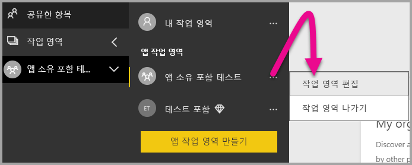

2. **고급**을 확장한 다음, **전용 용량**을 사용하도록 설정한 다음, 직접 만든 전용 용량을 선택합니다. 그런 다음, **저장**을 선택합니다.

    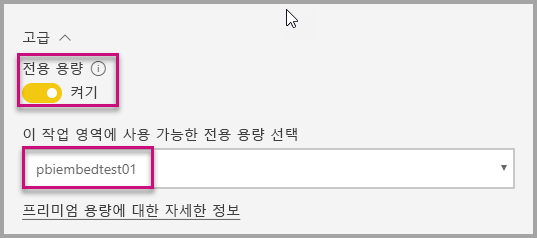

3. **저장**을 선택하면 앱 작업 영역 이름 옆에 **다이아몬드**가 표시됩니다.

    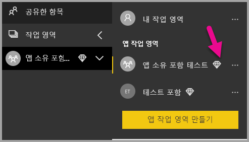

## <a name="next-steps"></a>다음 단계

이 자습서에서는 고객의 애플리케이션에 Power BI 콘텐츠를 포함하는 방법을 알아보았습니다. 조직에 Power BI 콘텐츠를 포함할 수도 있습니다.

> [!div class="nextstepaction"]
>[조직에 포함](embed-sample-for-your-organization.md)

궁금한 점이 더 있나요? [Power BI 커뮤니티에 질문합니다.](http://community.powerbi.com/)
