# <a name="tutorial-embed-a-power-bi-report-dashboard-or-tile-into-an-application-for-your-organization"></a>자습서: Power BI 보고서, 대시보드 또는 타일을 조직의 애플리케이션에 포함

**Power BI**를 통해 사용자 소유 데이터를 사용하여 애플리케이션에 보고서, 대시보드 또는 타일을 포함할 수 있습니다. **사용자 소유 데이터**를 사용하면 애플리케이션에서 Power BI 서비스를 확장하여 임베디드 분석을 사용할 수 있습니다. 이 자습서는 보고서를 애플리케이션에 통합하는 방법을 보여 줍니다. Power BI .NET SDK를 Power BI JavaScript API와 함께 사용하여 Power BI를 조직의 애플리케이션에 포함합니다.

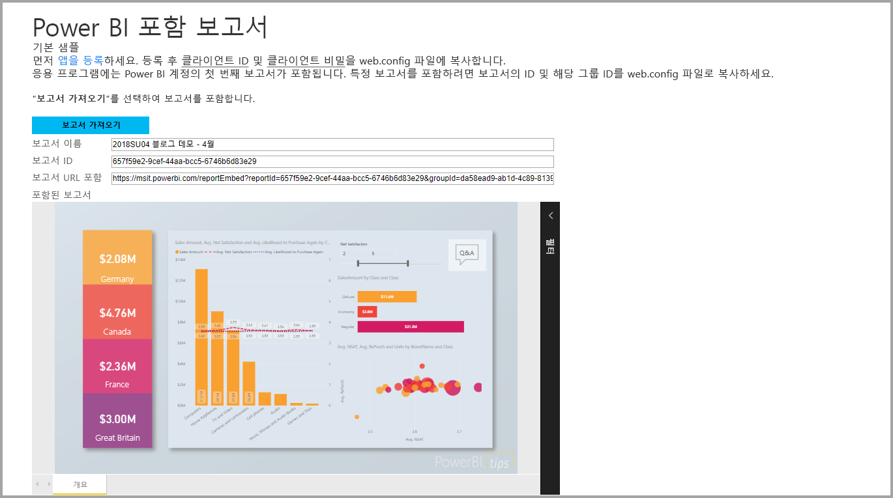

이 자습서에서는 다음 작업에 대해 학습합니다.
> [!div class="checklist"]
> * Azure에서 애플리케이션을 등록합니다.
> * 애플리케이션에 Power BI 보고서를 포함합니다.

## <a name="prerequisites"></a>필수 조건

시작하려면 Power BI Pro 계정과 Microsoft Azure 구독이 필요합니다.

* 아직 Power BI Pro에 등록하지 않은 경우 시작하기 전에 [평가판에 등록](https://powerbi.microsoft.com/en-us/pricing/)합니다.
* Azure 구독이 없는 경우 시작하기 전에 [체험 계정](https://azure.microsoft.com/free/?WT.mc_id=A261C142F)을 만듭니다.
* 자체 [Azure AD(Azure Active Directory) 테넌트](create-an-azure-active-directory-tenant.md)를 설정합니다.
* [Visual Studio](https://www.visualstudio.com/), 버전 2013 이상을 설치합니다.

## <a name="set-up-your-embedded-analytics-development-environment"></a>임베디드 분석 개발 환경 설정

애플리케이션으로 보고서, 대시보드 또는 타일 포함을 시작하기 전에 사용자 환경이 포함을 허용하도록 설정되었는지 확인합니다. 설치의 일부로 다음 작업 중 하나를 수행합니다.

* [포함 설치 도구](https://aka.ms/embedsetup/UserOwnsData)를 진행하여 환경을 만들고 보고서를 포함하는 방법을 설명할 수 있는 샘플 애플리케이션을 신속하게 시작하고 다운로드할 수 있습니다.

* 환경을 수동으로 설치하도록 선택하는 경우 다음 섹션의 단계를 수행합니다.

### <a name="register-an-application-in-azure-active-directory"></a>Azure Active Directory에서 애플리케이션 등록

애플리케이션에서 Power BI REST API에 액세스할 수 있도록 하려면 Azure Active Directory에 애플리케이션을 등록합니다. 그러면 애플리케이션에 대한 ID를 설정하고 Power BI REST 리소스에 대한 권한을 지정할 수 있습니다.

1. [Microsoft Power BI API 약관](https://powerbi.microsoft.com/api-terms)에 동의합니다.

2. [Azure Portal](https://portal.azure.com)에 로그인합니다.

    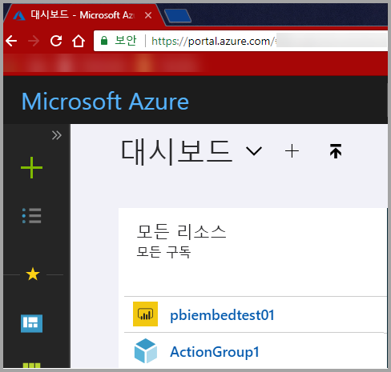

3. 왼쪽 탐색 창에서 **모든 서비스**를 선택하고 **앱 등록**을 선택합니다. 그런 다음, **새 애플리케이션 등록**을 선택합니다.

    </br>

    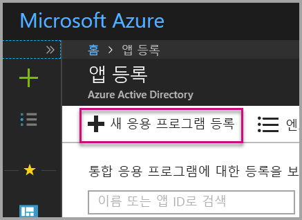

4. 메시지에 따라 새 애플리케이션을 만듭니다. **사용자 소유 데이터**의 경우 **애플리케이션 유형**으로 **웹앱/API**를 사용합니다. Azure AD에서 토큰 응답을 반환하는 데 사용하는 **로그온 URL**을 제공합니다. 사용하는 애플리케이션에 대한 값을 입력합니다. 예를 들면, `http://localhost:13526/`과 같습니다.

    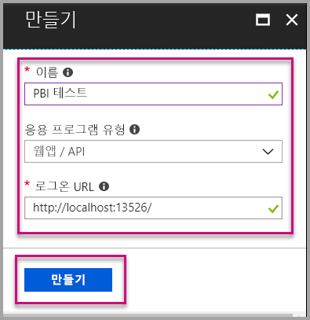

### <a name="apply-permissions-to-your-application-within-azure-active-directory"></a>Azure Active Directory 내 애플리케이션에 권한 적용

앱 등록 페이지에 제공된 것 외에도 애플리케이션에 대한 권한을 사용하도록 설정합니다. 권한을 사용하도록 설정하려면 전역 관리자 계정으로 로그인합니다.

### <a name="use-the-azure-active-directory-portal"></a>Azure Active Directory 포털 사용

1. Azure Portal 내에서 [앱 등록](https://portal.azure.com/#blade/Microsoft_AAD_IAM/ApplicationsListBlade)으로 이동한 후 포함에 사용할 앱을 선택합니다.

    

2. **설정**을 선택합니다. 그런 후 **API 액세스**에서 **필요한 권한**을 선택합니다.

    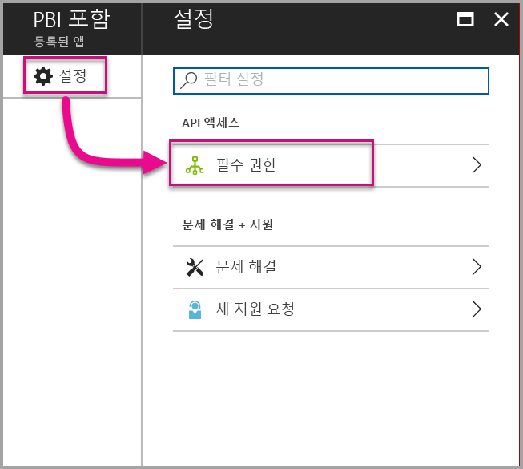

3. **Microsoft Azure Active Directory**를 선택합니다. 그런 후 **로그인한 사용자 권한으로 디렉터리에 액세스**가 선택되어 있는지 확인합니다. **저장**을 선택합니다.

    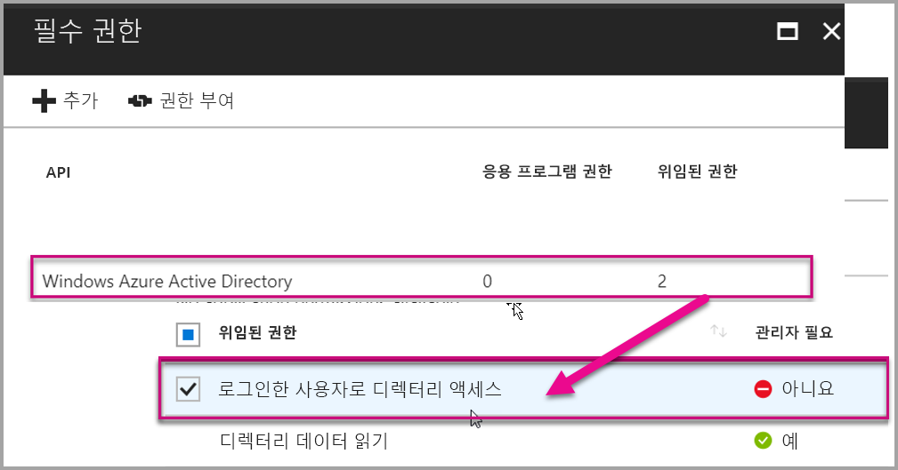

4. **추가**를 선택합니다.

    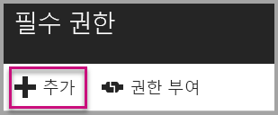

5. **API 선택**을 선택합니다.

    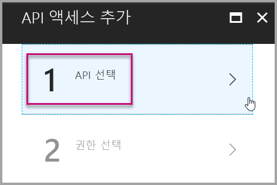

6. **Power BI 서비스**를 선택합니다. 그런 후 **선택**을 선택합니다.

    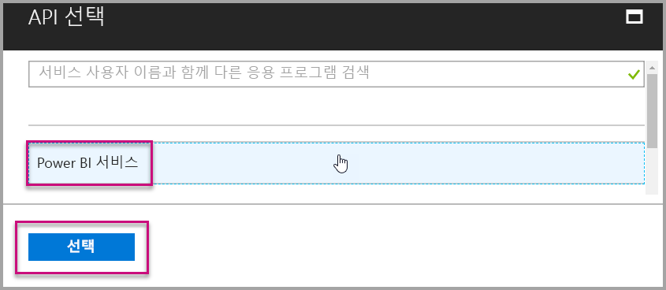

7. **위임된 권한**에서 모든 권한을 선택합니다. 선택 항목을 저장하려면 하나씩 선택합니다. 완료되면 **저장**을 선택합니다.

    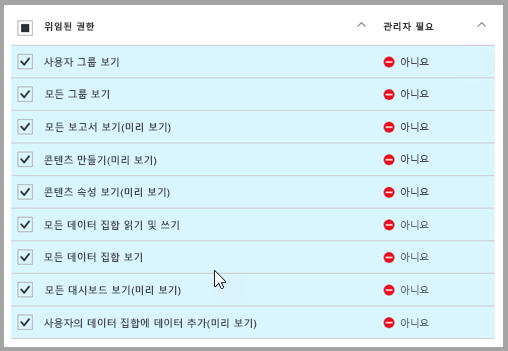

## <a name="set-up-your-power-bi-environment"></a>Power BI 환경 설정

### <a name="create-an-app-workspace"></a>앱 작업 영역 만들기

고객의 보고서, 대시보드 또는 타일을 포함하는 경우 콘텐츠를 앱 작업 영역 내에 배치해야 합니다.

1. 먼저 작업 영역을 만듭니다. **작업 영역** > **앱 작업 영역 만들기**를 선택합니다. 이 작업 영역은 애플리케이션이 액세스해야 하는 콘텐츠를 배치할 위치입니다.

    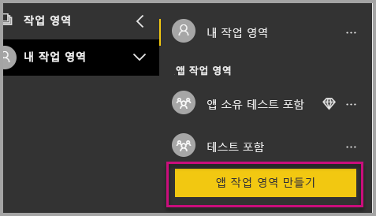

2. 작업 영역에 이름을 지정합니다. 해당하는 **작업 영역 ID**를 사용할 수 없는 경우 편집하여 고유한 ID를 입력합니다. 이 이름은 앱의 이름이기도 해야 합니다.

    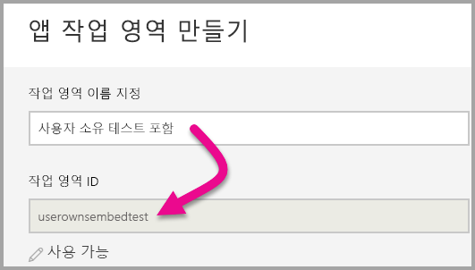

3. 설정할 몇 가지 옵션이 있습니다. **공개**를 선택할 경우 조직의 누구나 작업 영역에 있는 것을 볼 수 있습니다. **비공개**는 해당 작업 영역의 구성원만 콘텐츠를 볼 수 있음을 의미합니다.

    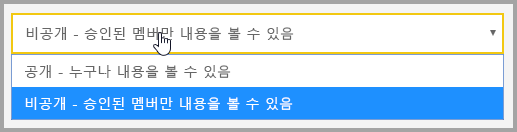

    그룹을 만든 후에 공개 또는 비공개 설정을 변경할 수 없습니다.

4. 또한, 구성원이 편집할 수 있거나 보기 전용 액세스 권한을 가질지도 선택할 수 있습니다.

    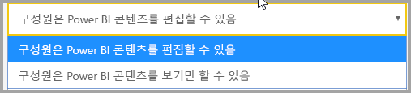

5. 작업 영역에 대한 액세스 권한을 부여할 사람의 메일 주소를 추가하고 **추가**를 선택합니다. 개인이 아닌 그룹 별칭은 추가할 수 없습니다.

6. 각 사용자가 구성원 또는 관리자인지 결정합니다. 관리자는 다른 구성원 추가를 포함해 작업 영역 자체를 편집할 수 있습니다. 구성원은 보기 전용 액세스 권한이 있는 경우를 제외하고 작업 영역의 콘텐츠를 편집할 수 있습니다. 관리자 및 멤버는 앱을 게시할 수 있습니다.

    이제 새 작업 영역을 볼 수 있습니다. Power BI는 작업 영역을 만들고 엽니다. 구성원으로 속해 있는 작업 영역 목록에 나타납니다. 사용자가 관리자이므로, 줄임표(…)를 선택하여 뒤로 이동한 후 새 구성원을 추가하거나 권한을 변경하여 변경 사항을 적용할 수 있습니다.

    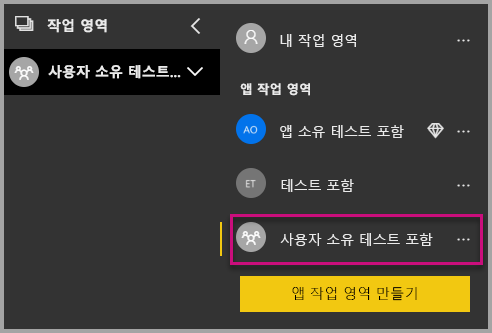

### <a name="create-and-publish-your-reports"></a>보고서 만들기 및 게시

Power BI Desktop을 사용하여 보고서와 데이터 세트를 만들 수 있습니다. 그런 후 해당 보고서를 앱 작업 영역에 게시할 수 있습니다. 보고서를 게시하는 최종 사용자는 앱 작업 영역에 게시하기 위해 Power BI Pro 라이선스가 필요합니다.

1. GitHub에서 샘플 [블로그 데모](https://github.com/Microsoft/powerbi-desktop-samples)를 다운로드합니다.

    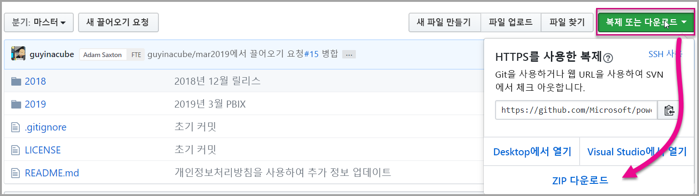

2. Power BI Desktop에서 샘플 .pbix 보고서 열기

   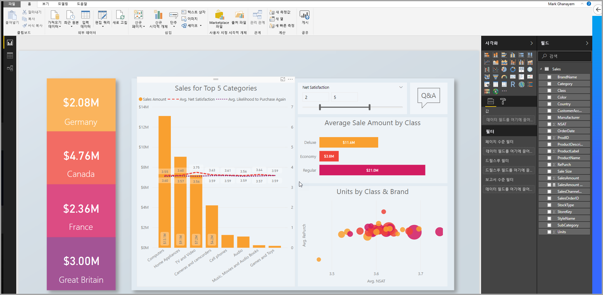

3. 앱 작업 영역에 게시합니다.

   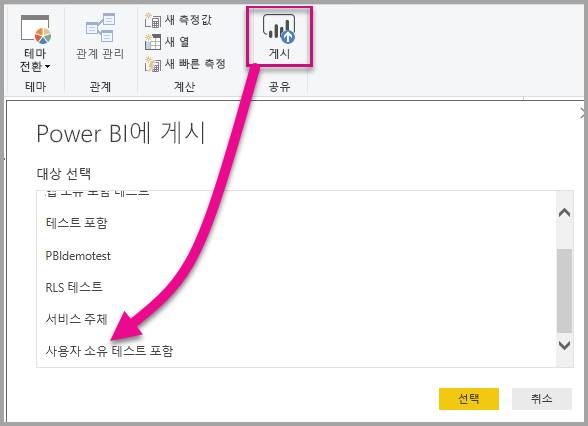

    이제 Power BI 서비스에서 온라인으로 보고서를 볼 수 있습니다.

   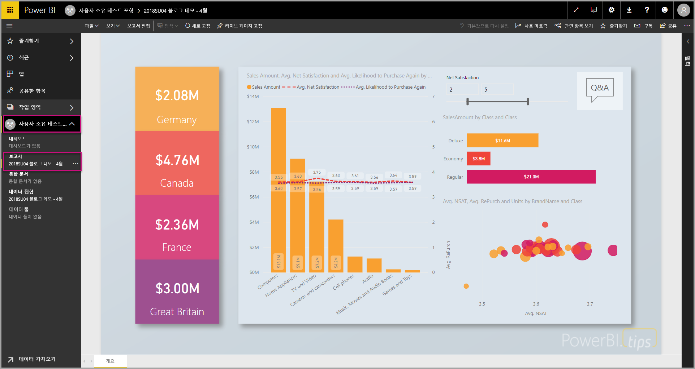

## <a name="embed-your-content-by-using-the-sample-application"></a>샘플 애플리케이션을 사용하여 콘텐츠 포함

샘플 애플리케이션을 사용하여 콘텐츠를 포함하려면 다음 단계를 수행합니다.

1. 시작하려면 GitHub에서 [사용자 소유 데이터 샘플](https://github.com/Microsoft/PowerBI-Developer-Samples)을 다운로드합니다. [보고서](https://github.com/Microsoft/PowerBI-Developer-Samples/tree/master/User%20Owns%20Data/integrate-report-web-app)용, [대시보드](https://github.com/Microsoft/PowerBI-Developer-Samples/tree/master/User%20Owns%20Data/integrate-dashboard-web-app)용 및 [타일](https://github.com/Microsoft/PowerBI-Developer-Samples/tree/master/User%20Owns%20Data/integrate-tile-web-app)용의 세 가지 샘플 애플리케이션이 있습니다. 이 문서에서는 **보고서** 애플리케이션을 참조합니다.

    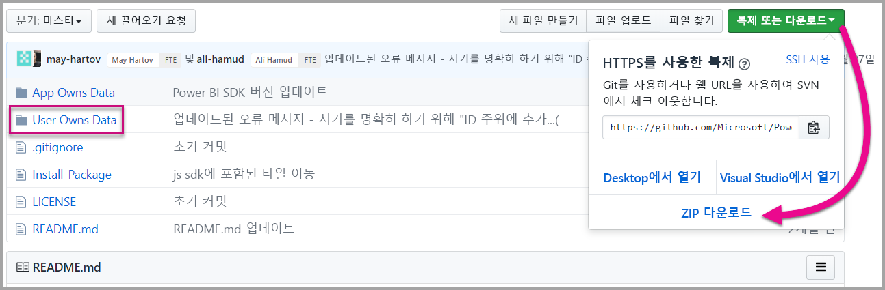

2. 샘플 애플리케이션에서 **Cloud.config** 파일을 엽니다. 애플리케이션을 성공적으로 실행하려면 다음 몇몇 필드를 입력해야 합니다. **ApplicationID** 및 **ApplicationSecret**.

    

    Azure의 **애플리케이션 ID**를 사용하여 **ApplicationID** 정보를 입력합니다. **ApplicationID**는 애플리케이션에서 권한을 요청 중인 사용자에게 애플리케이션을 인식시키는 데 사용됩니다.

    **ApplicationID**를 가져오려면 다음 단계를 수행합니다.

    1. [Azure Portal](https://portal.azure.com)에 로그인합니다.

       

    2. 왼쪽 탐색 창에서 **모든 서비스**를 선택하고 **앱 등록**을 선택합니다.

       

    3. **ApplicationID**를 사용해야 하는 애플리케이션을 선택합니다.

       

    4. GUID로 나열된 **애플리케이션 ID**가 표시되어야 합니다. 이 **애플리케이션 ID**를 애플리케이션의 **ApplicationID**로 사용합니다.

        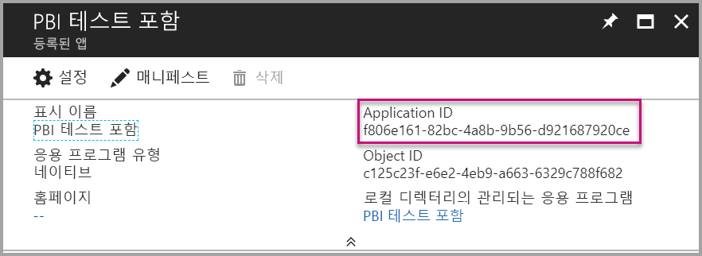

    **Azure**의 **앱 등록** 섹션에 있는 **키** 섹션에서 **ApplicationSecret** 정보를 입력합니다.

    **ApplicationSecret**을 가져오려면 다음 단계를 수행합니다.

    1. [Azure Portal](https://portal.azure.com)에 로그인합니다.

       

    2. 왼쪽 탐색 창에서 **모든 서비스**를 선택하고 **앱 등록**을 선택합니다.

       

    3. **ApplicationSecret**을 사용해야 하는 애플리케이션을 선택합니다.

       

    4. **설정**을 선택합니다.

       

    5. **키**를 선택합니다.

       

    6. **설명** 상자에 이름을 입력하고 지속 기간을 선택합니다. 그런 다음, **저장**을 선택하여 애플리케이션의 **값**을 가져옵니다. 키 값을 저장한 후 **키** 창을 닫으면 값 필드가 숨김으로만 표시됩니다. 이때는 키 값을 검색할 수 없습니다. 키 값을 분실한 경우 Azure Portal에서 새 키 값을 만듭니다.

          

    7. **groupId**에 대해 Power BI의 앱 작업 영역 GUID를 입력합니다.

       

    8. **reportId**에 대해 Power BI의 보고서 GUID를 입력합니다.

       

3. 애플리케이션을 실행합니다.

    **Visual Studio**에서 **실행**을 선택합니다.

    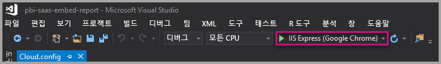

    그런 다음, **보고서 가져오기**를 선택합니다.

    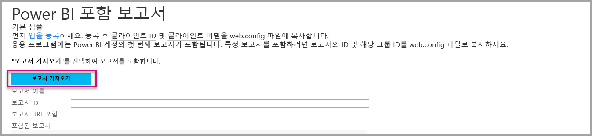

    이제 애플리케이션 예제에서 보고서를 볼 수 있습니다.

    

## <a name="embed-your-content-within-your-application"></a>애플리케이션 내에서 콘텐츠 포함

콘텐츠를 포함하는 단계가 [Power BI REST API](https://docs.microsoft.com/rest/api/power-bi/)를 사용하여 수행할 수 있더라도 이 아티클에 설명된 예제 코드는 .NET SDK를 사용하여 만듭니다.

보고서를 웹앱에 통합하려면 Power BI REST API 또는 Power BI C# SDK를 사용합니다. Azure Active Directory 권한 부여 액세스 토큰을 사용하여 보고서를 가져올 수도 있습니다. 그런 다음, 동일한 액세스 토큰을 사용하여 보고서를 로드합니다. Power BI Rest API는 특정 Power BI 리소스에 대한 프로그래밍 방식 액세스를 제공합니다. 자세한 내용은 [Power BI REST API](https://docs.microsoft.com/rest/api/power-bi/) 및 [Power BI JavaScript API](https://github.com/Microsoft/PowerBI-JavaScript)를 참조하세요.

### <a name="get-an-access-token-from-azure-ad"></a>Azure AD에서 액세스 토큰 가져오기

애플리케이션 내에서 Azure AD에서 액세스 토큰을 가져와야 Power BI REST API로 호출할 수 있습니다. 자세한 내용은 [사용자를 인증하고 Power BI 앱에 대한 Azure AD 액세스 토큰 가져오기](get-azuread-access-token.md)를 참조하세요.

### <a name="get-a-report"></a>보고서 가져오기

Power BI 보고서를 가져오려면, Power BI 보고서 목록을 가져오는 [보고서 가져오기](https://docs.microsoft.com/rest/api/power-bi/reports/getreports) 작업을 사용합니다. 보고서 목록에서 보고서 ID를 가져올 수 있습니다.

### <a name="get-reports-by-using-an-access-token"></a>액세스 토큰을 사용하여 보고서 가져오기

[보고서 가져오기](https://docs.microsoft.com/rest/api/power-bi/reports/getreports) 작업은 보고서 목록을 반환합니다. 보고서 목록에서 단일 보고서를 가져올 수 있습니다.

REST API를 호출하려면 *권한 부여* 헤더를 *Bearer {access token}* 형식으로 포함해야 합니다.

#### <a name="get-reports-with-the-rest-api"></a>REST API를 사용 하 여 보고서 가져오기

다음 코드 샘플은 **REST API**로 보고서를 검색하는 방법을 보여 줍니다.

> [!NOTE]  
> **포함하려는 콘텐츠 항목을 가져오는 샘플은 [샘플 애플리케이션](#embed-your-content-using-the-sample-application)의 Default.aspx.cs** 파일 내에서 사용 가능합니다. 예로는 보고서, 대시보드 또는 타일이 있습니다.

```csharp
using Newtonsoft.Json;

//Get a Report. In this sample, you get the first Report.
protected void GetReport(int index)
{
    //Configure Reports request
    System.Net.WebRequest request = System.Net.WebRequest.Create(
        String.Format("{0}/Reports",
        baseUri)) as System.Net.HttpWebRequest;

    request.Method = "GET";
    request.ContentLength = 0;
    request.Headers.Add("Authorization", String.Format("Bearer {0}", accessToken.Value));

    //Get Reports response from request.GetResponse()
    using (var response = request.GetResponse() as System.Net.HttpWebResponse)
    {
        //Get reader from response stream
        using (var reader = new System.IO.StreamReader(response.GetResponseStream()))
        {
            //Deserialize JSON string
            PBIReports Reports = JsonConvert.DeserializeObject<PBIReports>(reader.ReadToEnd());

            //Sample assumes at least one Report.
            //You could write an app that lists all Reports
            if (Reports.value.Length > 0)
            {
                var report = Reports.value[index];

                txtEmbedUrl.Text = report.embedUrl;
                txtReportId.Text = report.id;
                txtReportName.Text = report.name;
            }
        }
    }
}

//Power BI Reports used to deserialize the Get Reports response.
public class PBIReports
{
    public PBIReport[] value { get; set; }
}
public class PBIReport
{
    public string id { get; set; }
    public string name { get; set; }
    public string webUrl { get; set; }
    public string embedUrl { get; set; }
}
```

#### <a name="get-reports-by-using-the-net-sdk"></a>.NET SDK를 사용하여 보고서 가져오기

.NET SDK를 사용하여 REST API를 직접 호출하는 대신 보고서 목록을 검색할 수 있습니다. 다음 코드 샘플은 보고서를 나열하는 방법을 보여 줍니다.

```csharp
using Microsoft.IdentityModel.Clients.ActiveDirectory;
using Microsoft.PowerBI.Api.V2;
using Microsoft.PowerBI.Api.V2.Models;

var tokenCredentials = new TokenCredentials(<ACCESS TOKEN>, "Bearer");

// Create a Power BI Client object. It is used to call Power BI APIs.
using (var client = new PowerBIClient(new Uri(ApiUrl), tokenCredentials))
{
    // Get the first report all reports in that workspace
    ODataResponseListReport reports = client.Reports.GetReports();

    Report report = reports.Value.FirstOrDefault();

    var embedUrl = report.EmbedUrl;
}
```

### <a name="load-a-report-by-using-javascript"></a>JavaScript를 사용하여 보고서 로드

JavaScript를 사용하여 웹 페이지의 div 요소로 보고서를 로드합니다. 다음 코드 샘플은 제공된 작업 영역에서 보고서를 검색하는 방법을 보여 줍니다.

> [!NOTE]  
> 포함하려는 콘텐츠 항목을 로드하는 샘플은 [샘플 애플리케이션](#embed-your-content-using-the-sample-application)의 **Default.aspx** 파일에 제공됩니다. 예로는 보고서, 대시보드 또는 타일이 있습니다.

```javascript
<!-- Embed Report-->
<div> 
    <asp:Panel ID="PanelEmbed" runat="server" Visible="true">
        <div>
            <div><b class="step">Step 3</b>: Embed a report</div>

            <div>Enter an embed url for a report from Step 2 (starts with https://):</div>
            <input type="text" id="tb_EmbedURL" style="width: 1024px;" />
            <br />
            <input type="button" id="bEmbedReportAction" value="Embed Report" />
        </div>

        <div id="reportContainer"></div>
    </asp:Panel>
</div>
```

#### <a name="sitemaster"></a>Site.master

```javascript
window.onload = function () {
    // client side click to embed a selected report.
    var el = document.getElementById("bEmbedReportAction");
    if (el.addEventListener) {
        el.addEventListener("click", updateEmbedReporte, false);
    } else {
        el.attachEvent('onclick', updateEmbedReport);
    }

    // handle server side post backs, optimize for reload scenarios
    // show embedded report if all fields were filled in.
    var accessTokenElement = document.getElementById('MainContent_accessTokenTextbox');
    if (accessTokenElement !== null) {
        var accessToken = accessTokenElement.value;
        if (accessToken !== "")
            updateEmbedReport();
    }
};

// update embed report
function updateEmbedReport() {

    // check if the embed url was selected
    var embedUrl = document.getElementById('tb_EmbedURL').value;
    if (embedUrl === "")
        return;

    // get the access token.
    accessToken = document.getElementById('MainContent_accessTokenTextbox').value;

    // Embed configuration used to describe the what and how to embed.
    // This object is used when calling powerbi.embed.
    // You can find more information at https://github.com/Microsoft/PowerBI-JavaScript/wiki/Embed-Configuration-Details.
    var config = {
        type: 'report',
        accessToken: accessToken,
        embedUrl: embedUrl
    };

    // Grab the reference to the div HTML element that will host the report.
    var reportContainer = document.getElementById('reportContainer');

    // Embed the report and display it within the div container.
    var report = powerbi.embed(reportContainer, config);

    // report.on will add an event handler which prints to Log window.
    report.on("error", function (event) {
        var logView = document.getElementById('logView');
        logView.innerHTML = logView.innerHTML + "Error<br/>";
        logView.innerHTML = logView.innerHTML + JSON.stringify(event.detail, null, "  ") + "<br/>";
        logView.innerHTML = logView.innerHTML + "---------<br/>";
    }
  );
}
```

## <a name="using-a-power-bi-premium-dedicated-capacity"></a>Power BI Premium 전용 용량 사용

이제 애플리케이션 개발을 완료했으므로 전용 용량을 포함한 앱 작업 영역으로 돌아갈 차례입니다.

### <a name="create-a-dedicated-capacity"></a>전용 용량 만들기

전용 용량을 만들면 앱 작업 영역의 콘텐츠 전용 리소스의 혜택을 활용할 수 있습니다. [Power BI Premium](../service-premium.md)을 사용하여 전용 용량을 만들 수 있습니다.

다음 표에서는 [Microsoft Office 365](../service-admin-premium-purchase.md) 내에서 사용할 수 있는 Power BI Premium SKU를 나열합니다.

| 용량 노드 | 총 vCore<br/>(백 엔드 + 프런트 엔드) | 백 엔드 vCore | 프런트 엔드 vCore | DirectQuery/라이브 연결 제한 |
| --- | --- | --- | --- | --- | --- |
| EM1 |vCore 1개 |vCore 0.5개, 10GB RAM |vCore 0.5개 |초당 3.75 |
| EM2 |vCore 2개 |vCore 1개, 10GB RAM |vCore 1개 |초당 7.5 |
| EM3 |vCore 4개 |vCore 2개, 10GB RAM |vCore 2개 |초당 15 |
| P1 |vCore 8개 |vCore 4개, 25GB RAM |vCore 4개 |초당 30 |
| P2 |vCore 16개 |vCore 8개, 50GB의 RAM |vCore 8개 |초당 60 |
| P3 |vCore 32개 |vCore 16개, 100GB의 RAM |vCore 16개 |초당 120 |
| P4 |vCore 64개 |vCore 32개, 200GB RAM |vCore 32개 |초당 240 |
| P5 |vCore 128개 |vCore 64개, 400GB RAM |vCore 64개 |초당 480 |
> [!NOTE]
> - Microsoft Office 앱에 포함하려는 경우 EM SKU를 사용하여 무료 Power BI 라이선스로 콘텐츠에 액세스할 수 있습니다. 하지만 Powerbi.com 또는 Power BI Mobile을 사용하는 경우 무료 Power BI 라이선스를 사용하여 콘텐츠에 액세스할 수 없습니다.
> - Powerbi.com 또는 Power BI Mobile을 사용하여 Microsoft Office 앱에 포함하려는 경우 무료 Power BI 라이선스로 콘텐츠에 액세스할 수 있습니다.

### <a name="assign-an-app-workspace-to-a-dedicated-capacity"></a>전용 용량에 앱 작업 영역 할당

전용 용량을 만들면 해당 전용 용량에 앱 작업 영역을 할당할 수 있습니다. 이 프로세스를 완료하려면 다음 단계를 수행합니다.

1. Power BI 서비스 내에서 작업 영역을 확장하고 콘텐츠를 포함하는 데 사용하는 작업 영역에 대한 줄임표를 선택합니다. 그런 다음, **작업 영역 편집**을 선택합니다.

    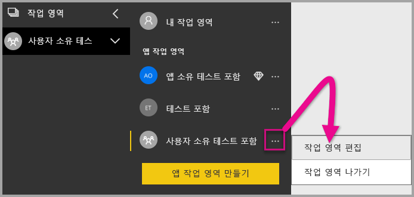

2. **고급**을 확장하고 **전용 용량**을 사용하도록 설정합니다. 만든 전용 용량을 선택합니다. 그런 다음, **저장**을 선택합니다.

    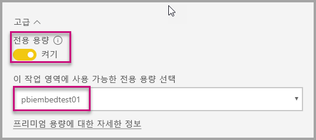

3. **저장**을 선택하면 앱 작업 영역 이름 옆에 다이아몬드가 표시됩니다.

    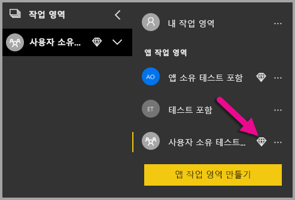

## <a name="admin-settings"></a>관리 설정

전역 관리자 또는 Power BI 서비스 관리자는 테넌트에 REST API를 사용하도록 설정하거나 해제할 수 있습니다. Power BI 관리자는 전체 조직 또는 개별 보안 그룹에 대해 이 설정을 지정할 수 있습니다. 기본적으로 전체 조직에서 사용하도록 설정됩니다. [Power BI 관리 포털](../service-admin-portal.md)에서 이러한 변경 내용을 적용할 수 있습니다.

## <a name="next-steps"></a>다음 단계

이 자습서에서는 Power BI 조직 계정을 사용하여 애플리케이션에 Power BI 콘텐츠를 포함하는 방법을 배웠습니다. 이제 앱을 사용하여 Power BI 콘텐츠를 애플리케이션에 포함할 수 있습니다. 고객을 위해 Power BI 콘텐츠를 포함할 수도 있습니다.

> [!div class="nextstepaction"]
> [앱에서 포함](embed-from-apps.md)

> [!div class="nextstepaction"]
>[고객에 대한 콘텐츠 포함](embed-sample-for-customers.md)

추가 질문이 있는 경우 [Power BI 커뮤니티에 질문합니다](http://community.powerbi.com/).
