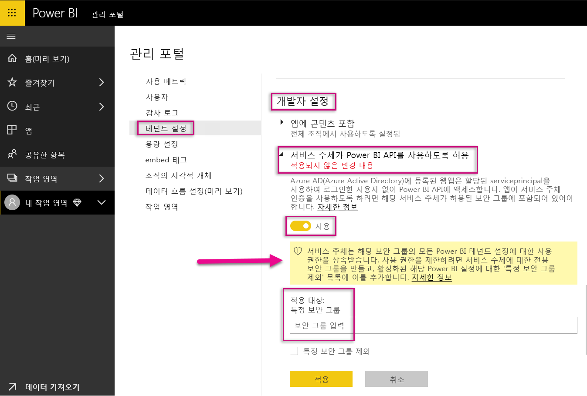
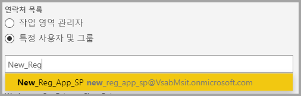
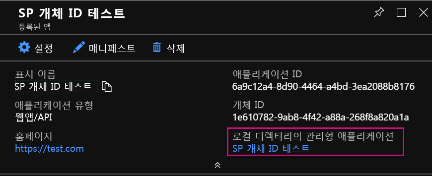
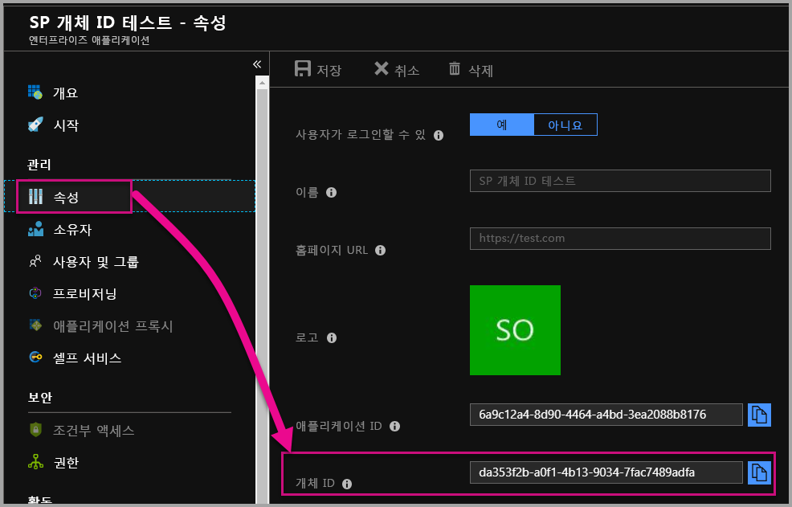

# <a name="service-principal-with-power-bi"></a>Power BI를 포함하는 서비스 주체

**서비스 주체**를 사용하면 Power BI 콘텐츠를 애플리케이션에 포함하고 **앱 전용** 토큰을 사용하여 Power BI와 함께 자동화를 사용할 수 있습니다. 서비스 주체는 **Power BI Embedded**를 사용하거나 **Power BI 작업 및 프로세스를 자동화**할 때 유용합니다.

Power BI Embedded를 사용할 경우 서비스 주체를 사용할 때 이점이 있습니다. 주요 이점은 애플리케이션을 인증하기 위해 마스터 계정(로그인하기 위한 사용자 이름 및 암호에 불과한 Power BI Pro 라이선스)이 필요하지 않다는 것입니다. 서비스 주체는 애플리케이션 ID와 애플리케이션 암호를 사용하여 애플리케이션을 인증합니다.

Power BI 작업을 자동화하는 작업을 할 때는 서비스 주체를 처리하고 관리하는 방법을 스크립팅하여 크기를 조정할 수도 있습니다.

## <a name="application-and-service-principal-relationship"></a>애플리케이션 및 서비스 주체 관계

Azure AD 테넌트를 보호하는 리소스에 액세스하기 위해 액세스가 필요한 엔터티가 보안 주체를 나타냅니다. 이 작업은 사용자(사용자 주체)와 애플리케이션(서비스 주체) 모두에 적용됩니다.

보안 주체는 Azure AD 테넌트의 사용자와 애플리케이션에 대한 액세스 정책 및 사용 권한을 정의합니다. 이 액세스 정책은 로그인 시 사용자 및 애플리케이션 인증과 리소스 액세스 시 권한 부여와 같은 핵심 기능을 사용할 수 있습니다. 자세한 내용은 [AAD(Azure Active Directory)](https://docs.microsoft.com/azure/active-directory/develop/app-objects-and-service-principals)의 애플리케이션 및 서비스 주체를 참조하세요.

Azure Portal에 Azure AD 애플리케이션을 등록할 때 두 개의 개체가 Azure AD 테넌트에 생성됩니다.

* [애플리케이션 개체](https://docs.microsoft.com/azure/active-directory/develop/app-objects-and-service-principals#application-object)
* [서비스 주체 개체](https://docs.microsoft.com/azure/active-directory/develop/app-objects-and-service-principals#service-principal-object)

애플리케이션 개체를 모두 테넌트에서 사용하기 위한 애플리케이션의 *글로벌* 표현으로, 서비스 주체 개체를 특정 테넌트에서 사용하기 위한 *로컬* 표현으로 간주합니다.

애플리케이션 개체는 해당 서비스 주체 개체를 만드는 데 사용하기 위해 공통 및 기본 속성이 *파생*되는 템플릿 역할을 제공합니다.

애플리케이션이 사용되는 테넌트별로 서비스 주체가 필요하며, 이를 통해 테넌트가 보안을 유지하는 로그인 및 액세스에 대한 ID를 설정할 수 있습니다. 단일 테넌트 애플리케이션에는 애플리케이션 등록 시 사용하기 위해 만들어지고 동의한 하나의 서비스 주체(해당 홈 테넌트에 있음)만 있습니다.

## <a name="service-principal-with-power-bi-embedded"></a>Power BI Embedded를 포함하는 서비스 주체

서비스 주체를 사용하면 애플리케이션 ID와 애플리케이션 암호를 사용하여 애플리케이션의 마스터 계정 정보를 마스킹할 수 있습니다. 더 이상 인증을 위해 애플리케이션에 마스터 계정을 하드 코딩할 필요가 없습니다.

**Power BI API** 및 **Power BI .NET SDK**는 이제 서비스 주체를 사용하여 호출을 지원하므로 [Power BI REST API](https://docs.microsoft.com/rest/api/power-bi/) 서비스 주체와 함께 사용할 수 있습니다. 예를 들어 작업 영역 만들기, 작업 영역에서 사용자 추가 또는 제거, 작업 영역으로 콘텐츠 가져오기와 같은 작업 영역을 변경할 수 있습니다.

Power BI 아티팩트 및 리소스가 [새 Power BI 작업 영역](../service-create-the-new-workspaces.md)에 저장되어 있는 경우에만 서비스 주체를 사용할 수 있습니다.

## <a name="service-principal-vs-master-account"></a>서비스 주체 대 마스터 계정

인증에 대한 서비스 주체 및 표준 마스터 계정(Power BI Pro 라이선스)를 사용하는 것 사이에는 차이점이 있습니다. 아래 표는 몇 가지 중요한 차이점을 강조 표시합니다.

| 함수 | 마스터 사용자 계정 <br> (Power BI Pro 라이선스) | 서비스 주체 <br> (앱 전용 토큰) |
|------------------------------------------------------|---------------------|-------------------|
| Power BI 서비스에 로그인할 수 있습니다.  | 예 | 아니요 |
| Power BI 관리 포털에서 사용하도록 설정 | 아니요 | 예 |
| [작업 영역 사용(v1)](../service-create-workspaces.md) | 예 | 아니요 |
| [새 작업 영역 사용(v2)](../service-create-the-new-workspaces.md) | 예 | 예 |
| Power BI Embedded와 함께 사용하는 경우 작업 영역 관리자 필요 | 예 | 예 |
| Power BI REST API 사용 가능 | 예 | 예 |
| 만들려면 글로벌 관리자 필요 | 예 | 아니요 |
| 온-프레미스 데이터 게이트웨이 설치 및 관리 가능 | 예 | 아니요 |

## <a name="get-started-with-a-service-principal"></a>서비스 주체로 시작

기존의 마스터 계정 사용과 달리 서비스 주체(앱 전용 토큰)를 사용하려면 몇 가지 다른 항목을 설정해야 합니다. 서비스 주체(앱 전용 토큰)로 시작하려면 적합한 환경을 설정해야 합니다.

1. AAD(Azure Active Directory)에 [서버 사이드 웹 애플리케이션을 등록](register-app.md)하여 Power BI와 함께 사용합니다. 애플리케이션을 등록한 후 애플리케이션 ID, 애플리케이션 암호 및 서비스 주체 개체 ID를 캡처하여 Power BI 콘텐츠에 액세스할 수 있습니다. [PowerShell](https://docs.microsoft.com/powershell/azure/create-azure-service-principal-azureps?view=azps-1.1.0)을 사용하여 서비스 주체를 만들 수 있습니다.

    다음은 새 Azure Active Directory 애플리케이션을 만드는 샘플 스크립트입니다.

    ```powershell
    # The app id - $app.appid
    # The service principal object id - $sp.objectId
    # The app key - $key.value

    # Sign in as a user that is allowed to create an app.
    Connect-AzureAD

    # Create a new AAD web application
    $app = New-AzureADApplication -DisplayName "testApp1" -Homepage "https://localhost:44322" -ReplyUrls "https://localhost:44322"

    # Creates a service principal
    $sp = New-AzureADServicePrincipal -AppId $app.AppId

    # Get the service principal key.
    $key = New-AzureADServicePrincipalPasswordCredential -ObjectId $sp.ObjectId
    ```

   > [!Important]
   > 서비스 주체를 Power BI와 함께 사용하도록 설정하면 애플리케이션의 AD 사용 권한이 더 이상 적용되지 않습니다. 애플리케이션 사용 권한은 Power BI 관리 포털을 통해 관리됩니다.

2.  **권장** - AAD(Azure Active Directory)의 보안 그룹을 만들고, 사용자가 만든 [애플리케이션](https://docs.microsoft.com/azure/active-directory/develop/app-objects-and-service-principals)을 해당 보안 그룹에 추가합니다. [PowerShell](https://docs.microsoft.com/powershell/azure/create-azure-service-principal-azureps?view=azps-1.1.0)을 사용하여 AAD 보안 그룹을 만들 수 있습니다.

    아래는 새 보안 그룹을 만들고 해당 보안 그룹에 애플리케이션을 추가하는 샘플 스크립트입니다.

    ```powershell
    # Required to sign in as a tenant admin
    Connect-AzureAD

    # Create an AAD security group
    $group = New-AzureADGroup -DisplayName <Group display name> -SecurityEnabled $true -MailEnabled $false -MailNickName notSet

    # Add the service principal to the group
    Add-AzureADGroupMember -ObjectId $($group.ObjectId) -RefObjectId $($sp.ObjectId)
    ```

3. Power BI 관리자는 Power BI 관리 포털의 **개발자 설정**에서 서비스 주체를 활성화해야 합니다. Azure AD에서 만든 보안 그룹을 **개발자 설정**의 특정 보안 그룹 섹션에 추가합니다. 전체 조직에 대한 서비스 주체 액세스를 활성화할 수도 있습니다. 이 경우 2단계는 필요하지 않습니다.

   > [!Important]
   > 서비스 주체는 전체 조직에 대해 설정되거나 서비스 주체가 그룹의 일부로 포함된 보안 그룹에 대해 설정되는 모든 테넌트 설정에 액세스할 수 있습니다. 특정 테넌트 설정에 대한 서비스 주체 액세스 권한을 제한하려면 특정 보안 그룹에 대한 액세스 권한만을 허용하거나 서비스 주체에 대해 전용 보안 그룹을 만들고 제외시킵니다.

    

4. [Power BI 환경](embed-sample-for-customers.md#set-up-your-power-bi-environment)을 설정합니다.

5. 생성한 새 작업 영역에 서비스 주체를 **관리자**로 추가합니다. 이 작업은 [API](https://docs.microsoft.com/rest/api/power-bi/groups/addgroupuser) 또는 Power BI 서비스를 통해 관리할 수 있습니다.

    

6. 이제 샘플 애플리케이션 내에서 또는 자체 애플리케이션 내에서 콘텐츠를 포함하도록 선택합니다.

    * [샘플 애플리케이션을 사용하여 콘텐츠 포함](embed-sample-for-customers.md#embed-content-using-the-sample-application)
    * [애플리케이션 내에서 콘텐츠 포함](embed-sample-for-customers.md#embed-content-within-your-application)

7. 이제 [프로덕션으로 이동](embed-sample-for-customers.md#move-to-production)할 준비가 되었습니다.

## <a name="migrate-to-service-principal"></a>서비스 주체로 마이그레이션

현재 Power BI 또는 Power BI Embedded와 함게 마스터 계정을 사용하는 경우 서비스 주체를 사용하기 위해 마이그레이션할 수 있습니다.

[서비스 주체로 시작](#get-started-with-a-service-principal) 섹션의 처음 세 단계를 완료하고, 완료되면 아래 정보를 따릅니다.

이미 Power BI에서 [새 작업 영역](../service-create-the-new-workspaces.md)을 사용하고 있는 경우 서비스 주체를 Power BI 아티팩트가 있는 작업 영역에 **관리자**로 추가합니다. 그러나 [기존 작업 영역](../service-create-workspaces.md)을 사용하는 경우에는 Power BI 아티팩트 및 리소스를 새 작업 영역으로 복사 또는 이동한 다음, 서비스 주체를 해당 작업 영역에 **관리자**로 추가합니다.

Power BI 아티팩트 및 리소스를 작업 영역 간에 이동하는 UI 기능이 없으므로 이 작업을 수행하려면 [API](https://powerbi.microsoft.com/pt-br/blog/duplicate-workspaces-using-the-power-bi-rest-apis-a-step-by-step-tutorial/)를 사용해야 합니다. 서비스 주체와 함께 API를 사용할 경우 서비스 주체 개체 ID가 필요합니다.

### <a name="how-to-get-the-service-principal-object-id"></a>서비스 주체 개체 ID를 가져오는 방법

서비스 주체를 새 작업 영역에 할당하려면 [Power BI REST API](https://docs.microsoft.com/rest/api/power-bi/groups/addgroupuser)를 사용합니다. 작업을 위해 서비스 주체를 참조하거나 변경하려면 **서비스 주체 개체 ID**를 사용합니다(예: 서비스 주체를 작업 영역에 관리자로 적용).

다음은 Azure Portal에서 서비스 주체 개체 ID를 가져오는 단계입니다.

1. Azure Portal에 새 앱 등록을 만듭니다.  

2. 그런 다음, **로컬 디렉터리의 관리되는 애플리케이션**에서 만든 애플리케이션의 이름을 선택합니다.

   

    > [!NOTE]
    > 위의 이미지에서 개체 ID는 서비스 주체와 함께 사용되는 것이 아닙니다.

3. 개체 ID를 보려면 **속성**을 선택합니다.

    

다음은 PowerShell을 사용하여 서비스 주체 개체 ID를 검색하는 샘플 스크립트입니다.

   ```powershell
   Get-AzureADServicePrincipal -Filter "DisplayName eq '<application name>'"
   ```

## <a name="considerations-and-limitations"></a>고려 사항 및 제한 사항

* 서비스 주체는 [새 작업 영역](../service-create-the-new-workspaces.md)에서만 작동합니다.
* 서비스 주체 사용 시 **내 작업 영역**이 지원되지 않습니다.
* 프로덕션으로 이동 시 전용 용량이 필요합니다.
* 서비스 주체를 사용하여 Power BI 포털에 로그인할 수 없습니다.
* Power BI 관리자 권한은 Power BI 관리 포털의 개발자 설정에서 서비스 주체를 활성화하는 데 필요합니다.
* 서비스 주체를 사용하여 온-프레미스 데이터 게이트웨이를 설치하거나 관리할 수 없습니다.
* [조직에 포함](embed-sample-for-your-organization.md) 애플리케이션은 서비스 주체를 사용할 수 없습니다.
* [데이터 흐름](../service-dataflows-overview.md) 관리는 지원되지 않습니다.
* 서비스 주체는 현재 모든 관리 API를 지원하지 않습니다.
* [Azure Analysis Services](https://docs.microsoft.com/azure/analysis-services/analysis-services-overview) 데이터 원본과 함께 서비스 주체를 사용하는 경우 서비스 주체 자체에 Azure Analysis Services 인스턴스 권한이 있어야 합니다. 서비스 주체가 포함된 보안 그룹을 이 목적으로 사용할 수는 없습니다.

## <a name="next-steps"></a>다음 단계

* [앱 등록](register-app.md)
* [고객을 위한 Power BI Embedded](embed-sample-for-customers.md)
* [Azure Active Directory의 애플리케이션 및 서비스 주체 개체](https://docs.microsoft.com/azure/active-directory/develop/app-objects-and-service-principals)
* [서비스 주체가 있는 온-프레미스 데이터 게이트웨이를 사용하는 행 수준 보안](embedded-row-level-security.md#on-premises-data-gateway-with-service-principal)
