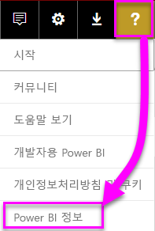
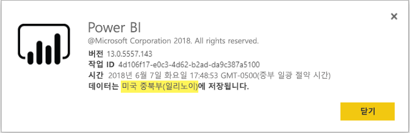

# <a name="frequently-asked-questions-about-power-bi-embedded"></a>Power BI Embedded에 대한 질문과 대답

* 다른 질문이 있는 경우 [Power BI 커뮤니티에 질문합니다](http://community.powerbi.com/).
* 여전히 문제가 있나요? [Power BI 지원 페이지](https://powerbi.microsoft.com/support/)를 방문하세요.

## <a name="general"></a>일반

### <a name="what-is-power-bi-embedded"></a>Power BI Embedded는 무엇인가요?

Microsoft PBIE(Power BI Embedded)를 사용하면 응용 프로그램 개발자는 자체 데이터 시각화 및 컨트롤을 처음부터 새로 만들 필요 없이 완전한 대화형 보고서를 포함할 수 있습니다.

### <a name="who-is-the-target-audience-for-power-bi-embedded"></a>Power BI Embedded의 대상 그룹은 누구인가요?

자체 응용 프로그램을 만드는 개발자 및 소프트웨어 회사를 말하며 ISV(독립 소프트웨어 공급업체)라고도 합니다.

### <a name="how-is-power-bi-embedded-different-from-power-bi-the-service"></a>Power BI Embedded는 Power BI 서비스와 어떤 차이가 있나요?

Power BI Embedded는 분석 솔루션을 처음부터 새로 만들지 않고 응용 프로그램을 빌드한 후 고객의 의사 결정을 도와주는 시각적 개체를 해당 응용 프로그램에 포함하려는 ISV 또는 개발자를 위한 것입니다. 비즈니스 사용자는 포함된 분석 서비스를 사용하여 비즈니스 데이터에 액세스하고 응용 프로그램 내에서 이 데이터를 사용하여 고급 정보를 생성하는 쿼리를 수행할 수 있습니다.

Power BI는 조직의 가장 중요한 비즈니스 데이터의 단일 보기를 제공하는 SaaS(Software as a Service) 분석 솔루션입니다.

### <a name="what-is-the-difference-between-power-bi-premium-and-power-bi-embedded"></a>Power BI Premium과 Power BI Embedded의 차이점은 무엇인가요?

Power BI Premium은 조직, 파트너, 고객 및 공급업체에 대한 단일 보기를 제공하는 완전한 BI 솔루션을 원하는 기업 고객을 위한 용량입니다. Power BI Premium은 조직의 의사 결정을 도와줍니다. Power BI Premium은 SaaS 제품이며 사용자가 Power BI 포털, 모바일 앱 및 내부에서 개발한 응용 프로그램을 통해 콘텐츠를 사용하는 기능을 기본적으로 제공합니다.

Power BI Embedded는 응용 프로그램을 빌드하고 시각적 개체를 포함하려는 ISV 또는 개발자를 위한 용량입니다. Power BI Embedded는 고객의 의사 결정에 도움을 줍니다. 왜냐하면 Power BI Embedded는 응용 프로그램 개발자를 위한 용량이며 해당 응용 프로그램 고객은 조직 내부 또는 외부의 아무 사용자를 포함하여 Power BI Embedded 용량에 저장된 콘텐츠를 사용할 수 있기 때문입니다. Power BI Embedded 용량 콘텐츠는 한 번 클릭으로 웹 게시 또는 한 번 클릭으로 SharePoint 게시를 통해 공유할 수 없으며, SSRS 보고서를 지원하지 않습니다.

### <a name="what-is-the-microsoft-recommendation-for-when-a-customer-should-buy-power-bi-premium-vs-power-bi-embedded"></a>고객이 Power BI Premium 또는 Power BI Embedded 중에 하나를 구매해야 하는 경우 Microsoft에서는 무엇을 추천하나요?

Microsoft는 기업 고객에게는 엔터프라이즈급 셀프 서비스 클라우드 BI 솔루션인 Power BI Premium을, ISV에게는 클라우드 기반의 포함된 분석 구성 요소인 Power BI Embedded를 추천합니다. 그러나 고객이 구매할 수 있는 제품에는 제한이 없습니다.

ISV(일반적으로 대규모)가 P SKU를 사용하여 조직 내에서 사전 패키지 Power BI 서비스의 추가 이점을 누리는 동시에 응용 프로그램에 포함하려는 경우가 있을 수 있습니다. 일부 기업에서는 사용하기로 할 수 있습니다. 기간 업무 애플리케이션을 빌드하고 여기에 분석 기능을 포함하는 데에만 관심이 있고 사전 패키지 Power BI 서비스에는 관심이 없는 기업은 Azure의 A SKU를 사용할 수 있습니다.

### <a name="how-many-embed-tokens-can-i-create"></a>얼마나 많은 포함 토큰을 만들 수 있나요?

PRO 라이선스가 있는 포함 토큰은 개발 테스트용이므로 Power BI 마스터 계정에서 생성할 수 있는 포함 토큰의 수는 제한적입니다. 프로덕션 환경에 포함하려면 [용량을 구입](#technical)해야 합니다. 용량을 구입할 때 생성할 수 있는 포함 토큰 수에는 제한이 없습니다. [사용 가능한 기능](https://docs.microsoft.com/rest/api/power-bi/availablefeatures)으로 이동하여 현재 포함된 사용 현황을 백분율로 표시하는 사용 값을 확인합니다.

## <a name="technical"></a>기술

### <a name="what-is-the-difference-between-the-a-skus-in-azure-and-the-em-skus-in-office-365"></a>Azure의 A SKU와 Office 365의 EM SKU는 어떤 차이가 있나요?

PowerBI.com은 Software as a Service 제안에 소셜 공동 작업, 이메일 구독 등의 여러 기능을 포함한 엔터프라이즈 솔루션입니다.

Power BI Embedded는 Platform as a Service에서 포함된 분석 솔루션을 만드는 개발자를 위한 API 집합입니다. Embedded 분석 시나리오의 경우 PowerBI.com을 사용하여 ISV 및 개발자의 포함된 분석 솔루션 콘텐츠 및 테넌트 수준 설정 관리를 도와주어야 합니다.

다음은 기능상 차이점의 일부 목록입니다.

| 특정 | Power BI Embedded | Power BI Premium 용량 | Power BI Premium 용량 |
|----------------------------------------------------------------------------------|-------------------|---------------------------|---------------------------|
|   | (A SKU) | (EM SKU) | (P SKU) |
| Power BI 앱 작업 영역의 아티팩트 포함 | Azure 용량 | Office 365 용량 | Office 365 용량 |
| Embedded 응용 프로그램에서 Power BI 보고서 사용 | 예 | 예 | 예 |
| SharePoint에서 Power BI 보고서 사용 | 아니요 | 예 | 예 |
| Dynamics에서 Power BI 보고서 사용 | 아니요 | 예 | 예 |
| Teams에서 Power BI 보고서 사용(모바일 앱 제외) | 아니요 | 예 | 예 |
| Powerbi.com 및 Power BI 모바일에서 무료 Power BI 라이선스를 사용하여 콘텐츠 액세스 | 아니요 | 아니요 | 예 |
| MS Office 앱에 포함된 무료 Power BI 라이선스를 사용하여 콘텐츠에 액세스 | 아니요 | 예 | 예 |

### <a name="power-bi-now-offers-three-skus-for-embedding-a-skus-em-skus-and-p-skus-which-one-should-i-purchase-for-my-scenario"></a>이제 Power BI는 A SKU, EM SKU, P SKU의 세 가지 SKU를 포함할 수 있습니다. 제 시나리오에는 어떤 용량을 구매해야 하나요?

|  |A SKU(Power BI Embedded)  |EM SKU(Power BI Premium)  |P SKU(Power BI Premium)  |
|---------|---------|---------|---------|
|구입  |Azure Portal |Office |Office |
|사용 사례 | 자체 응용 프로그램에 콘텐츠 포함 | <li> 자체 응용 프로그램에 콘텐츠 포함 <br><br></br> <li> MS Office 응용 프로그램에 콘텐츠 포함: <br> - [SharePoint](https://powerbi.microsoft.com/blog/integrate-power-bi-reports-in-sharepoint-online/) <br> - [Teams(모바일 앱 제외)](https://powerbi.microsoft.com/blog/power-bi-teams-up-with-microsoft-teams/) <br> - [Dynamics 365](https://docs.microsoft.com/dynamics365/customer-engagement/basics/add-edit-power-bi-visualizations-dashboard) | <li> 자체 응용 프로그램에 콘텐츠 포함 <br><br></br> <li> MS Office 응용 프로그램에 콘텐츠 포함: <br> - [SharePoint](https://powerbi.microsoft.com/blog/integrate-power-bi-reports-in-sharepoint-online/) <br> - [Teams(모바일 앱 제외)](https://powerbi.microsoft.com/blog/power-bi-teams-up-with-microsoft-teams/) <br> - [Dynamics 365](https://docs.microsoft.com/dynamics365/customer-engagement/basics/add-edit-power-bi-visualizations-dashboard) <br><br></br> <li> [Power BI 서비스](https://powerbi.microsoft.com/en-us/)를 통해 Power BI 사용자와 콘텐츠 공유  |
|청구 |시간별 |매월 |매월 |
|약정  |약정 없음 |매년  |매월/매년 |
|차별화 |탁월한 탄력성 - Azure Portal에서 또는 API를 통해 리소스를 강화/규모 축소, 일시 중지/다시 시작 가능  |SharePoint Online 및 Microsoft Teams(모바일 앱 제외)에 콘텐츠를 포함하는 데 사용 가능 |응용 프로그램에 포함 및 Power BI 서비스 사용을 동일한 용량에 결합 |

### <a name="what-are-the-prerequisites-to-create-a-pbie-capacity-in-azure"></a>Azure에서 PBIE 용량을 만드는 필수 구성 요소는 무엇인가요?

* 조직 디렉토리에 로그인해야 합니다(MSA 계정은 지원되지 않음).
* Power BI 테넌트가 있어야 합니다. 즉, 디렉터리에 있는 한 명 이상의 사용자가 Power BI에 가입해야 합니다. 
* 조직 디렉토리에 Azure 구독이 있어야 합니다.

### <a name="how-can-i-monitor-power-bi-embedded-capacity-consumption"></a>Power BI Embedded 용량 소비를 모니터링하려면 어떻게 하나요?

* [Power BI 관리 포털](../service-admin-portal.md#power-bi-embedded) 사용

* Power BI에서 [메트릭 앱](https://review.docs.microsoft.com/power-bi/service-admin-premium-monitor-capacity) 다운로드

* [Azure 진단 로깅](azure-pbie-diag-logs.md) 사용

### <a name="will-my-capacity-scale-automatically-to-adjust-to-the-consumption-of-my-app"></a>앱의 소비량에 따라 용량이 자동으로 조정되나요?

아직은 자동 조정 기능이 없지만, 언제든지 조정할 수 있도록 모든 API가 제공됩니다.

### <a name="why-creatingscalingresuming-a-capacity-results-in-putting-the-capacity-into-a-suspended-state"></a>용량을 만들기/크기 조정/다시 시작하면 용량을 일시 중단된 상태로 전환하는 이유는 무엇인가요?

용량의 프로비전(확장/다시 시작/만들기)에 실패할 수 있습니다. 프로비전 호출의 호출자는 세부 정보 가져오기 API [용량-세부 정보 가져오기](https://docs.microsoft.com/rest/api/power-bi-embedded/capacities/getdetails)를 사용하여 용량의 ProvisioningState를 확인해야 합니다.

### <a name="why-can-i-only-create-pbie-in-a-specific-region"></a>특정 지역에서만 PBIE를 만들 수 있는 이유는 무엇인가요?

PBI 테넌트 지역에서만 PBIE 용량을 만들 수 있습니다.

### <a name="how-can-i-find-what-is-my-pbi-tenant-region"></a>내 PBI 테넌트 지역을 어떻게 찾을 수 있나요?

PBI 포털을 사용하여 PBI 테넌트 지역을 이해할 수 있습니다.

[https://app.powerbi.com/](https://app.powerbi.com/) > ? > Power BI 정보




### <a name="what-is-supported-with-the-cloud-solution-provider-csp-channel"></a>CSP(클라우드 솔루션 공급자) 채널에서 지원되는 기능은 무엇인가요?

* 구독 형식 CSP를 사용하여 테넌트에 대한 PBIE를 만들 수 있습니다.
* 파트너 계정은 고객 테넌트에 로그인하고 고객 테넌트에 대한 PBIE를 구매하여 고객 테넌트 사용자를 Power BI 용량 관리자로 지정합니다.

### <a name="why-do-i-get-an-unsupported-account-message"></a>지원되지 않는 계정 메시지를 받은 이유는 무엇인가요?

Power BI에서는 조직 계정에 등록해야 합니다. MSA(Microsoft 계정)를 사용하여 Power BI에 등록하는 작업은 지원되지 않습니다.

### <a name="can-i-use-apis-to-create--manage-azure-capacities"></a>Azure 용량을 만들고 관리하는 데 API를 사용할 수 있나요?

예, PBIE 리소스를 만들고 관리하는 데 사용할 수 있는 PowerShell cmdlet 및 Azure Resource Manager API가 있습니다.

* REST API - https://docs.microsoft.com/rest/api/power-bi-embedded/
* PowerShell cmdlet - https://docs.microsoft.com/powershell/module/azurerm.powerbiembedded/

### <a name="what-is-the-pbi-embedded-dedicated-capacity-role-in-a-pbi-embedded-solution"></a>PBI Embedded 솔루션에 포함된 PBI Embedded 전용 용량 역할은 무엇인가요?

[솔루션의 수준을 프로덕션으로 올리기](https://docs.microsoft.com/power-bi/developer/embedding-content#step-3-promote-your-solution-to-production) 위해서는 Power BI 콘텐츠(응용 프로그램에서 사용 중인 앱 작업 영역)를 Power BI Embedded(A SKU) 용량에 할당해야 합니다.

### <a name="what-are-the-azure-regions-pbi-embedded-is-available"></a>PBI Embedded를 사용 가능한 Azure 지역은 어디인가요?

[PAM](https://ecosystemmanager.azurewebsites.net/home)(EcoManager) - 제품 가용성 관리자를 참조하세요.

사용 가능한 지역(Power BI와 동일한 16개 지역)

* 미국(6) - 미국 동부, 미국 동부 2, 미국 중북부, 미국 중남부, 미국 서부, 미국 서부 2
* 유럽(2) - 유럽 북부, 유럽 서부
* 아시아 태평양(2) - 동남 아시아, 동아시아
* 브라질(1) - 브라질 남부
* 일본(1) - 일본 동부
* 오스트레일리아(1) - 오스트레일리아 남동부
* 인도(1) - 인도 서부
* 캐나다(1) - 캐나다 중부
* 영국(1) - 영국 남부

### <a name="what-is-the-authentication-model-for-power-bi-embedded"></a>Power BI Embedded의 인증 모델은 무엇인가요?

Power BI Embedded는 앞으로도 계속해서 마스터 사용자 인증(지정된 Power BI Pro 라이선스 사용자)에 Azure AD를 사용하여 Power BI 내에서 응용 프로그램을 인증할 것입니다.

응용 프로그램 사용자의 인증 및 권한 부여는 ISV를 통해 구현되고, ISV는 자체 응용 프로그램에 맞는 자체 인증을 구현할 수 있습니다.

이미 Azure AD 테넌트가 있는 경우 기존 디렉터리를 사용해도 되고, 포함된 응용 프로그램 콘텐츠 보안을 위해 Azure AD 테넌트를 새로 만들어도 됩니다.

AAD 토큰을 가져오려면 Azure Active Directory 인증 라이브러리(https://docs.microsoft.com/azure/active-directory/develop/active-directory-authentication-libraries) 중 하나를 사용할 수 있습니다. 여러 플랫폼에서 사용할 수 있는 클라이언트 라이브러리가 있습니다.

### <a name="my-application-already-uses-aad-for-user-authentication-how-can-we-use-this-identity-when-authenticating-to-power-bi-in-an-user-owns-data-scenario"></a>내 응용 프로그램은 사용자 인증에 이미 AAD를 사용합니다. “사용자가 데이터 소유” 시나리오에서 Power BI에 인증할 때 이 ID를 사용하려면 어떻게 하나요?

흐름 대신 표준 OAuth입니다(https://docs.microsoft.com/azure/active-directory/develop/active-directory-authentication-scenarios#web-application-to-web-api). 응용 프로그램은 필수 범위에서 Power BI 서비스에 대한 사용 권한이 필요하도록 구성되어야 합니다. 또한 앱에 사용자 토큰을 만들면 사용자 액세스 토큰을 사용하여 ADAL API AcquireTokenAsync에 간단히 호출하고 Power BI 리소스 URL을 리소스 ID로 지정합니다. 수행 방법을 보여주는 코드 조각은 아래를 참조하세요.

```csharp
var context = new AD.AuthenticationContext(authorityUrl);
var userAssertion = new AD.UserAssertion(userAccessToken);
var clientAssertion = new AD.ClientAssertionCertificate(MyAppId, MyAppCertificate)
var authenticationResult = await context.AcquireTokenAsync(resourceId, clientAssertion, userAssertion);
```

### <a name="how-is-power-bi-embedded-different-from-other-azure-services"></a>Power BI Embedded는 다른 Azure 서비스와 어떤 차이가 있나요?

ISV/개발자는 Azure에서 Power BI Embedded를 구매하려면 Power BI 계정이 필요합니다. Power BI Embedded 배포 지역은 Power BI 계정에 따라 결정됩니다. Azure에서 Power BI Embedded 리소스를 관리하여 다음 작업을 수행할 수 있습니다.

* 강화/규모 축소
* 용량 관리자 추가
* 서비스 일시 중지/다시 시작

PowerBI.com을 사용하여 Power BI Embedded 용량에 작업 영역을 할당/할당 취소.

### <a name="what-deploy-regions-are-supported"></a>지원되는 배포 영역은 어디인가요?

오스트레일리아 남동부, 브라질 남부, 캐나다 중부, 미국 동부 2, 인도 서부, 일본 동부, 미국 중북부, 북유럽, 미국 중남부, 동남 아시아, 영국 남부, 유럽 서부, 미국 서부 및 미국 서부 2입니다.

### <a name="what-type-of-content-pack-data-can-be-embedded"></a>어떤 유형의 콘텐츠 팩 데이터를 포함할 수 있나요?

콘텐츠 팩 데이터 집합에서 빌드된 **대시보드** 및 **타일**은 *포함이 불가능*하지만, 콘텐츠 팩 데이터 집합에서 작성한 **보고서**는 *포함 가능*합니다.

### <a name="what-is-the-difference-between-using-rls-vs-javascript-filters"></a>RLS 대 JavaScript 필터 사용의 차이점은 무엇인가요?

RLS 대 JavaScript 필터를 사용할 때 종종 혼동이 있습니다. 한 방법에서는 특정 사용자가 볼 수 있는 내용의 제어를 다루고, 다른 방법에서는 사용자의 보기 최적화를 다루기 때문입니다.

RLS의 경우 ISV 개발자는 모델 및 포함 토큰 생성의 일부로 데이터 필터링을 제어합니다. 최종 사용자는 ISV가 사용자에게 보도록 허용한 내용만 볼 수 있습니다. 이 경우 사용자는 필터링되는 것보다 적은 내용을 볼 수 있지만, RLS 구성을 무시하고 허용되는 것보다 더 많은 내용을 볼 수는 없습니다.

클라이언트 쪽 필터링(JavaScript)의 경우 ISV는 초기 보기에서 최종 사용자에게 표시되는 내용을 결정할 수 있지만, 최종 사용자가 보기 자체에 적용할 수 있는 변경 사항은 제어할 수 없습니다. 데이터 필터링이 백엔드에서 발생할 수 있지만 JavaScript 클라이언트 코드에 의해 트리거되므로, 최종 사용자가 이를 변경할 수 있으며 이는 안전하다고 간주할 수 없습니다.

자세한 내용은 [RLS 대 JavaScript 필터](embedded-row-level-security.md#using-rls-vs-javascript-filters)를 참조하세요.

## <a name="licensing"></a>라이선싱

### <a name="how-do-i-purchase-power-bi-embedded"></a>Power BI Embedded를 구매하려면 어떻게 하나요?

Power BI Embedded는 Azure를 통해 제공됩니다.

### <a name="what-happens-if-i-already-purchased-power-bi-premium-and-now-i-want-some-of-the-benefits-of-power-bi-embedded-in-azure"></a>이미 Power BI Premium을 구입했는데 Azure에서 Power BI Embedded의 일부 이점을 사용하고 싶으면 어떻게 하나요?

고객은 계약 기간이 종료될 때까지는 기존에 구매한 Power BI Premium 요금을 계속 지불해야 하며, 기간이 종료되면 해당 시점의 상황을 보고 Power BI Premium을 전환하면 됩니다.

### <a name="do-i-still-have-to-buy-power-bi-premium-to-get-access-to-power-bi-embedded"></a>Power BI Embedded에 액세스하려면 Power BI Premium을 구매해야 하나요?

아니요, Power BI Embedded는 고객에게 솔루션을 배포해야 하는 Azure 기반 용량을 포함하고 있습니다.

### <a name="whats-the-purchase-commitment-for-power-bi-embedded"></a>Power BI Embedded의 구매 약정은 어떻게 되나요?

고객은 시간 단위로 사용량을 변경할 수 있습니다. Power BI Embedded 서비스는 월별 또는 연간 약정이 없습니다.

### <a name="how-does-the-usage-of-power-bi-embedded-show-up-on-my-bill"></a>청구서에 Power BI Embedded 사용량이 어떻게 표시되나요?

Power BI Embedded는 배포된 노드 유형을 기반으로 예측 가능한 시간당 요금이 청구됩니다. 리소스가 활성화되어 있는 한 사용하지 않는 경우에도 비용이 청구됩니다. 비용 청구를 중지하려면 리소스를 일시 중지해야 합니다.

### <a name="who-needs-a-power-bi-pro-license-for-power-bi-embedded-and-why"></a>Power BI Embedded에 Power BI Pro 라이선스가 필요한 사람은 누구이고 그 이유는 무엇인가요?

Power BI 작업 영역에 보고서를 추가해야 하는 분석가, REST API를 사용해야 하는 개발자, Power BI 테넌트 및 용량을 관리해야 하는 테넌트 관리자는 Power BI Pro 라이선스가 필요합니다.

Power BI Embedded는 Power BI 포털을 사용하여 포함된 콘텐츠를 관리하고 유효성을 검증할 수 있으므로, 올바른 리포지토리의 보고서에 액세스할 수 있도록 PowerBI.com 내에서 앱을 인증하려면 Power BI Pro 라이선스가 필요 합니다.

그러나 고유한 애플리케이션 내의 [포함된 보고서 만들기/편집](https://github.com/Microsoft/PowerBI-JavaScript/wiki/Create-Report-in-Embed-View)에서 최종 사용자가 Power BI 사용자일 필요가 없으므로 Pro 라이선스도 필요하지 않습니다.

### <a name="can-i-get-started-for-free"></a>무료로 시작할 수 있나요?

예, Power BI Embedded에 [Azure 크레딧](https://azure.microsoft.com/free/)을 사용할 수 있습니다.

### <a name="can-i-get-a-trial-experience-for-power-bi-embedded-in-azure"></a>Azure에서 Power BI Embedded 평가판을 받을 수 있나요?

Power BI Embedded는 Azure의 일부이기 때문에 [Azure에 등록할 때 받은 $200 크레딧](https://azure.microsoft.com/free/)으로 서비스를 사용할 수 있습니다.

### <a name="is-power-bi-embedded-available-for-sovereign-clouds-us-government-germany-china"></a>소버린 클라우드(미국 정부, 독일, 중국)에 Power BI Embedded를 사용할 수 있나요?

Power BI Embedded는 일부 [소버린 클라우드](embed-sample-for-customers-sovereign-clouds.md)에 사용할 수 있습니다. 아직 중국 클라우드에는 사용할 수 **없습니다**.

### <a name="is-power-bi-embedded-available-for-non-profits-and-educational"></a>교육 기관 및 비영리 단체도 Power BI Embedded를 사용할 수 있나요?

교육 기관 및 비영리 단체는 Azure를 구매할 수 있습니다. Azure에는 이러한 고객을 위한 특별 가격이 없습니다.

## <a name="power-bi-workspace-collection"></a>Power BI 작업 영역 컬렉션

### <a name="what-is-power-bi-workspace-collection"></a>Power BI 작업 영역 컬렉션은 무엇인가요?

**Power BI 작업 영역 컬렉션**( **Power BI Embedded** 버전 1)은 **Power BI 작업 영역 컬렉션** Azure 리소스를 기반으로 하는 솔루션입니다. 이 솔루션을 사용하면 응용 프로그램을 Power BI에 대해 인증하는 데 **Power BI 작업 영역 컬렉션** 솔루션의 Power BI 콘텐츠, 전용 API 및 작업 영역 컬렉션 키를 사용하는 고객의 **Power BI Embedded** 응용 프로그램을 만들 수 있습니다.

### <a name="can-i-migrate-from-power-bi-workspace-collection-to-power-bi-embedded"></a>Power BI 작업 영역 컬렉션에서 Power BI Embedded로 마이그레이션할 수 있나요?

1. 마이그레이션 도구를 사용하여 **Power BI 작업 영역 컬렉션** 콘텐츠를 Power BI - https://docs.microsoft.com/power-bi/developer/migrate-from-powerbi-embedded#content-migration에 복제할 수 있습니다.

2. Power BI 콘텐츠를 사용하는 **Power BI Embedded** 애플리케이션 POC를 시작합니다.

3. 프로덕션 준비가 되면 **Power BI Embedded** 전용 용량을 구매하고 해당 용량에 Power BI 콘텐츠(작업 영역)를 할당합니다.

> [!Note]
> **Power BI Embedded** 솔루션과 병렬로 빌드하는 동안 **Power BI 작업 영역 컬렉션**을 계속 사용할 수 있습니다. 준비가 되면 고객을 새 **Power BI Embedded** 솔루션으로 이동하고 **Power BI 작업 영역 컬렉션** 솔루션을 사용 중지할 수 있습니다.

자세한 내용은 [Power BI 작업 영역 컬렉션 콘텐츠를 Power BI Embedded로 마이그레이션하는 방법](https://docs.microsoft.com/power-bi/developer/migrate-from-powerbi-embedded)을 참조하세요.

### <a name="is-power-bi-workspace-collection-on-a-path-to-be-deprecated"></a>Power BI 작업 영역 컬렉션이 사용되지 않을 경로에 있나요?

예. **Power BI 작업 영역 컬렉션** 솔루션을 이미 사용하고 있는 고객은 사용 중단될 때까지 계속 사용할 수 있습니다. 고객은 **Power BI 작업 영역 컬렉션** 솔루션을 사용하는 **Power BI Embedded** 응용 프로그램 및 새 작업 영역 컬렉션을 만들 수도 있습니다.

그러나 이는 새 기능이 **Power BI 작업 영역 컬렉션** 솔루션에 추가되지 않음을 의미하며 해당 고객은 새 **Power BI Embedded** 솔루션으로 마이그레이션을 계획하는 것이 좋습니다.

### <a name="when-will-power-bi-workspace-collection-support-be-discontinued"></a>Power BI 작업 영역 컬렉션 지원은 언제 중단될까요?

**Power BI 작업 영역 컬렉션** 솔루션을 이미 사용하고 있는 고객은 2018년 6월 말까지 또는 지원 계약이 종료될 때까지 계속 사용할 수 있습니다.

### <a name="in-what-regions-can-pbi-workspace-collection-be-created"></a>PBI 작업 영역 컬렉션은 어떤 지역에서 만들 수 있나요?

사용 가능한 지역은 오스트레일리아 남동부, 브라질 남부, 캐나다 중부, 미국 동부 2, 일본 동부, 미국 중북부, 북유럽, 미국 중남부, 동남 아시아, 영국 남부, 유럽 서부, 인도 서부 및 미국 서부입니다.

### <a name="why-should-i-migrate-from-pbi-workspace-collection-to-power-bi-embedded"></a>PBI 작업 영역 컬렉션에서 Power BI Embedded로 마이그레이션해야 하는 이유는 무엇인가요?

**Power BI 작업 영역 컬렉션**에서 수행할 수 없는 **Power BI Embedded** 솔루션에 도입된 새로운 기능이 있습니다.

일부 기능은 다음과 같습니다.

* **Power BI 작업 영역 컬렉션**에서 두 개의 데이터 원본이 지원되는 것과 달리 모든 PBI 데이터 원본이 지원됩니다. 
* 질문 및 답변, 새로 고침, 책갈피, 대시보드 및 타일 포함, 사용자 지정 메뉴 등의 새로운 기능은 **Power BI Embedded** 솔루션에서만 지원됩니다.
* 용량 청구 모델입니다.

## <a name="embedding-setup-tool"></a>포함 설정 도구

### <a name="what-is-the-embedding-setup-tool"></a>포함 설정 도구란 무엇인가요?

[포함 설정 도구](https://aka.ms/embedsetup)를 사용하면 샘플 응용 프로그램을 신속하게 시작하고 다운로드하여 Power BI에서 포함을 시작할 수 있습니다.

### <a name="which-solution-should-i-choose"></a>어떤 솔루션은 선택해야 하나요?

* [고객에 대한 콘텐츠를 포함하면](embedding.md#embedding-for-your-customers) Power BI에 대한 계정이 없는 사용자에게 대시보드 및 보고서를 포함하는 기능을 제공합니다. [고객에 대한 콘텐츠 포함](https://aka.ms/embedsetup/AppOwnsData) 솔루션을 실행합니다.
* [조직에 대한 콘텐츠를 포함하면](embedding.md#embedding-for-your-organization) Power BI 서비스를 확장할 수 있습니다. [조직에 대한 콘텐츠 포함](https://aka.ms/embedsetup/UserOwnsData) 솔루션을 실행합니다.

### <a name="ive-downloaded-the-sample-app-which-solution-do-i-choose"></a>샘플 앱을 다운로드했다면 어떤 솔루션을 선택해야 하나요?

**고객에 대한 콘텐츠 포함** 환경을 사용하는 경우 *PowerBI-Developer-Samples.zip* 파일을 저장하고 압축을 풉니다. 그런 다음, *PowerBI-Developer-Samples-master\App Owns Data* 폴더를 열고 *PowerBIEmbedded_AppOwnsData.sln* 파일을 실행합니다.

**조직에 대한 콘텐츠 포함** 환경을 사용하는 경우 *PowerBI-Developer-Samples.zip* 파일을 저장하고 압축을 풉니다. 그런 다음, *PowerBI-Developer-Samples-master\User Owns Data\integrate-report-web-app* 폴더를 열고, *pbi-saas-embed-report.sln* 파일을 실행합니다.

### <a name="how-can-i-edit-my-registered-application"></a>등록된 애플리케이션을 편집하려면 어떻게 하나요?

[여기](https://docs.microsoft.com/azure/active-directory/develop/active-directory-integrating-applications#updating-an-application)에서 AAD 등록 응용 프로그램을 편집하는 방법을 알아볼 수 있습니다.

### <a name="how-can-i-edit-my-power-bi-user-profile-or-data"></a>내 Power BI 사용자 프로필 또는 데이터를 편집하려면 어떻게 하나요?

[여기](https://docs.microsoft.com/power-bi/service-basic-concepts)에서 Power BI 데이터를 편집하는 방법을 알아볼 수 있습니다.

자세한 내용은 [포함된 응용 프로그램 문제 해결](embedded-troubleshoot.md)을 참조하세요.

궁금한 점이 더 있으신가요? [Power BI 커뮤니티에 질문해 주세요.](http://community.powerbi.com/)
