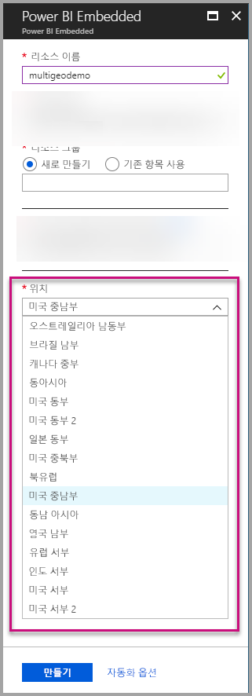
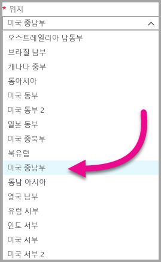
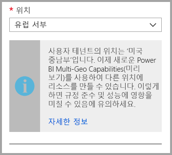
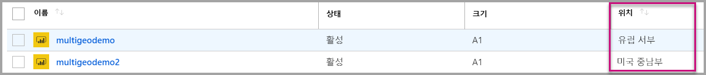
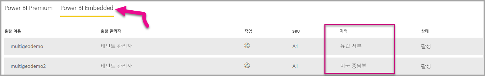

# Power BI Embedded에 대한 다중 지역 지원

**Power BI Embedded에 대한 다중 지역 지원**은 Power BI Embedded를 사용하여 애플리케이션을 빌드해 앱에 분석 기능을 포함하는 ISV와 조직이 이제 전 세계 여러 지역에서 데이터를 배포할 수 있음을 의미합니다.

이제 **Power BI Embedded**를 사용하는 고객은 [Power BI Premium에서 다중 지역을 사용하여 지원](../service-admin-premium-Multi-Geo.md)하는 것과 동일한 기능 및 제한 사항에 따라 **다중 지역** 옵션을 사용하여 **A 용량**을 설정할 수 있습니다.

## 다중 지역을 사용하여 새로운 Power BI Embedded 용량 리소스 만들기

**리소스 만들기** 화면에서 용량의 위치를 선택해야 합니다. 지금까지는 Power BI 테넌트의 위치로만 제한되었으므로 단일 위치만 사용할 수 있었습니다. 다중 지역을 사용하면 용량을 배포할 다른 지역을 선택할 수 있습니다.

위치 드롭다운 메뉴를 열면 홈 테넌트가 기본적으로 선택되어 있습니다.
  

다른 위치를 선택하면 해당 선택을 확인하는 메시지가 표시됩니다.

## 용량 위치 보기

Azure Portal에서 기본 Power BI Embedded 관리 페이지로 이동할 때 용량 위치를 쉽게 확인할 수 있습니다.

Powerbi.com의 관리 포털에서도 사용할 수 있습니다. 관리 포털에서 ‘용량 설정’을 선택한 이후 ‘Power BI Embedded’ 탭으로 전환합니다.

[Power BI Embedded를 사용하여 용량을 만드는 방법에 대해 자세히 알아보세요.](azure-pbie-create-capacity.md)

## 기존 용량 위치 관리

새 용량을 만든 후에는 Power BI Embedded 리소스 위치를 변경할 수 없습니다.

Power BI 콘텐츠를 다른 지역으로 이동하려면 다음 단계를 따르세요.

1. 다른 지역에 [새 용량을 만듭니다](azure-pbie-create-capacity.md).

2. 기존 용량의 모든 작업 영역을 새 용량에 할당합니다.

3. 이전 용량을 삭제하거나 일시 중지합니다.

콘텐츠를 다시 할당하지 않고 용량을 삭제하려는 경우 해당 용량의 모든 콘텐츠가 홈 지역에 있는 공유 용량으로 이동된다는 점에 유의하세요.

## 다중 지역에 대한 API 지원

API를 통해 다중 지역을 사용한 용량 관리를 지원하기 위해 기존 API를 약간 변경했습니다.

1. **[용량 가져오기](https://docs.microsoft.com/rest/api/power-bi/capacities/getcapacities)** - API에서 사용자에 대한 액세스 권한이 포함된 용량 목록을 반환합니다. 이제 응답에는 용량의 위치를 지정하는 ‘지역’이라는 추가 속성이 포함됩니다.

2. **[용량에 할당](https://docs.microsoft.com/rest/api/power-bi/capacities)** - API를 통해 용량에 지정된 작업 영역을 할당할 수 있습니다. 이 작업으로는 홈 지역 외부의 용량에 작업 영역을 할당하거나 다른 지역의 용량 간에 작업 영역을 이동할 수 없습니다. 이 작업을 수행하려면 사용자 또는 [서비스 주체](embed-service-principal.md)가 여전히 작업 영역에 대한 관리자 권한이 필요하며, 관리 또는 대상 용량에 대한 사용 권한을 할당해야 합니다.

3. **[Azure Resource Manager API](https://docs.microsoft.com/rest/api/power-bi-embedded/capacities)** - ‘만들기’ 및 ‘삭제’를 포함하여 모든 Azure Resource Manager API 작업에서 다중 지역을 지원합니다.  

## 제한 사항 및 고려 사항

* 지역 간에 시작한 모든 이동이 데이터 전송 전에 모든 회사 및 정부 준수 요구 사항을 따르는지 확인합니다.

* 원격 지역에 저장된 캐시된 쿼리는 해당 지역에 남아 있습니다. 그러나 전송 중인 다른 데이터는 여러 지역 간에 이동할 수 있습니다.

* 다중 지역 환경에서 데이터를 한 지역에서 다른 지역으로 이동하면 원본 데이터는 최대 30일 동안 데이터 이동이 시작된 지역에 남아 있을 수 있습니다. 해당 기간에 사용자는 데이터에 액세스할 수 없습니다. 데이터가 이 지역에서 제거되고 30일 기간 동안 삭제됩니다.

* 일반적으로 다중 지역을 사용해도 성능이 향상되지 않습니다. 보고서 및 대시보드 로드에는 메타데이터의 홈 지역에 대한 요청이 포함됩니다.

## 다음 단계

아래 링크를 참조하여 Power BI Embedded 용량과 모든 용량을 위한 다중 지역 옵션에 대해 자세히 알아보세요.

* [Power BI Embedded란?](azure-pbie-what-is-power-bi-embedded.md)

* [Power BI Embedded 용량 만들기](azure-pbie-create-capacity.md)

* [Power BI Premium 용량의 다중 지역](../service-admin-premium-multi-geo.md)

궁금한 점이 더 있나요? [Power BI 커뮤니티에 질문합니다.](https://community.powerbi.com/)