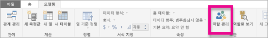
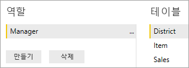
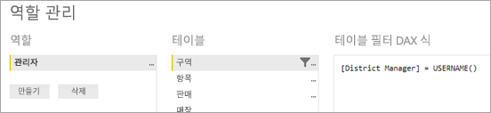
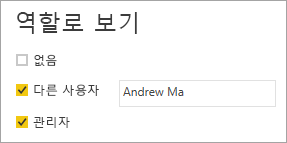

# <a name="use-row-level-security-with-power-bi-embedded-content"></a>Power BI Embedded 콘텐츠에서 행 수준 보안 사용

행 수준 보안(RLS)를 사용하여 대시보드, 타일, 보고서 및 데이터 집합 내 데이터에 대한 사용자 액세스를 제한할 수 있습니다. 여러 사용자가 다른 데이터를 보면서 동일한 아티팩트를 작업할 수 있습니다. RLS 포함이 지원됩니다.

일반적으로 ISV 시나리오인 Power BI 비사용자(앱 소유 데이터)에 포함되는 경우 이 문서를 참조하세요. 사용자 및 역할을 설명하기 위해 포함된 토큰을 구성해야 합니다. 이 작업을 수행하는 방법을 알아보려면 계속 읽어주세요.

조직 내에서 Power BI 사용자(사용자 소유 데이터)에 포함되는 경우 RLS는 Power BI 서비스 내에서와 마찬가지로 직접 작동합니다. 응용 프로그램에서 추가로 수행해야 하는 작업은 없습니다. 자세한 내용은 [Power BI에서 RLS(행 수준 보안)](../service-admin-rls.md)를 참조하세요.


RLS를 활용하려면 세 가지 주요 개념인 사용자, 역할 및 규칙을 이해해야 합니다. 각각에 대해 좀 더 자세히 살펴보겠습니다.

**사용자** – 아티팩트(대시보드, 타일, 보고서 또는 데이터 집합)를 보는 최종 사용자입니다. 사용자는 Power BI Embedded에서 포함된 토큰에 있는 사용자 이름 속성에 의해 식별됩니다.

**역할** - 사용자 역할에 속합니다. 역할은 규칙에 대한 컨테이너로써 *판매 관리자* 또는 *영업 담당자*와 같은 이름을 지정할 수 있습니다. Power BI Desktop 내에서 역할을 만듭니다. 자세한 내용은 [Power BI Desktop에서 RLS(행 수준 보안)](../desktop-rls.md)을 참조하세요.

**규칙** – 역할에는 규칙이 있고 이러한 규칙은 데이터에 적용되는 실제 필터입니다. “국가 = 미국”처럼 간단하거나 훨씬 동적입니다.
이 문서의 나머지 부분에는 RLS를 작성하고 포함된 응용 프로그램 내에서 사용하는 예제가 있습니다. 예제에서는 [소매점 분석 샘플](http://go.microsoft.com/fwlink/?LinkID=780547) PBIX 파일을 사용합니다.


## <a name="adding-roles-with-power-bi-desktop"></a>Power BI Desktop에서 규칙 추가

소매점 분석 샘플에서는 소매 체인에 있는 모든 상점의 판매량을 보여줍니다. RLS를 사용하지 않으면 어떤 구역 관리자가 로그인하고 보고서를 보는지에 상관 없이 동일한 데이터를 볼 수 있습니다. 경영 관리는 각 구역 관리자가 관리하는 매장에 대한 영업을 확인하는 것입니다. 이를 수행하기 위해 RLS를 사용할 수 있습니다.

RLS는 Power BI Desktop에서 작성됩니다. 데이터 집합 및 보고서를 열 때 스키마를 보려면 다이어그램 뷰로 전환할 수 있습니다.


이 스키마에서 기억해야 할 몇 가지 사항은 다음과 같습입니다.

* **총 판매액**과 같은 모든 측정값 **영업** 팩트 테이블에 저장됩니다.
* 관련 추가 차원 테이블에는 **항목**, **시간**, **저장소** 및 **구역**이라는 네 가지 항목이 있습니다.
* 관계선의 화살표는 필터가 테이블 간에 이동할 수 있는 방식을 나타냅니다. 예를 들어, 필터가 **시간[날짜]** 에 배치되면 현재 스키마에서는 **영업** 테이블에 있는 값만을 필터링합니다. 관계선에 있는 모든 화살표가 다른 방향이 아닌 판매 테이블을 가리키기 때문에 다른 테이블은 이 필터의 영향을 받지 않습니다.
* **구역** 테이블은 각 지역에 있는 관리자를 나타냅니다.
  
    

이 스키마에 따라 **구역** 테이블의 **구역 관리자** 열에 필터를 적용하는 경우 및 해당 필터가 보고서를 보는 사용자와 일치하는 경우 해당 필터는 **저장소** 및 **영업** 테이블을 필터링하여 해당 지역 관리자에게만 데이터를 표시합니다.

방법은 다음과 같습니다.

1. **모델링** 탭에서 **역할 관리**를 선택합니다.

    
2. **관리자**라는 새 역할을 만듭니다.

    
3. **구역** 테이블에서 다음과 같은 DAX 식을 입력합니다. **[구역 관리자] = USERNAME()**

    
4. 규칙이 작동하는지 확인하려면 **모델링** 탭에서 **역할로 보기**를 선택하고 방금 만든 **관리자** 역할과 함께 **다른 사용자**를 선택합니다. **AndrewMa**를 사용자로 입력합니다.

    

    보고서에 **AndrewMa**로 로그인한 경우처럼 데이터가 표시됩니다.

필터링을 적용하면 여기에서 수행한 방식으로 **구역**, **저장소** 및 **영업** 테이블에서 모든 레코드를 필터링합니다. 그러나 **영업**과 **시간** 간 관계의 필터 방향으로 인해 **영업**과 **항목** 및 **항목**과 **시간** 테이블이 필터링되지 않습니다. 양방향 교차 필터링에 대한 자세한 내용은 [SQL Server Analysis Services 2016 및 Power BI Desktop에서 양방향 교차 필터링](http://download.microsoft.com/download/2/7/8/2782DF95-3E0D-40CD-BFC8-749A2882E109/Bidirectional%20cross-filtering%20in%20Analysis%20Services%202016%20and%20Power%20BI.docx) 백서를 다운로드합니다.

## <a name="applying-user-and-role-to-an-embed-token"></a>포함된 토큰에 사용자 및 역할 적용

이제 Power BI Desktop 역할을 구성했으므로 역할을 활용하기 위해 응용 프로그램에 필요한 몇 가지 작업이 있습니다.

사용자가 응용 프로그램에 의해 인증되고 권한을 부여 받고 포함된 토큰을 사용하여 특정 Power BI Embedded 보고서에 대한 사용자 액세스 권한을 부여합니다. Power BI Embedded에는 사용자에 대한 특정 정보가 없습니다. RLS가 작동하려면 ID 양식에서 포함된 토큰의 일부로 몇 가지 추가 컨텍스트를 통과해야 합니다. [포함 토큰](https://docs.microsoft.com/rest/api/power-bi/embedtoken) API 방식으로 이 작업을 수행합니다.

API는 관련 데이터 집합이 표시된 ID 목록을 수락합니다. RLS를 실행하려면 ID의 일부로 다음을 전달해야 합니다.

* **사용자 이름(필수)** – RLS 규칙을 적용할 때 사용자를 식별하는 데 사용할 수 있는 문자열입니다. 단일 사용자만 나열할 수 있습니다. 사용자 이름은 *ASCII* 문자로 만들 수 있습니다.
* **역할(필수)** – 행 수준 보안 규칙을 적용할 때 선택하는 역할을 포함하는 문자열입니다. 둘 이상의 역할을 전달하는 경우 문자열 배열로 전달되어야 합니다.
* **데이터 집합(필수)** - 포함하는 아티팩트에 적용할 수 있는 데이터 집합입니다.

**PowerBIClient.Reports**에서 **GenerateTokenInGroup** 메서드를 사용하여 포함된 토큰을 만들 수 있습니다.

예를 들어 [PowerBIEmbedded_AppOwnsData](https://github.com/Microsoft/PowerBI-Developer-Samples/tree/master/App%20Owns%20Data) 샘플을 변경할 수 있습니다. *Home\HomeController.cs 줄 76 및 77*은 다음에서 업데이트할 수 없습니다.

```csharp
// Generate Embed Token.
var generateTokenRequestParameters = new GenerateTokenRequest(accessLevel: "view");

var tokenResponse = await client.Reports.GenerateTokenInGroupAsync(GroupId, report.Id, generateTokenRequestParameters);
```

받는 사람

```csharp
var generateTokenRequestParameters = new GenerateTokenRequest("View", null, identities: new List<EffectiveIdentity> { new EffectiveIdentity(username: "username", roles: new List<string> { "roleA", "roleB" }, datasets: new List<string> { "datasetId" }) });

var tokenResponse = await client.Reports.GenerateTokenInGroupAsync("groupId", "reportId", generateTokenRequestParameters);
```

이제 REST API를 호출하는 경우 업데이트된 API는 **identities**라는 추가 JSON 배열을 수용하고 다음과 같은 사용자 이름, 문자열 역할 목록 및 문자열 데이터 집합 목록을 포함합니다.

```json
{
    "accessLevel": "View",
    "identities": [
        {
            "username": "EffectiveIdentity",
            "roles": [ "Role1", "Role2" ],
            "datasets": [ "fe0a1aeb-f6a4-4b27-a2d3-b5df3bb28bdc" ]
        }
    ]
}
```

이제 모든 작업을 함께 수행하여 사용자가 이 아티팩트를 보기 위해 응용 프로그램에 로그인할 경우 행 수준 보안에 정의된 대로 보도록 허용된 데이터만을 볼 수 있습니다.

## <a name="working-with-analysis-services-live-connections"></a>Analysis Services 라이브 연결 사용

행 수준 보안은 온-프레미스 서버에 대해 Analysis Services 라이브 연결에서 사용할 수 있습니다. 이러한 종류의 연결을 사용하는 경우 이해해야 하는 몇 가지 특정 개념이 있습니다.

사용자 이름 속성에 제공되는 유효한 ID는 Analysis Services 서버에 대한 사용 권한이 있는 Windows 사용자여야 합니다.

**온-프레미스 데이터 게이트웨이 구성**

[온-프레미스 데이터 게이트웨이](../service-gateway-onprem.md)는 Analysis Services 라이브 연결을 사용할 경우에 사용됩니다. 나열된 ID를 사용하여 embed 토큰을 생성할 경우 마스터 계정은 게이트웨이의 관리자로 나열되어야 합니다. 마스터 계정이 나열되지 않으면 행 수준 보안이 데이터 속성에 적용되지 않습니다. 게이트웨이 관리자 이외의 역할을 제공할 수 있지만 유효한 ID에 대한 고유한 사용자 이름을 지정해야 합니다.

**역할 사용**

역할은 embed 토큰의 ID로 제공할 수 있습니다. 역할이 제공되지 않은 경우 제공된 사용자 이름을 사용하여 관련 역할을 확인할 수 있습니다.

**CustomData 기능 사용**

CustomData 기능을 사용하면 CustomData 연결 문자열 속성을 사용하는 일반 텍스트(문자열)를 전달하여 값을 AS에서 사용할 수 있습니다(CUSTOMDATA() 함수를 통해).
데이터 소비를 사용자 지정하는 대체 방법으로 이 기능을 사용할 수 있습니다.
역할 DAX 쿼리 내에서 사용할 수 있고 측정값 DAX 쿼리에서 역할 없이 사용할 수 있습니다.
CustomData 기능은 대시보드, 보고서 및 타일과 같은 아티팩트에서 토큰 생성 기능의 일부입니다. 대시보드에는 여러 CustomData ID가 있을 수 있습니다(타일/모델 당 하나씩).

> [!NOTE]
> CustomData 기능은 Azure Analysis Services에 상주하는 모델에 대해서만 작동하고 라이브 모드에서만 작동합니다. 사용자 및 역할과 달리 .pbix 파일 내에 사용자 지정 데이터 기능을 설정할 수 없습니다. 사용자 지정 데이터 기능을 사용하여 토큰을 생성하는 경우 사용자 이름이 있어야 합니다.

**CustomData SDK 추가**

CustomData 문자열 속성은 토큰 생성 시나리오에서 효과적인 ID에 추가되었습니다.

        [JsonProperty(PropertyName = "customData")]
        public string CustomData { get; set; }

해당 ID는 다음과 같은 호출을 사용하는 사용자 지정 데이터로 만들 수 있습니다.

        public EffectiveIdentity(string username, IList<string> datasets, IList<string> roles = null, string customData = null);

**CustomData SDK 사용**

REST API를 호출하는 경우 각 ID 내에 사용자 지정 데이터를 추가할 수 있습니다. 예:

```json
{
    "accessLevel": "View",
    "identities": [
        {
            "username": "EffectiveIdentity",
            "roles": [ "Role1", "Role2" ],
            "customData": "MyCustomData",
            "datasets": [ "fe0a1aeb-f6a4-4b27-a2d3-b5df3bb28bdc" ]
        }
    ]
}
```

## <a name="considerations-and-limitations"></a>고려 사항 및 제한 사항

* Power BI 서비스 내에서 역할에 사용자를 할당하면 포함된 토큰을 사용하는 경우 RLS에 영향을 주지 않습니다.
* Power BI 서비스는 편집 권한이 있는 사용자 또는 멤버에게 RLS 설정을 적용하지 않는 반면 포함된 토큰을 사용하여 ID를 제공할 경우 데이터에 적용합니다.
* 온-프레미스 서버에 대해 Analysis Services 라이브 연결이 지원됩니다.
* Azure Analysis Services 라이브 연결은 역할별 필터링을 지원합니다. CustomData를 사용하여 동적 필터링을 수행할 수 있습니다.
* 기본 데이터 집합에서 RLS가 필요하지 않은 경우 GenerateToken 요청은 유효 ID를 포함하지 **않아야** 합니다.
* 기본 데이터 집합이 클라우드 모델(캐시된 모델 또는 DirectQuery)이면 유효 ID는 하나 이상의 역할을 포함해야 합니다. 그러지 않으면 역할 할당이 이루어지지 않습니다.
* ID 목록은 대시보드 포함을 위한 여러 ID 토큰을 구현합니다. 다른 모든 아티팩트는 목록에 단일 ID가 포함됩니다.

궁금한 점이 더 있나요? [Power BI 커뮤니티에 질문합니다.](https://community.powerbi.com/)
