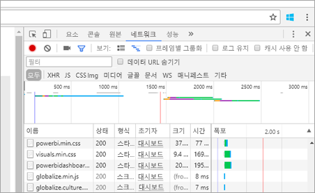

# <a name="troubleshooting-your-embedded-application"></a>포함된 응용 프로그램 문제 해결

이 문서에서는 Power BI 콘텐츠를 포함할 때 발생할 수 있는 몇 가지 일반적인 문제에 대해 설명합니다.

## <a name="tools-for-troubleshooting"></a>문제 해결을 위한 도구

### <a name="fiddler-trace"></a>Fiddler 추적

[Fiddler](http://www.telerik.com/fiddler)는 HTTP 트래픽을 모니터링하는 Telerik의 무료 도구입니다.  클라이언트 컴퓨터에서 Power BI API를 사용하여 앞뒤로 볼 수 있습니다. 오류 및 다른 관련 정보를 표시할 수 있습니다.


### <a name="f12-in-browser-for-front-end-debugging"></a>프런트 엔드 디버깅을 위한 브라우저의 F12 키

F12 키는 브라우저 내에서 개발자 창을 실행합니다. 이 창을 통해 네트워크 트래픽 및 기타 정보를 살펴볼 수 있습니다.



### <a name="extracting-error-details-from-power-bi-response"></a>Power BI 리소스에서 오류 세부 정보 추출

이 코드 조각은 HTTP 예외에서 오류 세부 정보를 추출하는 방법을 보여줍니다.

```
public static string GetExceptionText(this HttpOperationException exc)
{
    var errorText = string.Format("Request: {0}\r\nStatus: {1} ({2})\r\nResponse: {3}",
    exc.Request.Content, exc.Response.StatusCode, (int)exc.Response.StatusCode, exc.Response.Content);
    if (exc.Response.Headers.ContainsKey("RequestId"))
    {
        var requestId = exc.Response.Headers["RequestId"].FirstOrDefault();
        errorText += string.Format("\r\nRequestId: {0}", requestId);
    }

    return errorText;
}
```
요청 id(및 문제 해결에 대한 오류 세부 정보)를 기록해 두는 것이 좋습니다.
Microsoft 지원에 문의할 때 요청 id를 제공해 주세요.

## <a name="app-registration"></a>앱 등록

**앱 등록 실패**

Azure Portal 포털 또는 Power BI 앱 등록 페이지 내에서 표시되는 오류 메시지는 권한 부족에 대해 언급할 것입니다. 응용 프로그램을 등록하려면 Azure AD 테넌트의 관리자이거나 관리자가 아닌 사용자도 응용 프로그램을 등록할 수 있도록 설정해야 합니다.

**새 앱을 등록하는 경우 Azure Portal에 Power BI 서비스가 표시되지 않습니다.**

적어도 사용자 한 명 이상이 Power BI에 등록되어야 합니다. API 목록에 **Power BI 서비스**가 표시되지 않으면 Power BI에 등록된 사용자가 한 명도 없는 것입니다.

## <a name="rest-api"></a>REST API

**401을 반환하는 API 호출**

추가 조사를 위해 fiddler 캡처가 필요할 수 있습니다. Azure AD에 등록된 응용 프로그램에 필요한 사용 권한 범위가 없는 것이 원인일 수 있습니다. Azure Portal에서 필요한 범위가 Azure AD의 앱 등록 내에 있는지 확인하세요.

**403을 반환하는 API 호출**

추가 조사를 위해 fiddler 캡처가 필요할 수 있습니다. 403 오류는 다음과 같은 여러 가지 이유로 발생할 수 있습니다.

* 사용자가 공유 용량에 생성될 수 있는 포함 토큰의 양을 초과했습니다. 포함 토큰을 생성하기 위해 Azure 용량을 구입하고 해당 용량에 작업 영역을 할당해야 합니다. [Azure Portal에서 Power BI Embedded 용량 만들기](https://docs.microsoft.com/en-us/azure/power-bi-embedded/create-capacity)를 참조하세요.
* Azure AD 인증 토큰이 만료되었습니다.
* 인증된 사용자가 그룹(앱 작업 영역)의 구성원이 아닙니다.
* 인증된 사용자가 그룹(앱 작업 영역)의 관리자가 아닙니다.
* 권한 부여 헤더가 올바르게 표시되지 않을 수 있습니다. 오타가 없는지 확인합니다.

GenerateToken 호출 전에 응용 프로그램의 백 엔드가 인증 토큰을 새로 고침해야 할 수 있습니다.

```
    GET https://wabi-us-north-central-redirect.analysis.windows.net/metadata/cluster HTTP/1.1
    Host: wabi-us-north-central-redirect.analysis.windows.net
    ...
    Authorization: Bearer eyJ0eXAiOi...
    ...
 
    HTTP/1.1 403 Forbidden
    ...
     
    {"error":{"code":"TokenExpired","message":"Access token has expired, resubmit with a new access token"}}
```

**유효 ID 입력 시 토큰 생성 실패**

다음과 같은 몇 가지 이유로 유효ID 입력 시 GenerateToken이 실패할 수 있습니다.

* 데이터 집합이 유효 ID를 지원하지 않음
* 사용자 이름을 입력하지 않음
* 역할을 입력하지 않음
* DatasetId를 입력하지 않음
* 사용자에게 해당 권한이 없음

어디에 속하는지 확인하려면 다음 방법을 수행합니다.

* [get dataset](https://msdn.microsoft.com/library/mt784653.aspx)을 실행합니다. IsEffectiveIdentityRequired 속성이 true인지 확인합니다.
* Username은 모든 EffectiveIdentity의 필수 항목입니다.
* IsEffectiveIdentityRolesRequired가 true이면 역할이 필요합니다.
* DatasetId는 모든 EffectiveIdentity의 필수 항목입니다.
* Analysis Services의 경우 마스터 사용자는 게이트웨이 관리자여야 합니다.

## <a name="data-sources"></a>데이터 소스

**ISV가 동일한 데이터 원본에 대해 여러 자격 증명을 원함**

마스터 사용자 한 명마다 데이터 원본의 자격 증명 집합을 하나씩 사용할 수 있습니다. 여러 자격 증명을 사용해야 하는 경우 추가 마스터 사용자를 만들어야 합니다. 그런 다음 각 마스터 사용자 컨텍스트마다 서로 다른 자격 증명을 할당하고 해당 사용자의 Azure AD 토큰을 사용하여 자격 증명을 포함합니다.

## <a name="content-rendering"></a>콘텐츠 렌더링

**포함된 콘텐츠의 렌더링 또는 사용이 실패하거나 시간 초과**

포함된 토큰이 만료되지 않았는지 확인합니다. 포함된 토큰 만료를 확인하고 토큰을 새로 고칩니다. 자세한 내용은 [JavaScript SDK를 사용하여 토큰 새로 고침](https://github.com/Microsoft/PowerBI-JavaScript/wiki/Refresh-token-using-JavaScript-SDK-example)을 참조하세요.

**보고서 또는 대시보드가 로드되지 않음**

사용자가 보고서 또는 대시보드를 볼 수 없는 경우 보고서 또는 대시보드가 powerbi.com에서 올바르게 로드되는지 확인합니다. 보고서 또는 대시보드가 powerbi.com에서 올바르게 로드되지 않으면 응용 프로그램에서도 작동하지 않습니다.

**보고서 또는 대시보드 속도가 느림**

Power BI Desktop 또는 powerbi.com에서 파일을 열고, 성능이 응용 프로그램 또는 포함 api 문제를 배제해도 되는 수준인지 확인합니다.

자세한 내용은 [Power BI Embedded FAQ](embedded-faq.md)를 참조하세요.

궁금한 점이 더 있나요? [Power BI 커뮤니티를 이용하세요.](http://community.powerbi.com/)