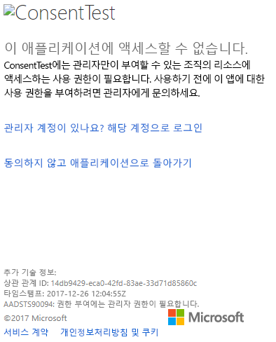
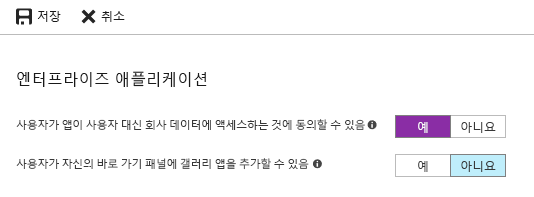

# <a name="troubleshoot-your-embedded-application"></a>포함된 애플리케이션 문제 해결

이 문서에서는 Power BI 콘텐츠를 포함할 때 발생할 수 있는 몇 가지 일반적인 문제에 대해 설명합니다.

## <a name="tools-to-troubleshoot"></a>문제 해결을 위한 도구

### <a name="fiddler-trace"></a>Fiddler 추적

[Fiddler](http://www.telerik.com/fiddler)는 HTTP 트래픽을 모니터링하는 Telerik의 무료 도구입니다.  클라이언트 머신에서 Power BI API를 사용하여 트래픽을 볼 수 있습니다. 이 도구에서 오류 및 다른 관련 정보를 표시할 수 있습니다.


### <a name="f12-in-browser-for-front-end-debugging"></a>프런트 엔드 디버깅을 위한 브라우저의 F12 키

F12 키를 사용하면 브라우저 내에서 개발자 창이 실행됩니다. 이 도구를 통해 네트워크 트래픽 및 기타 정보를 살펴볼 수 있습니다.


### <a name="extract-error-details-from-power-bi-response"></a>Power BI 응답에서 오류 세부 정보 추출

이 코드 조각은 HTTP 예외에서 오류 세부 정보를 추출하는 방법을 보여줍니다.

```csharp
public static string GetExceptionText(this HttpOperationException exc)
{
    var errorText = string.Format("Request: {0}\r\nStatus: {1} ({2})\r\nResponse: {3}",
    exc.Request.Content, exc.Response.StatusCode, (int)exc.Response.StatusCode, exc.Response.Content);
    if (exc.Response.Headers.ContainsKey("RequestId"))
    {
        var requestId = exc.Response.Headers["RequestId"].FirstOrDefault();
        errorText += string.Format("\r\nRequestId: {0}", requestId);
    }

    return errorText;
}
```

요청 ID(및 문제 해결에 대한 오류 세부 정보)를 기록해 두는 것이 좋습니다.
Microsoft 지원에 문의할 때 요청 ID를 제공해 주세요.

## <a name="app-registration"></a>앱 등록

### <a name="app-registration-failure"></a>앱 등록 실패

Azure Portal 또는 Power BI 앱 등록 페이지 내에서 표시되는 오류 메시지는 권한 부족에 대해 언급할 것입니다. 애플리케이션을 등록하려면 Azure AD 테넌트의 관리자이거나, 관리자가 아닌 사용자도 애플리케이션을 등록할 수 있도록 설정해야 합니다.

### <a name="power-bi-service-doesnt-appear-in-the-azure-portal-when-registering-a-new-app"></a>새 앱을 등록할 때 Azure Portal에 Power BI 서비스가 표시되지 않음

적어도 사용자 한 명 이상이 Power BI에 등록되어야 합니다. API 목록에 **Power BI 서비스**가 표시되지 않으면 Power BI에 등록된 사용자가 없는 것입니다.

## <a name="rest-api"></a>REST API

### <a name="api-call-returning-401"></a>401을 반환하는 API 호출

추가 조사를 위해 fiddler 캡처가 필요할 수 있습니다. Azure AD에 등록된 애플리케이션에 필요한 사용 권한 범위가 없는 것이 원인일 수 있습니다. Azure Portal에서 필요한 범위가 Azure AD의 앱 등록 내에 있는지 확인하세요.

### <a name="api-call-returning-403"></a>403을 반환하는 API 호출

추가 조사를 위해 fiddler 캡처가 필요할 수 있습니다. 403 오류는 다음과 같은 여러 가지 이유로 발생할 수 있습니다.

* 사용자가 공유 용량에 생성될 수 있는 포함 토큰의 양을 초과했습니다. Azure 용량을 구입하여 포함 토큰을 생성하고 해당 용량에 작업 영역을 할당합니다. [Azure Portal에서 Power BI Embedded 용량 만들기](https://docs.microsoft.com/azure/power-bi-embedded/create-capacity)를 참조하세요.
* Azure AD 인증 토큰이 만료되었습니다.
* 인증된 사용자가 그룹(앱 작업 영역)의 멤버가 아닙니다.
* 인증된 사용자가 그룹(앱 작업 영역)의 관리자가 아닙니다.
* 권한 부여 헤더가 올바르게 표시되지 않을 수 있습니다. 오타가 없는지 확인합니다.

GenerateToken 호출 전에 애플리케이션의 백 엔드가 인증 토큰을 새로 고침해야 할 수 있습니다.

    ```
    GET https://wabi-us-north-central-redirect.analysis.windows.net/metadata/cluster HTTP/1.1
    Host: wabi-us-north-central-redirect.analysis.windows.net
    ...
    Authorization: Bearer eyJ0eXAiOi...
    ...

    HTTP/1.1 403 Forbidden
    ...

    {"error":{"code":"TokenExpired","message":"Access token has expired, resubmit with a new access token"}}
    ```

## <a name="authentication"></a>인증

### <a name="authentication-failed-with-aadsts70002-or-aadsts50053"></a>AADSTS70002 또는 AADSTS50053으로 인증하지 못했습니다.

**_(AADSTS70002: 자격 증명의 유효성 검사 오류입니다. AADSTS50053: 잘못된 사용자 ID 또는 암호를 사용하여 로그인을 너무 많이 시도했습니다.)_**

Power BI Embedded를 사용하고 Azure AD 직접 인증을 활용하는 경우 다음과 같은 로그인 메시지를 받습니다. ***오류: unauthorized_client, error_description:AADSTS70002: 자격 증명의 유효성 검사 오류입니다. AADSTS50053: 잘못된 사용자 ID 또는 암호를 사용하여 로그인을 너무 많이 시도했습니다.*** 이는 2018년 6월 14일부터 직접 인증이 기본적으로 더 이상 사용되지 않기 때문입니다.

범위가 조직 또는 [서비스 주체](https://docs.microsoft.com/azure/active-directory/develop/active-directory-application-objects#service-principal-object)로 지정된 [Azure AD 정책](https://docs.microsoft.com/azure/active-directory/manage-apps/configure-authentication-for-federated-users-portal#enable-direct-authentication-for-legacy-applications)을 사용하여 이 기능을 다시 설정하는 방법이 있습니다.

이 정책은 앱별 기준으로만 사용하도록 설정하는 것이 좋습니다.

이 정책을 만들려면 정책을 만들고 할당하는 **전역 관리자** 디렉터리에 위치해야 합니다. 정책을 만들고 이 애플리케이션에 SP를 할당하기 위한 샘플 스크립트는 다음과 같습니다.

1. [Azure AD 미리 보기 PowerShell 모듈](https://docs.microsoft.com/powershell/azure/active-directory/install-adv2?view=azureadps-2.0)을 설치합니다.

2. 다음 PowerShell 명령을 한 줄씩 실행합니다(결과적으로 $sp 변수에 둘 이상의 애플리케이션이 없는지 확인).

```powershell
Connect-AzureAD
```

```powershell
$sp = Get-AzureADServicePrincipal -SearchString "Name_Of_Application"
```

```powershell
$policy = New-AzureADPolicy -Definition @("{`"HomeRealmDiscoveryPolicy`":{`"AllowCloudPasswordValidation`":true}}") -DisplayName EnableDirectAuth -Type HomeRealmDiscoveryPolicy -IsOrganizationDefault $false
```

```powershell
Add-AzureADServicePrincipalPolicy -Id $sp.ObjectId -RefObjectId $policy.Id 
```

정책이 할당되면 전파될 때까지 약 15~20초 동안 기다린 후에 테스트합니다.

### <a name="generate-token-fails-when-providing-effective-identity"></a>유효 ID 입력 시 토큰 생성 실패

다음과 같은 몇 가지 이유로 유효ID 입력 시 GenerateToken이 실패할 수 있습니다.

* 데이터 세트에서 유효 ID를 지원하지 않음
* 사용자 이름이 제공되지 않음
* 역할이 제공되지 않음
* DatasetId가 제공되지 않음
* 사용자에게 해당 권한이 없음

해당 이유를 확인하려면 다음 단계를 시도합니다.

* [get dataset](https://docs.microsoft.com/rest/api/power-bi/datasets)을 실행합니다. IsEffectiveIdentityRequired 속성이 true인지 확인합니다.
* Username은 모든 EffectiveIdentity의 필수 항목입니다.
* IsEffectiveIdentityRolesRequired가 true이면 역할이 필요합니다.
* DatasetId는 모든 EffectiveIdentity의 필수 항목입니다.
* Analysis Services의 경우 마스터 사용자는 게이트웨이 관리자여야 합니다.

### <a name="aadsts90094-the-grant-requires-admin-permission"></a>AADSTS90094: 권한 부여에는 관리자 권한이 필요합니다.

**_증상:_**</br>
관리자가 아닌 사용자가 동의를 허용하면서 애플리케이션에 처음으로 로그인하려고 하면 다음 오류 중 하나를 받습니다.

* ConsentTest에는 관리자만이 부여할 수 있는 조직의 리소스에 액세스하는 사용 권한이 필요합니다. 사용하기 전에 이 앱에 대한 권한을 부여하도록 관리자에게 요청하세요.
* AADSTS90094: 권한 부여에는 관리자 권한이 필요합니다.

    

관리 사용자는 성공적으로 로그인하고 동의를 허용할 수 있습니다.

**_근본 원인:_**</br>
사용자 동의는 테넌트에 대해 사용되지 않습니다.

**_몇 가지 수정은 가능합니다._**

*전체 테넌트(모든 사용자, 모든 애플리케이션)에 대해 사용자 동의 사용*

1. Azure Portal에서 "Azure Active Directory" = > "사용자 및 그룹" = > "사용자 설정"으로 이동합니다.
2. "사용자가 앱이 사용자 대신 회사 데이터에 액세스하는 것에 동의할 수 있음" 설정을 활성화하고 변경 내용을 저장합니다.

    

관리자가 전체 테넌트 또는 특정 사용자에게 애플리케이션에 대한 *권한을 부여*합니다.

## <a name="data-sources"></a>데이터 원본

### <a name="isv-wants-to-have-different-credentials-for-the-same-data-source"></a>ISV에서 동일한 데이터 원본에 대해 서로 다른 자격 증명을 사용하려고 함

마스터 사용자 한 명마다 데이터 원본의 자격 증명 집합을 하나씩 사용할 수 있습니다. 여러 자격 증명을 사용해야 하는 경우 추가 마스터 사용자를 만들어야 합니다. 그런 다음, 각 마스터 사용자 컨텍스트마다 서로 다른 자격 증명을 할당하고 해당 사용자의 Azure AD 토큰을 사용하여 자격 증명을 포함합니다.

## <a name="troubleshoot-your-embedded-application-with-the-ierror-object"></a>IError 개체를 사용하여 포함된 애플리케이션 문제 해결

[**JavaScript SDK**](https://github.com/Microsoft/PowerBI-JavaScript/wiki/Troubleshooting-and-debugging-of-embedded-parts)에서 ‘오류’ 이벤트에 의해 반환된 **IError 개체**를 사용하여 애플리케이션을 디버그하고 오류의 원인을 더 잘 알아보세요.

IError 개체를 확보한 후에는 사용 중인 포함 유형에 해당하는 적절한 일반 오류 테이블을 확인해야 합니다. **IError 속성**을 테이블의 속성과 비교하여 가능한 실패 원인을 찾아보세요.

### <a name="typical-errors-when-embedding-for-power-bi-users"></a>Power BI 사용자에 대해 포함할 경우 발생하는 일반적인 오류

| 메시지 | 자세한 메시지 | 오류 코드 | 가능한 이유 |
|-------------------------------------------------------|-----------------------------------------------------------------------------------------------------------------------------|-----------|--------------------------------------------------------|
| TokenExpired | 액세스 토큰이 만료되었습니다. 새 액세스 토큰으로 다시 제출하세요. | 403 | 만료된 토큰  |
| PowerBIEntityNotFound | 보고서를 가져오지 못했습니다. | 404 | <li> 잘못된 보고서 ID <li> 보고서가 존재하지 않음  |
| 잘못된 매개 변수 | powerbiToken 매개 변수가 지정되지 않았습니다. | 해당 없음 | <li> 액세스 토큰이 지정되지 않았음 <li> 보고서 ID가 제공되지 않았음 |
| LoadReportFailed | 초기화하지 못했습니다. 클러스터를 확인할 수 없습니다. | 403 | * 잘못된 액세스 토큰 * 포함 형식이 토큰 형식과 일치하지 않음 |
| PowerBINotAuthorizedException | 보고서를 가져오지 못했습니다. | 401 | <li> 잘못된 그룹 ID <li> 권한 없는 그룹 |
| TokenExpired | 액세스 토큰이 만료되었습니다. 새 액세스 토큰으로 다시 제출하세요. <visual title>(이)라는 보고서 시각적 개체를 렌더링할 수 없습니다. | 해당 없음 | 쿼리 데이터 만료 토큰 |
| OpenConnectionError | 시각적 개체를 표시할 수 없습니다. <visual title>(이)라는 보고서 시각적 개체를 렌더링할 수 없습니다. | 해당 없음 | 용량과 관련된 보고서가 세션에서 열려 있는 동안 용량이 일시 중지되었거나 삭제되었습니다. |
| ExplorationContainer_FailedToLoadModel_DefaultDetails | 이 보고서와 연결된 모델 스키마를 로드할 수 없습니다. 서버에 연결되어 있는지 확인하고 다시 시도하세요. | 해당 없음 | <li> 용량이 일시 중지됨 <li> 용량이 삭제됨 |

### <a name="typical-errors-when-embedding-for-non-power-bi-users-using-an-embed-token"></a>포함 토큰을 사용하여 Power BI가 아닌 사용자에 대해 포함하는 경우 발생하는 일반적인 오류

| 메시지 | 자세한 메시지 | 오류 코드 | 이유 |
|-------------------------------------------------------|-------------------------------------------------------------------------------------------------------------------------------|------------|-------------------------------------------------|
| TokenExpired | 액세스 토큰이 만료되었습니다. 새 액세스 토큰으로 다시 제출하세요. | 403 | 만료된 토큰  |
| LoadReportFailed | 보고서를 가져오지 못했습니다. | 404 | <li> 잘못된 보고서 ID <li> 보고서가 존재하지 않음  |
| LoadReportFailed | 보고서를 가져오지 못했습니다. | 403 | 보고서 ID가 토큰과 일치하지 않음 |
| LoadReportFailed | 보고서를 가져오지 못했습니다. | 500 | 보고서에 제공된 ID가 GUID가 아님 |
| 잘못된 매개 변수 | powerbiToken 매개 변수가 지정되지 않았습니다. | 해당 없음 | <li> 액세스 토큰이 지정되지 않았음 <li> 보고서 ID가 제공되지 않았음 |
| LoadReportFailed | 초기화하지 못했습니다. 클러스터를 확인할 수 없습니다. | 403 | 잘못된 토큰 유형, 잘못된 토큰 |
| PowerBINotAuthorizedException | 보고서를 가져오지 못했습니다. | 401 | 잘못되었거나 권한이 없는 그룹 ID |
| TokenExpired | 액세스 토큰이 만료되었습니다. 새 액세스 토큰으로 다시 제출하세요. <visual title>(이)라는 보고서 시각적 개체를 렌더링할 수 없습니다. | 해당 없음 | 쿼리 데이터 만료 토큰 |
| OpenConnectionError | 시각적 개체를 표시할 수 없습니다. <visual title>(이)라는 보고서 시각적 개체를 렌더링할 수 없습니다. | 해당 없음 | 용량과 관련된 보고서가 세션에서 열려 있는 동안 용량이 일시 중지되었거나 삭제되었습니다. |
| ExplorationContainer_FailedToLoadModel_DefaultDetails | 이 보고서와 연결된 모델 스키마를 로드할 수 없습니다. 서버에 연결되어 있는지 확인하고 다시 시도하세요. | 해당 없음 | <li> 용량이 일시 중지됨 <li> 용량이 삭제됨 |

## <a name="content-rendering"></a>콘텐츠 렌더링

### <a name="rendering-or-consumption-of-embedded-content-fails-or-times-out"></a>포함된 콘텐츠의 렌더링 또는 사용이 실패하거나 시간이 초과됨

포함된 토큰이 만료되지 않았는지 확인합니다. 포함 토큰 만료를 확인하고 새로 고칩니다. 자세한 내용은 [JavaScript SDK를 사용하여 토큰 새로 고침](https://github.com/Microsoft/PowerBI-JavaScript/wiki/Refresh-token-using-JavaScript-SDK-example)을 참조하세요.

### <a name="report-or-dashboard-doesnt-load"></a>보고서 또는 대시보드가 로드되지 않음

사용자가 보고서 또는 대시보드를 볼 수 없는 경우 보고서 또는 대시보드가 powerbi.com에서 올바르게 로드되는지 확인합니다. 보고서 또는 대시보드가 powerbi.com에서 올바르게 로드되지 않으면 애플리케이션에서도 작동하지 않습니다.

### <a name="report-or-dashboard-is-performing-slowly"></a>보고서 또는 대시보드의 속도가 느림

Power BI Desktop 또는 powerbi.com에서 파일을 열고, 성능이 애플리케이션 또는 포함 API 문제를 배제해도 되는 수준인지 확인합니다.

## <a name="embed-setup-tool"></a>포함 설정 도구

[포함 설정 도구](https://aka.ms/embedsetup)를 통해 신속하게 샘플 애플리케이션을 다운로드할 수 있습니다. 다음 샘플과 애플리케이션을 비교할 수 있습니다.

### <a name="prerequisites"></a>필수 조건

포함 설정 도구를 사용하기 전에 적절한 필수 조건이 모두 있는지 확인합니다. **Power BI Pro** 계정과 **Microsoft Azure** 구독이 필요합니다.

* 아직 **Power BI Pro**에 등록하지 않은 경우 시작하기 전에 [평가판에 등록](https://powerbi.microsoft.com/en-us/pricing/)합니다.
* Azure 구독이 없는 경우 시작하기 전에 [체험 계정](https://azure.microsoft.com/free/?WT.mc_id=A261C142F)을 만듭니다.
* 고유한 [Azure Active Directory 테넌트 ](create-an-azure-active-directory-tenant.md) 설정을 사용해야 합니다.
* [Visual Studio](https://www.visualstudio.com/)를 설치해야 합니다(버전 2013 이상).

### <a name="common-issues"></a>일반적인 문제

포함 설정 도구를 사용하여 테스트하는 동안 발생할 수 있는 몇 가지 일반적인 문제는 다음과 같습니다.

#### <a name="using-the-embed-for-your-customers-sample-application"></a>고객에 대한 콘텐츠 포함 사용 샘플 애플리케이션

**고객에 대한 콘텐츠 포함** 환경을 사용하는 경우 *PowerBI-Developer-Samples.zip* 파일을 저장하고 압축을 풉니다. 그런 다음, *PowerBI-Developer-Samples-master\App Owns Data* 폴더를 열고 *PowerBIEmbedded_AppOwnsData.sln* 파일을 실행합니다.

**권한 부여**를 선택하는 경우(권한 부여 단계) 다음과 같은 오류가 발생합니다.

    AADSTS70001: Application with identifier <client ID> wasn't found in the directory <directory ID>

솔루션은 팝업을 닫는 것입니다. 몇 초 정도 기다린 후에 다시 시도하세요. 이 작업을 여러 번 반복해야 합니다. 애플리케이션 등록 프로세스의 완료에서 외부 API에 사용할 수 있을 때까지의 시간 간격으로 인해 문제가 발생합니다.

샘플 앱을 실행하는 경우 다음과 같은 오류 메시지가 표시됩니다.

    Password is empty. Please fill password of Power BI username in web.config.

샘플 애플리케이션에 삽입되지 않는 유일한 값이 사용자 암호이기 때문에 이 오류가 발생합니다. 솔루션에서 Web.config 파일을 열고 사용자의 암호로 pbiPassword 필드를 채웁니다.

AADSTS50079 오류가 발생하는 경우: 사용자가 다단계 인증을 사용해야 합니다.

    Need to use an AAD account that doesn't have MFA enabled.

#### <a name="using-the-embed-for-your-organization-sample-application"></a>조직에 대한 콘텐츠 포함 사용 샘플 애플리케이션

**조직에 대한 콘텐츠 포함** 환경을 사용하는 경우 *PowerBI-Developer-Samples.zip* 파일을 저장하고 압축을 풉니다. 그런 다음, *PowerBI-Developer-Samples-master\User Owns Data\integrate-report-web-app* 폴더를 열고, *pbi-saas-embed-report.sln* 파일을 실행합니다.

**조직에 대한 콘텐츠 포함** 샘플 앱을 실행하는 경우 다음과 같은 오류가 발생합니다.

    AADSTS50011: The reply URL specified in the request doesn't match the reply URLs configured for the application: <client ID>

웹 서버 애플리케이션에 지정된 리디렉션 URL이 샘플의 URL과 다르기 때문에 이 오류가 발생합니다. 샘플 애플리케이션을 등록하려면 리디렉션 URL로 `http://localhost:13526/`을 사용합니다.

등록된 애플리케이션을 편집하려면 애플리케이션에서 웹 API에 대한 액세스 권한을 제공할 수 있도록 [AAD 등록 애플리케이션](https://docs.microsoft.com/azure/active-directory/develop/active-directory-integrating-applications#updating-an-application)을 편집하는 방법을 알아봅니다.

Power BI 사용자 프로필 또는 데이터를 편집하려는 경우 [Power BI 데이터](https://docs.microsoft.com/power-bi/service-basic-concepts)를 편집하는 방법을 알아봅니다.

AADSTS50079 오류가 발생하는 경우: 사용자가 다단계 인증을 사용해야 합니다.

    Need to use an AAD account that doesn't have MFA enabled.

자세한 내용은 [Power BI Embedded FAQ](embedded-faq.md)를 참조하세요.

궁금한 점이 더 있나요? [Power BI 커뮤니티를 이용하세요.](http://community.powerbi.com/)

추가 지원이 필요한 경우 [지원 담당자에게 문의](https://powerbi.microsoft.com/en-us/support/pro/?Type=documentation&q=power+bi+embedded)하거나 [Azure Portal을 통해 지원 티켓을 작성](https://ms.portal.azure.com/#blade/Microsoft_Azure_Support/HelpAndSupportBlade/newsupportrequest)하고 발생한 오류 메시지를 제공하세요.