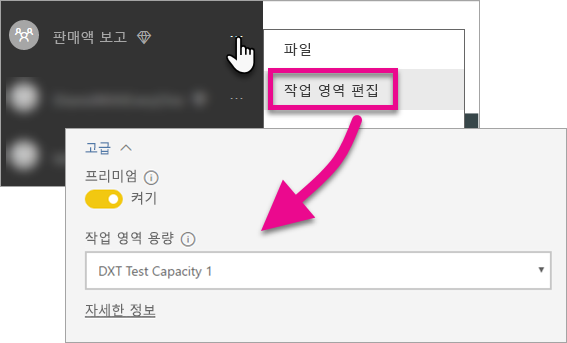

# Power BI 대시보드, 보고서 및 타일 포함

응용 프로그램 내에서 Power BI 콘텐츠를 포함하는 데 필요한 단계에 대해 알아봅니다.

Microsoft는 사용자의 콘텐츠 액세스, 공유 및 배포 방법에 대한 유연성을 높여주는 새로운 용량 기반 라이선스 모델인 [Power BI Premium을 발표했습니다](https://powerbi.microsoft.com/blog/microsoft-accelerates-modern-bi-adoption-with-power-bi-premium/). 또한, 이 제품은 Power BI 서비스에 향상된 확장성 및 성능을 제공합니다. Power BI Embedded에서도 Microsoft Azure 내에서 용량을 만들 수 있게 할 수 있습니다. Power BI Embedded는 응용 프로그램 및 고객에 집중합니다. 

이 문서에서는 조직 및 고객 모두에 대한 Power BI 콘텐츠를 포함하는 방법을 살펴봅니다. 두 시나리오의 단계는 유사합니다. 단계가 고객에 대한 콘텐츠를 포함하는 방법에 해당될 때 설명선이 만들어집니다.

이렇게 하려면 응용 프로그램으로 수행해야 하는 몇 가지 단계가 있습니다. 응용 프로그램 내에서 포함되는 콘텐츠를 만들고 사용하도록 허용하는 데 필요한 단계를 거치게 됩니다.

> [!NOTE]
> Power BI API는 계속 그룹으로 앱 작업 영역을 참조합니다. 그룹에 대한 참조는 앱 작업 영역과 작업 중임을 의미합니다.

## 1단계: 포함된 분석 개발 환경 설정

응용 프로그램으로 대시보드 및 보고서 포함을 시작하기 전에 사용자 환경이 포함을 허용하도록 설정되었는지 확인해야 합니다. 설치의 일부로 다음을 수행해야 합니다.

* [Azure Active Directory 테넌트 설치 확인](embedding-content.md#azureadtenant)
* [Power BI Pro 계정 만들기](embedding-content.md#proaccount)
* [Azure Active Directory 응용 프로그램 및 사용 권한 등록](embedding-content.md#appreg)

> [!NOTE]
> Power BI 용량은 응용 프로그램을 개발하는 데 필요하지 않습니다. 응용 프로그램의 개발자는 Power BI Pro 라이선스가 필요합니다.

### Azure Active Directory 테넌트

Power BI에서 항목을 포함하기 위해 Azure AD(Azure Active Directory) 테넌트가 필요합니다. 이 테넌트는 하나 이상의 Power BI Pro 사용자가 있어야 합니다. 또한 테넌트 내에서 Azure AD 앱을 정의해야 합니다. 기존 Azure AD 테넌트를 활용하거나 포함 목적으로 특별히 새 테넌트를 만들 수 있습니다.

고객에 대한 콘텐츠를 포함하는 경우 사용할 테넌트 설정을 확인해야 합니다.

* 기존 회사 Power BI 테넌트를 사용합니까?
* 응용 프로그램에 대한 별도 테넌트를 사용합니까?
* 각 고객에 대한 별도 테넌트를 사용합니까?

기존 테넌트를 사용하지 않으려는 경우 응용 프로그램 또는 각 고객에 대해 새 테넌트를 만들도록 결정할 수 있습니다. [Azure Active Directory 테넌트 만들기](create-an-azure-active-directory-tenant.md) 또는 [Azure Active Directory 테넌트를 가져오는 방법](https://docs.microsoft.com/azure/active-directory/develop/active-directory-howto-tenant)을 참조하세요.

### Power BI Pro 사용자 계정 만들기

콘텐츠를 포함할 수 있는 단일 Power BI Pro 계정만이 필요합니다. 그러나 항목에 대한 특정 액세스를 갖는 몇 명의 다른 사용자를 가질 수 있습니다. 테넌트 내에서 고려할 가능한 사용자를 살펴보면 다음과 같습니다.

다음 계정은 테넌트 내에 있고 할당된 Power BI Pro 라이선스가 있어야 합니다. Power BI 내에서 앱 작업 영역을 사용하는 데 Power BI Pro 라이선스가 필요합니다.

#### 조직/테넌트 관리 사용자

조직/테넌트 전역 관리 사용자는 고객에 대한 콘텐츠를 포함하는 경우 응용 프로그램에서 사용하는 계정으로 사용하지 않는 것이 좋습니다. 테넌트 내에서 해당 응용 프로그램 계정이 가지는 액세스 권한을 최소화하기 위한 것입니다. 이 관리 사용자는 포함 목적으로 만든 모든 앱 작업 영역의 관리자여야 합니다.

#### 콘텐츠를 만드는 분석가용 계정

Power BI에 대한 콘텐츠를 만드는 여러 사용자가 있을 수 있습니다. Power BI에 콘텐츠를 만들고 배포하는 각 분석가에 대해 Power BI Pro 계정이 필요합니다.

#### 고객에 대한 콘텐츠를 포함하는 응용 프로그램 *마스터* 사용자 계정

마스터 계정은 고객에 대한 콘텐츠를 포함하는 경우 응용 프로그램에서 사용하는 계정입니다. 이 시나리오는 ISV 응용 프로그램에 일반적입니다. 마스터 계정은 조직 내에서 필요한 유일한 필수 계정입니다. 분석가 및 관리자 계정으로 사용할 수도 있지만, 권장하지는 않습니다. 응용 프로그램 백 엔드는 이 계정에 대한 자격 증명을 저장하고 Power BI API에 사용할 Azure AD 인증 토큰을 획득하기 위해 사용합니다. 이 계정은 고객에 대해 사용할 응용 프로그램에 대한 embed 토큰을 생성하는 데 사용됩니다.

마스터 계정은 응용 프로그램에서 사용하는 Power BI Pro 라이선스가 있는 일반 사용자이며 포함에 사용되는 앱 작업 영역의 관리자여야 합니다.

###  앱 등록 및 사용 권한

REST API를 호출하려면 Azure AD에 응용 프로그램을 등록해야 합니다. 자세한 내용은 [포함된 Power BI 콘텐츠에 Azure AD 앱 등록](register-app.md)을 참조하세요.

### 앱 작업 영역 만들기

고객에 대한 대시보드 및 보고서를 포함하는 경우 해당 대시보드 및 보고서는 앱 작업 영역 내에 있어야 합니다. 위에서 언급한 *마스터* 계정은 앱 작업 영역의 관리자여야 합니다.

[!INCLUDE [powerbi-service-create-app-workspace](../includes/powerbi-service-create-app-workspace.md)]

### 보고서 만들기 및 업로드

Power BI Desktop을 사용하여 보고서 및 데이터 집합을 만든 다음, 이러한 보고서를 앱 작업 영역으로 게시할 수 있습니다. 보고서를 게시하는 최종 사용자는 앱 작업 영역에 게시하기 위해 Power BI Pro 라이선스가 필요합니다.

## 2단계: 콘텐츠 포함

응용 프로그램 내에서 Power BI를 사용하여 인증해야 합니다. 고객에 대한 콘텐츠를 포함하는 경우 응용 프로그램 내에서 *마스터* 계정에 대한 자격 증명을 저장합니다. 자세한 내용은 [사용자를 인증하고 Power BI 앱에 대한 Azure AD 액세스 토큰 가져오기](get-azuread-access-token.md)를 참조하세요.

일단 인증하면 응용 프로그램 내에서 Power BI REST API 및 JavaScript API를 사용하여 응용 프로그램에 대시보드 및 보고서를 포함합니다. 

**조직에 대한 콘텐츠를 포함**하는 경우 다음 연습을 참조하세요.

* [대시보드를 응용 프로그램에 통합](integrate-dashboard.md)
* [타일을 앱에 통합](integrate-tile.md)
* [보고서를 앱에 통합](integrate-report.md)

ISV에서 일반적인 **고객에 대한 콘텐츠를 포함**하는 경우 다음을 참조하세요.

* [대시보드, 타일 또는 보고서를 응용 프로그램에 통합](embed-sample-for-customers.md)

고객에 대한 콘텐츠를 포함하는 경우 embed 토큰이 필요합니다. 자세한 내용은 [GenerateToken](https://msdn.microsoft.com/library/mt784614.aspx)을 참조하세요.

## 3단계: 프로덕션에 솔루션 승격

프로덕션으로 이동하려면 몇 가지 추가 단계가 필요합니다.

### 조직에 대한 콘텐츠 포함

조직에 대한 콘텐츠를 포함하는 경우 사용자에게 응용 프로그램을 가져오는 방법을 알리기만 하면 됩니다. 

해당 작업 영역이 용량으로 지원되는 경우 무료 사용자는 앱 작업 영역(그룹)에서 포함된 콘텐츠를 사용할 수 있습니다. 무료 사용자를 앱 작업 영역(그룹)의 멤버로 나열합니다. 그렇지 않으면 401 권한 없음 오류가 표시됩니다. 다음 표에서는 Office 365 내에서 사용할 수 있는 Power BI Premium SKU를 나열합니다.

| 용량 노드 | 총 코어 *(백 엔드 + 프런트 엔드)* | 백 엔드 코어 | 프런트 엔드 코어 | DirectQuery/라이브 연결 제한 | 사용량이 가장 많은 시간에 최대 페이지 렌더링 |
| --- | --- | --- | --- | --- | --- |
| EM3 |4v-코어 |2개 코어, 10GB RAM |2개 코어 | |601-1,200 |
| P1 |8v-코어 |4개 코어, 25GB RAM |4개 코어 |초당 30 |1,201-2,400 |
| P2 |16v-코어 |8개 코어, 50GB RAM |8개 코어 |초당 60 |2,401-4,800 |
| P3 |32v-코어 |16개 코어, 100GB RAM |16개 코어 |초당 120 |4,801-9600 |

> [!NOTE]
> Power BI 프리미엄을 구입하려면 테넌트 내에서 전역 또는 대금 청구 관리자여야 합니다. Power BI 프리미엄을 구입하는 방법에 대한 정보는 [Power BI 프리미엄 구매 방법](../service-admin-premium-purchase.md)을 참조하세요.

### 고객에 대한 콘텐츠 포함

고객에 대한 콘텐츠를 포함하는 경우 다음을 수행합니다.

* 개발에 별도 테넌트를 사용하는 경우 대시보드 및 보고서와 함께 앱 작업 영역을 프로덕션 환경에서 사용할 수 있는지 확인해야 합니다. Azure AD에서 프로덕션 테넌트에 대한 응용 프로그램을 만들고 1단계에서 표시된 대로 적절한 앱 사용 권한을 할당해야 합니다.
* 필요에 맞는 용량을 구입합니다. 아래 표를 사용하여 필요한 Power BI Embedded 용량 SKU를 이해할 수 있습니다. 자세한 내용은 [포함된 분석 용량 계획 백서](https://aka.ms/pbiewhitepaper)를 참조하세요. 구입할 준비가 되면 [Microsoft Azure Portal](https://portal.azure.com) 내에서 수행할 수 있습니다. Power BI Embedded 용량을 만드는 방법에 대한 자세한 내용은 [Azure Portal에서 Power BI Embedded 용량 만들기](https://docs.microsoft.com/azure/power-bi-embedded/create-capacity)를 참조하세요.

| 용량 노드 | 총 코어 *(백 엔드 + 프런트 엔드)* | 백 엔드 코어 | 프런트 엔드 코어 | DirectQuery/라이브 연결 제한 | 사용량이 가장 많은 시간에 최대 페이지 렌더링 |
| --- | --- | --- | --- | --- | --- |
| A1 |1v-코어 |0.5개 코어, 3GB RAM |0.5개 코어 | 초당 5 |1-300 |
| A2 |2v-코어 |1개 코어, 5GB RAM |1개 코어 | 초당 10 |301-600 |
| A3 |4v-코어 |2개 코어, 10GB RAM |2개 코어 | 초당 15 |601-1,200 |
| A4 |8v-코어 |4개 코어, 25GB RAM |4개 코어 |초당 30 |1,201-2,400 |
| A5 |16v-코어 |8개 코어, 50GB RAM |8개 코어 |초당 60 |2,401-4,800 |
| A6 |32v-코어 |16개 코어, 100GB RAM |16개 코어 |초당 120 |4,801-9600 |

* 앱 작업 영역을 편집하고 고급에서 용량에 할당합니다.

    

* 프로덕션에 업데이트된 응용 프로그램을 배포하고 Power BI 대시보드 및 보고서를 포함하기 시작합니다.

## 관리 설정

전역 관리자 또는 Power BI 서비스 관리자는 테넌트에 REST API를 사용하도록 설정하거나 해제할 수 있습니다. Power BI 관리자는 전체 조직 또는 개별 보안 그룹에 대해 이 설정을 지정할 수 있습니다. 기본적으로 전체 조직에서 사용하도록 설정됩니다. 이 작업은 [Power BI 관리 포털](../service-admin-portal.md)을 통해 수행합니다.

## 다음 단계

[Power BI에 포함](embedding.md)  
[Power BI Embedded 작업 영역 컬렉션 콘텐츠를 Power BI으로 마이그레이션하는 방법](migrate-from-powerbi-embedded.md)  
[Power BI 프리미엄이란?](../service-premium.md)  
[Power BI 프리미엄 구매 방법](../service-admin-premium-purchase.md)  
[JavaScript API Git 리포지토리](https://github.com/Microsoft/PowerBI-JavaScript)  
[Power BI C# Git 리포지토리](https://github.com/Microsoft/PowerBI-CSharp)  
[JavaScript 포함 샘플](https://microsoft.github.io/PowerBI-JavaScript/demo/)  
[포함된 분석 용량 계획 백서](https://aka.ms/pbiewhitepaper)  
[Power BI 프리미엄 백서](https://aka.ms/pbipremiumwhitepaper)  

궁금한 점이 더 있나요? [Power BI 커뮤니티에 질문합니다.](http://community.powerbi.com/)

