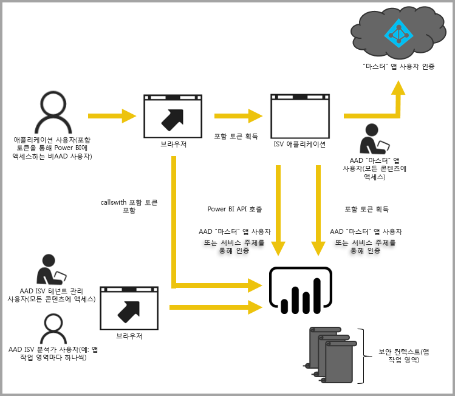

# Power BI를 사용한 임베디드 분석

Power BI 서비스(SaaS) 및 Azure의 Power BI Embedded(PaaS)에는 대시보드 및 보고서 포함을 위한 API가 있습니다. 이 기능은 일련의 기능은 물론, 콘텐츠 포함 시 대시보드, 게이트웨이 및 앱 작업 영역 등의 최신 Power BI 기능을 이용할 수 있음을 의미합니다.

[포함 설정 도구](https://aka.ms/embedsetup)를 통해 신속하게 시작하고 샘플 애플리케이션을 다운로드할 수 있습니다.

사용자에게 적합한 솔루션을 선택합니다.

* [조직에 대한 콘텐츠를 포함하면](embedding.md#embedding-for-your-organization) Power BI 서비스를 확장할 수 있습니다. [조직에 대한 콘텐츠 포함](https://aka.ms/embedsetup/UserOwnsData) 솔루션을 실행합니다.
* [고객에 대한 콘텐츠를 포함하면](embedding.md#embedding-for-your-customers) Power BI에 대한 계정이 없는 사용자에게 대시보드 및 보고서를 포함하는 기능을 제공합니다. [고객에 대한 콘텐츠 포함](https://aka.ms/embedsetup/AppOwnsData) 솔루션을 실행합니다.

## API 사용

Power BI 콘텐츠를 포함할 때 두 가지 주요 시나리오가 있습니다.  하나는 조직 내 사용자(Power BI에 대한 라이선스를 갖고 있는)를 위해 포함하는 시나리오이고, 다른 하나는 사용자 및 고객에게 Power BI 라이선스를 요구하지 않고 포함하는 시나리오입니다. 두 시나리오 모두에 Power BI REST API를 사용할 수 있습니다.

Power BI 라이선스가 없는 고객 및 사용자의 경우 조직 또는 고객에게 서비스를 제공할 때 사용하는 것과 동일한 API를 사용하여 대시보드 및 보고서를 사용자 지정 애플리케이션에 포함할 수 있습니다. 애플리케이션에서 관리하는 데이터를 고객이 볼 수 있습니다. 조직 내 Power BI 사용자의 경우 Power BI에서 직접 또는 포함된 애플리케이션의 컨텍스트에서 ‘사용자 고유의 데이터’를 볼 수 있는 추가 옵션이 제공됩니다. 포함 필요에 따라 JavaScript 및 REST API를 완벽하게 활용할 수 있습니다.

포함 작동 방법의 예제를 보려면 [JavaScript 포함 샘플](https://microsoft.github.io/PowerBI-JavaScript/demo/)을 참조하세요.

## 조직에 대한 콘텐츠 포함

**조직에 대한 콘텐츠를 포함하면** Power BI 서비스를 확장할 수 있습니다. 조직에 대한 콘텐츠 포함에서 애플리케이션 사용자가 해당 콘텐츠를 보는 경우 Power BI 서비스에 로그인해야 합니다. 조직 내 사용자가 로그인하면 해당 사용자는 본인 소유의 또는 Power BI 서비스에서 공유된 대시보드 및 보고서에만 액세스할 수 있습니다.

*조직에 대한 콘텐츠 포함의 예제에는 [SharePoint Online](https://powerbi.microsoft.com/blog/integrate-power-bi-reports-in-sharepoint-online/), [Microsoft Teams 통합(관리자 권한 필요)](https://powerbi.microsoft.com/blog/power-bi-teams-up-with-microsoft-teams/) 및 [Microsoft Dynamics](https://docs.microsoft.com/dynamics365/customer-engagement/basics/add-edit-power-bi-visualizations-dashboard)와 같은 내부 애플리케이션이 포함됩니다.*

조직에 대한 콘텐츠를 포함하는 경우 아래 항목을 참조하세요.

* [보고서를 앱에 통합](embed-sample-for-your-organization.md)

편집, 저장 등과 같은 셀프 서비스 기능은 Power BI 사용자에 대해 포함하는 경우 [JavaScript API](https://github.com/Microsoft/PowerBI-JavaScript)를 통해 사용할 수 있습니다.

조직의 콘텐츠를 포함할 [포함 설정 도구](https://aka.ms/embedsetup/UserOwnsData)를 통해 조직에 대한 보고서를 통합하는 방법을 설명하는 샘플 애플리케이션을 신속하게 시작하고 다운로드할 수 있습니다.

## 고객에 대한 콘텐츠 포함

**고객에 대한 콘텐츠 포함**을 통해 Power BI에 대한 계정이 없는 사용자에게 대시보드 및 보고서를 포함할 수 있습니다. 고객에 대한 콘텐츠 포함은 **Power BI Embedded**라고도 합니다.

[Power BI Embedded](azure-pbie-what-is-power-bi-embedded.md)는 ISV(독립 소프트웨어 공급 업체) 및 개발자가 용량 기반 시간당 요금 모델을 통해 애플리케이션에 시각적 개체, 보고서 및 대시보드를 신속하게 추가하는 **Microsoft Azure** 서비스입니다.

Power BI Embedded에는 ISV, 해당 개발자 및 고객에 대한 혜택이 있습니다. 예를 들어 ISV는 Power BI Desktop을 사용하여 시각적 개체를 무료로 만들 수 있습니다. ISV는 시각적 분석 개발 노력을 최소화하여 시장에 대한 출시 시간 단축을 달성하고 차별화된 데이터 환경에서 경쟁사와 차별화할 수 있습니다. ISV는 임베디드 분석을 사용하여 만든 추가 값에 대해 프리미엄 요금을 청구하도록 옵트인할 수도 있습니다.

Power BI Embedded에서 고객은 Power BI에 대해 알 필요가 없습니다. 포함된 애플리케이션을 만드는 데 하나의 Power BI Pro 계정이 필요합니다. Power BI Pro 계정은 애플리케이션에 대한 마스터 계정처럼 작동합니다(이 마스터 계정을 프록시 계정으로 간주). 또한 Power BI Pro 계정을 사용하면 애플리케이션이 소유한/관리하는 Power BI 서비스 내에서 대시보드 및 보고서에 대한 액세스를 제공하는 embed 토큰을 생성할 수 있습니다.

Power BI Embedded를 사용하는 개발자는 시각적 개체 및 분석을 개발하는 시간보다 해당 애플리케이션의 핵심 역량을 빌드하는 데 집중하여 시간을 투자할 수 있습니다. 개발자는 고객 보고서 및 대시보드 요구를 신속하게 충족하고 완전히 문서화된 API 및 SDK를 사용하여 쉽게 포함할 수 있습니다. 앱에서 탐색하기 쉬운 데이터 탐색을 설정하여 ISV를 사용하면 고객이 모든 디바이스에서 상황에 맞는 신속한 데이터 기반 결정을 내릴 수 있습니다.

> [!IMPORTANT]
> 포함 작업이 Power BI 서비스에 종속되는 반면 고객의 Power BI에 대해 종속되지는 않습니다. 애플리케이션에 포함된 콘텐츠를 보기 위해 Power BI에 가입할 필요는 없습니다.

프로덕션으로 이동할 준비가 되면 앱 작업 영역은 전용 용량에 할당되어야 합니다. Microsoft Azure 내에서 Power BI Embedded는 애플리케이션에서 사용할 [전용 용량](azure-pbie-create-capacity.md)을 제공합니다.

포함하는 방법에 대한 자세한 내용은 [Power BI 대시보드, 보고서 및 타일을 포함하는 방법](embed-sample-for-customers.md)을 참조하세요.

## 다음 단계

이제 Power BI 콘텐츠를 애플리케이션에 포함하거나 고객에 대한 Power BI 콘텐츠를 포함할 수 있습니다.

> [!div class="nextstepaction"]
> [조직에 포함](embed-sample-for-your-organization.md)

> [!div class="nextstepaction"]
> [Power BI Embedded란?](azure-pbie-what-is-power-bi-embedded.md)

> [!div class="nextstepaction"]
>[고객에 대한 콘텐츠 포함](embed-sample-for-customers.md)

궁금한 점이 더 있나요? [Power BI 커뮤니티에 질문합니다.](http://community.powerbi.com/)