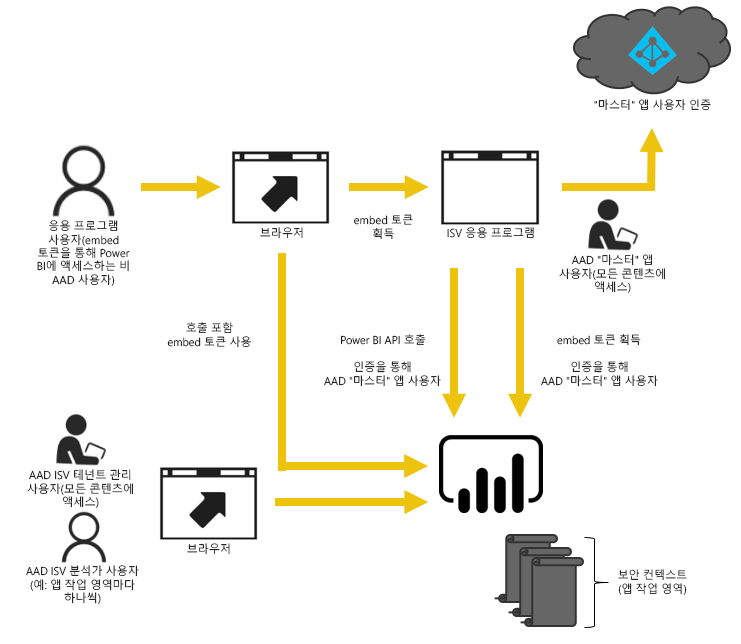
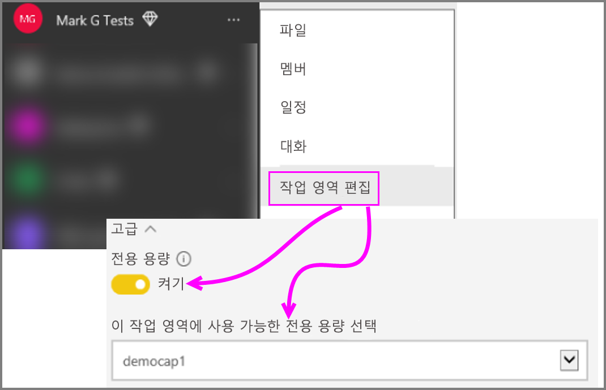

# Power BI 작업 영역 컬렉션 콘텐츠를 Power BI Embedded로 마이그레이션하는 방법
Power BI 작업 영역 컬렉션에서 Power BI Embedded로 마이그레이션하고 앱에서 포함하기 위한 고급 기능을 활용하는 방법을 알아봅니다.

Microsoft는 최근에 사용자의 콘텐츠 액세스, 공유 및 배포 방법에 대한 유연성을 높여주는 새로운 용량 기반 라이선스 모델인 [Power BI Embedded를 발표했습니다](https://powerbi.microsoft.com/en-us/blog/power-bi-embedded-capacity-based-skus-coming-to-azure/). 또한, 이 제품은 향상된 확장성 및 성능을 제공합니다.

Power BI Embedded를 사용하면, 콘텐츠 포함 시 단일 API 영역, 일관된 성능은 물론 대시보드, 게이트웨이 및 앱 작업 영역 등의 최신 Power BI 기능을 이용할 수 있습니다. 더 나아가 Power BI Desktop을 시작하고 Power BI Embedded를 통해 배포를 진행할 수 있습니다.

현재 Power BI 작업 영역 컬렉션은 제한된 시간 동안 계속 사용할 수 있습니다. 기업계약을 체결한 고객은 기존 계약이 만료될 때까지 액세스할 수 있습니다. 직접 또는 CSP 채널을 통해 Power BI 작업 영역 컬렉션을 구매한 고객은 Power BI Embedded의 일반 공급 릴리스에서 1년간 액세스를 유지합니다.  이 아티클에서는 Power BI 작업 영역 컬렉션에서 새 Power BI Embedded 환경으로 마이그레이션하는 방법에 대한 일부 지침과 응용 프로그램에서 예상되는 변경 내용을 제공합니다.

> [!IMPORTANT]
> 마이그레이션은 Power BI Embedded에 종속되어 실행되지만, **임베드 토큰** 사용 시 응용 프로그램 사용자의 Power BI에 대한 종속은 없습니다. 응용 프로그램에 임베드된 콘텐츠를 보기 위해 Power BI에 가입할 필요는 없습니다. Power BI Embedded 이외 사용자에게 이 포함 방법을 사용할 수 있습니다.
> 
> 

## 마이그레이션 준비
Power BI 작업 영역 컬렉션에서 Power BI Embedded로 마이그레이션할 준비를 하기 위해 해야 할 일이 몇 가지 있습니다. Power BI Pro 라이선스가 있는 사용자와 함께, 사용 가능한 테넌트가 필요합니다.

1. Azure Active Directory(Azure AD) 테넌트에 대한 액세스 권한이 있는지 확인하세요.
   
    사용할 테넌트 설정을 결정해야 합니다.
   
   * 기존 회사 Power BI 테넌트를 사용합니까?
   * 응용 프로그램에 대한 별도 테넌트를 사용합니까?
   * 각 고객에 대한 별도 테넌트를 사용합니까?
     
     응용 프로그램 또는 각 고객에 대해 새 테넌트를 만들도록 결정한 경우 [Azure Active Directory 테넌트 만들기](create-an-azure-active-directory-tenant.md) 또는 [Azure Active Directory 테넌트를 가져오는 방법](https://docs.microsoft.com/azure/active-directory/develop/active-directory-howto-tenant)을 참조하세요.
2. 응용 프로그램 "마스터" 계정으로 작동할 이 새 테넌트 내에서 사용자를 만듭니다. 해당 계정은 Power BI에 등록해야 하며 할당된 Power BI Pro 라이선스가 있어야 합니다.

## Azure AD 내 계정
다음 계정은 테넌트 내에 있어야 합니다.

> [!NOTE]
> 이러한 계정은 앱 작업 영역을 사용하기 위해 Power BI Pro 라이선스를 보유해야 합니다.
> 
> 

1. 테넌트 관리 사용자.
   
    이 사용자는 포함 목적으로 만든 모든 앱 작업 영역의 구성원이어야 합니다.
2. 콘텐츠를 만드는 분석가용 계정.
   
    이러한 사용자는 필요에 따라 앱 작업 영역에 할당되어야 합니다.
3. 응용 프로그램 *마스터* 사용자 계정 또는 Embedded 계정.
   
    응용 프로그램 백 엔드는 이 계정에 대한 자격 증명을 저장한 후 Power BI REST API에 사용할 Azure AD 토큰을 획득하기 위해 사용합니다. 이 계정은 응용 프로그램에 대한 임베드 토큰을 생성하는 데 사용됩니다. 또한 이 계정은 포함용으로 만든 앱 작업 영역의 관리자여야 합니다.
   
   > [!NOTE]
   > 조직에서 포함의 목적으로 사용할 일반 사용자 계정입니다.
   > 
   > 

## 앱 등록 및 사용 권한
Azure AD 내에서 응용 프로그램을 등록하고 일부 사용 권한을 부여해야 합니다.

### 응용 프로그램 등록
REST API를 호출하려면 Azure AD에 응용 프로그램을 등록해야 합니다. 여기에는 Azure Portal로 이동하여 Power BI 앱 등록 페이지 외에도 추가 구성을 적용하는 것이 포함됩니다. 자세한 내용은 [포함된 Power BI 콘텐츠에 Azure AD 앱 등록](register-app.md)을 참조하세요.

응용 프로그램 **마스터** 계정을 사용하여 응용 프로그램을 등록해야 합니다.

## 앱 작업 영역 만들기(필수)
응용 프로그램에서 여러 고객에게 서비스를 제공하고 있을 경우 향상된 격리 성능을 제공하기 위해 앱 작업 영역을 활용할 수 있습니다. 대시보드와 보고서는 고객 간에 격리됩니다. 그런 다음, 앱 작업 영역당 하나의 Power BI 계정을 사용하여 고객 간 응용 프로그램 경험을 더 격리할 수 있습니다.

> [!IMPORTANT]
> Power BI가 아닌 사용자에게 포함을 활용하기 위해 개인 작업 영역을 사용할 수 없습니다.
> 
> 

Power BI 내에서 하나의 앱 작업 영역을 만들려면 Pro 라이센스가 있는 사용자가 필요합니다. 응용 프로그램 작업 영역을 만드는 Power BI 사용자는 기본적으로 해당 작업 영역의 관리자가 됩니다.

> [!NOTE]
> 응용 프로그램 *마스터* 계정은 작업 영역의 관리자여야 합니다.
> 
> 

## 콘텐츠 마이그레이션
작업 영역 컬렉션에서 Power BI Embedded로 콘텐츠를 마이그레이션하는 것은 현재 솔루션과 동시에 수행할 수 있으며 가동 중지 시간이 필요하지 않습니다.

**마이그레이션 도구**는 Power BI 작업 영역 컬렉션에서 Power BI Embedded로 콘텐츠 복사를 지원하기 위해 사용할 수 있습니다. 특히 콘텐츠가 많은 경우입니다. 자세한 내용은 [Power BI Embedded 마이그레이션 도구](migrate-tool.md)를 참조하세요.

콘텐츠 마이그레이션은 주로 두 개의 API에 의존합니다.

1. PBIX 다운로드 - 이 API는 2016년 10월 이후 Power BI에 업로드된 PBIX 파일을 다운로드할 수 있습니다.
2. PBIX 가져오기 - 이 API는 Power BI에 모든 PBIX를 업로드합니다.

일부 관련된 코드 조각은 [Power BI 작업 영역 컬렉션에서 콘텐츠 마이그레이션을 위한 코드 조각](migrate-code-snippets.md)을 참조하세요.

### 보고서 유형
다소 다른 마이그레이션 흐름이 필요한 여러 종류의 보고서가 있습니다.

#### 캐시된 데이터 집합 및 보고서
캐시된 데이터 집합은 라이브 연결 또는 DirectQuery 연결과는 대조적으로 데이터를 가져온 PBIX 파일을 가리킵니다.

**흐름**

1. PaaS 작업 영역에서 PBIX API 다운로드를 호출합니다.
2. PBIX를 저장합니다.
3. SaaS 작업 영역에 PBIX 가져오기를 호출합니다.

#### DirectQuery 데이터 집합 및 보고서
**흐름**

1. https://api.powerbi.com/v1.0/collections/{collection_id}/workspaces/{wid}/datasets/{dataset_id}/Default.GetBoundGatewayDataSources 가져오기를 호출하고 수신한 연결 문자열을 저장합니다.
2. PaaS 작업 영역에서 PBIX API 다운로드를 호출합니다.
3. PBIX를 저장합니다.
4. SaaS 작업 영역에 PBIX 가져오기를 호출합니다.
5. POST https://api.powerbi.com/v1.0/myorg/datasets/{dataset_id}/Default.SetAllConnections를 호출하여 연결 문자열 업데이트
6. GET https://api.powerbi.com/v1.0/myorg/datasets/{dataset_id}/Default.GetBoundGatewayDataSources 를 호출하여 GW ID 및 데이터 원본 ID 가져오기
7. PATCH https://api.powerbi.com/v1.0/myorg/gateways/{gateway_id}/datasources/{datasource_id}를 호출하여 사용자의 자격 증명 업데이트

#### 이전 데이터 집합 및 보고서
2016년 10월 이전에 만든 데이터 집합/보고서입니다. PBIX 다운로드는 2016년 10월 이전에 업로드된 PBIX를 지원하지 않습니다

**흐름**

1. 개발 환경에서 PBIX를 가져옵니다(내부 원본 제어).
2. SaaS 작업 영역에 PBIX 가져오기를 호출합니다.

#### 푸시 데이터 집합 및 보고서
PBIX 다운로드는 *푸시 API* 데이터 집합을 지원하지 않습니다. 푸시 API 데이터 집합 데이터는 PaaS에서 SaaS로 이식할 수 없습니다.

**흐름**

1. 데이터 집합 Json으로 "데이터 집합 만들기" API를 호출하여 SaaS 작업 영역에 데이터 집합을 만듭니다.
2. 만든 데이터 집합*에 대한 보고서를 다시 작성합니다.

다음을 시도하여 PaaS에서 SaaS로 푸시 api 보고서를 마이그레이션하는 데 일부 해결 방법을 사용할 수 있습니다.

1. 일부 더미 PBIX를 PaaS 작업 영역으로 업로드합니다.
2. 푸시 api 보고서를 복제하고 1단계의 더미 PBIX에 바인딩합니다.
3. 더미 PBIX를 사용하여 푸시 API 보고서를 다운로드합니다.
4. SaaS 작업 영역에 더미 PBIX를 업로드합니다.
5. SaaS 작업 영역에 푸시 데이터 집합을 만듭니다.
6. 푸시 api 데이터 집합에 보고서를 다시 바인딩합니다.

## 새 보고서 만들기 및 업로드
Power BI 작업 영역 컬렉션에서 마이그레이션한 콘텐츠 뿐 아니라 Power BI Desktop을 사용하여 보고서 및 데이터 집합을 만든 다음, 앱 작업 영역에 해당 보고서를 게시할 수 있습니다. 보고서를 게시하는 최종 사용자는 앱 작업 영역에 게시하기 위해 Power BI Pro 라이선스가 필요합니다.

## 응용 프로그램 다시 빌드
1. powerbi.com 내에서 보고서 위치와 Power BI REST API를 사용하려면 응용 프로그램을 수정해야 합니다.
2. 응용 프로그램에 대한 *마스터* 계정을 사용하여 AuthN/AuthZ 인증을 다시 빌드하세요. 이 사용자가 다른 사용자를 대신하여 작업할 수 있도록 [임베드 토큰](https://msdn.microsoft.com/library/mt784614.aspx) 사용을 활용할 수 있습니다.
3. 응용 프로그램에 powerbi.com에서 보고서를 포함 합니다.

## 사용자를 Power BI 사용자로 매핑
응용 프로그램 내에서 관리하는 사용자를 응용 프로그램의 목적에 맞게 *마스터* Power BI 자격 증명으로 매핑합니다. 이 Power BI *마스터* 계정에 대한 자격 증명은 응용 프로그램 내에 저장되어 임베드 토큰을 만드는 데 사용됩니다.

## 프로덕션 준비가 되면 해야 할 일
프로덕션으로 전환할 준비가 되면 다음 사항을 수행해야 합니다.

* 개발에 별도 테넌트를 사용하는 경우 대시보드 및 보고서와 함께 앱 작업 영역을 프로덕션 환경에서 사용할 수 있는지 확인해야 합니다. 또한 Azure AD에 프로덕션 테넌트에 대한 응용 프로그램을 만들고 1단계에서 표시된 대로 적절한 앱 사용 권한을 할당했는지 확인해야 합니다.
* 필요에 맞는 용량을 구입합니다. 필요한 용량 및 형식을 더 잘 이해하려면 [Power BI Embedded 분석 용량 계획 백서](https://aka.ms/pbiewhitepaper)를 참조하세요. Azure에서 [용량을 구입](https://portal.azure.com/#create/Microsoft.PowerBIDedicated)할 수 있습니다.
* 앱 작업 영역을 편집하고 고급에서 프리미엄 용량에 할당합니다.
 
    
    
* 프로덕션에 업데이트된 응용 프로그램을 배포하고 Power BI Embedded에서 보고서 포함을 시작합니다.

## 마이그레이션 후
Azure 내에서 몇 가지 정리를 수행해야 합니다.

* Power BI 작업 영역 컬렉션의 Azure Embedded 내에 있는 배포된 솔루션에서 모든 작업 영역을 제거합니다.
* Azure 내에 있는 모든 작업 영역 컬렉션을 삭제합니다.

## 다음 단계
[Power BI에 포함](embedding.md)  
[Power BI 작업 영역 컬렉션 마이그레이션 도구](migrate-tool.md)  
[Power BI 작업 영역 컬렉션에서 콘텐츠 마이그레이션을 위한 코드 조각](migrate-code-snippets.md)  
[Power BI 대시보드, 보고서 및 타일을 포함하는 방법](embedding-content.md)  
[Power BI 프리미엄이란?](../service-premium.md)  
[JavaScript API Git 리포지토리](https://github.com/Microsoft/PowerBI-JavaScript)  
[Power BI C# Git 리포지토리](https://github.com/Microsoft/PowerBI-CSharp)  
[JavaScript 포함 샘플](https://microsoft.github.io/PowerBI-JavaScript/demo/)  
[작업 영역 컬렉션 분석 용량 계획 백서](https://aka.ms/pbiewhitepaper)  
[Power BI 프리미엄 백서](https://aka.ms/pbipremiumwhitepaper)  

궁금한 점이 더 있나요? [Power BI 커뮤니티에 질문합니다.](http://community.powerbi.com/)