# <a name="power-bi-embedded-migration-tool"></a>Power BI Embedded 마이그레이션 도구

이 마이그레이션 도구는 Power BI Embedded Azure 서비스(PaaS)에서 Power BI 서비스(SaaS)로 보고서를 복사하는 데 사용할 수 있습니다.

작업 영역 컬렉션에서 Power BI 서비스로 콘텐츠를 마이그레이션하는 것은 현재 솔루션과 동시에 수행할 수 있으며 가동 중지 시간이 필요하지 않습니다.

## <a name="limitations"></a>제한 사항

* 푸시된 데이터 세트는 다운로드할 수 없으며 Power BI 서비스용 Power BI REST API를 사용하여 다시 만들어야 합니다.
* 2016년 11월 26일 이전에 가져온 PBIX 파일은 다운로드할 수 없습니다.

## <a name="download"></a>다운로드

[GitHub](https://github.com/Microsoft/powerbi-migration-sample)에서 마이그레이션 도구 샘플을 다운로드할 수 있습니다. 리포지토리의 zip을 다운로드하거나 로컬로 복제할 수 있습니다. 다운로드한 후에는 Visual Studio 내에서 *powerbi-migration-sample.sln*을 열고 마이그레이션 도구를 빌드 및 실행할 수 있습니다.

## <a name="migration-plans"></a>마이그레이션 계획

마이그레이션 계획은 Power BI Embedded 내에서 콘텐츠를 카탈로그화하고 이를 Power BI 서비스에 어떻게 게시할지 명시하는 메타데이터일 뿐입니다.

### <a name="start-with-a-new-migration-plan"></a>새 마이그레이션 계획 시작

마이그레이션 계획은 Power BI 서비스를 통해 이동하려는 Power BI Embedded에서 사용 가능한 항목의 메타데이터입니다. 마이그레이션 계획은 XML 파일로 저장됩니다.

새 마이그레이션 계획을 만들어 시작합니다. 새 마이그레이션 계획을 만들려면 다음을 수행합니다.

1. **파일** > **새 마이그레이션 계획**을 선택합니다.

    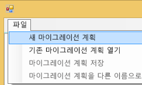

2. **Power BI Embedded 리소스 그룹 선택** 대화 상자에서 환경 드롭다운을 선택하고 prod를 선택합니다.

3. 로그인하라는 메시지가 표시됩니다. Azure 구독 로그인을 사용합니다.

   > [!IMPORTANT]
   > Power BI에 로그인하려는 Office 365 조직 계정이 **아닙니다.**

4. Power BI Embedded 작업 영역 컬렉션을 저장하는 Azure 구독을 선택합니다.

    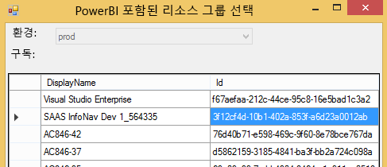
5. 구독 목록 아래에서 작업 영역 컬렉션이 포함된 **리소스 그룹**을 선택하고 **선택**을 선택합니다.

    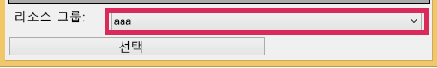

6. **분석**을 선택합니다. 그러면 계획을 시작할 Azure 구독 내에 있는 항목의 인벤토리를 가져옵니다.

    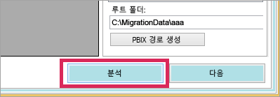

   > [!NOTE]
   > 이 분석 과정은 작업 영역 컬렉션 수와 작업 영역 컬렉션에 존재하는 콘텐츠 양에 따라 몇 분 정도 걸릴 수 있습니다.

7. **분석**이 완료되면 마이그레이션 계획을 저장할지 묻는 메시지가 표시됩니다.

이 시점에서 마이그레이션 계획을 Azure 구독에 연결했습니다. 마이그레이션 계획이 작동하는 방법에 대한 흐름을 이해하려면 아래를 읽어보세요. 여기에는 분석 및 마이그레이션 계획, 다운로드, 그룹 만들기 및 업로드가 포함됩니다.

### <a name="save-your-migration-plan"></a>마이그레이션 계획 저장

나중에 사용하기 위해 마이그레이션 계획을 저장할 수 있습니다. 그러면 마이그레이션 계획의 모든 정보를 포함하는 XML 파일이 만들어집니다.

마이그레이션 계획을 저장하려면 다음을 수행합니다.

1. **파일** > **마이그레이션 계획 저장**을 선택합니다.

    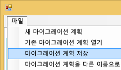

2. 파일 이름을 지정하고 생성된 파일 이름을 사용하고 **저장**을 선택합니다.

### <a name="open-an-existing-migration-plan"></a>기존 마이그레이션 계획 열기

저장된 마이그레이션 계획을 열어 마이그레이션을 계속 진행할 수 있습니다.

기존 마이그레이션 계획을 열려면 다음을 수행합니다.

1. **파일** > **기존 마이그레이션 계획 열기**를 선택합니다.

    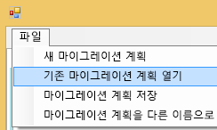

2. 마이그레이션 파일을 선택하고 **열기**를 선택합니다.

## <a name="step-1-analyze--plan-migration"></a>1단계: 분석 및 마이그레이션 계획

**분석 및 마이그레이션 계획** 탭은 Azure 구독의 리소스 그룹의 현재 상태에 대한 보기를 제공합니다.

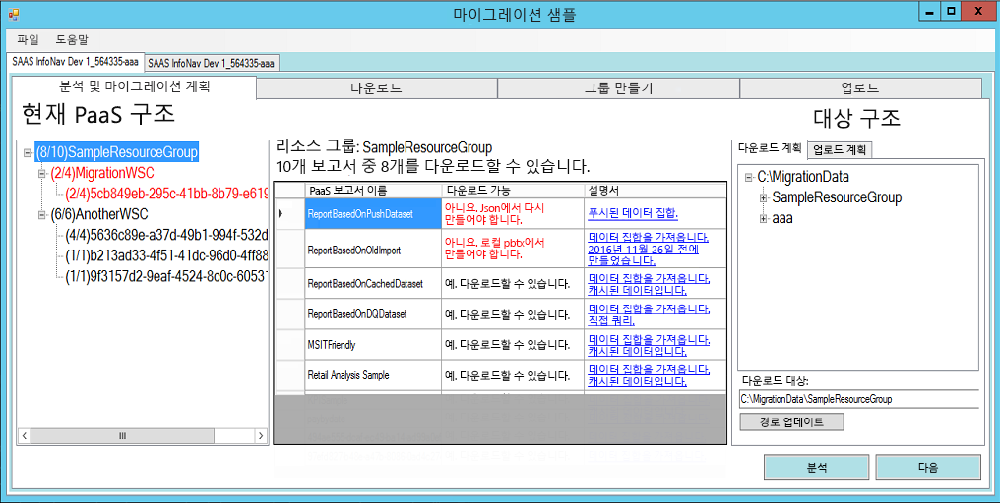

예로 *SampleResourceGroup*을 살펴보겠습니다.

### <a name="paas-topology"></a>PaaS 토폴로지

*리소스 그룹 > 작업 영역 컬렉션 > 작업 영역* 목록입니다. 리소스 그룹 및 작업 영역 컬렉션에 친숙한 이름이 표시됩니다. 작업 영역에는 GUID가 표시됩니다.

목록의 항목은 (#/#) 형식으로 색과 숫자도 표시합니다. 이것은 다운로드할 수 있는 보고서의 수를 나타냅니다.
검은색은 모든 보고서를 다운로드할 수 있음을 의미합니다.

빨간색은 일부 보고서를 다운로드할 수 없음을 의미합니다. 왼쪽 숫자는 다운로드할 수 있는 보고서의 총 수를 나타냅니다. 오른쪽의 숫자는 그룹화 내에 있는 보고서의 총 수를 나타냅니다.

보고서 섹션에 보고서를 표시하도록 PaaS 토폴로지 내에서 항목을 선택할 수 있습니다.

### <a name="reports"></a>보고서

보고서 섹션에는 사용 가능한 보고서가 나열되고 다운로드 가능 여부를 표시합니다.

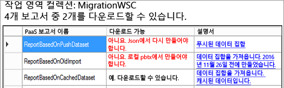

### <a name="target-structure"></a>대상 구조

**대상 구조**에서는 다운로드되는 위치와 업로드 방법을 지정할 수 있습니다.

#### <a name="download-plan"></a>다운로드 계획

경로가 자동으로 만들어집니다. 원하는 경우 이 경로를 변경할 수 있습니다. 경로를 변경하지 않은 경우 **경로 업데이트**를 선택해야 합니다.

> [!NOTE]
> 이 경우 다운로드가 실제로 수행되지 않습니다. 보고서를 다운로드할 위치의 구조만 지정합니다.

#### <a name="upload-plan"></a>업로드 계획

여기에서 Power BI 서비스 내에서 생성될 앱 작업 영역에 사용할 접두사를 지정할 수 있습니다. 접두사 다음에는 Azure에 존재하는 작업 영역에 대한 GUID가 나옵니다.

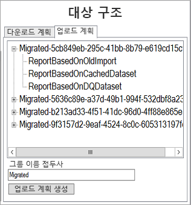

> [!NOTE]
> 이 경우 Power BI 서비스 내에 그룹이 실제로 만들어지지 않습니다. 그룹에 대한 명명 구조만 정의합니다.

접두사를 변경하지 않은 경우 **업로드 계획 생성**을 선택해야 합니다.

그룹을 마우스 오른쪽 단추로 클릭하고 업로드 계획 내에서 직접 그룹의 이름을 변경하도록 선택합니다(원하는 경우).

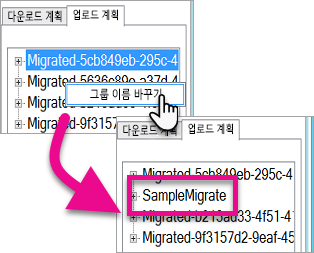

> [!NOTE]
> *그룹* 이름에는 공백이나 잘못된 문자가 없어야 합니다.

## <a name="step-2-download"></a>2단계: 다운로드

**다운로드** 탭에 보고서 및 관련 메타데이터 목록이 표시됩니다. 이전 및 현재 내보내기 상태를 함께 볼 수 있습니다.

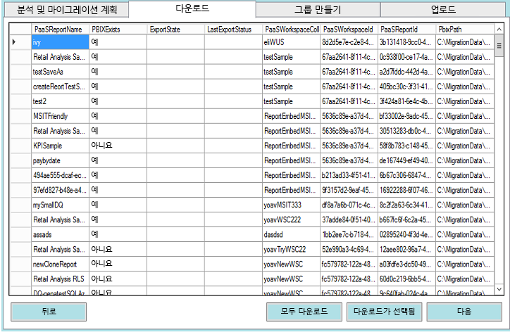

다음과 같은 두 가지 옵션이 있습니다.

* 특정 보고서를 선택하고 **다운로드가 선택됨**을 선택합니다.
* **모두 다운로드**를 선택합니다.

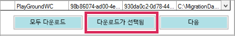

다운로드가 성공하면 *완료* 상태가 표시되며 PBIX 파일이 있는 것으로 나타납니다.

다운로드가 완료된 후에는 **그룹 만들기** 탭을 선택합니다.

## <a name="step-3-create-groups"></a>3단계: 그룹 만들기

사용할 수 있는 보고서를 다운로드한 후에는 **그룹 만들기** 탭으로 이동할 수 있습니다. 이 탭에는 생성한 마이그레이션 계획에 따라 Power BI 서비스 내에 앱 작업 영역이 만들어집니다. 그러면 **분석 및 마이그레이션 계획** 내의 **업로드** 탭에 제공한 이름의 앱 작업 영역이 만들어집니다.

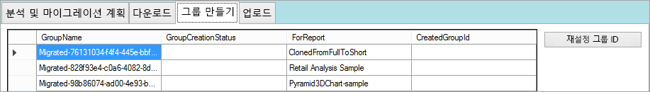

앱 작업 영역을 만들기 위해서는 **선택한 그룹 만들기** 또는 **Create All Missing Groups(누락된 모든 그룹 만들기)** 를 선택하면 됩니다.

이러한 옵션 중 하나를 선택하면 로그인하라는 메시지가 표시됩니다. *앱 작업 영역을 만들 Power BI 서비스에 대한 자격 증명을 사용합니다.*

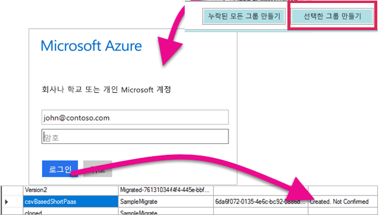

이렇게 하면 Power BI 서비스 내에 앱 작업 영역이 만들어집니다. 보고서를 앱 작업 영역에 업로드하지 않습니다.

Power BI에 로그인하고 해당 작업 영역이 존재하는지 확인하여 앱 작업 영역이 만들어진 것을 확인할 수 있습니다. 작업 영역에 아무 것도 없음을 확인합니다.

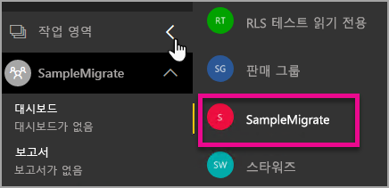

작업 영역이 만들어지면 **업로드** 탭으로 이동할 수 있습니다.

## <a name="step-4-upload"></a>4단계: 업로드

**업로드** 탭에서 보고서를 Power BI 서비스에 업로드합니다. 마이그레이션 계획을 토대로 한 대상 그룹 이름과 함께 다운로드 탭에서 다운로드한 보고서 목록이 표시됩니다.

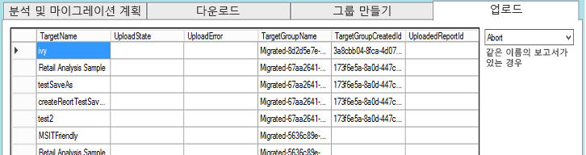

선택한 보고서를 업로드하거나 모든 보고서를 업로드할 수 있습니다. 업로드 상태를 다시 업로드 항목으로 재설정할 수도 있습니다.

같은 이름의 보고서가 있는 경우 수행할 작업을 선택하는 옵션도 있습니다. **중단**, **무시** 및 **덮어쓰기** 중에서 선택할 수 있습니다.

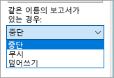

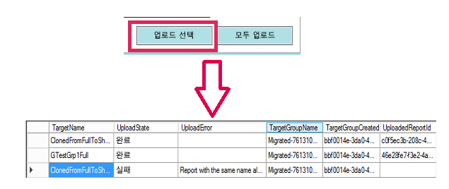

### <a name="duplicate-report-names"></a>보고서 이름 복제

동일한 이름의 보고서가 있지만 다른 보고서로 판단되면 보고서의 **TargetName**을 변경해야 합니다. 마이그레이션 계획 XML을 직접 편집하여 이름을 변경할 수 있습니다.

마이그레이션 도구를 닫아 변경 내용을 적용한 후 도구와 마이그레이션 계획을 다시 열어야 합니다.

위의 예에서는 복제된 보고서 중 하나가 같은 이름의 보고서가 있음을 표시하며 실패했습니다. 마이그레이션 계획 XML을 살펴보면 다음이 표시됩니다.

```
<ReportMigrationData>
    <PaaSWorkspaceCollectionName>SampleWorkspaceCollection</PaaSWorkspaceCollectionName>
    <PaaSWorkspaceId>4c04147b-d8fc-478b-8dcb-bcf687149823</PaaSWorkspaceId>
    <PaaSReportId>525a8328-b8cc-4f0d-b2cb-c3a9b4ba2efe</PaaSReportId>
    <PaaSReportLastImportTime>1/3/2017 2:10:19 PM</PaaSReportLastImportTime>
    <PaaSReportName>cloned</PaaSReportName>
    <IsPushDataset>false</IsPushDataset>
    <IsBoundToOldDataset>false</IsBoundToOldDataset>
    <PbixPath>C:\MigrationData\SampleResourceGroup\SampleWorkspaceCollection\4c04147b-d8fc-478b-8dcb-bcf687149823\cloned-525a8328-b8cc-4f0d-b2cb-c3a9b4ba2efe.pbix</PbixPath>
    <ExportState>Done</ExportState>
    <LastExportStatus>OK</LastExportStatus>
    <SaaSTargetGroupName>SampleMigrate</SaaSTargetGroupName>
    <SaaSTargetGroupId>6da6f072-0135-4e6c-bc92-0886d8aeb79d</SaaSTargetGroupId>
    <SaaSTargetReportName>cloned</SaaSTargetReportName>
    <SaaSImportState>Failed</SaaSImportState>
    <SaaSImportError>Report with the same name already exists</SaaSImportError>
</ReportMigrationData>
```

실패한 항목에 대해서는 SaaSTargetReportName의 이름을 변경할 수 있습니다.

```
<SaaSTargetReportName>cloned2</SaaSTargetReportName>
```

그런 다음 계획을 다시 열고 마이그레이션 도구에서 실패한 보고서를 업로드합니다.

Power BI로 돌아가, 앱 작업 영역에 업로드한 보고서 및 데이터 세트를 볼 수 있습니다.

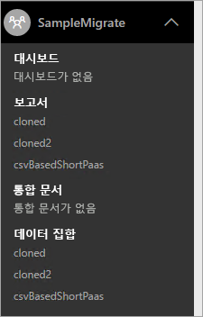

<a name="upload-local-file"></a>

### <a name="upload-a-local-pbix-file"></a>로컬 PBIX 파일 업로드

로컬 버전의 Power BI Desktop 파일을 업로드할 수 있습니다. 도구를 닫고, XML을 편집하고 전체 경로를 **PbixPath** 속성의 로컬 PBIX에 배치해야 합니다.

```
<PbixPath>[Full Path to PBIX file]</PbixPath>
```

xml을 편집한 후에는 마이그레이션 도구 내에서 계획을 다시 열고 보고서를 업로드합니다.

<a name="directquery-reports"></a>

### <a name="directquery-reports"></a>DirectQuery 보고서

DirectQuery 보고서에 대한 연결 문자열을 업데이트해야 합니다. *powerbi.com* 내에서 수행하거나 Power BI Embedded(Paas)에서 연결 문자열을 프로그래밍 방식으로 쿼리할 수 있습니다. 예를 들어 [PaaS 보고서에서 DirectQuery 연결 문자열 추출](migrate-code-snippets.md#extract-directquery-connection-string-from-paas-report)을 참조하세요.

그런 다음, Power BI 서비스(Saas) 내에서 데이터 세트에 대한 연결 문자열을 업데이트하고 데이터 원본에 대한 자격 증명을 설정할 수 있습니다. 다음 예제를 통해 이 작업을 수행하는 방법을 볼 수 있습니다.

* [SaaS 작업 영역에서 DirectQuery 연결 문자열 업데이트](migrate-code-snippets.md#update-directquery-connection-string-is-saas-workspace)
* [SaaS 작업 영역에서 DirectQuery 자격 증명 설정](migrate-code-snippets.md#set-directquery-credentials-in-saas-workspace)

## <a name="embedding"></a>포함

이제 Power BI Embedded Azure 서비스에서 Power BI 서비스로 보고서가 마이그레이션되었으며 애플리케이션을 업데이트하고 이 앱 작업 영역에 보고서를 포함할 수 있습니다.

자세한 내용은 [Power BI Embedded 작업 영역 컬렉션 콘텐츠를 Power BI로 마이그레이션하는 방법](migrate-from-powerbi-embedded.md)을 참조하세요.

## <a name="next-steps"></a>다음 단계

[Power BI에 포함](embedding.md)  
[Power BI Embedded 작업 영역 컬렉션 콘텐츠를 Power BI으로 마이그레이션하는 방법](migrate-from-powerbi-embedded.md)  
[Power BI 프리미엄이란?](../service-premium.md)  
[JavaScript API Git 리포지토리](https://github.com/Microsoft/PowerBI-JavaScript)  
[Power BI C# Git 리포지토리](https://github.com/Microsoft/PowerBI-CSharp)  
[JavaScript 포함 샘플](https://microsoft.github.io/PowerBI-JavaScript/demo/)  
[Power BI 프리미엄 백서](https://aka.ms/pbipremiumwhitepaper)  

궁금한 점이 더 있나요? [Power BI 커뮤니티에 질문합니다.](http://community.powerbi.com/)