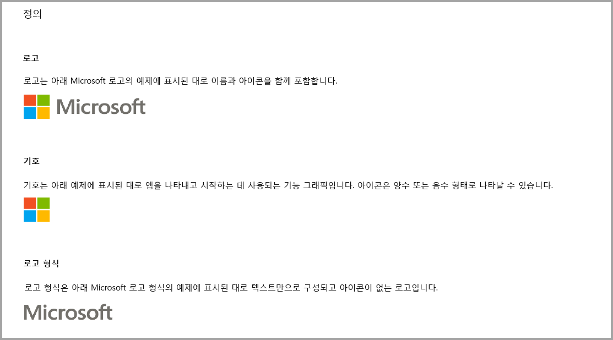
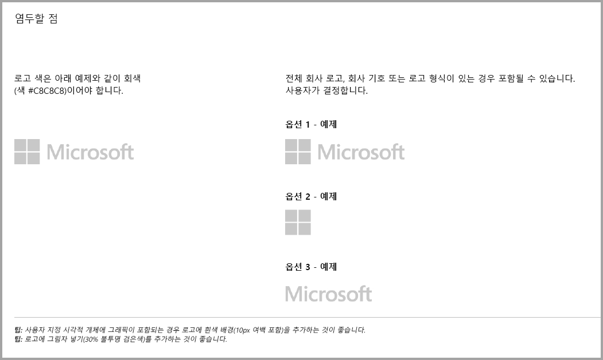
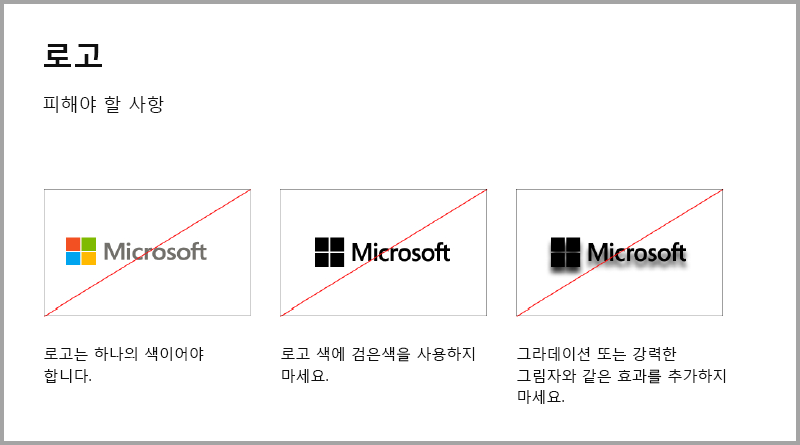
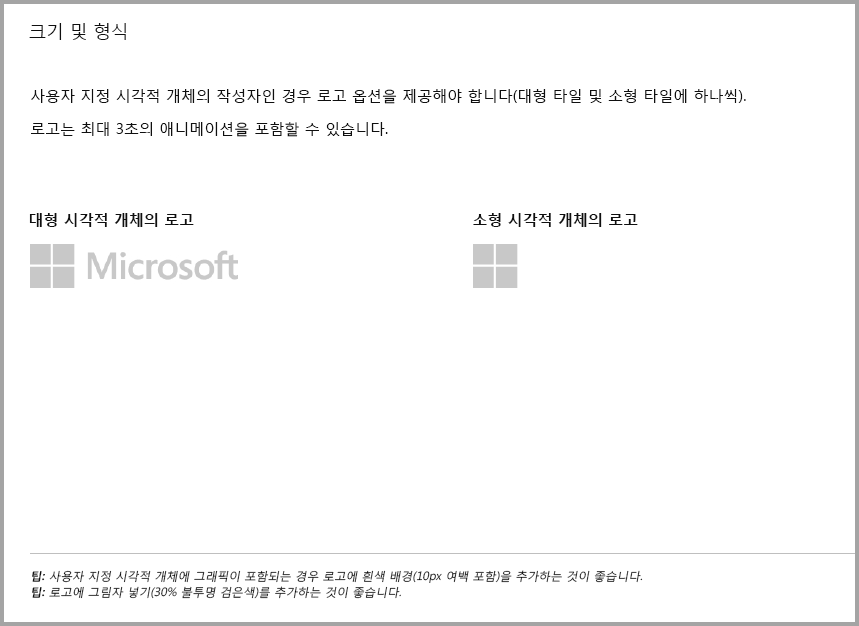
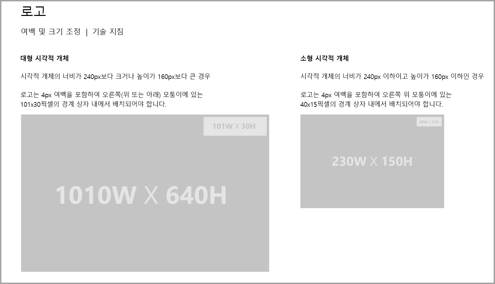
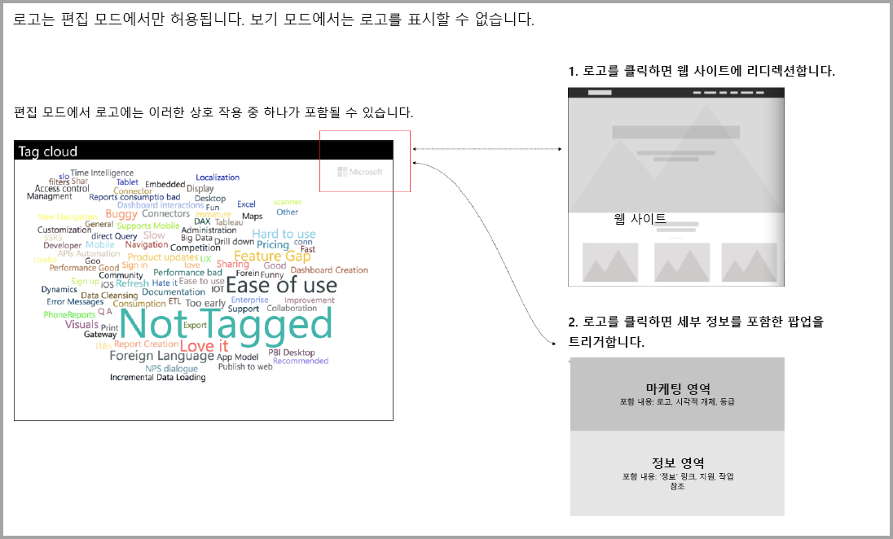

# 추가 구매 시 Power BI 시각적 개체에 대한 지침

최근까지 **Marketplace(AppSource)** 에서는 무료인 Power BI 시각적 개체만 허용했습니다. 이 정책은 "추가 구매가 필요할 수도 있음" 가격 태그가 있는 시각적 개체도 **AppSource**에 제출할 수 있도록 변경됩니다. 추가 구매가 필요할 수도 있음 시각적 개체는 office 스토어의 IAP(앱에서 바로 구매) 추가 기능과 유사합니다. 개발자는 **AppSource** 팀이 승인하고 [인증된 사용자 지정 시각적 개체 문서](../power-bi-custom-visuals-certified.md)에 설명된 대로 인증 요구 사항을 준수하는지 확인한 후 인증을 위해 이러한 시각적 개체를 제출할 수도 있습니다.

> [!Note]
> 시각적 개체 인증을 받으려면 외부 서비스나 리소스에 액세스해서는 안됩니다.

> [!Note]
> 모든 무료 시각적 개체는 이전에 제공된 동일한 무료 기능을 유지해야 합니다. 이전 무료 기능을 기반으로 선택적 고급 유료 기능을 추가할 수 있습니다. 고급 기능을 갖춘 IAP 시각적 개체를 새 시각적 개체로 제출하고 이전 무료 버전을 업데이트하지 않는 것이 좋습니다.

## 제출 프로세스에서 변경된 내용은 무엇인가요?

개발자는 무료 시각적 개체를 위해 수행한 것처럼 판매자 대시보드를 통해 IAP 시각적 개체를 AppSource에 업로드합니다. 제출한 시각적 개체에 IAP 기능이 있음을 나타내려면 판매자 대시보드 노트에 "앱에서 바로 구매가 포함된 시각적 개체"라고 입력해야 합니다. 또한 개발자는 유효성 검사 팀이 IAP 기능의 유효성을 검사할 수 있도록 라이선스 키 또는 토큰을 제공해야 합니다. 시각적 개체가 유효성이 검사되고 승인되면 IAP 시각적 개체의 AppSource 목록이 가격 옵션 아래에 '추가 구매가 필요할 수도 있음'이라고 표시됩니다.

## IAP 기능이 포함된 Power BI 시각적 개체란?

IAP 시각적 개체는 무료 시각적 개체이며 무료 기능을 제공하지만, 추가 요금이 부과될 수 있는 고급 추가 기능도 있습니다. 개발자는 작동을 위해 추가 구매가 필요한 기능에 대한 시각적 개체의 설명을 사용자에게 알려야 합니다. 현재 Microsoft는 앱에서 바로 구매 및 추가 기능을 지원하는 네이티브 API(애플리케이션 프로그래밍 인터페이스)를 제공하지 않습니다. 개발자는 해당 구매에 대해 타사 지불 시스템을 사용할 수 있습니다. 스토어 [정책](https://docs.microsoft.com/office/dev/store/validation-policies#2-apps-or-add-ins-can-display-certain-ads)을 참조하세요.

> [!NOTE]
> 무료 기능에서는 워터마크를 사용할 수 없습니다. 고급 유료 기능이 유효한 라이선스 없이 사용되는 경우, 개발자자 팝업 창 또는 워터마크를 표시할 수 있습니다.  

## 로고 지침

이 섹션에서는 로고 및 로고 유형을 시각적 개체에 추가하는 방법을 설명합니다.

> [!NOTE]
> 로고는 편집 모드에서만 허용됩니다. 보기 모드에서는 로고를 표시할 수 없습니다.

## 모범 사례

### 시각적 개체 방문 페이지

방문 페이지를 사용하여 사용자에게 시각적 개체를 사용할 수 있는 방법과 라이선스를 구매할 위치를 명확하게 합니다. 자동으로 트리거되는 비디오는 포함하지 마세요. 라이선스 구매 세부 사항에 대한 정보 또는 링크, IAP 기능을 사용하는 방법과 같이 사용자의 환경을 개선하는 데 도움이 되는 자료만 추가합니다.

### 라이선스 키 및 토큰

사용자 편의를 위해 형식 창의 맨 위에 있는 라이선스 키 또는 토큰 관련 필드를 추가하여 사용자를 위해 더 좋은 위치에 둡니다.

## FAQ

자세한 내용 및 질문과 대답은 [추가 구매가 포함된 시각적 개체에 관한 자주 묻는 질문](https://docs.microsoft.com/power-bi/power-bi-custom-visuals-faq#visuals-with-additional-purchases)을 참조하세요.

## 다음 단계

다른 사람이 검색하고 사용할 수 있도록 사용자 지정 시각적 개체를 [AppSource](office-store.md)에 게시하는 방법을 알아봅니다.
