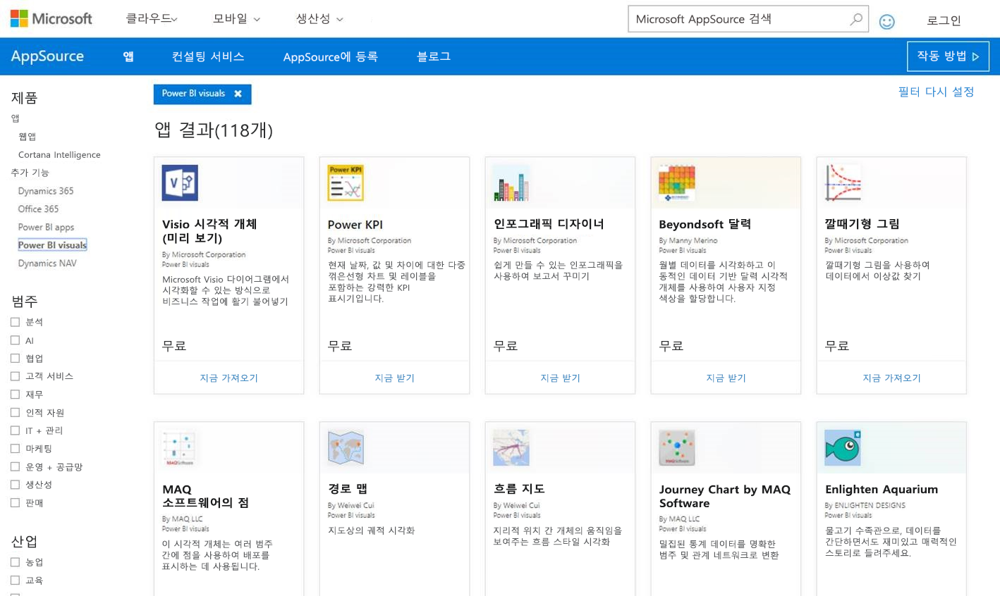

# 파트너 센터에 Power BI 시각적 개체 게시

Power BI 시각적 개체를 만든 후에는 다른 사람이 검색하고 사용할 수 있도록 AppSource에 게시할 수 있습니다. Power BI 시각적 개체를 만드는 방법에 대한 자세한 내용은 [Power BI 시각적 개체 개발](visuals/custom-visual-develop-tutorial.md)을 참조하세요.

## AppSource란?

[AppSource](https://appsource.microsoft.com/marketplace/apps?product=power-bi-visuals)는 Microsoft 제품 및 서비스에 대한 SaaS 앱과 추가 기능을 찾을 수 있는 곳입니다.

## Power BI 시각적 개체 제출 준비

Power BI 시각적 개체를 AppSource에 제출하기 전에 [Power BI 시각적 개체 지침](guidelines-powerbi-visuals.md)을 읽고 [사용자 지정 시각적 개체를 테스트](https://github.com/Microsoft/PowerBI-visuals/blob/master/Tutorial/SubmissionTesting.md)했는지 확인합니다.

Power BI 시각적 개체를 제출할 준비가 되면 시각적 개체가 아래 나열된 모든 요구 사항을 충족하는지 확인합니다.

| 항목 | 필수 | 설명 |
| --- | --- | --- |
| Pbiviz 패키지 |예 |필요한 메타데이터를 모두 포함하는 Pbiviz 패키지에 Power BI 시각적 개체를 압축합니다. 시각적 개체 이름 표시 이름 GUID 버전 설명 작성자 이름 및 전자 메일 |
| 샘플 .pbix 보고서 파일 |예 |시각적 개체를 소개하는 경우 사용자가 시각적 개체에 익숙해질 수 있도록 도움을 줘야 합니다. 시각적 개체가 사용자에게 도움이 되는 이유를 강조하고 사용 사례, 서식 지정 옵션 등을 제공합니다. 팁과 요령, 피해야 할 사항을 포함하는 *"힌트"* 페이지를 마지막에 추가할 수도 있습니다. 샘플 .pbix 보고서 파일은 어떤 외부 연결도 없이 오프라인에서 작동되어야 합니다. |
| 아이콘 |예 |스토어 맨 앞에 표시되는 사용자 지정 시각적 개체 로고를 포함해야 합니다. 가능한 형식은 png, .jpg, .jpeg 또는 .gif입니다. 정확히 300px(너비) x 300px(높이)여야 합니다. **중요** 아이콘을 제출하기 전에 [AppSource 스토어 이미지 가이드](https://docs.microsoft.com/office/dev/store/craft-effective-appsource-store-images)를 자세히 검토하세요. |
| 스크린샷 |예 |스크린샷을 하나 이상 제공합니다. 가능한 형식은 png, .jpg, .jpeg 또는 .gif입니다. 크기는 정확히 1366px(너비) x 768px(높이)여야 합니다. 파일 크기는 1024KB를 초과할 수 없습니다. 활용도를 높이려면, 각 스크린샷에 표시되는 주요 기능의 가치 제안을 분명히 전달하기 위한 말풍선을 추가합니다. |
| 다운로드 링크 지원 |예 |고객 지원 URL을 제공합니다. 이 링크는 판매자 대시보드 목록의 일부로 입력되고 AppSource의 시각적 개체 목록에 액세스할 때 사용자에게 표시됩니다. URL 형식은 https:// 또는 https:// 를 포함해야 합니다. |
| 개인정보처리방침 링크 |예 |시각적 개체의 개인정보 취급방침 링크를 제공합니다. 이 링크는 판매자 대시보드 목록의 일부로 입력되고 AppSource의 시각적 개체 목록에 액세스할 때 사용자에게 표시됩니다. 링크 형식에 https:// 또는 https:// 를 포함해야 합니다. |
| EULA(최종 사용자 사용권 계약) |예 |EULA 파일을 업로드해야 합니다. 자체 EULA를 사용하거나 Office 스토어 내에 있는 Power BI 시각적 개체에 대한 기본 EULA를 사용할 수 있습니다. 기본 EULA를 사용하려면 판매자 대시보드의 “최종 사용자 사용권 계약” 파일 업로드 대화 상자에 다음 URL을 붙여넣습니다. [https://visuals.azureedge.net/app-store/Power BI - Default Custom Visual EULA.pdf](https://visuals.azureedge.net/app-store/Power%20BI%20-%20Default%20Custom%20Visual%20EULA.pdf). |
| 비디오 링크 |아니요 |사용자 지정 시각적 개체에 대한 사용자의 관심을 높이려면 시각적 개체에 대한 비디오 링크를 제공합니다. URL 형식은 https:// 또는 https:// 를 포함해야 합니다. |
| GitHub 리포지토리 |아니요 |Power BI 시각적 개체 및 샘플 데이터의 소스가 포함된 [GitHub](https://www.github.com) 리포지토리에 대한 공용 링크를 공유합니다. 이렇게 하면 다른 개발자가 피드백을 제공하고 코드 개선 사항을 제안할 수 있습니다. |

## 앱 패키지 XML 얻기

Power BI 시각적 개체를 제출하려면 Power BI 팀의 앱 패키지 XML이 있어야 합니다. 앱 패키지 XML을 얻으려면 Power BI 시각적 개체 제출 팀([pbivizsubmit@microsoft.com](mailto:pbivizsubmit@microsoft.com))에 이메일을 보냅니다.

**.pbiviz** 패키지를 만들기 전에 **pbiviz.json** 파일에서 다음 필드를 채워야 합니다.
* description
* supportUrl
* 작성자
* 이름
* 이메일

이메일에 **pbiviz 파일**과 **샘플 보고서 pbix 파일**을 첨부합니다. Power BI 팀이 지침 및 업로드할 앱 패키지 XML 파일이 포함된 회신을 보냅니다. XML 앱 패키지는 Office 개발자 센터를 통해 시각적 개체를 제출하기 위해 필요합니다.

> [!NOTE]
> 품질을 개선하고 기존 보고서가 중단되지 않도록 하기 위한 기존의 시각적 개체에 대한 업데이트는 스토어에서 승인 후 프로덕션 환경에 도달하기까지 추가로 2주가 걸립니다.

## AppSource에 제출

Power BI 시각적 개체를 AppSource에 제출하려면 Power BI 팀에서 앱 패키지를 얻은 후 파트너 센터에 제출해야 합니다. 

### 앱 패키지 얻기

AppSource에 제출하기 전에 **pbiviz** 파일과 **pbix** 파일이 첨부된 이메일을 Power BI 팀에 보내야 합니다. 그러면 Power BI 팀이 해당 파일을 공개 공유 서버에 업로드할 수 있습니다. 그렇지 않으면 스토어에서 파일을 검색할 수 없습니다. 

Power BI 팀은 파일에서 새 Power BI 시각적 개체 제출, 기존 Power BI 시각적 개체 업데이트 및 거부된 제출에 대한 수정 사항을 확인해야 합니다.

### 파트너 센터에 제출

파트너 센터에 Power BI 시각적 개체를 제출하려면 파트너 센터에 등록되어 있어야 합니다. 아직 등록하지 않은 경우 [파트너 센터에서 개발자 계정을 개설](https://docs.microsoft.com/office/dev/store/open-a-developer-account)합니다.

파트너 센터에 Power BI 시각적 개체를 제출하려면 다음 단계를 수행합니다. 제출 프로세스에 대한 자세한 내용은 [파트너 센터를 통해 AppSource에 Office 솔루션 제출](https://docs.microsoft.com/office/dev/store/use-partner-center-to-submit-to-appsource)을 참조하세요.

>[!NOTE]
> Power BI 시각적 개체 제출 프로세스를 진행하는 도중이고 [판매자 대시보드](https://docs.microsoft.com/office/dev/store/use-the-seller-dashboard-to-submit-to-the-office-store)(이전 관리 도구)를 사용해야 하는 경우 [판매자 대시보드를 사용하여 AppSource에 Power BI 시각적 개체 제출](seller-dashboard.md)에 안내된 지침을 검토하세요.

1. **파트너 센터**에 로그인합니다.

2. 왼쪽 창에서 **OFFICE 스토어**를 선택합니다.

3. **개요**를 선택합니다.

4. **새로 만들기**를 선택하고 드롭다운 메뉴에서 **Power BI 시각적 개체**를 선택합니다.

    

5. **새 Power BI 시각적 개체 만들기** 창에서 Power BI 시각적 개체의 이름을 입력하고 **만들기**를 선택합니다.

6. **패키지**를 선택하고 Power BI 시각적 개체 XML 앱 패키지를 업로드합니다.

7. **속성**을 선택하고 필요한 정보를 제공합니다.

8. 제품에 추가 구매가 필요한 경우 **제품 설정**을 선택하고 **연결된 서비스 구매** 확인란을 선택합니다.

9. (선택 사항) 시각적 개체를 [인증](power-bi-custom-visuals-certified.md)하려는 경우 **제품 설정**을 선택하고 **Power BI 인증** 확인란을 선택합니다.
    >[!TIP]
    >Power BI 인증 프로세스는 시간이 걸릴 수 있습니다. 새 Power BI 시각적 개체를 만드는 경우 Power BI 인증을 요청하기 전에 파트너 센터를 통해 Power BI 시각적 개체를 게시하는 것이 좋습니다. 이렇게 하면 시각적 개체의 게시가 지연되지 않습니다.

10. **제품 설정**을 선택하고 **검토 및 게시**를 클릭합니다.

## 제출 상태 및 사용 현황 추적

[유효성 검사 정책](https://dev.office.com/officestore/docs/validation-policies#13-power-bi-custom-visuals)을 검토할 수 있습니다.

제출 후에 [앱 대시보드](https://sellerdashboard.microsoft.com/Application/Summary/)에서 제출 상태를 볼 수 있습니다.

## 시각적 개체 인증

시각적 개체를 만든 후 원할 경우 시각적 개체를 [인증](../developer/power-bi-custom-visuals-certified.md)받을 수 있습니다.

## 다음 단계

[Power BI 사용자 지정 시각적 개체 개발](visuals/custom-visual-develop-tutorial.md)  
[Power BI의 시각화](../visuals/power-bi-report-visualizations.md)  
[Power BI의 사용자 지정 시각화](../developer/power-bi-custom-visuals.md)  
[Power BI 시각적 개체 인증받기](../developer/power-bi-custom-visuals-certified.md)

궁금한 점이 더 있나요? [Power BI 커뮤니티에 질문합니다.](https://community.powerbi.com/)
